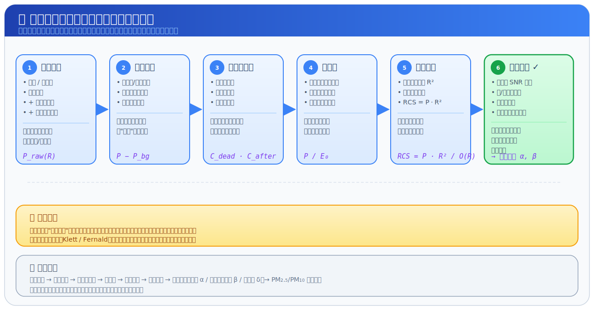
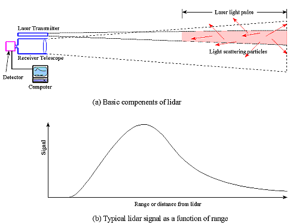
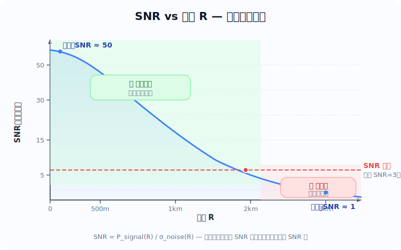

# 11. 颗粒物版本的数据处理到底怎么走


这一节是整份文档里最重要的工程部分之一。因为真正把系统做出来时，你面对的不是“一个公式”，而是一整条数据流水线。

### 11.0 如果你数学基础比较弱，先看这张总流程图




你可以先不要急着记公式，先把这张图读顺：

1. 最左边是机器真正测到的原始回波，它里面既有目标信息，也有各种噪声。
2. 中间每一个方框都在解决一种具体误差，例如背景光、探测器失真、发射能量波动、近距离重叠不足。
3. 最右边的意思是：只有把这些非目标因素先拿掉，后面才值得做反演。

如果你现在只想抓住一句话，那就是：

> 算法链前半段不是在“炫技术”，而是在努力回答一个更朴素的问题：我看到的回波，到底有多少是真的空气和颗粒物，多少只是设备和环境带来的假信号。

如果你更想先看一张网上现成、最经典的基础示意图，可以看 NOAA 这张：



这张图特别适合数学基础弱的读者，因为它同时把两件事画出来了：

1. 左边是空间过程：激光脉冲打出去，沿路不断有微弱回波返回。
2. 右边是数据结果：返回信号会随着距离变化形成一条曲线。
3. 这张图把“空间里发生了什么”和“电脑里最后看到什么”直接连在一起了。

> **🎯 关键原理：这条曲线是怎么来的？**
>
> 右边那条曲线，就是**发射一次激光脉冲**后收到的全部回波信号。注意，不是多次累加，是**一发一收**画出来的。
>
> 那 X 轴的"距离"是怎么知道的？LiDAR 并没有拿尺子去量，而是用了一个非常朴素的方法——**计时**：
>
> 1. 激光器发出一个极短的脉冲（纳秒级），同时计时器开始计时（t = 0）
> 2. 脉冲飞出去，遇到 500 m 处的颗粒物，一部分光被散射回来
> 3. 回波走了 500 m 去程 + 500 m 回程 = 1000 m，以光速飞行，耗时约 3.3 μs
> 4. 探测器收到这束回波时，计时器显示 3.3 μs
> 5. 电脑反算：$R = \frac{c \cdot \Delta t}{2} = \frac{3 \times 10^8 \times 3.3 \times 10^{-6}}{2} \approx 500 \text{ m}$
>
> 也就是说，**X 轴上每一个距离值，本质上就是一个时间戳除以 2 再乘以光速**。曲线上左边的点（近距离）先回来、右边的点（远距离）后回来——这条曲线本身就是回波信号按到达时间排好队的结果。
>
> 实际工程中，探测器以固定频率（比如 20 MHz，即每 50 ns 采一个点）连续采样，每个采样点对应一个距离门（range gate），一个采样点 = 7.5 m 的距离分辨率。

你读这张图时，建议只抓住 3 个问题：

1. 为什么越远回波越晚回来。——因为光要走来回，距离越远耗时越长，回波越晚被探测器收到。
2. 为什么回波曲线不是平的，而会有起伏和峰值。——因为不同高度上的颗粒物浓度不一样，浓度高的地方散射强、回波就强，曲线就鼓起来。
3. 为什么曲线里的高值区，往往对应空气里有更多散射体的区域。——因为回波强度直接反映了该距离处空气把多少光"弹回来"的能力。

来源：NOAA Chemical Sciences Laboratory 的 LIDAR 原理页，适合做入门直觉图。

#### 老师讲课版：这张图请按 4 眼来看

第 1 眼，只看左边，不看右边。

你先把自己想象成站在设备旁边，看到一束很短的激光脉冲打出去。它不是一下子照亮整片天空，而是像一个很短的光包沿着前方飞出去。

第 2 眼，继续只看左边，注意“沿路每一段空气都会给一点点回波”。

空气分子、颗粒物、粉尘、烟雾，都可以把极少量光散射回来。离设备近的那一段空气，会先把回波送回来；离设备远的那一段空气，会更晚才把回波送回来。

第 3 眼，再去看右边曲线。

右边这条曲线，本质上就是把“不同距离上返回了多少光”按距离排成一列。也就是说：

1. 左边空间里每一小段空气。
2. 在右边曲线上都会对应一个自己的位置。
3. 哪一段空气散射更强，曲线在那个距离上就更高。

第 4 眼，把左右两边连起来。

这一步最关键。你要建立一个稳定直觉：

> 左边看到的是物理世界里光怎么走，右边看到的是电脑把这些返回光按距离排好之后的结果。

如果你只能记住一句最核心的话，那就是：

> 空间里哪一段空气更容易把光打回来，曲线在那个距离位置就更容易鼓起来。

这就是后面所有预处理、反演、识别算法的起点。因为算法并不是凭空制造信息，它只是想办法把这条曲线里的结构，重新翻译回空间里的粉尘分布。

建议把数据链分成 5 个层级，这样工程上最好管理。

| 级别 | 内容 | 典型数据形态 | 小白理解 |
| --- | --- | --- | --- |
| L0 | 原始 ADC / photon counts / 元数据 | 一维波形、二维时距矩阵、角度序列、姿态序列 | 机器刚吐出来的原始记录 |
| L1 | 背景扣除、暗电流、死时间、能量归一化、RCS | 已清洗的 profile | 先把脏信号洗干净 |
| L1.5 | attenuated backscatter、depol、云雨 mask、SNR | 可展示的物理图层 | 可以先给人看图了 |
| L2 | backscatter、extinction、PM 估算、层顶层底 | 物理量剖面和扫描面产品 | 真正进入业务指标 |
| L3 | 2D/3D 网格、热点轨迹、统计报表、告警事件 | 体素、栅格、事件表、质心点 | 平台和联动控制直接消费 |

> **📖 初学者名词速查：表格里那些看不懂的词**
>
> 上面的表格用了很多专业缩写，如果你是初学者，一个一个搜很浪费时间。下面按从 L0 到 L3 的顺序，把每个词翻译成大白话：
>
> **L0 层（机器刚吐出来的原始数据）**
>
> | 术语 | 大白话解释 |
> | --- | --- |
> | **ADC** | Analog-to-Digital Converter，模数转换器。探测器收到的是模拟电压信号（连续的波浪），ADC 把它变成电脑能存的数字。就像用手机录音时，麦克风收到声波，ADC 把声波变成一串数字音频数据。ADC 采样率决定了距离分辨率（20 MHz → 7.5 m）。 |
> | **photon counts** | 光子计数。高端 LiDAR（比如光子计数型）不是测电压，而是"一个一个数光子"——每飞回来一个光子就记一个 1。就像用计数器数雨滴，滴一滴按一下。适合极弱信号（高空探测），但设备更贵。 |
> | **元数据** | 不是测量数据本身，而是"描述这次测量的附加信息"：什么时间测的、激光能量多大、设备温度多少、GPS 位置在哪。就像照片的 EXIF 信息（拍摄时间、光圈、ISO），不是画面内容但必不可少。 |
> | **一维波形** | 最基本的数据形态——一条"回波强度 vs 距离"的曲线，就是前面 NOAA 示意图右边那条线。一次激光脉冲 → 一条一维波形。 |
> | **二维时距矩阵** | 连续发射很多次脉冲，把每次的波形按时间排成一行，就变成一张二维图：横轴是距离，纵轴是时间，颜色代表回波强度。类似热力图，能看出颗粒物层随时间的演变。 |
>
> **L1 层（清洗后的数据）**
>
> | 术语 | 大白话解释 |
> | --- | --- |
> | **背景扣除** | 即使不发射激光，探测器也会收到太阳光、天空散射光等"背景噪声"。做法很简单：在两个激光脉冲之间的间隙，测一次没有激光时的信号，然后减掉。就像拍照时先拍一张"黑帧"（盖住镜头），再从每张照片里减去这个噪声。 |
> | **暗电流** | 探测器完全不见光时也会有微弱电流输出（因为温度导致电子热运动）。就像收音机没信号时也有嘶嘶声。通常通过测"盖住镜头时的输出"来估计并减掉。 |
> | **死时间** | 探测器收到一个光子后需要一小段恢复时间才能接收下一个（就像人眨眼的那一瞬间看不到东西）。高频信号下这会导致近处强回波被"数少了"，需要数学校正。 |
> | **能量归一化** | 每次脉冲的激光能量不可能完全一样（会有 ±5% 的波动）。如果不校正，能量大的那次回波就偏高、能量小的就偏低。做法：测出每次实际发射能量 E₀，把回波除以 E₀，这样就消除了发射能量波动的影响。 |
> | **RCS** | Range-Corrected Signal，距离校正信号。因为回波会随距离平方衰减（越远越弱），即使空气完全均匀，远处回波也会变小。公式是 RCS = P(R) × R²。做完这一步，曲线上的起伏才真正反映颗粒物浓度的变化，而不是"远了就弱"的数学假象。 |
> | **profile** | "廓线"——一条"某个物理量随高度/距离变化的曲线"。比如"消光系数廓线"就是消光系数随高度变化的曲线。LiDAR 的核心产品就是各种 profile。 |
>
> **L1.5 层（可以看图了）**
>
> | 术语 | 大白话解释 |
> | --- | --- |
> | **attenuated backscatter** | 衰减后向散射。简单说就是"每个距离上空气把多少光弹回来了"——但还没有做反演校正，所以只是一个半成品物理量。优点是不需要假设任何东西就能算出来，可以直接画图看。就像洗完菜但还没炒——干净了但还不能上桌。 |
> | **depol** | Depolarization ratio 的缩写，退偏比。激光发射时光是偏振的（振动方向一致），遇到球形颗粒（水滴）回波保持偏振，遇到非球形颗粒（沙尘、冰晶）回波偏振方向会变乱。退偏比 = 偏振变了多少 / 原来多少。退偏比高 → 多半是沙尘或冰晶；退偏比低 → 多半是水滴或球形气溶胶。这是区分颗粒物类型的**最关键参数之一**。 |
> | **云雨 mask** | 一张标记"哪些像素是云、哪些是雨、哪些是晴空"的分类标签图。就像修图软件里的"抠图蒙版"——把云和雨的区域标记出来，后续分析时可以单独处理或排除。 |
> | **SNR** | Signal-to-Noise Ratio，信噪比。信号强度 / 噪声强度。SNR = 10 表示信号是噪声的 10 倍（可靠）；SNR = 1 表示信号和噪声差不多大（不可靠，基本是猜的）。SNR < 3 的数据通常直接丢弃。就像你在一个嘈杂的酒吧里听朋友说话——他喊得越大声（信号越强）或者酒吧越安静（噪声越低），你听得越清楚（SNR 越高）。 |
>
> **L2 层（真正的业务指标）**
>
> | 术语 | 大白话解释 |
> | --- | --- |
> | **backscatter** | 后向散射系数 β。单位体积空气往 180° 方向（也就是往 LiDAR 方向）散射了多少光。这是 LiDAR 方程里最核心的物理量——β 越大，说明那个位置空气里的颗粒物越多或越大。 |
> | **extinction** | 消光系数 α。光每走 1 m 被空气"吃掉"多少（散射 + 吸收）。α 越大 → 空气越浑浊 → 能见度越低。PM2.5 浓度高时，消光系数也会高。α 和 β 的关系是 LiDAR 反演的核心难题。 |
> | **PM 估算** | 用 α 或 β 通过经验公式换算成 PM2.5 / PM10 浓度（μg/m³）。注意这是"估算"不是直接测量——LiDAR 测的是光学性质（光被散射了多少），要转换成质量浓度需要假设颗粒物的粒径分布、折射率等参数，有不确定性。 |
> | **层顶层底** | 颗粒物层（或云层）的顶部高度和底部高度。比如"今天边界层顶高 1.2 km"，意味着 1.2 km 以下污染物比较容易积累，1.2 km 以上空气比较干净。对空气质量预报非常重要。 |
>
> **L3 层（给平台和用户直接用的）**
>
> | 术语 | 大白话解释 |
> | --- | --- |
> | **体素** | Voxel = Volume + Pixel，三维像素。就像 2D 图片由像素（pixel）组成，3D 空间数据由体素组成。扫描式 LiDAR 把不同方位的廓线拼在一起，就能重建出 3D 的颗粒物分布，每个小方块就是一个体素。 |
> | **栅格** | Raster，规则的网格数据。把连续的空间数据切成整齐的小格子（类似棋盘），每个格子一个数值。是 GIS 和遥感中最常见的数据格式。 |
> | **事件表** | 一张记录"什么时候、什么地点、发生了什么事"的日志表。比如"14:23 工地北侧 200 m 高度 PM10 超标"就是一条事件记录。告警系统直接消费这个表。 |
> | **质心点** | 一个污染团的"重心"位置。就像用质心代表一个几何体的中心一样，质心点用来追踪一个扬尘团"漂到哪里了"。连续追踪质心点就能算出污染物的运动轨迹。 |

### 11.1 一次原始采样到底长什么样

很多初学者会以为设备每次输出的是一张图。其实不是。设备最底层拿到的通常是一串“按距离分箱的回波数组”。

最基础的一次 profile 往往包含：

1. 时间戳。
2. 通道编号。
3. 发射能量。
4. 方位角和仰角。
5. 回波数组。
6. 设备状态。
7. GPS 和 IMU 信息。

一个很简化的记录可以长这样：

```json
{
  "timestamp": "2026-05-27T10:23:15.120Z",
  "channel": "532_elastic",
  "azimuth_deg": 35.0,
  "elevation_deg": 12.0,
  "laser_energy_mj": 1.82,
  "range_resolution_m": 7.5,
  "signal_counts": [128, 124, 119, 116, 109, 98, 91],
  "gps": [121.4737, 31.2304, 28.5],
  "imu": [0.2, -0.5, 37.1]
}
```

这里的 `signal_counts` 只是示意。真实系统里它一般会更长，常常是几百到几千个 range bin。

> **🎯 关于接收窗口和 signal_counts，初学者最常问的几个问题**
>
> **Q1：发射一次激光后，要接收多久？怎么判断该接收多长时间？**
>
> 答案取决于你想测多远。回忆一下前面的公式 $R = \frac{c \cdot \Delta t}{2}$，反过来就是 $\Delta t = \frac{2R}{c}$：
>
> | 目标最远距离 | 回波最晚到达时间 | 接收窗口至少要多长 |
> | --- | --- | --- |
> | 1 km | 6.7 μs | ≈ 7 μs |
> | 5 km | 33.3 μs | ≈ 35 μs |
> | 10 km | 66.7 μs | ≈ 70 μs |
> | 20 km | 133.3 μs | ≈ 135 μs |
>
> 所以如果你宣称"探测距离 5 km"，接收窗口至少要开 35 μs。如果只开了 10 μs 就关闭接收，那 1.5 km 以外的回波确实还没回来就被丢了——**你说的完全正确，接收时间短了远处的数据就丢了**。
>
> 工程上，接收窗口的结束时刻由厂商预设（在设备配置里写死），通常比最大探测距离对应的时间再留 10–20% 余量。比如宣称 5 km 的设备，接收窗口可能设为 40 μs。
>
> **Q2：接收窗口和脉冲重复频率的关系**
>
> 这就引出一个关键约束：**两次脉冲之间必须留够时间让上一次的回波全部回来**。否则会出现"距离模糊"（range ambiguity）——你分不清某个回波是这一次脉冲的近处回波，还是上一次脉冲的远处回波。
>
> | 重复频率 PRF | 脉冲间隔 | 最大无模糊距离 |
> | --- | --- | --- |
> | 10 kHz | 100 μs | 15 km |
> | 5 kHz | 200 μs | 30 km |
> | 1 kHz | 1000 μs | 150 km |
> | 20 Hz | 50 ms | 7500 km |
>
> 所以方案 A（PRF = 5–10 kHz）对应最大无模糊距离 15–30 km，远超实际探测距离，没问题。而方案 B（PRF = 20–50 Hz）脉冲间隔很大（20–50 ms），不存在距离模糊问题，但每秒发射次数少，需要更长时间累计才能提高信噪比。
>
> **Q3：signal_counts 数组到底记录的是什么？**
>
> **是的，就是一次激光脉冲回波的多次采样结果。** 具体来说：
>
> 1. 激光脉冲发出的瞬间（t=0），ADC 开始以固定频率采样
> 2. 假设采样率 20 MHz（每 50 ns 采一个点），那么：
>    - 第 1 个采样点 → 对应距离 $R_1 = \frac{50 \text{ ns} \times c}{2} = 7.5$ m
>    - 第 2 个采样点 → 对应距离 $R_2 = 15$ m
>    - 第 3 个采样点 → 对应距离 $R_3 = 22.5$ m
>    - ……以此类推
> 3. 采样一直持续到接收窗口关闭
> 4. 这些采样值排成一列，就是 `signal_counts` 数组
>
> 所以 `signal_counts` 的**数组索引 = 距离门编号（range bin）**，每个值就是该距离处的回波强度。数组长度 = 采样点数 = 接收窗口时长 / 采样间隔。
>
> ```
> signal_counts[0]   →  7.5 m   处的回波强度
> signal_counts[1]   → 15.0 m   处的回波强度
> signal_counts[2]   → 22.5 m   处的回波强度
> ...
> signal_counts[666] → 5000 m   处的回波强度（5 km 设备的最后一个点）
> ```
>
> 打个比方：`signal_counts` 就像你站在路边，以固定频率拍照（比如每秒拍一张），每张照片记录的是那一瞬间路上有多少车经过。照片编号越靠后，对应的位置越远。
>
> 💡 **一句话总结**：一次脉冲 → 接收窗口打开 → ADC 以固定频率连续采样 → 采样值排成数组 → 数组索引就是距离 → 这就是 `signal_counts`。

> **Q4：采样率是不是就决定了空间精度？7.5 m 一个点，精度就是 7.5 米吗？**
>
> **对，但不完全对。** 需要区分两个概念：
>
> | 概念 | 含义 | 由什么决定 |
> | --- | --- | --- |
> | **距离分辨率** | 两个目标至少隔多远才能被区分开 | ADC 采样率（硬件） |
> | **空间定位精度** | 某个目标的位置测得有多准 | 采样率 + 脉冲宽度 + 系统校准 |
>
> **距离分辨率**确实是采样率直接决定的：
>
> $$
> \Delta R = \frac{c}{2 \cdot f_{\text{sample}}}
> $$
>
> | ADC 采样率 | 距离分辨率 | 每公里有多少个采样点 |
> | --- | --- | --- |
> | 10 MHz | 15 m | ≈ 67 个 |
> | 20 MHz | 7.5 m | ≈ 133 个 |
> | 40 MHz | 3.75 m | ≈ 267 个 |
> | 100 MHz | 1.5 m | ≈ 667 个 |
>
> 7.5 m 的意思就是：**如果一个扬尘层只有 5 m 厚，在 7.5 m 分辨率下它只会占不到一个采样点，你可能看不出它和周围空气的区别。** 这就像用 720p 和 4K 拍同一个画面——4K 能看清的细节，720p 可能就糊成一片了。
>
> **但是，"精度"不止看采样率，还有一个隐形瓶颈——脉冲宽度：**
>
> 激光脉冲不是数学上无限窄的 δ 函数，它有一个物理宽度（通常 5–20 ns）。脉冲宽度在空间上展开的距离是：
>
> $$
> \Delta R_{\text{pulse}} = \frac{c \cdot \tau}{2}
> $$
>
> | 脉冲宽度 τ | 脉冲空间长度 | 影响 |
> | --- | --- | --- |
> | 5 ns | 0.75 m | 很窄，几乎不影响分辨率 |
> | 10 ns | 1.5 m | 仍远小于 7.5 m 采样间距 |
> | 50 ns | 7.5 m | 和一个采样间距一样宽 |
> | 200 ns | 30 m | 远大于采样间距，成为真正的瓶颈 |
>
> 关键规则：**实际分辨率 = max(采样分辨率, 脉冲空间长度)**。
>
> - 如果采样率 20 MHz（7.5 m）且脉冲宽度 10 ns（1.5 m）→ 实际分辨率 **7.5 m**（采样率是瓶颈）
> - 如果采样率 100 MHz（1.5 m）但脉冲宽度 50 ns（7.5 m）→ 实际分辨率 **7.5 m**（脉冲宽度是瓶颈）
> - 厂商宣称"1 m 分辨率"但你一看脉冲宽度 100 ns（15 m）→ **假的**，实际分辨不出 15 m 以内的结构
>
> 这就是 10.6 采购避坑指南里那个"混淆距离分辨率和空间分辨率"陷阱的技术背景——有些厂商把采样率对应的理论分辨率当卖点，但脉冲宽度才是真正的物理极限。
>
> 💡 **一句话总结**：采样率决定"你每隔几米采一个点"，脉冲宽度决定"每个点其实模糊了几米"。真正的分辨率是两者中**较差**的那个。对于方案 A（采样率 10–20 MHz + 微脉冲宽度 5–10 ns），7.5–15 m 的分辨率对工地扬尘监测完全够用（扬尘层通常厚几十到几百米），不需要追求更精细。

> **Q5：方案 A 写着"有效探测距离 1–5 km"，这个距离是怎么来的？什么因素决定了它能看多远？**
>
> "探测距离"不是厂商随便写的，它有一个物理定义：**在最远处，回波信号的信噪比（SNR）还能达到某个阈值（通常 SNR ≥ 3）的最大距离**。超过这个距离，信号就淹没在噪声里，数据不可信了。
>
> 想象你在一个嘈杂的房间里听人说话：对方离你 5 米时你能听清（SNR 高），离你 50 米时声音太弱被噪音淹没（SNR < 1），中间有个临界距离就是"有效探测距离"。
>
> **探测距离受哪些因素影响？**
>
> | 因素 | 怎么影响探测距离 | 打个比方 |
> | --- | --- | --- |
> | **激光能量 E₀** | 能量越大 → 回波越强 → 看得越远。E₀ 翻倍，距离约增加 ~20% | 喊得越大声，远处越能听到 |
> | **望远镜口径 D** | 口径越大 → 收集的回波越多。D 翻倍，收集面积翻 4 倍 | 耳朵越大，收到的声音越多 |
> | **探测器灵敏度** | 量子效率越高、噪声越低 → 能分辨更弱信号 | 听力越好，越远的声音也能分辨 |
> | **波长** | 大气透过率随波长变化。532 nm 和 1064 nm 的透过率比 355 nm 好 | 用穿透力强的声音（低音）传得更远 |
> | **天气/气溶胶** | 空气越干净 → 散射少 → 回波弱 → 看不远；空气越脏 → 散射多 → 回波强但衰减也快 → 中等距离内信号好 | 空气越透明声音传得越远，但声音也越弱 |
> | **白天 vs 夜间** | 白天太阳光产生的背景噪声大 → SNR 降低 → 距离缩短 50% 以上 | 白天嘈杂时听不清远处说话 |
> | **脉冲累计次数** | 多次脉冲累加平均 → 噪声降低 √N 倍 → SNR 提高 → 距离增加 | 多听几遍同一段话，更容易听清 |
>
> **为什么方案 A 写 1–5 km 而不是一个固定值？**
>
> 因为"能看多远"不是设备单方面决定的，而是**设备和空气一起决定的**：
>
> - **空气很干净**（晴天、无污染）：空气中颗粒物少 → 激光沿路被散射的少 → 回波弱 → 可能只看到 1–2 km
> - **空气中等脏**（轻度污染）：颗粒物适中 → 散射回波够强且衰减不严重 → 能看到 3–5 km
> - **空气很脏**（重污染）：颗粒物太多 → 回波很强但衰减极快 → 远处信号被"吃掉" → 可能只能看到 2–3 km
> - **夜间 vs 白天**：白天背景光噪声大 → SNR 下降 → 同样条件下距离缩短 50% 或更多
>
> ```
> 回波强度
>   ↑
>   │ ████
>   │ ██████        夜间（背景噪声低）
>   │ ████████      ╲ 信号明显高于噪声 → 可探测到 5 km
>   │ ████████████   ╲
>   │ ████████████████──╲──── 噪声底线
>   │                                    5 km
>   │ ████
>   │ █████           白天（背景噪声高）
>   │ ██████  ──────────────── 噪声底线（高了！）
>   │                   ╲ 信号被噪声淹没 → 只能探测到 2 km
>   └──────────────────────────────→ 距离
> ```
>
> **这就是为什么 10.6 采购避坑指南里说"很多厂商只报夜间最佳值"** ——同样的设备，夜间能看 5 km，白天可能只有 2 km。买设备时必须问清楚白天和夜间分别是多少。
>
> 💡 **一句话总结**：探测距离 = 回波信号刚好能从噪声中分辨出来的最远距离。它不取决于单一因素，而是激光能量、望远镜口径、探测器灵敏度、天气、白天/夜间、累计次数等**多个因素共同决定**，所以厂商给的是一个范围（如 1–5 km）而不是固定值。

如果做的是连续垂直观测，数据更像：

$$
\mathrm{signal}[t, r]
$$

也就是“时间 × 距离”的二维矩阵。

> **🎯 从一维数组到二维矩阵——先纠正一个误解**
>
> 你说得完全对！**LiDAR 每次只给计算系统一条 `signal_counts`（一维数组），不是一次性把一整天的二维矩阵丢过来。** 真实的数据流是这样的：
>
> ```
> LiDAR 硬件                     计算系统（服务器/工控机）
> ┌─────────┐                    ┌─────────────────────┐
> │ 08:00:00 │ ── 1条 signal_counts ──→  保存到数据库     │
> │ 08:00:30 │ ── 1条 signal_counts ──→  保存到数据库     │
> │ 08:01:00 │ ── 1条 signal_counts ──→  保存到数据库     │
> │ 08:01:30 │ ── 1条 signal_counts ──→  保存到数据库     │
> │   ...    │     每30秒一条        │     ...            │
> │ 23:59:30 │ ── 1条 signal_counts ──→  保存到数据库     │
> └─────────┘                    │                     │
>                                │ 后台分析程序：        │
>                                │  把攒够的N条拼成矩阵   │
>                                │  → 画热力图 / 报警    │
>                                └─────────────────────┘
> ```
>
> 所以这里有两个角色、两个时间尺度：
>
> | 角色 | 它看到的"一次数据" | 频率 |
> | --- | --- | --- |
> | **LiDAR 硬件** | 1 条 `signal_counts`（一维数组） | 每 30 秒一条 |
> | **计算系统** | N 条攒起来的二维矩阵 `signal[t, r]` | 攒够再分析 |
>
> **那为什么前面要用 `signal[t, r]` 这个二维记号？**
>
> 因为虽然 LiDAR 是一条一条传的，但**你做分析时从来不会只看一条**。就像你不会只看股市某一秒的股价就判断涨跌——你得把一整天的股价画成 K 线图才能看出趋势。
>
> LiDAR 数据也一样：一条 `signal_counts` 只能告诉你"这一刻头顶空气柱里颗粒物怎么分布"，但你真正关心的是"扬尘什么时候来、什么时候散、升到多高了"——这需要**把很多条拼在一起看**。
>
> 所以 `signal[t, r]` 不是 LiDAR 传过来的格式，而是**分析时用的视角**：把很多条一维数组按时间排好，组成一张二维表。
>
> 打个比方：
> - LiDAR 每次传一条数据 = 每秒拍一张照片
> - 计算系统保存起来 = 照片存进相册
> - 拼成 `signal[t, r]` = 把相册里的照片按时间排好，快速翻看就成了延时摄影
> - **照片是一张一张拍的，但你要的是整段视频**——`signal[t, r]` 就是"视频"的数学记号
>
> 工程上这个二维矩阵通常画成**热力图（伪彩色图，也叫"瀑布图"）**：
>
> ```
>        距离 →
>        0m          1km         2km         3km         4km         5km
>  t↑   ┌──────────────────────────────────────────────────────────┐
>  08:00│▓▓▓▓▓░░░░░░░░░░░░░░░░░░░░░░░░░░░░░░░░░░░░░░░░░░░░░░░░░ │
>  09:00│▓▓▓▓▓▓▓▓░░░░░░░░░░░░░░░░░░░░░░░░░░░░░░░░░░░░░░░░░░░░░ │ ← 扬尘层升高
>  10:00│▓▓▓▓▓▓▓▓▓▓▓░░░░░░░░░░░░░░░░░░░░░░░░░░░░░░░░░░░░░░░░░ │
>  11:00│▓▓▓▓▓▓▓▓▓░░░░░░░░░░░░░░░░░░░░░░░░░░░░░░░░░░░░░░░░░░░░ │ ← 扬尘消散
>  12:00│▓▓▓▓▓░░░░░░░░░░░░░░░░░░░░░░░░░░░░░░░░░░░░░░░░░░░░░░░░ │
>       └──────────────────────────────────────────────────────────┘
>       ▓=高浓度  ░=低浓度
> ```
>
> 你在论文或产品演示里看到的 LiDAR "彩色瀑布图"，就是计算系统把几百上千条一维数据攒起来之后画出来的。
>
> 💡 **一句话总结**：LiDAR 每次**只传一条**一维数组（一次脉冲），`signal[t, r]` 是计算系统把很多条攒起来后排成的二维矩阵——是**分析的视角**，不是传输的格式。就像照片是一张一张拍的，K 线图是事后画出来的。

如果做的是 PPI 或 RHI 扫描，数据更像：

$$
\mathrm{signal}[\mathrm{scan}, \mathrm{angle}, r]
$$

> **🎯 PPI 和 RHI 是什么？扫描式 LiDAR 怎么工作？**
>
> 前面说的都是 LiDAR **固定不动、朝天发射**的情况（垂直观测）。但如果你需要知道"哪个方向有扬尘"，就要让 LiDAR **转起来**——这就是扫描式 LiDAR。
>
> **PPI（Plan Position Indicator，平面位置指示）**
>
> 想象雷达在天线上水平转圈扫描——PPI 就是这个意思。LiDAR 保持仰角不变（通常低仰角，比如 2°–5°），然后**水平旋转 360°**，每转到一个角度就发射一次脉冲，得到一条 `signal_counts`。
>
> ```
>         俯视图（从上往下看）
>
>              北 (0°)
>               ↑
>              ╱│╲
>            ╱  │  ╲
>          ╱ 5km│   ╲
>        ╱      │     ╲
>      ←────────●────────→  东 (90°)
>   (270°) ╲    │     ╱
>            ╲  │   ╱
>              ╲│╱
>               ↓
>              南 (180°)
>
>   ● = LiDAR 位置
>   每条辐射线 = 一个方位角上的一条 signal_counts
>   转一圈 = 几百条 signal_counts 拼成一张"水平扇面图"
> ```
>
> 转完一圈后，把所有方位角的回波数据拼在一起，就得到一张**水平面的颗粒物分布图**——就像气象雷达的"月饼图"。你能一眼看出"北边 2 km 处有一团高浓度扬尘"。
>
> | 参数 | 典型值 | 说明 |
> | --- | --- | --- |
> | 仰角 | 2°–5° | 几乎水平，看低层大气 |
> | 水平扫描范围 | 0°–360° | 也可以只扫某个扇区（如 0°–180°） |
> | 角度步长 | 1°–5° | 每隔几度打一发 |
> | 一圈耗时 | 1–10 分钟 | 取决于角分辨率和脉冲积累时间 |
>
> 工程场景：**工业园区边界监测**——LiDAR 装在园区中心或边界，PPI 扫描看哪个方向排放超标。
>
> **RHI（Range-Height Indicator，距离-高度指示）**
>
> RHI 和 PPI 刚好**反过来**：方位角固定不动，**仰角从低到高扫一遍**。就像一个人站着不动，只抬头点头——从地平线扫到天顶。
>
> ```
>         侧视图（从侧面看）
>
>       天顶(90°)
>          ↑
>          │  ╲
>          │    ╲   ← 每个仰角一条 signal_counts
>          │      ╲
>          │        ╲
>          │   ●──────→  地平线(0°)
>          │
>          ● = LiDAR 位置
>          扫出来的数据拼成一张"垂直剖面图"
> ```
>
> 扫完后拼出来的是一张**垂直剖面的颗粒物分布图**——你能直接看到"扬尘层在 0.5–1.2 km 高度，厚度约 700 m"。
>
> | 参数 | 典型值 | 说明 |
> | --- | --- | --- |
> | 方位角 | 固定（比如正北 0°） | 只看一个方向 |
> | 仰角扫描范围 | 0°–90° 或 0°–180° | 从地平线到天顶 |
> | 角度步长 | 1°–2° | 每隔一两度打一发 |
> | 一圈耗时 | 30 秒–5 分钟 | 比PPI快，因为只扫一个方向 |
>
> 工程场景：**边界层高度观测**——用 RHI 扫描得到垂直剖面，直接看出今天污染物被"盖"在多高以下。
>
> **PPI + RHI 的数据为什么写成 `signal[scan, angle, r]`？**
>
> - `scan`：第几次扫描（比如第 1 圈、第 2 圈……）
> - `angle`：第几个角度（PPI 是方位角，RHI 是仰角）
> - `r`：距离门编号
>
> 和前面垂直观测的 `signal[t, r]` 对比：
>
> | 观测模式 | 数据维度 | 每一维的含义 | 能看到什么 |
> | --- | --- | --- | --- |
> | 垂直固定 | `signal[t, r]` | 时间 × 距离 | 头顶空气柱的时间变化 |
> | PPI 扫描 | `signal[scan, azimuth, r]` | 扫描次 × 方位角 × 距离 | 水平面颗粒物分布 |
> | RHI 扫描 | `signal[scan, elevation, r]` | 扫描次 × 仰角 × 距离 | 垂直剖面颗粒物分布 |
>
> 注意：**扫描式 LiDAR 比固定式贵得多**（方案 B 或 C 级别），因为它需要精密的转动机构和角度编码器。入门级的方案 A（工地扬尘监测）通常不需要扫描功能。

如果做的是车载扫描，还要再叠加：

$$
\mathrm{signal}[t, r] + \mathrm{pose}[t] + \mathrm{gps}[t]
$$

> **🎯 车载扫描又是什么？多出了什么数据？**
>
> 前面三种模式（垂直固定 / PPI / RHI）都有一个共同前提：**LiDAR 装在固定位置不动**。所以数据只需要时间、角度、距离就够了。
>
> 但如果把 LiDAR **装在车上开**，问题就来了——**LiDAR 自己在动**，它的位置和朝向每一秒都在变。所以必须额外记录：
>
> ```
> 每次脉冲传回来的数据：
> ┌────────────────────────────────────────────┐
> │ signal_counts: 回波数组（和之前一样）        │
> │ gps[t]:        这一瞬间的经纬度和海拔高度     │  ← 车在哪？
> │ pose[t]:       这一瞬间的朝向和姿态          │  ← 车头朝哪？车体倾斜多少？
> └────────────────────────────────────────────┘
> ```
>
> 为什么要绑得这么紧？因为后续要把所有回波数据**拼成一张 3D 地图**。如果某一条 `signal_counts` 的 GPS 或姿态数据差了哪怕 0.1 秒，拼出来的地图就会出现"错位"——就像拼图时两块拼反了，整张图就歪了。
>
> ```
> 车载走航扫描的数据流：
>
>   LiDAR（车上）                     计算系统
>   ┌──────────┐                    ┌──────────────────┐
>   │ t=0.0s   │ ── signal+gps+pose ──→  保存            │
>   │ t=0.5s   │ ── signal+gps+pose ──→  保存            │
>   │ t=1.0s   │ ── signal+gps+pose ──→  保存            │
>   │  ...     │                      │  ...             │
>   │ t=3600s  │ ── signal+gps+pose ──→  保存            │
>   └──────────┘                    │                  │
>                                   │ 后台处理：         │
>                                   │  用 gps+pose 把    │
>                                   │  每条回波放到3D空间  │
>                                   │  → 拼成3D污染地图   │
>                                   └──────────────────┘
> ```
>
> | 额外传感器 | 记录什么 | 精度要求 | 为什么需要 |
> | --- | --- | --- | --- |
> | **GPS/RTK** | 经纬度、海拔 | 亚米级（RTK 厘米级） | 知道这条回波是在路上哪个位置打的 |
> | **IMU** | 三轴加速度、角速度、姿态角 | 0.1° 级别 | 知道 LiDAR 朝向有没有被车体颠歪 |
> | **里程计** | 车轮转速 | 厘米级 | GPS 信号丢失时（隧道、高架下）用轮子推算位置 |
>
> 💡 **一句话总结**：车载 LiDAR 的核心难题不是 LiDAR 本身，而是**定位和姿态**——你必须精确知道每一条回波是在"哪里的、朝哪个方向"打的，否则后面拼 3D 地图就会飘。这也是为什么车载方案比固定站方案复杂得多、贵得多。

### 11.2 从 L0 到 L3 的全链路应该怎么理解

最推荐你记住的是下面这条链：

```mermaid
flowchart LR
    A[L0 原始波形] --> B[背景和暗电流校正]
    B --> C[死时间与afterpulse校正]
    C --> D[发射能量归一化]
    D --> E[RCS与overlap校正]
    E --> F[SNR和异常mask]
    F --> G[Klett/Fernald反演]
    G --> H[湿度修正]
    H --> I[PM标定模型]
    I --> J[ENU坐标映射]
    J --> K[2D/3D网格化]
    K --> L[热点提取与联动控制]
```



这个流程里，每一步都不是“可有可无的优化”，而是在解决一种明确的误差来源。

### 11.3 为什么预处理不能省

因为原始回波里混着很多不属于目标的信息，例如：

1. 太阳背景光。
2. 探测器暗电流。
3. photon counting 死时间效应。
4. 发射能量波动。
5. afterpulse 假回波。
6. 近距离 overlap 缺陷。
7. 云、雨、雾、强反射导致的异常点。

如果不先清理这些问题，后面的反演几乎一定会偏，而且偏得并不直观。

### 11.4 小白先记住的预处理顺序

1. 时间同步和角度同步。
2. 背景扣除。
3. 暗电流扣除。
4. 死时间和 afterpulse 校正。
5. 发射能量归一化。
6. 时间平均和距离重采样。
7. 距离平方校正。
8. overlap 校正。
9. SNR 估计。
10. 云、雨、雾、异常点 mask。

### 11.5 每一步到底在做什么

#### 第 1 步：时间同步和角度同步

这是整条数据链最容易被忽视的地方。

你必须保证：

1. 这一条回波对应的是哪一次激光发射。
2. 这一条回波对应的是哪个方位角和仰角。
3. 如果是车载，还要知道这一刻车在哪里、姿态如何。

如果时间对不上，后果会非常严重：

1. 地图投影错位。
2. RHI 和 PPI 图像撕裂。
3. 热点看起来像在跳动。
4. 喷雾指令会打偏。

#### 第 2 步：背景光扣除

背景光主要来自太阳散射、城市光、电子底噪。最简单的做法是取远距离无有效回波的尾部区间，求一个平均背景值：

$$
B = \frac{1}{N} \sum_{i=r_1}^{r_2} P_{\mathrm{raw}}(i)
$$

然后：

$$
P_1(R) = P_{\mathrm{raw}}(R) - B
$$

> **🎯 背景光到底是什么？什么时候采集的？**
>
> **背景光是什么？**
>
> 即使不发射激光，探测器也一直在“看到”光——太阳光被空气散射进来、城市灯光、月光，甚至探测器自身的电子噪声。这些和激光回波混在一起，就像你在大白天听人说话，周围的车声、风声、音乐声都混在一起。
>
> **什么时候采集？有两种常见方式：**
>
> **方式一：用接收窗口的尾部（最常用）**
>
> 你的直觉是对的！但不是“最后一个点”，而是**尾部一段区间**。原理是：
>
> - 激光回波随距离衰减，到了很远处（比如 4–5 km），真正的回波信号已经弱到几乎为零
> - 但背景光不会随距离衰减（太阳光到处都有）
> - 所以接收窗口**最远处的那段信号 ≈ 纯背景光**
>
> ```
> signal_counts 数组（示意）：
>
> 回波强度
>   ↑
>   │ ████
>   │ ██████
>   │ ████████
>   │ ████████▓▓
>   │ ████████▓▓▓▓
>   │ ████████▓▓▓▓▓▓▓▓▓▓▓▓▓▓▓▓▓▓▓ ← 这一段全是背景光（远处回波已经没了）
>   │ ████████▓▓▓▓▓▓▓▓▓▓▓▓▓▓▓▓▓▓▓ ← 求平均值 = B
>   └────────────────────────────→ 距离
>   ├──── 有效回波区 ────┤├─ 背景区 ─┤
>                        r1        r2
> ```
>
> 假设设备探测距离 5 km，接收窗口可能开到 6 km（留余量）。那么 5–6 km 这段信号基本上全是背景光，求平均就得到 B。
>
> **方式二：脉冲间隙采集（更精确）**
>
> 前面说过，两次脉冲之间有一段间隔（比如 PRF = 5 kHz 时，间隔 200 μs）。方案 B/C 的设备会在**两次脉冲之间的间隙关闭激光**，但探测器继续采样——这时收到的就是纯背景光，没有任何激光回波。
>
> ```
> 时间轴：
> ┌──── 脉冲1 ────┐  间隔  ┌──── 脉冲2 ────┐  间隔
> │ 发射+接收回波  │        │ 发射+接收回波  │
> │ + 背景光（混合）│        │ + 背景光（混合）│
>                  └─ 这里只采集背景光（激光关闭）─┘
> ```
>
> 这种方式更干净，但不是所有设备都支持（需要快门或激光调制能力）。
>
> **两种方式对比：**
>
> | | 方式一：尾部区间 | 方式二：脉冲间隙 |
> | --- | --- | --- |
> | 原理 | 远处回波≈0，剩余信号=背景 | 主动关闭激光，只测背景 |
> | 精度 | 较好（假设远处无回波） | 更好（真正的纯背景） |
> | 要求 | 接收窗口要比探测距离长 | 设备需要支持快门/调制 |
> | 适用 | 方案 A 入门级都能用 | 方案 B/C 常用 |
>
> 💡 **一句话总结**：背景光通常取自接收窗口最远处的一段信号（那里回波已衰减为零，只剩背景光），不是单独“关激光测一次”。你说的“最后一个”方向是对的，但不是一个点而是一段区间的平均值。

#### 第 3 步：暗电流扣除

探测器即使没有光，也可能自己产生电信号，这部分叫暗电流。它通常通过实验室暗场测量或定期关快门采集得到：

$$
P_2(R) = P_1(R) - D(R)
$$

其中 $D(R)$ 可以是一个常数，也可以是随距离变化的标定曲线。

> **🎯 暗电流为什么会产生？**
>
> 要理解暗电流，先得知道 LiDAR 的探测器是怎么工作的。以方案 A 用的 **Si-APD**（硅雪崩光电二极管）为例：
>
> **探测器的基本原理**
>
> APD 的核心是一块半导体材料（硅），里面有两层：P 层和 N 层，中间有个"耗尽层"。正常工作时，两端加一个很高的反向电压，形成一个很强的电场。
>
> 当一个光子打进来时，它会激发一个电子-空穴对，电子在强电场中被加速、撞击其他原子、产生更多电子——就像雪崩一样，一个光子最终变成几万甚至几十万个电子，形成可测量的电流。这就是 APD 能探测到极弱光的原理。
>
> **暗电流的来源**
>
> 问题是：**即使完全没有光子打进来，半导体里的电子也不会完全乖乖待着。** 主要有三个原因：
>
> | 来源 | 物理机制 | 大白话解释 |
> | --- | --- | --- |
> | **热激发** | 环境温度使半导体中的价电子获得足够能量，跳到导带成为自由电子 | 就像锅里烧水——温度越高，水分子越活跃，即使没到沸点也会有气泡冒出来。室温下半导体里总有少数电子"蹦出来"形成电流 |
> | **晶格缺陷** | 半导体制造过程中不可能完美无瑕，杂质和缺陷会在禁带中引入额外能级，让电子更容易跃迁 | 就像篱笆上有个洞——即使门锁着（没有光），东西也会从洞里漏出来。工艺越好缺陷越少，但不可能完全没有 |
> | **隧穿效应** | 在强电场下（APD 工作电压很高），量子力学效应让部分电子直接"穿"过势垒 | 就像你明明没推门，但量子力学说你有一丁点概率直接出现在门外——听着玄乎但确实存在，电场越强越明显 |
>
> **为什么暗电流是问题？**
>
> 暗电流和真正的光信号在电路里是**完全混在一起的**——探测器不知道来的电子是"光子打的"还是"自己热出来的"。而且暗电流不是恒定的，它会随温度变化：
>
> ```
> 暗电流 vs 温度（示意）
>
> 暗电流
>   ↑
>   │                                          ╱ 高温（夏天下午 40°C）
>   │                               ╱ 中温（室温 25°C）
>   │                ╱ 低温（冬天清晨 5°C）
>   │   ╱─────────── 很低（-20°C，温控设备）
>   └──────────────────────────────→ 温度
>
>   温度每升高 8°C，暗电流大约翻一倍！
> ```
>
> 这就是为什么方案 B/C 需要温控舱——不只是保护激光器，也是为了稳定暗电流。方案 A 没有温控，白天晒一天温度可能从 20°C 升到 50°C，暗电流涨了好几倍，必须实时校正。
>
> **怎么测量和扣除？**
>
> | 方法 | 做法 | 适用场景 |
> | --- | --- | --- |
> | **实验室标定** | 在暗室中盖住镜头，测不同温度下的暗电流，存成查找表 | 生产厂商出厂前做 |
> | **定期关快门** | 设备运行中每隔一段时间关闭快门（不透光），采集一段纯暗电流 | 方案 B/C 自动运行 |
> | **用尾部数据估计** | 利用远处信号已经为零的区间，扣除背景光后剩余的就是暗电流+噪声 | 方案 A 常用（和背景扣除合并做） |
>
> 💡 **一句话总结**：暗电流是探测器在完全无光时也会产生的电流，主要来自热激发、晶格缺陷和隧穿效应。温度每升高 8°C 大约翻一倍，所以夏天白天暗电流远大于冬天清晨。扣除方法是用各种方式测出"没光时的输出"，再从实际信号中减掉。

#### 第 4 步：死时间校正

如果用 photon counting，探测器或计数电子学在记录了一个光子之后，需要很短一段恢复时间，这段时间叫死时间 $\tau$。高计数率时会出现“漏记数”。

非瘫痪模型下，一个常见近似是：

$$
N_{\mathrm{true}} = \frac{N_{\mathrm{obs}}}{1 - \tau N_{\mathrm{obs}}}
$$

意思是：

- 观测计数 $N_{\mathrm{obs}}$ 偏低。
- 真值 $N_{\mathrm{true}}$ 要往上修正。

如果不做这一步，近距离强信号区会被压扁。

> **🎯 市面上的 LiDAR 用的是 Photon Counting 还是模拟采集？**
>
> 答案是：**两种都有，取决于价位和用途。** 死时间校正不是所有设备都需要的——只有用光子计数模式的设备才需要。
>
> **两种采集模式对比**
>
> | | **模拟采集（Analog）** | **光子计数（Photon Counting）** |
> | --- | --- | --- |
> | **原理** | 探测器输出的电流经放大后，由高速 ADC（模数转换器）直接采样，得到连续的电压波形 | 探测器每收到一个光子就输出一个尖脉冲，由计数器统计每个时间窗口内的脉冲数 |
> | **适合信号强度** | 中等到强信号（近距离） | 极弱信号（远距离、单光子级别） |
> | **死时间问题** | ❌ 没有 | ✅ 有（计数器每记一个脉冲需要恢复时间） |
> | **线性范围** | 好（近距离不会饱和失真） | 差（近距离光子太多，漏记严重） |
> | **灵敏度** | 较低（受放大器噪声限制） | 极高（单个光子也能记录） |
> | **大白话比喻** | 用水桶接水，水位多高都能量 | 一个人站在那里数雨滴，滴太快就数不过来 |
>
> **市面上各方案的典型选择**
>
> | 方案 / 产品 | 探测器 | 采集模式 | 需要死时间校正？ |
> | --- | --- | --- | --- |
> | **方案 A 入门款（905 nm）** | Si-APD | **模拟为主**（用 ADC 采样） | ❌ 不需要 |
> | **Luftblick / Raymetrics**（科研级） | PMT | **模拟 + 光子计数双通道** | ✅ 光子计数通道需要 |
> | **SIGMA-0 / Leosphere Windcube**（风雷达） | APD / InGaAs | **模拟** | ❌ 不需要 |
> | **SIGNAL-0 / Vaisala CL61**（气象云高仪） | APD | **模拟** | ❌ 不需要 |
> | **MPLNET / EARLINET**（全球观测网） | PMT / Geiger APD | **光子计数为主** | ✅ 必须做 |
> | **无人机载微型 LiDAR** | SiPM / MPPC | **光子计数** | ✅ 必须做 |
>
> **关键规律**
>
> ```text
> 信号强 ←————————————————→ 信号弱
> 近距离                      远距离
> 模拟采集适用 ←————————→ 光子计数适用
>
> ┌─────────────────────────────────────────┐
> │         高端科研设备（如 Raymetrics）       │
> │  近距离通道：模拟采集（ADC 直采）            │
> │  远距离通道：光子计数（Photon Counting）     │
> │  → 两套信号最后拼接成一条完整 profile       │
> └─────────────────────────────────────────┘
>
> ┌─────────────────────────────────────────┐
> │         入门商用设备（如方案 A 905 nm）      │
> │  全量程：模拟采集                           │
> │  → 没有死时间问题                          │
> │  → 但远距离灵敏度不如光子计数                │
> └─────────────────────────────────────────┘
> ```
>
> 💡 **一句话总结**：方案 A（905 nm 入门款）用模拟采集，**不需要做死时间校正**。只有使用光子计数的高端科研设备或远距离通道才有这个问题。但这一步出现在预处理流程中，是因为它对科研级数据处理是标准步骤——就像体检项目表里有些项目你可能用不上，但标准流程要列出来。

#### 第 5 步：afterpulse 校正

afterpulse 可以理解为探测器或电子链路在主脉冲之后留下的“拖尾假信号”。

它常用一条实验标定得到的参考曲线来扣除：

$$
P_3(R) = P_2(R) - A(R)
$$

其中 $A(R)$ 是 afterpulse 模板。

> **🎯 Afterpulse 到底是啥？先澄清一个误解**
>
> **这个校正和“多次脉冲混在一起”不是一回事。** Afterpulse 是单发脉冲内部的“假信号拖尾”，不是上一发和下一发搞混了（那个叫“距离模糊”，是第 11.1 节 Q2 里说的问题）。
>
> **什么是 Afterpulse？**
>
> 用 PMT（光电倍增管）做探测器的设备里最容易发生这个问题。PMT 的工作原理是：
>
> ```
> 光子打在第一级光阴极上
>       ↓
> 激发出一个电子
>       ↓
> 电子被电场加速，撞击第二级“打拿极”
>       ↓
> 撞出 3~5 个电子（二次发射）
>       ↓
> 再加速 → 再撞击下一级 → 级联放大
>       ↓
> 最终 10⁶~10⁷ 倍放大，形成可测脉冲
> ```
>
> **问题出在“二次发射”这个环节**：被加速的电子打在打拿极上时，绝大多数电子立刻弹出去参与放大，但有极少数电子会被打拿极材料暂时“困住”（吸附在表面），过一小段时间（几十到几百纳秒）才被释放出来。
>
> 这些“迟到”的电子会继续参与级联放大，在主脉冲之后产生一个或多个小脉冲——这就是 **afterpulse**（后脉冲）。
>
> ```
> 正常脉冲序列（单个光子产生的理想输出）：
>
> 信号
>   ↑
>   │  ██                           ← 一个干净的主脉冲
>   │  ██
>   │  ██
>   └──────────────────────────────→ 时间
>
> 实际脉冲序列（有 afterpulse）：
>
> 信号
>   ↑
>   │  ██         ▁                ← 主脉冲之后出现小“鬼影”
>   │  ██       ▁▁▁▁               ← 这就是 afterpulse
>   │  ██
>   └──────────────────────────────→ 时间
>        ↑         ↑
>     主脉冲    afterpulse（延迟释放的假信号）
> ```
>
> **为什么这是个问题？**
>
> 打个比方：你在安静的房间里拍一下手（发一个激光脉冲），声音传出去碰到墙壁弹回来（真正的回波信号）。但如果你的麦克风本身有“余振”——拍手之后麦克风自己嗡嗡响了一小会儿——那你就分不清远处传来的弱回声是墙壁弹回来的，还是麦克风自己在响。
>
> | 概念 | 比喻 | 真实含义 |
> | --- | --- | --- |
> | 主脉冲 | 拍手的声音 | 光子打进来产生的真实信号 |
> | Afterpulse | 麦克风拍完之后的余振 | 探测器内部延迟释放的假信号 |
> | 真实回波 | 远处墙壁弹回来的声音 | 大气散射回来的真正信号 |
>
> Afterpulse 的特点是：
> - **它和光子无关**——即使完全没有光打进来（暗室里），探测器高压开着，偶尔也会出现这种小脉冲
> - **它有固定的延迟时间分布**——不同类型的 afterpulse 有不同的延迟，形成一个固定的“模板”波形
> - **它的幅度远小于主脉冲**——但远距离的真正回波信号也很弱，所以二者量级可能重叠
>
> **$P(R)$ 是什么？$A(R)$ 又是什么？校正逻辑是什么？**
>
> 一步步来看：
>
> | 符号 | 含义 | 大白话 |
> | --- | --- | --- |
> | $R$ | 距离（高度） | 从 LiDAR 出发，沿激光方向的空间位置 |
> | $P_2(R)$ | 第 2 步结束后，距离 $R$ 处的信号强度 | 一条从近到远的“信号曲线”，已经扣除了背景光和暗电流 |
> | $A(R)$ | 标定得到的 afterpulse 模板 | 在实验室里，完全不让光进来，测出来的“纯假信号波形” |
> | $P_3(R)$ | 扣除后的结果 | $P_2 - A = 真实信号$ |
>
> 整个逻辑就是：
>
> ```
> 你实际测到的 = 真实信号 + afterpulse 假信号
>                     ↑              ↑
>                  我们要的        已知的模板（实验室标定过）
>
> 所以：
> 真实信号 = 实际测量 - afterpulse 模板
>           P₃(R)   =   P₂(R)    -    A(R)
> ```
>
> **这是对单发脉冲做校正，不是对“多次结果”做校正。** 每一个激光脉冲发出后，接收到的信号 $P(R)$ 里都混有 afterpulse。校正就是对这一发信号减去模板，把假信号部分去掉。
>
> **方案 A 需要做这个吗？**
>
> | 探测器类型 | Afterpulse 严重程度 | 需要校正？ |
> | --- | --- | --- |
> | **PMT**（光电倍增管） | ⚠️ 比较严重——打拿极二次发射是主要来源 | ✅ 必须做 |
> | **APD**（雪崩光电二极管，方案 A 用） | ✅ 很轻微——APD 没有“打拿极”结构，几乎没有这个问题 | 通常可以忽略 |
> | **SiPM / MPPC** | ⚠️ 有——光学串扰和后充放电会产生类似效果 | ✅ 需要做 |
>
> 和第 4 步类似，这一步在预处理流程中出现是因为它是科研级（尤其是用 PMT 的设备）的标准步骤。方案 A 用 APD，afterpulse 问题很小，但了解这个概念有助于理解完整的数据处理链。

> **🎯 Q：Afterpulse 模板 $A(R)$ 是怎么得到的？它和距离的关系是什么？**
>
> 你问到了一个很关键的问题。这里有两层要分清：
>
> **第一层：Afterpulse 的物理本质是"时间延迟"，不是"距离延迟"**
>
> Afterpulse 是探测器内部的电子被"困住"后延迟释放产生的假信号。它延迟的是**时间**（几十到几百纳秒），而 LiDAR 的采样系统是把时间映射成距离的（$R = c \cdot t / 2$），所以这个假信号就**出现在一个错误的"距离"上**。
>
> 但这里有个关键区别：
>
> | | **真实回波** | **Afterpulse 假信号** |
> | --- | --- | --- |
> | 产生原因 | 光子从距离 $R$ 处的大气散射回来 | 探测器内部电子延迟释放 |
> | 延迟来源 | 光往返的飞行时间 $t = 2R/c$ | 打拿极材料的释放时间常数 |
> | 和真实大气有关吗？ | ✅ 有关——每个距离的气溶胶浓度不同 | ❌ 无关——纯粹是探测器的内部特性 |
>
> 也就是说，afterpulse 模板反映的是**探测器自身的固定特性**，和大气里有什么完全无关。
>
> **第二层：$A(R)$ 是怎么标定的？**
>
> 既然 afterpulse 是探测器固有特性，标定方法就很简单——**让探测器没有真实信号，只测量假信号**：
>
> ```
> 标定流程（实验室中）
>
> ┌─────────────┐
> │  完全遮光     │ ← 不让任何光进入探测器
> │  （盖住镜头   │    （或者关掉激光，只让探测器工作）
> │   或关激光）  │
> └──────┬──────┘
>        ↓
> ┌─────────────┐
> │  采集大量     │ ← 探测器在完全无光条件下的输出
> │  "暗帧"      │    只剩暗电流 + afterpulse
> └──────┬──────┘
>        ↓
> ┌─────────────┐
> │  减去暗电流   │ ← 第3步已经单独处理了暗电流
> │  （已知常数） │    剩下的就是纯 afterpulse 波形
> └──────┬──────┘
>        ↓
> ┌─────────────┐
> │  得到模板     │ ← A(R)：一个固定的距离-信号曲线
> │  A(R)        │    每台探测器有自己的模板，出厂时标定好
> └─────────────┘
> ```
>
> **第三层：模板的形态——它不是一个简单的常数**
>
> 暗电流（第3步）可以近似为一个常数或缓慢变化的基线，但 afterpulse 模板通常是一个**有特定形状的曲线**：
>
> ```
> Afterpulse 模板 A(R) 的一般形态（示意）
>
> 信号
>   ↑
>   │  ▄▄
>   │ ██  ██                          ← 第一个峰：主脉冲本身的拖尾
>   │ ██   ██                          （距离最近，对应最快释放的电子）
>   │       ██
>   │         ▁▁
>   │            ▁▁▁                    ← 第二个峰：延迟更久的电子
>   │               ▁▁▁▁
>   │                   ▁▁▁▁▁▁▁         ← 逐渐衰减的长尾
>   │                         ▁▁▁▁▁▁▁▁▁
>   └────────────────────────────────→ 距离 R
>    近                                    远
>
>   特点：近处强、远处弱，整体呈指数衰减趋势
>   不同探测器的衰减时间常数不同（典型值 50~500 ns）
> ```
>
> 所以 $A(R)$ 确实是**距离的函数**，但它反映的不是大气状况，而是探测器内部电子释放的时间特性被"翻译"成距离后的样子。
>
> **第四层：直接减就行吗？**
>
> 基本是的，但有一个前提条件：
>
> | 条件 | 说明 |
> | --- | --- |
> | ✅ 模板稳定 | afterpulse 特性主要由探测器材料和结构决定，通常非常稳定，一次标定长期有效 |
> | ✅ 与信号强度无关 | afterpulse 的**形状**（归一化后）不随入射光强度变化——这是可以直接减的前提 |
> | ⚠️ 幅度可能需缩放 | 有时候模板是在特定条件下标定的，实际使用时可能需要按比例缩放：$P_3(R) = P_2(R) - k \cdot A(R)$ |
> | ⚠️ 温度影响 | 极端温度变化可能轻微影响打拿极的释放特性，高端设备会做温度补偿 |
>
> **所以校正流程就是：**
>
> ```
> 实际测量的信号 P₂(R)
>        ↓
> 减去标定好的模板 A(R)（可能乘一个缩放系数 k）
>        ↓
> 得到去除 afterpulse 的干净信号 P₃(R)
>
> 整个过程就是一个简单的逐点减法：
> 对每个距离点 R，做 P₃(R) = P₂(R) - A(R)
> ```
>
> 💡 **一句话总结**：$A(R)$ 是实验室里完全遮光条件下测出的探测器"固有假信号波形"，是距离的函数但反映的是探测器内部特性。它非常稳定，出厂标定一次后长期有效，校正就是在每个距离点上直接减去模板值。方案 A 用 APD 几乎没有这个问题，所以实际操作中通常跳过这一步。

#### 第 6 步：发射能量归一化

每一枪激光的能量不可能完全一样。为了让不同 profile 可以直接比较，通常要做能量归一化：

$$
P_4(R) = \frac{P_3(R)}{E_{\mathrm{laser}}}
$$

这里的 $E_{\mathrm{laser}}$ 要特别说清楚：

> 它不是接收到的回波能量，也不是公式里的电场强度，而是这一枪激光**实际发出去的脉冲能量**。

通常单位是 mJ。工程上会在发射端用能量计、取样光电二极管，或者激光器内部的能量监测通道，记录每一枪或每一帧对应的实际发射能量。

为什么要除以它？因为同样一片空气，如果这一枪激光打得更强，回波自然也会更强；如果这一枪激光打得更弱，回波自然也会更弱。这个变化不是空气变了，而是发射端自己抖了。

举个很简单的例子：

1. 第一次发射能量是 $2.0\ \mathrm{mJ}$，某距离回波是 100 counts。
2. 第二次发射能量是 $1.8\ \mathrm{mJ}$，同样空气可能只收到 90 counts。

如果直接看原始回波，你会误以为空气变淡了。但归一化后：

$$
100 / 2.0 = 50
$$

$$
90 / 1.8 = 50
$$

结果一样，说明空气其实没变，只是第二枪激光弱了一点。

所以这一步的人话就是：

> 把回波统一换算成“每 1 mJ 发射能量对应多少回波”，这样不同 profile 才能公平比较。

如果没有这一步，你看到的波动可能不是空气变了，而只是激光器输出抖了。

#### 第 7 步：时间平均和距离重采样

单发回波通常很噪，所以工程里经常把若干发脉冲平均成一个 profile。

例如 1000 Hz 重复频率、每 1 秒输出一帧，那就是平均 1000 发。平均后信噪比会提升，直观上近似满足：

$$
\mathrm{SNR} \propto \sqrt{N_{\mathrm{shots}}}
$$

意思是：

- 平均 4 倍发数，SNR 大约提高 2 倍。
- 但时间分辨率会下降。

所以工程上永远是在“稳定”和“灵敏”之间找平衡。

> **🎯 时间平均到底怎么做的？为什么能提高信噪比？SNR 是什么？**
>
> **三个问题，一个一个来。**
>
> **第一：LiDAR 一般每秒发多少次激光？**
>
> 这取决于设备路线和工作模式：
>
> | 方案 | 重复频率 (PRF) | 每秒脉冲数 | 说明 |
> | --- | --- | --- | --- |
> | 方案 A 入门款（905 nm 微脉冲） | ~1 kHz | ~1000 次/秒 | 高频、单发能量低、靠平均提 SNR |
> | 方案 B 进阶款（532/1064 nm） | 20–50 Hz | 20–50 次/秒 | 单发能量高、频率较低 |
> | 方案 C 科研级（多波长） | 10–50 Hz | 10–50 次/秒 | 通道多、系统更复杂 |
>
> 文档里说的“1000 Hz 重复频率、每 1 秒输出一帧，平均 1000 发”，对应的就是方案 A 的典型思路。
>
> **第二：“平均”到底做了什么？**
>
> 是的，就是把这一秒内所有单发回波，**在同一个距离格点上取平均**：
>
> ```
> 假设 PRF = 1000 Hz，做 1 秒的平均帧：
>
> 脉冲 #1:    signal_1[0m, 15m, 30m, 45m, ...]   ← 第 1 发的完整回波
> 脉冲 #2:    signal_2[0m, 15m, 30m, 45m, ...]   ← 第 2 发的完整回波
> 脉冲 #3:    signal_3[0m, 15m, 30m, 45m, ...]   ← 第 3 发的完整回波
> ...
> 脉冲 #1000: signal_1000[0m, 15m, 30m, ...]     ← 第 1000 发
>                     ↓
>             对每个距离格点分别求平均
>                     ↓
> 平均帧:     avg_signal[0m, 15m, 30m, 45m, ...]  ← 1000 发的平均值
> ```
>
> **关键点**：对每个距离点（比如 15m 处），把 1000 个测量值加起来除以 1000。不是把整条曲线“压缩变短”，而是把同一位置的多次测量“抹平”。
>
> **第三：SNR 是什么？**
>
> **SNR = Signal-to-Noise Ratio = 信噪比**，意思是：
>
> $$
> \mathrm{SNR} = \frac{\text{真正的信号强度}}{\text{随机噪声的幅度}}
> $$
>
> 打个比方：你在嘈杂的餐厅里听朋友说话——
>
> - 朋友的声音 = **信号**（Signal）
> - 周围人的吵闹声 = **噪声**（Noise）
> - 你能听清的程度 = **信噪比**（SNR）
>
> SNR 越高，数据越可信；SNR 越低，说明信号被噪声淹没了。
>
> **第四：为什么平均能提高 SNR？**
>
> 核心原理：**信号是有规律的，噪声是随机的**。
>
> ```
> 同一个距离点（比如 500m 处），连续 4 发脉冲的测量值：
>
> 脉冲 #1:   真值 50 + 噪声 +8  = 58
> 脉冲 #2:   真值 50 + 噪声 -3  = 47
> 脉冲 #3:   真值 50 + 噪声 +2  = 52
> 脉冲 #4:   真值 50 + 噪声 -6  = 44
>
> 平均 = (58+47+52+44)/4 = 50.25  ← 非常接近真值！
> ```
>
> | | 信号部分 | 噪声部分 |
> | --- | --- | --- |
> | 每次测量 | 大致相同（大气在 1 秒内变化很小） | 正负随机，有时偏大有时偏小 |
> | N 次累加 | 放大 N 倍 | 因为正负抵消，只放大 √N 倍 |
> | 平均后 | 不变（除以 N） | 缩小为 1/√N |
> | **效果** | **信号保持稳定，噪声被压低了** | |
>
> 所以平均 1000 发，SNR 大约提高 $\sqrt{1000} \approx 31.6$ 倍。
>
> **代价**：时间分辨率下降。如果不平均，你有 1000 帧/秒，但每帧都很噪；如果平均成 1 帧/秒，信号干净了，但看不出毫秒级变化。对于工地扬尘监测来说，1 秒甚至 30 秒分辨率通常都够用。
>
> 💡 **一句话总结**：时间平均的本质是利用“信号相对稳定但噪声随机”这一特点，通过多次测量取平均让随机噪声互相抵消。平均发数越多，信号越干净，但时间细节也越模糊——工程上永远在“干净”和“精细”之间找平衡。

#### 第 8 步：距离平方校正 RCS

最基础的一步就是：

$$
\mathrm{RCS}(R) = P_4(R) R^2
$$

> **🎯 方程没写错，但“校正”这个词容易引起误解——这里到底在做什么？RCS(R) 是什么？**
>
> **方程是正确的。** 这里的“校正”不是在修 bug，而是一个标准的数学操作。让我一步步拆开说。
>
> **第一：为什么信号天然会随距离衰减？**
>
> LiDAR 方程里有一个关键的几何因子 $1/R^2$。它来自一个很简单的物理事实：激光打出去后，光束像手电筒一样越照越散；回波也是一样，从远处散射回来后，只有一小部分能被望远镜接住。这个过程导致的衰减是**纯几何的**，和空气里有没有污染完全无关。
>
> ```
> 回波信号 P(R) 随距离的变化（假设大气完全均匀、无任何颗粒物变化）：
>
> 信号
>   ↑ ████
>   │ ████
>   │ ██████
>   │ ██████
>   │ ████████
>   │ ██████████
>   │ ████████████████
>   │ ████████████████████████████████████████
>   └──────────────────────────────────────→ 距离 R
>
> 即使空气完全一样，远处就是天然更暗——这就是 1/R² 几何衰减
> 它不代表远处颗粒物少，纯粹是“手电筒照远处自然更暗”
> ```
>
> **第二：“校正”做了什么？**
>
> 乘上 $R^2$ 就是在数学上把这个几何衰减**抵消掉**：
>
> | | 表达式 | 含义 |
> | --- | --- | --- |
> | 原始信号 | $P_4(R)$ | 混着几何衰减 + 大气信息 |
> | 几何因子 | $1/R^2$ | 纯数学的衰减，和大气无关 |
> | 乘以 $R^2$ | $P_4(R) \times R^2$ | 把几何衰减抵消掉 |
> | 结果 | $\mathrm{RCS}(R)$ | 剩下的变化才真正反映大气结构 |
>
> 用大白话说：
>
> - 校正前：你看曲线下降，分不清是“远处颗粒物少了”还是“远处天然更暗”
> - 校正后：曲线如果还在下降，那就是真正的大气变化，不是几何效应了
>
> **第三：RCS 是什么的缩写？**
>
> **RCS = Range-Corrected Signal = 距离校正信号**
>
> | 英文 | 中文 | 含义 |
> | --- | --- | --- |
> | Range | 距离 | 指从 LiDAR 到目标的距离 |
> | Corrected | 校正过的 | 把几何衰减 $1/R^2$ 乘回去了 |
> | Signal | 信号 | 回波信号 |
>
> 它**不是**雷达领域常说的 Radar Cross Section（雷达散射截面积），虽然缩写恰好一样。在 LiDAR 领域，RCS 指的就是 $P(R) \times R^2$ 这个操作的结果。
>
> **第四：校正后的曲线长什么样？**
>
> ```
> 校正前 P(R) vs 校正后 RCS(R)：
>
> 信号 P(R)                         RCS(R)
>   ↑ ████                           ↑ ▓▓▓▓▓▓▓▓▓▓▓▓▓▓▓▓▓  ← 近处不再特别高
>   │ ██████                         │ ▓▓▓▓▓▓▓▓▓▓▓▓▓▓▓▓▓
>   │ ████████                       │ ▓▓▓▓▓▓▓▓▓▓▓▓▓▓▓▓▓
>   │ ██████████                     │ ▓▓▓▓▓▓▓▓▓▓▓▓▓▓▓▓▓     ▂▂  ← 这里有个扬尘层
>   │ ████████████████               │ ▓▓▓▓▓▓▓▓▓▓▓▓▓▓▓▓▓   ▂▂▂▂
>   │ ████████████████████████████   │ ▓▓▓▓▓▓▓▓▓▓▓▓▓▓▓▓▓▓▓▓▓▓
>   └──────────────────────────→    └──────────────────────────→
>         距离 R                           距离 R
>
> 左图：天然单调下降，很难看出哪里有异常结构
> 右图：基线变平坦了，扬尘层的凸起变得一目了然
> ```
>
> 💡 **一句话总结**：方程没写错。RCS = Range-Corrected Signal（距离校正信号），做法就是给回波信号乘上 $R^2$，把 LiDAR 方程中固有的 $1/R^2$ 几何衰减抵消掉。这样曲线剩下的变化才是真正的大气结构，而不是“远处天然更暗”的假象。

它的作用不是“直接得到浓度”，而是先把最显眼的几何扩散趋势补回来，让曲线更容易观察结构变化。

你可以理解成：

> 先把“远处天然更暗”这件事粗略补偿掉，再去看哪里真的是结构变化。

#### 第 9 步：overlap 校正

近距离时，发射光束和接收视场没有完全重合，所以实际能收回的回波比例偏低。通常用一个重叠函数 $O(R)$ 来描述。这一步在第 8 步（距离平方校正）之后做，所以是对 RCS 进行校正：

$$
P_{\mathrm{corr}}(R) = \frac{\mathrm{RCS}(R)}{O(R)} = \frac{P_4(R) \cdot R^2}{O(R)}
$$

如果 $O(R)$ 在近距离小于 1，而你又不校正，那么近端粉尘会被严重低估。

> **🎯 为什么 overlap 校正要在 RCS 之后做？公式到底该用谁的输出？**
>
> **这是一个顺序问题。** 预处理的步骤是有严格顺序的，每一步的输出是下一步的输入：
>
> ```
> 第 6 步输出:  P_4(R)    ← 能量归一化后的信号
>        ↓
> 第 7 步输出:  P_4_avg(R) ← 时间平均后（省略下标 avg，仍记为 P_4）
>        ↓
> 第 8 步:      RCS(R) = P_4(R) × R²    ← 距离平方校正
>        ↓
> 第 9 步:      P_corr(R) = RCS(R) / O(R)  ← overlap 校正，输入是 RCS
>        ↓
> 后续反演...
> ```
>
> 所以第 9 步的公式应该写成 $\frac{\mathrm{RCS}(R)}{O(R)}$，而不是 $\frac{P_4(R)}{O(R)}$。
>
> **那 $O(R)$ 到底是什么？**
>
> $O(R)$ 是 overlap 函数（重叠函数），描述的是：在距离 $R$ 处，发射激光束和接收望远镜视场之间有多少比例是重合的。
>
> ```
> 近距离 vs 远距离的 overlap 情况：
>
>    LiDAR
>    ┌──────┐
>    │发射  ╲····················  ← 发射光束（随距离逐渐变宽）
>    │激光  ╲
>    │      ╲
>    │接收  ╱────────────────────  ← 接收视场（也是一个锥形）
>    │望远镜╱
>    └──────┘
>
>    近距离（R 很小）：
>    发射光束和接收视场只重合一小部分
>    → O(R) << 1（比如 0.2）
>    → 你只收到了 20% 的回波，但不是空气只有 20% 的粉尘
>
>    远距离（R 够大）：
>    发射光束完全落在接收视场内
>    → O(R) ≈ 1.0
>    → 收到的回波不再被几何缺陷压缩
> ```
>
> | 距离 | O(R) 值 | 含义 |
> | --- | --- | --- |
> | 很近（< 50m） | 0.1–0.5 | 发射和接收严重不重合 |
> | 中等（50–200m） | 0.5–0.9 | 部分重合 |
> | 远（> 200m） | ≈ 1.0 | 完全重合，不再需要校正 |
>
> **如果不做 overlap 校正会怎样？**
>
> 近距离的信号会被严重低估。比如某个工地在 30m 处有一团扬尘，但 $O(30\text{m}) = 0.3$，你只收到了 30% 的回波。如果不除以 0.3 把它补回来，算法会认为那里粉尘很少——实际上粉尘很多，只是你的设备"看漏了"。
>
> 💡 **一句话总结**：overlap 校正的输入应该是第 8 步输出的 RCS（距离校正信号），不是 P_4。$O(R)$ 描述的是近距离发射和接收视场没对齐导致的信号损失，除以它就把这部分损失补回来了。

#### 第 10 步：SNR 估计和质量标志

一个很常见的简化写法是：

$$
\mathrm{SNR}(R) = \frac{P_{\mathrm{signal}}(R)}{\sigma_{\mathrm{noise}}(R)}
$$

或者在 photon counting 近似下：

$$
\mathrm{SNR}(R) \approx \frac{N(R)}{\sqrt{N(R) + N_{\mathrm{bg}}}}
$$

> **🎯 SNR 在这里到底干什么？入门级雷达用哪种公式？具体怎么算？**
>
> **先说作用：SNR 是给每个距离点贴一个"可信度标签"。**
>
> 想象你看一张照片，有些区域很清晰，有些区域糊成一团。SNR 就是自动帮你标出"哪些距离的数据是清晰的、哪些是糊的"。后面的反演算法（Klett、Fernald、PM 估算）**只在 SNR 足够高的地方做**——如果某个距离点 SNR 太低，算出来的浓度就是垃圾数，还不如不算。
>
> 
>
> 工程上通常会设一个阈值（比如 SNR > 3 或 SNR > 5），低于阈值的距离段直接标成 mask = False，后面跳过不处理。
>
> **入门级 LiDAR（方案 A，模拟采集）用哪种公式？**
>
> 方案 A 用的是**模拟采集（Analog）**，不是光子计数（Photon Counting），所以用的是第一种公式：
>
> $$
> \mathrm{SNR}(R) = \frac{P_{\mathrm{signal}}(R)}{\sigma_{\mathrm{noise}}(R)}
> $$
>
> 其中：
>
> | 符号 | 含义 | 大白话 |
> | --- | --- | --- |
> | $P_{\mathrm{signal}}(R)$ | 距离 $R$ 处的信号强度 | 校正后的回波值（已经扣完背景、暗电流、做了 RCS） |
> | $\sigma_{\mathrm{noise}}(R)$ | 距离 $R$ 处的噪声标准差 | 随机抖动有多大 |
> | SNR(R) | 信噪比 | 这个距离点的数据可信度 |
>
> **具体怎么算？工程上最简单的做法：**
>
> 别急，一步一步来。先建立一个完整的数据结构画面。
>
> **第一步：你手上到底有什么数据？**
>
> 假设你的 LiDAR 探测距离 0–3 km，距离分辨率 15 m，重复频率 1000 Hz，1 秒内打了 1000 发脉冲。
>
> 那么你手上其实是一个 **200 行 × 1000 列** 的表格：
>
> ```
>            脉冲 #1   脉冲 #2   脉冲 #3  ...  脉冲 #1000
> 0m          523.1     519.8     525.3   ...   521.4
> 15m         480.2     477.5     483.1   ...   479.8
> 30m         410.6     408.3     413.7   ...   411.2
> 45m         340.1     338.9     342.5   ...   340.7
> ...         ...       ...       ...     ...   ...
> 1500m       12.3      10.8      13.1    ...   11.9
> 1515m       11.1       9.5      12.8    ...   10.7
> ...         ...       ...       ...     ...   ...
> 2985m        2.1       1.5       2.8    ...    1.8
> 3000m        1.9       1.3       2.5    ...    1.6
>
> 行 = 200 个距离格点（0m, 15m, 30m, ..., 3000m）
> 列 = 1000 发脉冲的测量值
> ```
>
> **关键**：你不需要自己选"从哪里开始不可信"——你把**每一行（每个距离格点）**都算一遍 SNR，算完整条曲线之后，自然就看到从哪里掉到阈值以下了。
>
> **第二步：对每个距离格点算 SNR（就三个数：均值、标准差、一除）**
>
> 什么叫"均值"和"标准差"？用大白话说：
>
> - **均值** = 这 1000 个数的平均值（加起来除以 1000），代表"信号有多大"
> - **标准差** = 这 1000 个数互相之间差多少，代表"抖动有多厉害"
>   - 如果 1000 个数几乎一样 → 标准差很小 → 噪声小 → SNR 高
>   - 如果 1000 个数忽高忽低 → 标准差很大 → 噪声大 → SNR 低
>
> ```
> 以 15m 这个格点为例：
>
> 1000 个值: [480.2, 477.5, 483.1, 476.8, 481.3, ...]
>
> 均值 = (480.2 + 477.5 + 483.1 + ... ) / 1000 = 479.8    ← 信号
> 标准差 = 把这 1000 个数和均值的偏差算一下         =   3.2    ← 噪声
>
> SNR = 479.8 / 3.2 = 149.9  ← 非常可信！
> ```
>
> 你对 **200 个距离格点每一个都做同样的计算**，得到 200 个 SNR 值。
>
> **第三步：把所有距离格点的 SNR 列成一张表**
>
> | 距离格点 | 均值（信号） | 标准差（噪声） | SNR | 可信？ |
> | --- | --- | --- | --- | --- |
> | 0 m | 522.4 | 4.1 | 127.4 | ✅ |
> | 15 m | 479.8 | 3.2 | 149.9 | ✅ |
> | 30 m | 410.9 | 3.5 | 117.4 | ✅ |
> | 45 m | 340.5 | 3.8 | 89.6 | ✅ |
> | ... | ... | ... | ... | ... |
> | 750 m | 78.3 | 5.1 | 15.4 | ✅ |
> | 900 m | 45.2 | 4.9 | 9.2 | ✅ 但勉强 |
> | 1050 m | 28.1 | 5.2 | 5.4 | ✅ 但勉强 |
> | 1200 m | 18.6 | 5.5 | 3.4 | ⚠️ 刚好过线 |
> | 1350 m | 12.4 | 5.3 | 2.3 | ❌ 低于阈值 |
> | 1500 m | 11.5 | 5.8 | 2.0 | ❌ |
> | ... | ... | ... | ... | ... |
> | 3000 m | 1.7 | 1.2 | 1.4 | ❌ |
>
> 你不需要猜"从哪里开始不可信"——**直接看 SNR 那一列，找到第一个低于 3 的行就行了**。
>
> 在这个例子里，1350 m 那行 SNR = 2.3 < 3，所以从 1350 m 开始往后的所有数据都被标成"不可用"。
>
> **第四步：用图看更直观**
>
> 上面那张表画成图，就是前文的 SNR vs 距离图。横轴是距离，纵轴是 SNR，曲线往下走，和红色阈值线交叉的那个点就是临界距离。交叉点以左（近处）可用，交叉点以右（远处）不可用。
>
> **第五步：代码就几行**
>
> ```python
> import numpy as np
>
> # profiles 形状: (1000发, 200个距离格点)
> # 每个距离格点算均值和标准差
> P_signal = profiles.mean(axis=0)     # 200个均值，形状 (200,)
> sigma_noise = profiles.std(axis=0)   # 200个标准差，形状 (200,)
>
> # 除一下就是 SNR
> snr = P_signal / np.maximum(sigma_noise, 1e-9)  # 防止除以0
>
> # 找到临界距离：SNR 第一次掉到 3 以下的那个格点
> threshold = 3
> mask = snr >= threshold  # True = 可用, False = 不可用
>
> # mask 就是你的"可信度标签"
> # 比如 mask = [True, True, ..., True, False, False, ..., False]
> #                 近处 ~1200m             1350m ~ 远处
> ```
>
> **总结一下整个流程：**
>
> ```
> 手上的数据
> ↓
> 1000 发 × 200 个距离格点的表格
> ↓
> 对每一行（每个距离格点）算 均值 和 标准差
> ↓
> SNR = 均值 / 标准差，得到 200 个 SNR 值
> ↓
> 和阈值（比如 3）比较，低于阈值的标成不可用
> ↓
> 得到一个 mask: [True, True, ..., True, False, False, ...]
>               近处可用 ←───────→ 远处不可用
> ```
>
> 你不需要提前知道"从哪里开始不可信"——算法会自动帮你找出来。你要做的只是设一个阈值（工程上一般用 3 或 5），剩下的全是自动计算。
>
> **第二种公式（光子计数）是什么？方案 A 需要管它吗？**
>
> $$
> \mathrm{SNR}(R) \approx \frac{N(R)}{\sqrt{N(R) + N_{\mathrm{bg}}}}
> $$
>
> 这个是给**光子计数模式**用的，其中 $N(R)$ 是计数到的光子数，$N_{\mathrm{bg}}$ 是背景光子数。它的物理基础是：光子计数服从泊松统计，标准差 = $\sqrt{N}$，所以直接可以算出来，不需要真的去统计 1000 发的标准差。
>
> | | 模拟采集（方案 A） | 光子计数（方案 B/C） |
> | --- | --- | --- |
> | SNR 公式 | $P_{\mathrm{signal}} / \sigma_{\mathrm{noise}}$ | $N / \sqrt{N + N_{\mathrm{bg}}}$ |
> | 需要统计吗？ | 需要实测多发的标准差 | 不需要，公式直接给出 |
> | 入门级常用？ | ✅ 是 | ❌ 只有高端设备用 |
>
> **SNR 阈值一般设多少？**
>
> | SNR 值 | 含义 | 工程处理 |
> | --- | --- | --- |
> | SNR > 10 | 信号很清晰 | 完全可信，放心反演 |
> | SNR 3–10 | 勉强能用 | 可以反演，但结果要加不确定性标记 |
> | SNR < 3 | 基本是噪声 | 标记为不可用，跳过 |
>
> 💡 **一句话总结**：SNR 在这一步的作用是给每个距离点打"可信度分数"——近处分数高、远处分数低。入门级方案 A 用 $P_{\mathrm{signal}} / \sigma_{\mathrm{noise}}$（信号均值除以标准差），不需要光子计数公式。低于阈值的距离段后面直接跳过，避免垃圾进垃圾出。

SNR 的作用非常大，因为后面很多反演步骤只应该在 SNR 足够高的区间做。

### 11.6 一个工程上能落地的预处理伪代码

```cpp
#include <vector>
#include <algorithm>
#include <cmath>

// ---- 数据结构 ----

struct RangeSlice {
    size_t start;   // 背景区起始索引
    size_t end;     // 背景区结束索引
};

struct PreprocessResult {
    std::vector<double> corrected;  // 校正后的信号
    std::vector<double> snr;        // 每个距离点的信噪比
    std::vector<bool>   mask;       // true=可用, false=不可用
};

// ---- 辅助函数（示意） ----

double mean(const std::vector<double>& v) {
    double sum = 0.0;
    for (double x : v) sum += x;
    return sum / static_cast<double>(v.size());
}

double stddev(const std::vector<double>& v) {
    double mu = mean(v);
    double sum2 = 0.0;
    for (double x : v) sum2 += (x - mu) * (x - mu);
    return std::sqrt(sum2 / static_cast<double>(v.size()));
}

// 死时间校正（非瘫痪模型）
double deadtime_correct(double observed, double tau) {
    return observed / std::max(1.0 - tau * observed, 1e-9);
}

// ---- 主预处理流程 ----

PreprocessResult preprocess_profile(
    const std::vector<double>& raw_signal,   // 原始回波 [200个距离格点]
    const std::vector<double>& ranges,        // 距离轴   [200个距离格点] (单位: m)
    double laser_energy,                      // 这一枪的发射能量 (mJ)
    RangeSlice background_slice,              // 背景区的索引范围
    const std::vector<double>& overlap_curve, // overlap 函数 O(R)
    const std::vector<double>& afterpulse,    // afterpulse 模板 A(R)
    double deadtime_tau,                      // 死时间 τ (秒)
    double snr_threshold = 3.0                // SNR 阈值
) {
    size_t N = raw_signal.size();
    std::vector<double> signal(N);

    // 第 2 步：背景光扣除
    // 取远距离尾部的均值作为背景值 B
    double bg_sum = 0.0;
    for (size_t i = background_slice.start; i < background_slice.end; ++i)
        bg_sum += raw_signal[i];
    double background = bg_sum
                      / static_cast<double>(background_slice.end - background_slice.start);

    for (size_t i = 0; i < N; ++i)
        signal[i] = raw_signal[i] - background;

    // 第 4 步：死时间校正（仅 photon counting 设备需要）
    for (size_t i = 0; i < N; ++i)
        signal[i] = deadtime_correct(signal[i], deadtime_tau);

    // 第 5 步：afterpulse 扣除
    for (size_t i = 0; i < N; ++i)
        signal[i] -= afterpulse[i];

    // 第 6 步：发射能量归一化
    double E = std::max(laser_energy, 1e-9);
    for (size_t i = 0; i < N; ++i)
        signal[i] /= E;

    // 第 8 步：距离平方校正 → RCS
    std::vector<double> rcs(N);
    for (size_t i = 0; i < N; ++i)
        rcs[i] = signal[i] * ranges[i] * ranges[i];

    // 第 9 步：overlap 校正
    std::vector<double> corrected(N);
    for (size_t i = 0; i < N; ++i)
        corrected[i] = rcs[i] / std::max(overlap_curve[i], 1e-6);

    // 第 10 步：SNR 估计
    // 简化示意：这里用信号值近似估计（实际应统计多发脉冲的标准差）
    std::vector<double> snr(N);
    for (size_t i = 0; i < N; ++i) {
        double noise_est = std::sqrt(std::max(corrected[i], 0.0));  // 简化噪声估计
        snr[i] = corrected[i] / std::max(noise_est, 1e-9);
    }

    // 第 10 步续：质量标志
    std::vector<bool> mask(N);
    for (size_t i = 0; i < N; ++i)
        mask[i] = (snr[i] >= snr_threshold);

    return { corrected, snr, mask };
}
```

> **🎯 为什么用 C++ 写？和前面的 Python 版本有什么区别？**
>
> 这个项目本身就有 C++ 部分（`cpp/` 目录下的 `lidar_demo`），所以用 C++ 写伪代码更贴近实际工程。两者的逻辑完全一样，区别只在于：
>
> | | Python 版 | C++ 版 |
> | --- | --- | --- |
> | 数据容器 | `numpy` 数组，一行搞定向量运算 | `std::vector<double>`，手写循环 |
> | 背景扣除 | `signal = raw_signal - background` | `for` 循环逐点减 |
> | RCS | `signal * ranges**2` | `for` 循环逐点乘 |
> | 代码量 | ~12 行 | ~90 行 |
> | 执行速度 | 慢 | 快（适合嵌入式 / 实时处理） |
>
> 但**预处理逻辑是逐条注释对应的**——每一步和前面的 10 步流程一一对应，注释里都标了"第几步"。

这段伪代码传达的核心思想只有一句话：

> 预处理的本质不是"美化数据"，而是把不属于目标本身的误差因素尽量先拿掉。

这也正是时间平均、空间平均、SNR 门限和质量标志存在的原因。它们不是为了把图修得好看，而是为了帮助你区分“稳定结构”和“随机毛刺”。

如果把它翻译成工程动作，就是：

1. 先压噪声。
2. 再找连续异常距离段。
3. 然后才去做反演和 PM 估算。

---

