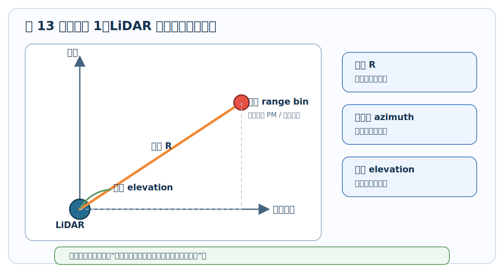
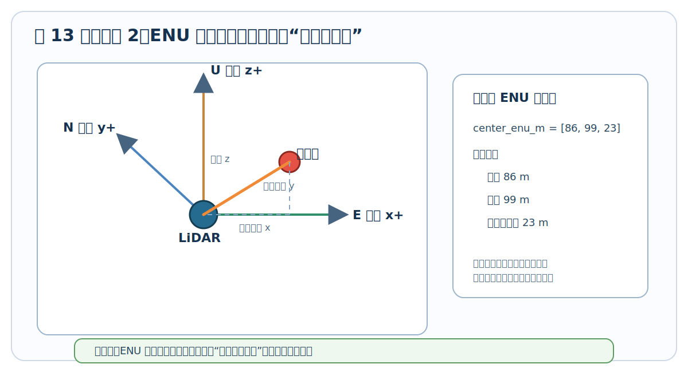
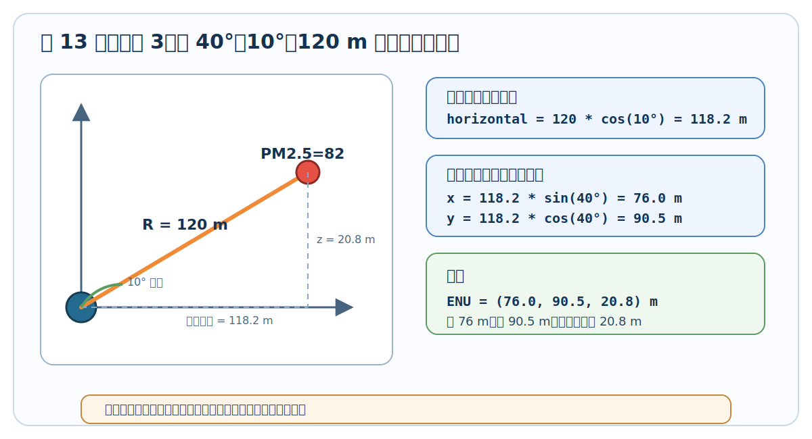
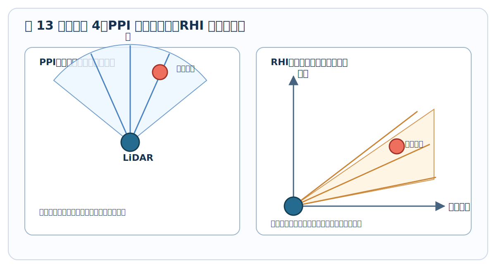
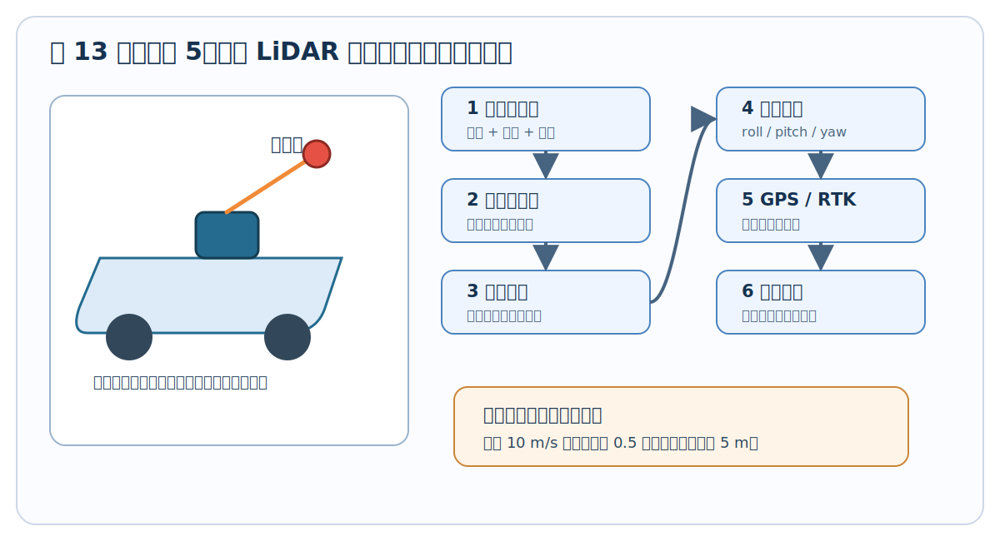
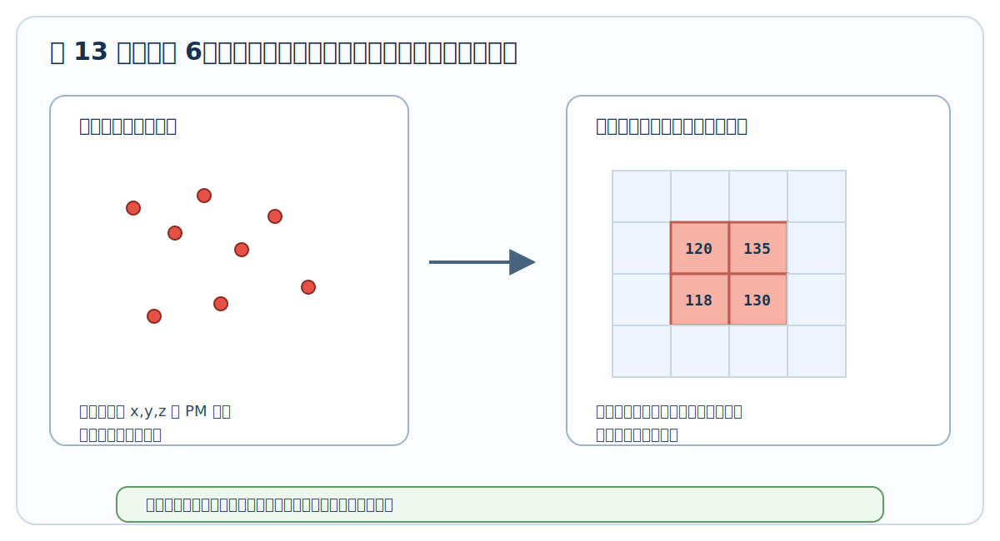
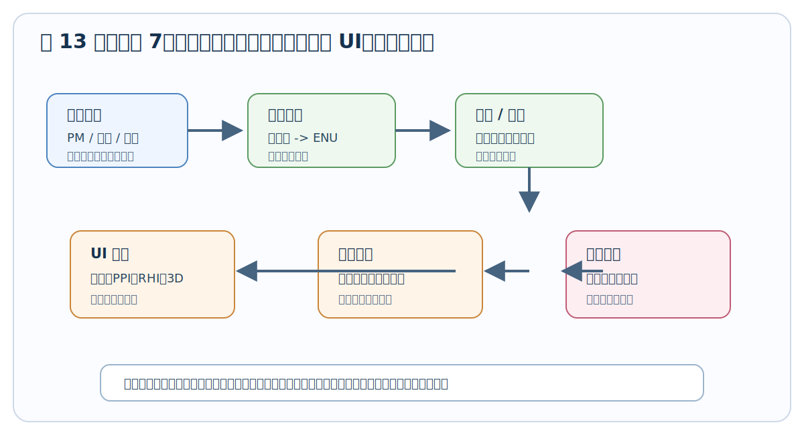

# 13. 从极坐标到地图坐标，再到 UI 图层


前面第 11 章和第 12 章讲的是：怎么把一条回波曲线一步步变成 RCS、消光、PM2.5 / PM10 和热点。

但这还不够。工程系统最终必须回答一个更现实的问题：

> 这团粉尘到底在现场的哪个方向、离设备多远、离地多高、该画在地图哪里、喷雾炮该往哪儿打？

所以第 13 章讲的不是新的反演算法，而是把算法结果“放回现实空间”。你可以把它理解成：

```text
算法告诉你：第 120 m 这个距离格子 PM2.5 很高
空间定位告诉你：这个格子在设备东北方向 86 m、北向 99 m、高度 23 m
UI 图层告诉你：这个点应该画在地图和 3D 场景里的哪里
联动控制告诉你：喷雾炮应该转到哪个角度
```

一句话总结：

> 第 12 章解决“这里脏不脏”，第 13 章解决“这里到底是哪儿”。

---

### 13.1 先把“极坐标”说成人话

激光雷达天然不是像地图软件那样直接输出经纬度。它最直接知道的是三件事：

1. **距离 R**：回波从多远的地方回来。
2. **方位角 azimuth**：这束光朝哪个水平方向打出去。
3. **仰角 elevation**：这束光往上抬了多少角度。

这三个量合起来，就像你拿着手电筒指向空中某个方向，然后说：

> 沿着我手电筒照出去的这条线，往前 120 m 那里有一团粉尘。

这就是极坐标的直觉。



```text
侧视 + 俯视混合想象：

                      这个点 = (R, azimuth, elevation)
                         ●
                        ╱
                       ╱  R = 距离
                      ╱
                     ╱ elevation = 抬头角
                    ╱
      LiDAR  ●─────╯
             ↑
             azimuth = 水平方向角
```

所以每个 range bin 都不是地图上的一个现成点，而是“某个方向射线上的一个小空间格子”。

> **🎯 为什么算法结果必须做空间定位？**
>
> 因为算法输出的 PM 或消光，最开始只是挂在数组索引上的。
>
> 比如 `pm25[4] = 82` 只说明“第 4 个距离格子浓度高”，但它没有直接告诉你这个格子在现实世界中的位置。
>
> 业务系统真正需要的是：
>
> 1. 它在雷达东边还是西边？
> 2. 它离设备水平距离多远？
> 3. 它离地多高？
> 4. 它是不是在工地边界内？
> 5. 喷雾炮能不能打到？
>
> 所以坐标转换不是“画图小功能”，而是从算法结果走向工程动作的关键一步。没有它，PM 图只能看热闹，不能定位和联动。

---

### 13.2 固定式系统怎么转成 ENU

固定式系统最常用的是 ENU 本地坐标系。它不是经纬度，而是以雷达站为原点建立一个小范围的三维坐标系：

| 轴 | 英文 | 中文含义 | 人话理解 |
| --- | --- | --- | --- |
| E | East | 东向 | x 轴，往东为正 |
| N | North | 北向 | y 轴，往北为正 |
| U | Up | 向上 | z 轴，往天上为正 |



可以想象雷达站脚下放了一张透明坐标纸：

```text
俯视图：

                 北 N / y+
                   ↑
                   │
                   │
        西 x-  ────●────→ 东 E / x+
                 LiDAR
                   │
                   │
                   ↓
                 南 y-

侧视图：

                 上 U / z+
                   ↑
                   │      ● 粉尘点
                   │     ╱
                   │    ╱
                   ●───╯────────→ 水平距离
                LiDAR
```

固定式雷达坐标转换的核心动作只有两步：

1. 先把斜距 R 拆成“水平投影”和“高度”。
2. 再把水平投影按方位角拆成“东向 x”和“北向 y”。

用普通写法就是：

```text
水平投影 = R * cos(elevation)
高度 z = R * sin(elevation)

东向 x = 水平投影 * sin(azimuth)
北向 y = 水平投影 * cos(azimuth)
```

注意这里默认方位角 0 度指向正北，90 度指向正东。这是气象和雷达系统里很常见的定义。

### 13.3 一个具体数字例子：40 度方位、10 度仰角、120 m 距离

假设某个热点格子来自下面这条射线：

1. 方位角 azimuth = 40 deg。
2. 仰角 elevation = 10 deg。
3. 斜距 R = 120 m。
4. 这一格 PM2.5 = 82。

先算水平投影：

```text
水平投影 ≈ 120 * cos(10 deg) ≈ 118.2 m
高度 z   ≈ 120 * sin(10 deg) ≈ 20.8 m
```

再把水平投影拆成东向和北向：

```text
东向 x ≈ 118.2 * sin(40 deg) ≈ 76.0 m
北向 y ≈ 118.2 * cos(40 deg) ≈ 90.5 m
```

所以这个点的 ENU 坐标约为：

```text
(x, y, z) = (76.0, 90.5, 20.8) m
```

这句话的业务含义是：

> 这个高 PM 格子位于雷达东边约 76 m、北边约 90 m、高度约 21 m 的位置。

这就比“第 120 m 距离 bin 浓度高”有用多了。因为现在它已经能被放到地图、剖面图、三维场景和喷雾控制里。



下面是一个更完整的 Python 小函数：

```python
import numpy as np

def polar_to_enu(ranges_m, azimuth_deg, elevation_deg):
    az = np.deg2rad(azimuth_deg)
    el = np.deg2rad(elevation_deg)

    horizontal = ranges_m * np.cos(el)
    x_east = horizontal * np.sin(az)
    y_north = horizontal * np.cos(az)
    z_up = ranges_m * np.sin(el)
    return x_east, y_north, z_up

x, y, z = polar_to_enu(120.0, 40.0, 10.0)
print(round(x, 1), round(y, 1), round(z, 1))
```

> **🎯 为什么 x 用 sin，y 用 cos？是不是写反了？**
>
> 这取决于方位角从哪里开始算。
>
> 在数学课里，角度常常从 x 轴正方向开始，逆时针转，所以很多公式会写成 `x = R * cos(angle)`、`y = R * sin(angle)`。
>
> 但气象、导航和雷达里，方位角常常是：
>
> 1. 0 度 = 正北。
> 2. 90 度 = 正东。
> 3. 180 度 = 正南。
> 4. 270 度 = 正西。
>
> 这样定义时，北向 y 才是 0 度的主方向，所以：
>
> ```text
> x_east  = horizontal * sin(azimuth)
> y_north = horizontal * cos(azimuth)
> ```
>
> 你只要记住一句：这里的方位角是“从北开始顺时针量”的，不是数学课里“从 x 轴开始量”的。

---

### 13.4 PPI 和 RHI 转坐标时分别在看什么

第 4 章和第 19 章已经讲过 PPI 和 RHI。这里把它们和坐标转换连起来。



#### PPI：像在地图上扫一圈

PPI 是固定仰角，水平方向转动。它最适合回答：

> 哪个方向、多远处有污染热点？

```text
PPI 俯视图：

              北
              ↑
         38° ╱│╲ 42°
            ╱ │ ╲
           ╱  │  ╲
          ╱   │   ╲
         ●────┼────→ 东
       LiDAR

每一条射线都有一串距离 bin。
把这些 bin 转成 ENU 后，就能铺到地图上。
```

PPI 的重点是平面位置。对工地和园区来说，它适合画：

1. 扫描扇区。
2. 热点多边形。
3. 污染团在平面上的质心。
4. 风向叠加后的传播方向。

#### RHI：像把空气竖着切一刀

RHI 是固定方位角，上下扫仰角。它最适合回答：

> 这团粉尘抬到了多高？层顶层底在哪里？

```text
RHI 侧视图：

高度 ↑
     │              ● 高仰角点
     │           ╱
     │        ● 中仰角点
     │     ╱
     │  ● 低仰角点
     │╱
LiDAR●────────────────→ 地面距离
```

RHI 有时不必一开始就转完整三维，先转成“地面距离 + 高度”就很直观：

```text
地面距离 = R * cos(elevation)
高度     = 设备安装高度 + R * sin(elevation)
```

例如设备安装高度 18 m，R = 120 m，仰角 10 度：

```text
地面距离 ≈ 118.2 m
高度     ≈ 18 + 20.8 = 38.8 m
```

注意这里高度比前面的 20.8 m 多了 18 m，因为前面算的是“相对雷达本体的高度”，这里算的是“相对地面的高度”。

> **🎯 固定式系统里，什么时候要加设备安装高度？**
>
> 如果你只在雷达本体坐标系里画图，z = R * sin(elevation) 就够了。
>
> 但如果你要说“离地高度是多少”，或者要和建筑物、喷雾炮、工地围挡、地形模型叠加，就必须加上设备安装高度。
>
> ```text
> 相对雷达高度 = R * sin(elevation)
> 离地高度     = 雷达安装高度 + R * sin(elevation)
> ```
>
> 这件事很容易漏。漏掉之后，所有热点高度都会被系统性低估。

---

### 13.5 车载系统为什么更麻烦

固定式系统好办，是因为雷达站不动。你只要知道雷达原点在哪里，射线往哪个方向打，就能把点放到空间里。

车载系统麻烦在于：雷达自己一直在动，而且车体还会晃。



车载 LiDAR 每一条 profile 都必须同时绑定：

1. 这一刻车在哪里：GPS / RTK。
2. 这一刻车头朝哪：航向 yaw。
3. 车有没有左右歪：横滚 roll。
4. 车有没有前后点头：俯仰 pitch。
5. 雷达装在车顶哪个位置：安装偏置。
6. 扫描头自己又转到了哪个角度：扫描姿态。

可以把完整坐标链想成一层一层搬箱子：

```text
第 1 层：点在雷达自己的坐标里
        ↓ 加上扫描头角度
第 2 层：点在雷达安装座坐标里
        ↓ 加上雷达相对车体的位置偏置
第 3 层：点在车体坐标里
        ↓ 加上车体 roll / pitch / yaw
第 4 层：点在世界坐标里
        ↓ 加上 GPS / RTK 位置
第 5 层：点能落到地图上
```

用一行普通话表达就是：

> 先把“雷达看见的点”转到“车上”，再把“车上的点”转到“地球上的位置”。

如果写成工程关系，可以这样理解：

```text
世界点 = GPS位置 + 车体姿态 * (安装偏置 + 扫描头姿态 * 雷达本体点)
```

你不需要一开始就手推矩阵，但必须知道每一项少了会发生什么：

| 漏掉的量 | 会出现什么问题 |
| --- | --- |
| GPS 位置 | 整条走航轨迹不知道在地图哪里 |
| 航向 yaw | 点云整体转错方向 |
| 俯仰 pitch | 前方热点高度被算高或算低 |
| 横滚 roll | 左右两侧热点高度不一致 |
| 安装偏置 | 点云整体平移，喷雾目标偏位 |
| 时间同步 | 点云像被拉扯、错位、重影 |

> **🎯 车载系统最怕的不是公式写错，而是时间没对齐**
>
> 假设车速 36 km/h，也就是 10 m/s。如果 LiDAR 数据和 GPS 时间差了 0.5 秒，那么空间位置就会错 5 m。
>
> 对普通显示来说，5 m 可能只是图上有点偏；但对喷雾联动、污染源定位、执法取证来说，5 m 已经可能让结论不可靠。
>
> 所以车载系统里，LiDAR、GPS、IMU、云台角度必须尽量使用统一时间戳。坐标转换不是最后才补的美化步骤，而是从采集时就要设计好的数据契约。

---

### 13.6 为什么还要做网格化

坐标转换之后，你会得到很多离散点：

```text
点 1: x=76.0, y=90.5, z=20.8, PM=82
点 2: x=94.9, y=113.2, z=26.0, PM=66
点 3: x=79.0, y=87.8, z=20.8, PM=79
...
```

这些点对算法工程师来说可以处理，但对 UI 和业务系统来说还不够好用。因为它们是散的，不一定刚好排成整齐表格。

网格化就是把空间切成固定大小的小格子，然后把落在同一个小格子里的点合并统计。



```text
俯视图：

    ┌────┬────┬────┬────┐
    │    │    │    │    │
    ├────┼────┼────┼────┤
    │    │ ●  │ ●  │    │
    ├────┼────┼────┼────┤
    │    │ ●  │ ●  │    │
    ├────┼────┼────┼────┤
    │    │    │    │    │
    └────┴────┴────┴────┘

    多个离散点落进同一个网格后，合成一个格子的值。
```

三维时，这个小格子就叫体素。你可以把体素理解成“三维像素”。

一个简单的体素索引逻辑是：

```text
i = floor((x - x0) / dx)
j = floor((y - y0) / dy)
k = floor((z - z0) / dz)
```

其中：

1. x0、y0、z0 是网格原点。
2. dx、dy、dz 是每个格子的尺寸。
3. i、j、k 是这个点落在哪个三维格子里。

同一个格子里可能有多个点，常见统计方式有：

| 统计方式 | 适合场景 | 含义 |
| --- | --- | --- |
| 平均值 | 稳定显示 PM 场 | 多个点取平均，图更平稳 |
| 最大值 | 告警检测 | 只要格子里有高值就突出显示 |
| 加权平均 | 热点质心 | PM 越高，对结果影响越大 |
| 命中次数 | 数据质量 | 这个格子被扫描到多少次 |
| 最近一次值 | 实时刷新 | 保留最新观测结果 |

> **🎯 网格化不是为了“降低精度”，而是为了让数据可用**
>
> 很多初学者会觉得：点云越原始越真实，为什么还要切格子？
>
> 原因是业务系统要的是稳定、可查询、可告警、可回放的数据。
>
> 离散点适合科研分析，但网格更适合：
>
> 1. 画热力图。
> 2. 做区域统计。
> 3. 找连通热点。
> 4. 和工地边界、道路、厂区网格叠加。
> 5. 做历史对比和报表。
>
> 所以网格化的本质是把“很多条射线上的点”，整理成“平台能消费的空间产品”。

---

### 13.7 坐标转换之后，UI 页面分别吃什么数据

前面第 12.13 节说过，不同产品层级给不同人用。现在加上空间坐标以后，页面和数据的关系会更清楚。



| 页面 | 主要输入 | 是否需要坐标转换 | 典型显示 | 主要用途 |
| --- | --- | --- | --- | --- |
| 时间-高度主图 | L1.5 attenuated backscatter | 通常只需要距离转高度 | curtain plot | 看污染层随时间变化 |
| 当前廓线 | L1/L2 profile | 不一定需要 ENU | 曲线图 | 看单条回波或消光剖面 |
| RHI 剖面 | L2 extinction / PM | 需要转地距和高度 | 距离-高度热力图 | 看羽流抬升和层顶层底 |
| PPI 平面 | L2 PM / extinction | 需要转 ENU 平面坐标 | 扇区热力图 | 看热点平面位置 |
| 地图页面 | L3 grid / hotspot | 必须转 ENU 或经纬度 | 底图叠加 | 看热点在哪个工地、道路、厂区 |
| 3D 页面 | L3 voxel / point cloud | 必须转 3D 坐标 | 体素、点云、切片 | 看空间结构和喷雾指向 |
| 告警页面 | 热点事件表 | 需要热点质心坐标 | 告警列表 | 决策和联动 |
| 质量控制页面 | L0 / L1 / SNR / energy | 坐标不是重点 | 原始信号和 QA 图 | 排查设备和算法问题 |

最容易犯的错是：所有页面都直接读原始数组，然后各算各的。这样会导致：

1. 同一个热点在不同页面位置不一致。
2. UI 和算法的结果对不上。
3. 回放时和实时显示不一致。
4. 喷雾目标和地图标记不一致。

更稳的做法是：

```text
L0 原始数据
  ↓
L1 / L2 算法产品
  ↓
统一坐标转换
  ↓
L3 空间产品快照
  ↓
各个 UI 页面只消费同一份快照
```

也就是说，坐标转换最好放在产品层统一做，而不是每个页面自己偷偷算一遍。

---

### 13.8 一个热点事件最终应该长什么样

平台层真正喜欢消费的，不是一整条回波，也不是一堆散点，而是一条结构化事件。

例如：

```json
{
    "event_id": "dust_20260527_102315_001",
    "timestamp": "2026-05-27T10:23:15Z",
    "type": "dust_hotspot",
    "source_product": "ppi_pm25_grid",
    "center_enu_m": [86.1, 99.1, 23.2],
    "center_height_agl_m": 41.2,
    "target_azimuth_deg": 41.0,
    "target_elevation_deg": 10.0,
    "peak_pm25_ugm3": 186.0,
    "mean_pm25_ugm3": 122.5,
    "mean_extinction_km_1": 0.42,
    "area_m2": 950.0,
    "vertical_extent_m": [24.0, 58.0],
    "confidence": 0.91,
    "recommended_action": "spray"
}
```

这条事件里，字段可以分成 5 类：

| 字段类别 | 例子 | 作用 |
| --- | --- | --- |
| 身份信息 | event_id, timestamp, type | 知道这是什么事件、什么时候发生 |
| 空间位置 | center_enu_m, center_height_agl_m | 知道热点在哪里、离地多高 |
| 控制目标 | target_azimuth_deg, target_elevation_deg | 给喷雾炮或云台使用 |
| 污染强度 | peak_pm25, mean_pm25, extinction | 判断严重程度 |
| 质量和处置 | confidence, recommended_action | 判断要不要报警和联动 |

你可以看到，到这一步数据已经从“科研数组”变成了“业务对象”。

```text
科研数组：pm25[azimuth_index, range_index]
业务对象：某时某地有一个粉尘热点，中心在 (86.1, 99.1, 23.2) m，建议喷雾
```

这就是平台层最需要的数据形态。

---

### 13.9 从热点事件到喷雾联动

当热点事件已经有了质心坐标，喷雾联动就可以继续往下走。

最常见流程是：

1. 把热点 ENU 坐标换成喷雾设备自己的坐标。
2. 计算喷雾炮要转到的方位角。
3. 计算喷雾炮要抬到的俯仰角。
4. 判断这个角度是否在机械行程范围内。
5. 判断热点距离是否在有效射程内。
6. 判断置信度和持续时间是否足够，避免误喷。
7. 发送控制指令。
8. 继续用 LiDAR 观察喷雾之后 PM 是否下降。

一个简单几何关系是：

```text
热点相对喷雾炮的坐标 = 热点坐标 - 喷雾炮坐标

水平距离 = sqrt(dx*dx + dy*dy)
目标方位角 = atan2(dx, dy)
目标仰角   = atan2(dz, 水平距离)
```

这里 `dx` 是东向差值，`dy` 是北向差值，`dz` 是高度差。

> **🎯 为什么不能一发现超标就立刻喷？**
>
> 因为 LiDAR 数据里可能有噪声、鸟类昆虫、雨滴、强反射、短时车尘扰动。工程系统通常会加几个保险条件：
>
> 1. 热点连续存在超过一定时间，比如 30 秒或 1 分钟。
> 2. 热点面积不能太小，不能只是单个孤立格子。
> 3. SNR 和数据质量标志要合格。
> 4. 热点必须落在需要治理的区域内。
> 5. 喷雾炮角度和射程必须覆盖得到。
>
> 所以联动控制不只是“PM 超标 -> 喷水”，而是“可信热点 -> 可达目标 -> 合规动作 -> 效果评估”。

### 13.10 这一章真正想让你记住什么

第 13 章可以浓缩成一条完整链路：

```text
距离 bin + 方位角 + 仰角
      ↓
极坐标点
      ↓
ENU / 地图 / 地距-高度坐标
      ↓
点云或网格
      ↓
热点区域和质心
      ↓
UI 图层、告警事件、喷雾目标
```

如果只记住 5 句话，就记住这 5 句：

1. LiDAR 原始空间信息是“距离 + 方位角 + 仰角”，不是现成地图点。
2. ENU 坐标就是以雷达为原点的“东、北、上”本地坐标。
3. PPI 主要看水平位置，RHI 主要看垂直结构。
4. 车载系统必须额外处理 GPS、IMU、安装偏置和时间同步。
5. UI 和联动控制真正消费的是空间产品和热点事件，不是原始回波数组。

所以从软件视角看，一条完整的数据链并不是“画图结束”，而是：

> 原始回波数组 -> 预处理 -> 反演 -> PM 估算 -> 空间定位 -> 热点事件 -> 联动控制 -> 效果评估

---

