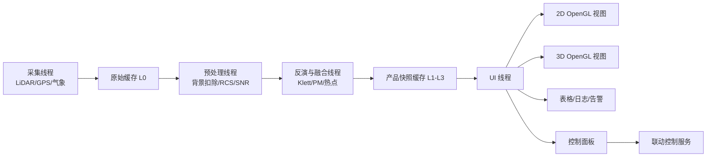

# 14. 软件到底应该做成什么样，小白先建立正确的 UI 预期

很多人一说到激光雷达 UI，就先想到炫酷 3D 点云。对颗粒物系统来说，这其实不是第一优先级。

真正高频、好用、工程上有效的界面通常是：

1. 时间-高度热力图。
2. 距离-高度剖面图。
3. 地图上的扫描扇区叠加。
4. 当前廓线曲线。
5. 告警列表和设备状态栏。

3D 当然也重要，但通常是第二屏或分析屏，而不是唯一主屏。

### 14.1 你应该从公开软件界面里学什么

主要学 3 件事：

1. 信息组织方式。
2. 图层和质量控制怎么展示。
3. 操作员最常盯的指标到底是什么。

下面这些 UI 图都来自公开资料，已经放进本项目的 assets 目录，可以直接在 Markdown 中查看。

### 14.2 CloudnetPy / Cloudnet 风格：科研型 quicklook

来源：[CloudnetPy quickstart](https://actris-cloudnet.github.io/cloudnetpy/quickstart.html)

这类界面最适合你理解“时间-高度 curtain plot 才是大气遥感系统的主战场”。

典型 LiDAR attenuated backscatter：

怎么看：

1. 横轴通常是时间。
2. 纵轴通常是高度。
3. 颜色表示后向散射强弱。
4. 一整天的污染层抬升、云底变化、低层气溶胶累积都能直接看出来。

目标分类图：

怎么看：

1. 不同颜色不是“浓淡”，而是不同目标类型。
2. 这类图特别适合未来加入云、雾、雨、昆虫、沙尘等质量控制标签。
3. 对颗粒物系统来说，它能启发你做“有效数据”和“无效数据”的分层展示。

多仪器联合 quicklook：

怎么看：

1. 同一时间轴上放多个产品，判断效率会高很多。
2. 平台不应该只有一张图，而应该让用户能同时看回波、气象、质量标志和算法结果。

### 14.3 Vaisala BL-View 风格：运维值守型 UI

来源：[Vaisala BL-View 文档](https://docs.vaisala.com/r/M211185EN-E/en-US/GUID-EF63D824-E0FA-437C-A1F8-FCFC6DFDADD7)

BL-View 主界面：

归档图界面：

这两张图给你的启发：

1. 顶部状态栏非常重要，不能只顾画图，不顾设备状态。
2. 业务系统必须同时支持实时查看和历史回放。
3. 告警、数据延迟、设备健康度应该一直可见。

### 14.4 Vaisala CL61 风格：颗粒物业务最接近的显示形态

来源：[Vaisala CL61 文档](https://docs.vaisala.com/r/M212721EN-D/en-US/GUID-34D2DC29-AC43-404F-9F80-3199EF7F9E36)

CL61 后向散射图：

为什么这张图特别值得参考：

1. 它和颗粒物遥感的主图形态几乎一致。
2. 颜色直接表达强弱，非常适合业务用户。
3. 上面可以继续叠加云底、污染层顶、边界层高度、质量标志线。

### 14.5 如果做自己的系统，建议至少有 4 个页面

#### 页面 1：实时总览

应该包含：

1. 站点和设备状态栏。
2. 当前风速风向、湿度、温度。
3. 时间-高度热力图。
4. 当前时刻垂直廓线。
5. 当前告警列表。

#### 页面 2：扫描剖面

应该包含：

1. RHI 距离-高度剖面。
2. PPI 扫描扇区图。
3. 产品切换：RCS、消光、PM2.5、PM10、depol。
4. 风场和污染源叠加。

#### 页面 3：三维空间页面

应该包含：

1. 本地底图或三维地形。
2. ENU 点云或体素。
3. 热点质心位置。
4. 时间轴播放控件。
5. 地面站和喷雾设备位置。

#### 页面 4：质量控制与标定页面

应该包含：

1. 原始信号。
2. 背景值和发射能量趋势。
3. SNR 与异常标志。
4. 地面 PM 对比散点图。
5. 模型漂移和误差统计。

### 14.6 如果最后软件要用 Qt + OpenGL，这几类公开界面最值得参考

你这次明确提到“最终做成 Qt + OpenGL 的软件”，那参考图就不能只看气象 quicklook 了，还要看真正的桌面软件形态。

最值得参考的是下面 3 类：

1. CloudCompare 这种“左侧对象树 + 中间 OpenGL 三维视图 + 底部日志”的三维分析界面。
2. QGIS 这种“左侧图层树 + 中间地图画布 + 右侧属性面板”的 GIS 业务界面。
3. 把两者结合起来，做成“实时监控主屏偏 2D，分析页面偏 3D”的工业上位机。

如果你现在看到的是 Markdown 源码编辑区，而不是预览面板，那么下面这些图片不会像 Word 那样直接展开，这是正常现象。要看渲染后的图片，请打开 Markdown 预览。

#### 参考图 1：CloudCompare 主界面

原图链接：[CloudCompare 主界面快照](../assets/qt_ui_refs/cloudcompare_snapshot.jpg)

这张图最值得学的不是配色，而是结构：

1. 左侧是对象树，适合放扫描任务、图层、热点、设备和历史结果。
2. 中间是 OpenGL 主视口，适合放 ENU 点云、体素、PPI 扇面、RHI 剖面和热点质心。
3. 右侧色标告诉你当前颜色到底代表什么物理量，这对 PM、消光、SNR 特别重要。
4. 底部日志区非常实用，适合放设备连接状态、数据延迟、算法异常和控制回执。

如果把它翻译成你的项目，就是：

> 一定要把“图层树”“主视口”“色标”“日志/状态栏”做成固定骨架，而不是只有一块大画布。

来源：CloudCompare 官方介绍页。官方页面明确写明 CloudCompare 依赖 Qt 和 OpenGL，这张图很适合拿来理解 Qt 桌面软件的典型布局。

#### 参考图 2：QGIS 风格的业务应用界面

原图链接：[QGIS 业务应用界面](../assets/qt_ui_refs/qgis_workflow_app.png)

这张图更接近“工业上位机”的日常工作状态，因为它不是只展示结果，而是把工具、图层、主画布和底部操作区全部放在一个窗口里。

你重点看 4 个位置：

1. 左侧图层树：适合放底图、道路、工地边界、喷雾炮、雷达站位、热点区域。
2. 中间地图区：适合放 PPI 扇区、热点多边形、风向箭头、历史轨迹。
3. 顶部工具栏：适合放开始扫描、暂停、回放、阈值切换、联动开关。
4. 底部参数区：适合放当前目标角、选中区域属性、设备控制参数。

对你的系统来说，这张图最有启发的一点是：

> 真正高频使用的主屏通常不是纯 3D，而是“地图 + 图层 + 参数区 + 状态区”的组合界面。

#### 参考图 3：QGIS 风格的地图主屏 + 侧边样式面板

原图链接：[QGIS 深色地图主屏](../assets/qt_ui_refs/qgis_dark_mode.png)

这张图适合拿来理解“分析屏”应该怎么布局：

1. 左边可以是事件树、历史任务树、算法工具箱。
2. 中间是主地图或主剖面区。
3. 右边是样式和阈值面板，适合放颜色表、量程、阈值、图层透明度。

这对颗粒物系统特别重要，因为同一份数据常常要切换成不同显示模式：

1. RCS。
2. 消光系数。
3. PM2.5。
4. PM10。
5. SNR。
6. 告警 mask。

如果没有右侧这种随时可调的样式面板，值班人员很难快速把图调到“看得出问题”的状态。

来源：QGIS Hub 截图页，CC0。

#### 参考图 4：OpenGL 实时渲染效果为什么重要

原图链接：[CloudCompare OpenGL filters](../assets/qt_ui_refs/cloudcompare_gl_filters.jpg)

这张图虽然不是完整软件界面，但它很适合解释一个工程事实：

1. 同一份三维数据，渲染方式不同，视觉可读性会差很多。
2. 如果没有基本的阴影、边缘增强或深度感，三维点云会很平，值班人员不容易看清结构。
3. 所以 OpenGL 在这套软件里不只是“为了炫酷”，而是为了把三维结构看清楚。

来源：CloudCompare 官方介绍页中的 OpenGL filters 示例图。

### 14.7 最推荐的落地路线：Qt Widgets 做外壳，OpenGL 做高性能视图内核

如果你的目标是工业上位机，而不是做一个偏展示的概念 Demo，我更推荐：

1. Qt Widgets 负责主窗口、菜单、停靠面板、表格、参数页、设备状态页。
2. QOpenGLWidget 负责时间高度图、PPI、RHI、地图叠加和三维场景。
3. 曲线和表格继续用 Qt 原生控件或成熟绘图库，不要强行全都塞进 3D 引擎。

这样选的原因很现实：

1. QMainWindow + QDockWidget 很适合做工业软件常见的多面板布局。
2. OpenGL 只处理真正需要高刷新的图形层，性能和维护成本更平衡。
3. 参数配置、日志、设备树、告警表这些内容，用 Widgets 比 QML 或纯 OpenGL 更稳。

如果用一句话概括这条路线，就是：

> 外壳用 Qt 桌面软件的成熟能力，重图形区域再交给 OpenGL，不要把所有事情都变成三维渲染问题。

### 14.8 软件模块建议怎么拆

下面这张表是比较适合 MVP 到工程版演进的拆法：

| 模块 | 推荐技术 | 作用 |
| --- | --- | --- |
| 主窗口 AppShell | QMainWindow + QDockWidget + QSplitter | 组织页面、停靠面板、工具栏、状态栏 |
| 数据接入层 | QTcpSocket / QUdpSocket / QSerialPort / QThread | 接 LiDAR、气象站、GPS、IMU、喷雾炮控制器 |
| 算法调度层 | QObject worker + 线程池 | 背景扣除、RCS、Klett/Fernald、PM 标定、热点检测 |
| 产品缓存层 | 环形缓冲区 + 快照对象 | 给 UI 提供稳定的 L1/L2/L3 产品快照 |
| 2D 图层视图 | QOpenGLWidget | 时间高度图、PPI、RHI、热力图、地图叠加 |
| 3D 视图 | QOpenGLWidget | ENU 点云、体素、热点质心、喷雾方向线 |
| 曲线与表格 | QTableView + QTreeView + 绘图库 | 当前廓线、设备状态、告警列表、误差统计 |
| 回放与归档 | SQLite / 文件索引 / 时间轴控件 | 历史查询、事件回放、前后对比 |
| 联动控制层 | 命令服务 + 状态回执 | 向喷雾炮、云台、继电器发送控制指令 |

你可以把它理解成 3 层：

1. 下层负责收数据和发命令。
2. 中层负责把原始数据变成产品。
3. 上层负责把产品画出来，并让人能操作。

### 14.9 线程和数据流一定要这样设计，UI 才不会卡死

Qt + OpenGL 软件最容易犯的错，就是一边采数据、一边算算法、一边在 UI 线程里直接画原始数组。这样数据一大，界面就会卡。

更合理的结构应该是：

你要特别记住 4 条工程规则：

1. QOpenGLWidget 的真正绘制发生在 UI 线程，不要在工作线程里直接碰 OpenGL 上下文。
2. 算法线程只生产“产品快照”，不要直接操作界面控件。
3. UI 线程只消费最新快照，不回头扫大批历史原始数据。
4. 采集、算法、UI 之间尽量用 signal/slot 的队列连接或线程安全队列隔开。

也就是说：

> 算法线程负责算，UI 线程负责看，控制线程负责发命令，三者不要混在一起。

### 14.10 每一种图在 OpenGL 里分别怎么画

#### 视图 1：时间-高度图

这个视图最适合做成一张持续刷新的二维纹理：

1. 横轴是时间列。
2. 纵轴是距离或高度 bin。
3. 每来一条新 profile，就更新一列像素。
4. 颜色映射由 shader 或颜色查找表完成。

工程上最常用的做法是：

1. CPU 先把当前产品整理成浮点矩阵。
2. 再上传成 OpenGL texture。
3. 最后由 fragment shader 按色标显示。

这样做的好处是，哪怕矩阵比较大，滚动显示也比用普通 QWidget 一格一格画快得多。

#### 视图 2：PPI 和 RHI

PPI 和 RHI 有两条实现路线：

1. 简单路线：先在 CPU 上把极坐标重采样到规则网格，再当作二维纹理画出来。
2. 进阶路线：直接在 GPU 上按射线和距离插值，实时生成扇形或剖面图层。

如果是你现在这个项目，我建议先走简单路线，因为：

1. 更容易调试。
2. 算法和显示更容易对齐。
3. 出问题时更容易检查是哪一步错了。

等到 MVP 稳定以后，再考虑把极坐标插值搬到 GPU。

#### 视图 3：地图叠加层

地图页不要直接把所有东西都做成三维。更实用的做法是：

1. 底图作为纹理或瓦片图层。
2. 热点多边形、扫描扇区、设备图标、风向箭头作为叠加图层。
3. 选中某个热点后，在右侧面板显示区域面积、均值、峰值和持续时间。

这类图层最关键的不是炫酷，而是坐标准确。你必须把下面这些对象统一到同一坐标系里：

1. 雷达位置。
2. GPS/IMU 姿态。
3. ENU 结果点。
4. 底图坐标。
5. 喷雾炮目标角。

#### 视图 4：三维点云和体素场

三维视图建议只承担 4 件事：

1. 看热点空间位置。
2. 看喷雾方向和热点是否对准。
3. 看扫描覆盖范围。
4. 做事后分析和回放。

实现时可以这样理解：

1. 点云模式用 VBO 存点坐标和颜色。
2. 体素模式用 instancing 或立方体批量绘制。
3. 色标统一由 PM、消光或 backscatter 对应的查找表控制。
4. 鼠标点击用 picking 或射线相交，拿到选中点或选中体素。

#### 视图 5：当前廓线和质量控制曲线

这一类图不一定非要 OpenGL。更现实的选择是：

1. 用普通 2D 绘图库画当前 profile。
2. 用表格控件画告警和日志。
3. 让 OpenGL 重点负责热力图、地图和三维场景。

这样分工更稳，也更容易维护。

### 14.11 真正做工程时，页面建议这样拆

如果最后软件要能上线值守，我建议页面按“主屏看态势，副屏做分析”来拆：

1. 实时总览页：时间高度图、当前风场、告警列表、设备状态。
2. 扫描页：PPI、RHI、扇区热力图、扫描参数。
3. 地图联动页：底图、热点区、喷雾炮方向、联动按钮。
4. 三维分析页：ENU 点云、体素、热点轨迹、时间轴回放。
5. 质量控制页：原始信号、能量趋势、背景、SNR、标定散点图。

这样拆的好处是：

1. 值班人员有主屏可看。
2. 算法人员有分析页可查。
3. 运维人员有质量页可排错。
4. 领导或客户演示时也有一页看起来足够直观。

### 14.12 一个现实可落地的 Qt + OpenGL 开发顺序

如果你们现在准备开始做软件，我建议按下面顺序推进，而不是一开始就做全功能三维系统：

1. 第一步先搭 Qt 主窗口、菜单、状态栏和停靠面板。
2. 第二步先做时间高度图和当前廓线，这样最容易尽快看到成果。
3. 第三步再做 PPI/RHI 和地图叠加。
4. 第四步补三维 ENU 场景和热点选中。
5. 第五步再接历史回放、告警管理和喷雾联动。

这样推进的原因很简单：

1. 最先有业务价值的是 quicklook、剖面和地图页。
2. 三维页很重要，但通常不是 MVP 最先证明价值的页面。
3. 如果一开始就把大量时间砸在 3D 特效上，反而容易把真正关键的数据链和联动控制拖慢。

---

