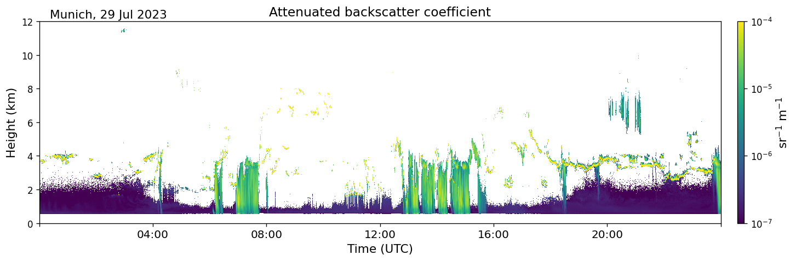
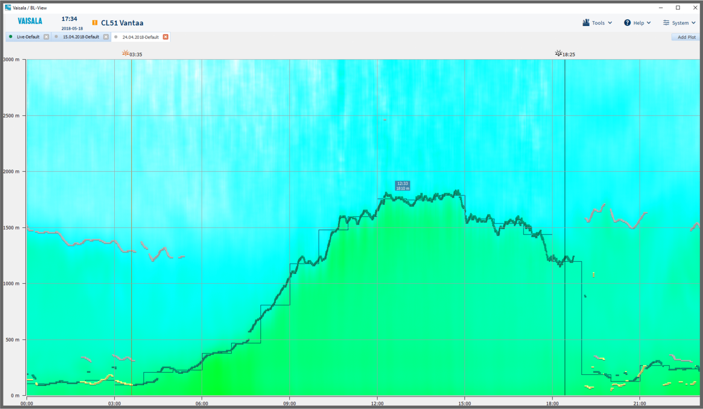
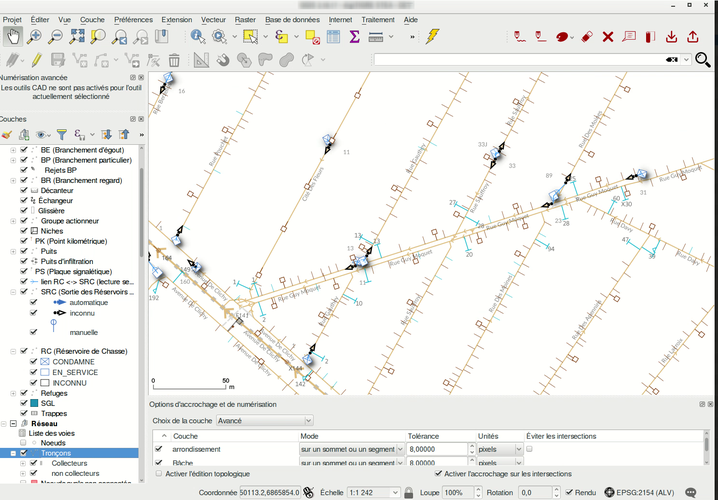
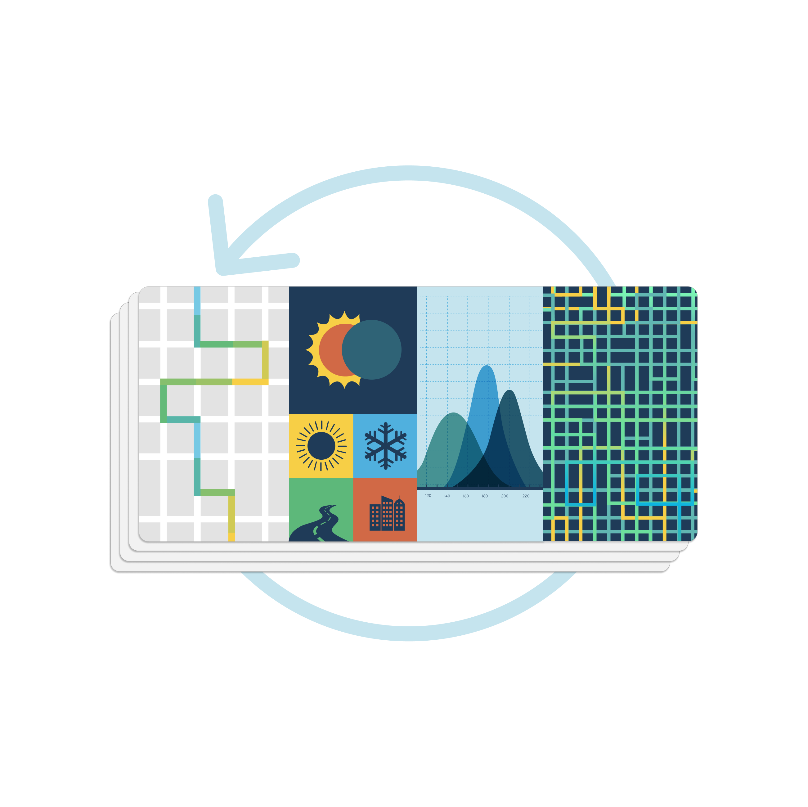
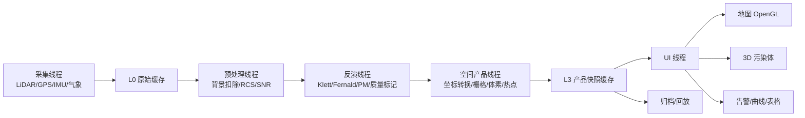

# 14. 软件到底应该做成什么样：地图 + 3D 污染物可视化

很多人一想到 LiDAR 软件，就会想到“炫酷 3D 点云”。但颗粒物监测不是自动驾驶点云，也不是纯科研 quicklook。你的应用目标更具体：

> 走航车或固定式设备，用 LiDAR 回波和算法反演得到 PM2.5 / PM10，实时发现城市道路、工地、厂界附近的污染热点，并在地图和 3D 视图里讲清楚“哪里脏、脏到什么程度、飘到多高、有没有处置”。

所以这套软件的第一屏不应该是孤立的 3D 点云，而应该是：

1. **地图主屏**：底图、工地边界、道路、设备、走航轨迹、PM 热力图。
2. **3D 污染物范围**：在地图上方显示半透明体素或等值面，表达污染团高度和体积。
3. **停靠面板**：图层树、告警列表、设备状态、PM 廓线、RHI/PPI、统计、时间轴回放。
4. **工程闭环入口**：告警确认、派单、喷淋/雾炮联动、处置前后对比。

一句话：

> 地图负责“定位”，3D 负责“解释空间形态”，告警和回放负责“让人做决定”。

---

### 14.1 先看类似软件怎么做 UI

我参考了几类公开产品和平台。它们不是完全同类，但每一类都有值得借鉴的 UI 逻辑。

#### 参考 1：CloudnetPy / Cloudnet quicklook



CloudnetPy 的 quicklook 很适合学习“时间-高度 curtain plot”。横轴是时间，纵轴是高度，颜色表示衰减后向散射或分类结果。它告诉我们：

1. 连续固定观测时，时间-高度图比单条曲线直观得多。
2. 颜色必须稳定表达物理量强弱，不能每张图自动乱缩放。
3. 固定站软件应该保留一个“时间-高度历史面板”，用于看污染层抬升、消散和日变化。

参考来源：[CloudnetPy Quickstart](https://actris-cloudnet.github.io/cloudnetpy/quickstart.html)。

#### 参考 2：Vaisala BL-View / CL61



Vaisala BL-View 是典型的运维型大气遥感软件：它强调数据采集、分析、可视化和边界层判断。CL61 这类设备还会显示衰减后向散射、退偏比、云/气溶胶结构。

对你的软件的启发是：

1. 顶部状态栏必须一直可见：设备在线、数据延迟、激光状态、GPS/IMU、存储、告警数。
2. 科研图层可以保留，但不能抢主屏；业务主屏应该优先给地图。
3. 质量控制要能被看见，例如 SNR、湿度修正、雨雾标记、参考区段是否可靠。

参考来源：[Vaisala BL-View 文档](https://docs.vaisala.com/r/M211185EN-E/en-US/GUID-EF63D824-E0FA-437C-A1F8-FCFC6DFDADD7)、[Vaisala CL61 产品页](https://www.vaisala.com/en/products/ceilometer-CL61-urban-industrial)、[CL61 衰减后向散射说明](https://docs.vaisala.com/r/M212475EN-E/en-US/GUID-0EFAAD1B-9445-4A4A-9C6C-1F8B0777E265/GUID-B6793816-A756-41D2-AA7D-4C962A383863)。

#### 参考 3：QGIS



QGIS 的经典布局是“左侧图层树 + 中间地图画布 + 右侧属性/处理面板”。这个结构非常适合你的系统：

1. 左侧控制底图、PM 热力图、3D 污染体、设备、轨迹、告警、工地边界。
2. 中间地图负责主要空间判断。
3. 右侧属性面板显示选中热点的峰值、均值、面积、高度、持续时间和处置状态。

参考来源：[QGIS Layers Panel 文档](https://docs.qgis.org/latest/en/docs/user_manual/introduction/general_tools.html)。

#### 参考 4：Aclima 城市空气质量移动监测


Aclima 的公开页面展示了移动监测车、地图建模和可视化流程。它不是 LiDAR PM 反演软件，但和“城市污染物巡逻”非常接近。



对你的软件的启发是：

1. 走航车 UI 要突出“轨迹 + 沿线污染色带”，用户先看路线，不先看曲线。
2. 城市级展示要支持栅格化/分段聚合，不能只显示一堆采样点。
3. 车载巡逻和平台分析要分层：车上看实时异常，平台看历史分布和热点排名。

参考来源：[Aclima How Aclima Maps Air](https://aclima.earth/how-aclima-maps-air)。

#### 参考 5：Aeroqual OneView / AirNow / Google Air Quality API

Aeroqual OneView 面向工地、修复场地和厂界空气监测，强调实时 dashboard、风数据、超标告警、短信/邮件通知和自动报表。AirNow 和 Google Air Quality API 则强调公众可理解的空气质量地图、AQI 色标、热力瓦片和污染物详情。

这几类平台给你的启发是：

1. 工地场景必须把“阈值、超标、持续时间、处置状态”做成一等公民。
2. 地图热力图最好做成可叠加图层，像瓦片一样按视野加载。
3. 色标要稳定，AQI/PM 阈值要清楚；不能为了好看而让每次颜色尺度漂移。
4. 报表和证据链不是后期附加功能，而是工地和执法场景的核心需求。

参考来源：[Aeroqual OneView](https://www.aeroqual.com/products/oneview-air-monitoring-software)、[AirNow Fire and Smoke Map](https://fire.airnow.gov/)、[AirNow Interactive Map](https://gispub.epa.gov/airnow/)、[Google Air Quality API](https://developers.google.com/maps/documentation/air-quality/overview)、[Google Heatmap Tiles](https://developers.google.com/maps/documentation/air-quality/heatmaps)。

> 上面这些图和链接只作为 UI 参考。真正开发时不应该照搬品牌视觉，而应该抽取它们的信息架构：地图、图层、时间轴、状态栏、告警、报表、质量控制。

---

### 14.2 这套软件应该有两个主模式

软件不要做成很多互相割裂的小工具。建议主界面只有两个一级模式：

| 模式 | 适用场景 | 地图主屏显示 | 右侧重点面板 |
| --- | --- | --- | --- |
| 固定监测 | 工地、厂界、园区、城市固定站 | 设备位置、PPI 热力图、3D 污染体、风向、工地边界 | 当前热点、PPI/RHI、设备质量、联动控制 |
| 走航巡逻 | 城市道路、投诉点、巡查路线 | 车辆位置、轨迹色带、沿途高值点、停车精扫结果 | 轨迹统计、异常路段、导航/复扫建议 |

顶部可以用清晰的分段切换：

```text
┌─────────────────────────────────────────────────────────────────────┐
│ 固定监测 | 走航巡逻     设备: ONLINE  数据延迟: 1.2s  GPS: RTK  告警: 2 │
├─────────────────────────────────────────────────────────────────────┤
│                                                                     │
│                         地图 + 3D 污染物范围                         │
│                                                                     │
├─────────────────────────────────────────────────────────────────────┤
│ ◄  ▌▌  ►   10:00 ━━━━━━━━━━━●━━━━ 10:45        实时 | 历史回放      │
└─────────────────────────────────────────────────────────────────────┘
```

固定模式和走航模式不要换掉整个软件，只换地图图层和右侧面板。这样用户心智稳定：无论设备装在楼顶还是车顶，主问题始终是“污染在哪里”。

---

### 14.3 推荐主界面布局

主界面建议采用工业桌面软件常见布局：顶部状态栏，中间地图，左右停靠面板，底部告警和时间轴。

```text
┌──────────────────────────────────────────────────────────────────────────┐
│ 固定监测  走航巡逻 │ 设备:ONLINE  风:NE 4.2m/s  PM2.5峰值:186  告警:2    │
├──────────────┬──────────────────────────────────┬──────────────────────┤
│ 图层 / 设备    │                                  │  热点属性             │
│              │                                  │                      │
│ ☑ 底图        │                                  │  事件: dust_001       │
│ ☑ 工地边界     │                                  │  位置: 工地A东北角      │
│ ☑ PM热力图     │          地图主屏                 │  峰值: 186 μg/m³      │
│ ☑ 3D污染体     │     + 半透明 3D 污染范围           │  均值: 122 μg/m³      │
│ ☑ 扫描扇区     │                                  │  面积: 950 m²         │
│ ☑ 车辆轨迹     │                                  │  高度: 12-35 m        │
│ ☑ 告警标注     │                                  │  持续: 5m30s          │
│              │                                  │  置信度: 0.91         │
│ 设备列表       │                                  │                      │
│ ● LiDAR-01   │                                  │  [确认] [派单] [回放]  │
│ ● 气象站       │                                  │                      │
├──────────────┴──────────────────────────────────┴──────────────────────┤
│ 告警列表: 10:23 PM2.5超标 工地A东北角 186 μg/m³  未处理                 │
│ 时间轴:   ◄  ▌▌  ►   10:00 ━━━━━━━━━━━●━━━━ 10:45                      │
└──────────────────────────────────────────────────────────────────────────┘
```

各区域职责如下：

| 区域 | 作用 |
| --- | --- |
| 顶部状态栏 | 模式切换、设备在线、数据延迟、GPS/IMU、风、当前峰值、告警数 |
| 左侧图层树 | 控制底图、工地边界、PM 热力图、3D 污染体、扫描扇区、轨迹、告警显隐 |
| 中央地图 | 软件主屏，显示空间位置和污染分布 |
| 右侧属性面板 | 点击热点、车辆、设备或区域后显示详细统计 |
| 底部告警列表 | 最近超标事件，点击后地图定位 |
| 底部时间轴 | 实时播放、暂停、历史回放、处置前后对比 |

---

### 14.4 地图主屏应该画哪些图层

地图主屏不是一张静态图，而是一组图层叠加。

| 图层 | 固定模式 | 走航模式 | 说明 |
| --- | --- | --- | --- |
| 底图 | 必须 | 必须 | 道路、建筑、工地范围、厂界 |
| 设备图标 | 必须 | 必须 | 固定站位置或车辆当前位置 |
| 扫描覆盖 | 必须 | 可选 | PPI 扇区、RHI 切面、盲区 |
| PM 2D 热力图 | 必须 | 必须 | 固定站 PPI 或走航轨迹聚合 |
| 3D 污染体 | 推荐 | 停车精扫时推荐 | 半透明体素、拉伸柱或等值面 |
| 风向风速 | 必须 | 推荐 | 判断污染传播方向 |
| 工地/厂界 | 必须 | 必须 | 判断热点是否越界 |
| 告警标注 | 必须 | 必须 | 超标事件质心、范围、状态 |
| 轨迹色带 | 不需要 | 必须 | 车辆路线按 PM 着色 |

地图颜色建议固定使用分级色标，不要每帧自动重算最大最小值。

| PM 等级 | 颜色建议 | UI 含义 |
| --- | --- | --- |
| 低 | 蓝绿 | 正常背景 |
| 中 | 黄 | 需要关注 |
| 高 | 橙 | 接近阈值或轻度超标 |
| 很高 | 红 | 触发告警 |
| 质量差 | 灰/斜纹 | SNR 低、雨雾、湿度影响大 |

质量差的数据不要简单删掉。最好以灰色或斜纹标记，让用户知道“这里不是干净，而是不可靠”。

---

### 14.5 3D 污染物范围怎么画

3D 的价值不是炫技，而是把“高度”和“体积”说清楚。建议保留三种渲染模式，从简单到复杂逐步做。

#### 方式一：2D 热力图垂直拉伸

把地图上的 PM 热力图按浓度值拉成柱状或山丘状。

| 优点 | 缺点 | 适合阶段 |
| --- | --- | --- |
| 实现最快，走航模式也能实时显示 | 不是真正的垂直浓度分布 | MVP |

这适合第一版展示：“哪里高、哪里低”一眼可见。

#### 方式二：半透明体素堆叠

第 13 章已经讲过体素。每个体素根据 PM 值着色，并根据浓度设置透明度。

```text
低浓度边缘：透明、黄
中浓度区域：半透明、橙
高浓度核心：更不透明、红
```

| 优点 | 缺点 | 适合阶段 |
| --- | --- | --- |
| 能表达真实 3D 空间结构 | 需要 PPI + RHI 或体积扫描数据 | 主力方案 |

这是最推荐的日常运行方案。实现时不要给每个体素创建独立 OpenGL 对象，应该用 instancing 批量绘制。

#### 方式三：等值面 / 体积雾

用 Marching Cubes 提取平滑等值面，或者用体积渲染表现雾状污染团。

| 优点 | 缺点 | 适合阶段 |
| --- | --- | --- |
| 演示效果最好，污染团边界更自然 | 计算量大，对数据密度敏感 | 高级分析/汇报 |

建议开发顺序：

```text
先做 2D 热力图
  ↓
再做垂直拉伸
  ↓
数据稳定后做半透明体素
  ↓
最后再加等值面/体积雾
```

---

### 14.5.1 四个级别在 Qt 里分别怎么实现

上面三个方式是从视觉效果角度分的。真正写代码时，要落实到 Qt 技术栈。第 13 章 §13.9 给出的四个显示级别（2D 热力图 → 拉伸柱 → 半透明体素 → 等值面/体积雾）每一级都有明确的 Qt 实现路径。

#### 先看结论：技术选型总表

| 级别 | 视觉效果 | 推荐技术 | 第三方依赖 | 难度 |
| --- | --- | --- | --- | --- |
| Level 1 | 2D 热力图（俯视色块） | QPainter + QImage，或 QOpenGLWidget 纹理上传 | 无 | ★☆☆☆☆ |
| Level 2 | 拉伸柱（正交 2.5D） | QOpenGLWidget + 正交投影 glOrtho | 无 | ★★☆☆☆ |
| Level 3 | 半透明体素堆叠 | QOpenGLWidget + instancing + alpha 混合 | 无 | ★★★★☆ |
| Level 4 | 等值面 / 体积雾 | CPU Marching Cubes → VBO，或 GPU ray marching | 无（自己写） | ★★★★★ |

整体结论：**四个级别全部可以用 Qt Widgets + QOpenGLWidget 实现，不需要引入 QML / Qt3D。** QML+Qt3D 也能做，但文档少、社区小、调试难，只有在团队已经有成熟 QML 经验时才考虑。

#### Level 1：2D 热力图 —— QPainter + QImage

Level 1 是最简单的 MVP，零 OpenGL 依赖就能做。核心思路是把 PM 栅格逐格查色表，写进一张 QImage，再用 QPainter 画到地图上。

```cpp
// 伪代码：PM 栅格 -> 热力图 QImage
QImage buildHeatmap(const Grid2D<float>& pm, const ColorLUT& lut) {
    QImage img(pm.cols, pm.rows, QImage::Format_ARGB32);
    img.fill(Qt::transparent);
    for (int r = 0; r < pm.rows; ++r) {
        for (int c = 0; c < pm.cols; ++c) {
            QColor color = lut.lookup(pm.at(r, c));  // PM 值 -> 颜色 + alpha
            img.setPixelColor(c, r, color);
        }
    }
    // 交给 OpenGL 时，直接 bindToTexture 即可
    return img;
}
```

这个级别甚至可以不写 OpenGL：直接把 QImage 作为 QLabel 或 QWidget 的背景。但如果后面要叠在地图底图上、支持缩放旋转，建议一开始就用 QOpenGLWidget 把 QImage 当纹理上传：

```cpp
// QOpenGLWidget::initializeGL 里
GLuint tex;
glGenTextures(1, &tex);
glBindTexture(GL_TEXTURE_2D, tex);
glTexImage2D(GL_TEXTURE_2D, 0, GL_RGBA, img.width(), img.height(),
             0, GL_BGRA, GL_UNSIGNED_BYTE, img.constBits());
```

Level 1 足以覆盖走航轨迹色带和固定站 PPI 俯视热力图，是第一版必须做出来的东西。

#### Level 2：拉伸柱 —— QOpenGLWidget + 正交投影

Level 2 在 Level 1 基础上加一个高度维度。每个栅格单元画一个立方体（或四棱锥），高度按 PM 值缩放，颜色还是查色表。这里用**正交投影**而不是透视投影，因为目标是俯视的 2.5D 柱状图，不需要近大远小。

```cpp
// QOpenGLWidget::resizeGL 里设正交相机
float halfW = sceneWidth * 0.5f;
float halfH = sceneHeight * 0.5f;
glOrtho(-halfW, halfW, -halfH, halfH, -maxHeight, maxHeight);
// maxHeight 要覆盖最高柱体，否则会被近/远裁剪面切掉
```

每个栅格单元画一个立方体的核心数据：底面中心坐标 $(x, y)$、柱体高度 $h$、颜色。可以预生成一个单位立方体顶点数组，然后对每个单元做 translate + scale：

```cpp
for (int r = 0; r < grid.rows; ++r) {
    for (int c = 0; c < grid.cols; ++c) {
        float pm = grid.at(r, c);
        glm::mat4 model = glm::translate(glm::mat4(1.0f), {x, y, 0.0f})
                        * glm::scale(glm::mat4(1.0f), {cellSize, cellSize, pm * hScale});
        shader.setUniform("uModel", model);
        shader.setUniform("uColor", lut.lookup(pm));
        glDrawArrays(GL_TRIANGLES, 0, 36);  // 6 面 × 2 三角形 × 3 顶点
    }
}
```

Level 2 不需要透明度，所以深度测试开着就行，绘制顺序无所谓。难点只是把正交相机角度调对（建议俯视带一点斜角，比如 $30°$ 倾角，让柱体高度可读但底图位置不变形）。

#### Level 3：半透明体素堆叠 —— instancing + alpha 混合（主力方案）

这是最推荐的主力 3D 方案，也是工程难点所在。成千上万个体素，不能一个个画，必须用 **instancing（实例化绘制）**。思路是只准备一份单位立方体几何，再给每个体素传一组实例属性（位置、颜色、透明度），GPU 一次性画完所有体素。

**1）数据结构**

```cpp
struct VoxelInstance {       // 每个体素的实例属性
    float pos[3];            // 体素中心世界坐标 (x, y, z)
    float color[3];          // RGB，来自 PM 色表
    float alpha;             // 透明度，浓度越高越不透明
};
// std::vector<VoxelInstance> instances;
```

**2）上传顶点缓冲**

```cpp
// QOpenGLWidget::initializeGL
// (a) 单位立方体几何 —— 所有实例共用
glBindBuffer(GL_ARRAY_BUFFER, cubeVBO);
glBufferData(GL_ARRAY_BUFFER, sizeof(CUBE_VERTICES), CUBE_VERTICES, GL_STATIC_DRAW);
glEnableVertexAttribArray(0);
glVertexAttribPointer(0, 3, GL_FLOAT, GL_FALSE, 0, nullptr);

// (b) 实例属性缓冲 —— 每帧或每次扫描更新
glBindBuffer(GL_ARRAY_BUFFER, instanceVBO);
glBufferData(GL_ARRAY_BUFFER, instances.size() * sizeof(VoxelInstance),
             instances.data(), GL_DYNAMIC_DRAW);

// 位置：location 1，每个实例前进一位
glEnableVertexAttribArray(1);
glVertexAttribPointer(1, 3, GL_FLOAT, GL_FALSE, sizeof(VoxelInstance),
                      (void*)offsetof(VoxelInstance, pos));
glVertexAttribDivisor(1, 1);

// 颜色：location 2
glEnableVertexAttribArray(2);
glVertexAttribPointer(2, 3, GL_FLOAT, GL_FALSE, sizeof(VoxelInstance),
                      (void*)offsetof(VoxelInstance, color));
glVertexAttribDivisor(2, 1);

// 透明度：location 3
glEnableVertexAttribArray(3);
glVertexAttribPointer(3, 1, GL_FLOAT, GL_FALSE, sizeof(VoxelInstance),
                      (void*)offsetof(VoxelInstance, alpha));
glVertexAttribDivisor(3, 1);
```

关键是 `glVertexAttribDivisor(loc, 1)`：它告诉 OpenGL 这个属性每个实例才前进一次，而不是每个顶点前进一次。不写这行，所有体素会叠在同一个位置。

**3）一次性绘制全部体素**

```cpp
glEnable(GL_BLEND);
glBlendFunc(GL_SRC_ALPHA, GL_ONE_MINUS_SRC_ALPHA);

shader.bind();
glDrawArraysInstanced(GL_TRIANGLES, 0, 36, instances.size());
// 36 = 单位立方体顶点数，instances.size() = 体素个数
```

**4）顶点着色器**

```glsl
#version 330 core
layout(location = 0) in vec3 aCubeVertex;   // 单位立方体顶点
layout(location = 1) in vec3 aInstancePos;  // 每实例：体素中心
layout(location = 2) in vec3 aInstanceCol;  // 每实例：颜色
layout(location = 3) in float aInstanceAlpha; // 每实例：透明度

uniform mat4 uViewProj;
uniform float uVoxelSize;

out vec3 vColor;
out float vAlpha;

void main() {
    vec3 worldPos = aInstancePos + aCubeVertex * uVoxelSize;
    gl_Position = uViewProj * vec4(worldPos, 1.0);
    vColor = aInstanceCol;
    vAlpha = aInstanceAlpha;
}
```

片元着色器直接输出 `vec4(vColor, vAlpha)` 即可。

**5）透明度陷阱：必须排序或分两趟**

这是 Level 3 最容易踩的坑。半透明物体开 `GL_BLEND` 后，深度缓冲**只写入不遮挡**——如果后面的体素先画了，前面的体素会被它挡住看不见，导致"高浓度核心被边缘透明体素盖住"的错误画面。三种解决思路：

| 方案 | 做法 | 优点 | 缺点 | 适用 |
| --- | --- | --- | --- | --- |
| 由后向前排序 | 按体素到相机距离排序，先画远的再画近的 | 效果最正确 | 每次相机移动都要重排，几万体素时慢 | 体素少 |
| 两趟法 | 第一趟画不透明的高浓度核心（alpha=1，正常深度测试）；第二趟画半透明的中低浓度外壳（开混合、关深度写入） | 性能好，效果可接受 | 核心和外壳边界可能有硬边 | **推荐，PM 监控够用** |
| OIT / 深度剥离 | 用硬件支持的顺序无关透明，逐层剥离 | 效果最好 | 实现复杂，GPU 要求高 | 演示级别 |

对颗粒物监控，**两趟法足够**：高浓度核心本来就是主要关注对象，让它不透明、正常遮挡；边缘低浓度区域半透明叠加，表达"扩散趋势"。

#### Level 4：等值面 / 体积雾 —— Marching Cubes 或 GPU ray marching

Level 4 是最高级效果，有两种技术路线：

**路线 A：CPU Marching Cubes → 三角网格 → VBO 渲染**

Marching Cubes 的核心是一张 256 种情况的查找表。算法遍历每个体素单元，根据 8 个角点的浓度值与阈值的比较（在等值面内 / 外），查出这个单元的等值面由哪些三角形组成。

```text
1. 遍历所有体素单元（8 个角点）
2. 用 8 个角点与阈值比较，得到 8 位编码（0-255）
3. 查表得到三角面片连接方式
4. 对涉及到的角点做线性插值，求出三角形顶点精确坐标
5. 收集所有三角形，写入 VBO
6. QOpenGLWidget 里当普通三角网格画
```

Marching Cubes 的好处是产出的等值面可以用普通不透明渲染，没有透明度排序问题。坏处是 256 种情况的查找表要写对（网上有现成实现，不要自己手推），而且每次数据更新都要重算网格。

**路线 B：GPU ray marching（体积雾效果）**

在片元着色器里对每个像素发射一条射线，穿过体数据，沿途采样、累加颜色和透明度。效果最接近"真实雾团"，但着色器复杂，对 GPU 要求高。适合最终汇报演示版，不建议作为日常运行主显示。

#### QML / Qt3D 能不能用

技术上可以用 QML + Qt3D（QInstancing、Scene3D）实现 Level 2 和 Level 3，但**不推荐**作为首选：

| 对比项 | Qt Widgets + QOpenGLWidget | QML + Qt3D |
| --- | --- | --- |
| 3D 体素 instancing | 原生 OpenGL，直接可控 | 有 QInstancing，但文档少 |
| 表格 / 停靠面板 / 告警列表 | QTableView/QDockWidget 非常成熟 | 需要用 QtQuick.Controls 凑，工业风格弱 |
| 调试难度 | OpenGL 标准问题，资料多 | Qt3D 内部 ECS 抽象，报错难定位 |
| 社区 / 案例 | 工业上位机大量使用 | 主要在嵌入式 UI 领域 |

结论：除非团队已经有成熟的 QML 技术栈，否则用 **Qt Widgets 做外壳 + QOpenGLWidget 做 3D 内核**，这条路线最稳、可控性最强、资料最多。

---

### 14.6 固定监测页面应该长什么样

固定站的第一目标是 7x24 值守和告警。

固定模式主屏建议默认显示：

1. 设备位置居中。
2. 工地/厂区边界。
3. 当前 PPI PM 热力图。
4. 3D 污染物范围。
5. 风向箭头。
6. 最近 3 个告警热点。
7. 右侧显示当前最严重事件。

固定模式需要的停靠面板：

| 面板 | 内容 | 为什么需要 |
| --- | --- | --- |
| 当前热点 | 峰值、均值、面积、高度、持续时间、置信度 | 值班人员判断是否处理 |
| PPI 面板 | 方位角-距离热力图 | 看当前扫描面是否有异常 |
| RHI 面板 | 地距-高度热力图 | 判断粉尘是否抬升 |
| 时间-高度图 | 最近数小时污染层变化 | 看趋势和持续性 |
| 设备质量 | 激光能量、SNR、温湿度、雨雾、参考区段 | 避免把坏数据当告警 |
| 联动控制 | 喷淋/雾炮方向、状态、手动/自动 | 工地闭环处置 |

固定模式最重要的交互不是旋转 3D，而是：

> 点击地图上的热点，右侧马上告诉我：它在哪里、是否超标、持续多久、该不该派人或联动喷淋。

---

### 14.7 走航巡逻页面应该长什么样

走航模式的第一目标是“快速发现异常路段，然后指导复扫”。

走航模式主屏建议默认显示：

1. 车辆当前位置和朝向。
2. 已行驶轨迹，按 PM2.5 / PM10 着色。
3. 沿途高值点和异常路段。
4. 最近一次停车精扫的 PPI 扇区。
5. 右侧显示本次巡逻统计。

走航模式需要的停靠面板：

| 面板 | 内容 | 为什么需要 |
| --- | --- | --- |
| 巡逻统计 | 行驶里程、有效数据比例、峰值、超标路段数 | 快速评估本次任务 |
| 异常路段 | 起止位置、长度、峰值、持续时间 | 生成复扫任务 |
| 车辆状态 | GPS/RTK、IMU、车速、数据延迟 | 判断定位质量 |
| 实时廓线 | 当前方向 PM 随距离变化 | 判断高值是否来自近处源 |
| 停车精扫 | PPI/RHI/3D 结果 | 锁定污染源 |

走航模式不建议一上来就显示复杂 3D。车辆移动时用户最需要的是路线和异常点。3D 适合停车后展开：

```text
边走边扫：轨迹色带 + 高值点
停车精扫：PPI 热力图 + RHI 剖面 + 3D 污染体
```

---

### 14.8 告警不是弹窗，而是一条可追踪事件

告警列表不要只写“PM2.5 超标”。它应该直接对应第 13 章的热点事件。

| 字段 | 示例 |
| --- | --- |
| 时间 | 10:23:15-10:28:45 |
| 类型 | PM2.5 超标 |
| 位置 | 工地A东北角 |
| 峰值 | 186 μg/m³ |
| 均值 | 122 μg/m³ |
| 高度 | 12-35 m |
| 面积 | 950 m² |
| 持续 | 5m30s |
| 状态 | 未确认 / 已派单 / 处置中 / 已关闭 |

点击告警后，软件应该做 5 件事：

1. 地图定位到热点。
2. 高亮污染体。
3. 右侧显示事件属性。
4. 时间轴跳到告警发生时刻。
5. 显示处置按钮和历史对比入口。

这样告警才是闭环入口，而不是吵人的弹窗。

---

### 14.9 技术路线：Qt Widgets 外壳 + OpenGL 视图内核

目标是工业上位机，不是网页 Demo。推荐路线：

| 模块 | 推荐技术 | 作用 |
| --- | --- | --- |
| 主窗口 | QMainWindow + QDockWidget + QSplitter | 顶部状态栏、停靠面板、菜单 |
| 地图视图 | QOpenGLWidget | 底图、PM 热力图、轨迹、扫描扇区 |
| 3D 污染体 | QOpenGLWidget + instancing | 半透明体素、等值面 |
| 表格树控件 | QTableView / QTreeView | 告警列表、图层树、设备列表 |
| 曲线图 | QPainter / QCustomPlot | PM 廓线、趋势曲线 |
| 数据接入 | QTcpSocket / QUdpSocket / QSerialPort / QThread | LiDAR、气象站、GPS、IMU |
| 产品缓存 | 环形缓冲区 + 快照对象 | L1/L2/L3 产品共享给 UI |
| 归档回放 | SQLite / Parquet / 文件索引 | 历史查询、事件回放、报表 |

Qt Widgets 适合工业软件，因为它对表格、停靠面板、菜单、状态栏非常成熟。OpenGL 只用在需要高性能渲染的地图和 3D 区域，不要把参数页、告警表、设备状态都做成 3D。

---

### 14.10 线程和数据流：UI 不能直接跑算法

推荐数据流如下：



4 条工程规则：

1. UI 线程只消费最新产品快照，不直接扫原始大数组。
2. 算法线程只生产产品，不直接操作界面控件。
3. OpenGL 绘制放在 UI 线程里，后台线程只准备顶点、纹理和快照数据。
4. 回放走同一套 L3 快照接口，不要为历史数据另写一套显示逻辑。

---

### 14.11 地图和 3D 在 OpenGL 里怎么叠

地图主屏需要同时混合 2D 和 3D，推荐分层渲染：

```text
1. 底图层：正交投影，离线瓦片或矢量底图
2. 工地/道路/厂界层：线和多边形
3. PM 热力图层：PPI 或走航栅格纹理，alpha 混合
4. 扫描层：扇区、射线、RHI 切面
5. 3D 污染体：透视投影，半透明体素或等值面
6. 标注层：设备、车辆、热点标签、风向箭头，屏幕空间绘制
```

关键技巧：

1. 底图和 PM 热力图适合正交投影。
2. 3D 污染体适合透视投影。
3. 标注图标最好用屏幕空间 billboard，保证不被体素遮得看不清。
4. 半透明体素要注意排序或使用近似透明混合，否则高浓度核心可能被错误遮挡。

地图主屏的目标不是“真实世界 1:1 建模”，而是让用户稳定判断：

> 哪个区域超标、中心在哪、范围多大、飘到多高、是否越界。

---

### 14.12 一个现实可落地的开发顺序

不建议第一版就做全功能 3D 系统。最稳的路线是：

**第 1 步：UI 骨架**

搭 QMainWindow、状态栏、图层树、地图占位、属性面板、告警列表、时间轴。先不接真数据。

**第 2 步：地图 + 走航轨迹色带**

接入 GPS 和一列 PM 数据，让车走过的路线能按 PM 着色。城市巡逻的第一眼价值就出来了。

**第 3 步：固定站 PPI 热力图**

把 PPI 扫描结果转成 ENU 栅格，叠加到地图上。工地固定站的核心价值出来。

**第 4 步：热点事件和告警列表**

从 PM 栅格里提取连通热点，生成事件，支持点击定位、确认、派单、关闭。

**第 5 步：RHI 和 3D 污染体**

先做垂直拉伸，再做半透明体素。让软件能解释“污染飘到多高”。

**第 6 步：历史回放和报表**

把 L3 快照归档，支持按时间回放、告警前后对比、日报/周报导出。

```text
UI 骨架
  ↓
走航轨迹色带
  ↓
固定站 PPI 热力图
  ↓
热点事件和告警
  ↓
RHI + 3D 污染体
  ↓
历史回放 + 报表
```

这个顺序的好处是每一步都有业务价值，不会卡在“3D 很酷但数据链还没通”的阶段。

---

### 14.13 这一章真正想让你记住什么

这套软件最重要的不是“像不像点云软件”，而是能不能服务颗粒物巡查和工地值守。

如果只记 6 句话：

1. 第一屏必须是地图，不是孤立 3D。
2. 固定模式看 PPI/RHI/3D 污染体，走航模式看车辆轨迹和异常路段。
3. 3D 是为了表达高度和体积，不是为了炫。
4. 告警应该是一条可追踪事件，能确认、派单、处置、回放。
5. UI 只消费 L3 产品快照，不直接吃原始回波。
6. 先做地图和 2D 热力图，再做 3D 体素，最后做等值面和高级效果。
