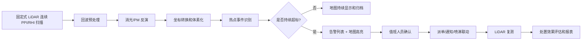
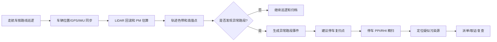

# 15. 一个最现实的工程闭环是什么样

前面几章已经把关键链路拆开了：

1. 第 11 章：原始回波怎么预处理。
2. 第 12 章：怎么从回波得到消光、PM 和热点。
3. 第 13 章：怎么把热点放回地图和 3D 空间。
4. 第 14 章：软件界面怎么展示地图、3D 污染物范围、告警和回放。

第 15 章要把它们重新合成一个工程闭环。

最现实的目标不是一开始就做“全自动智慧环保大平台”，而是先做一个能在工地或城市巡逻中跑通的闭环：

> 发现污染热点 → 定位到地图 → 判断是否可信 → 告警 → 人工确认或自动派单 → 现场处置 → LiDAR 复测 → 生成证据和报表。

这条链跑通了，系统才真正从“能画图”变成“能用”。

---

### 15.1 闭环一：固定式工地 / 厂界监测

固定式最适合工地、厂界、园区和城市固定站。它的目标是 7x24 值守。



固定式系统里，最关键的不是某一个公式，而是 5 个判断：

| 判断 | 为什么重要 |
| --- | --- |
| 是否真超标 | 避免把噪声、雨雾、湿度影响当成污染 |
| 是否持续 | 瞬时尖峰不一定值得派单，持续高值才是事件 |
| 是否在管控区域内 | 判断属于哪个工地、厂界或道路 |
| 是否可能外逸 | 结合风向和边界判断是否影响周边 |
| 处置后是否下降 | 闭环必须证明处理有效 |

工地场景里最实用的处置动作有：

1. 值班人员确认告警。
2. 通知现场负责人。
3. 联动雾炮、喷淋或围挡喷雾。
4. 记录处置开始时间。
5. 继续观测 5-15 分钟，比较 PM 峰值和面积是否下降。

---

### 15.2 闭环二：走航车城市污染物巡逻

走航车适合城市道路、投诉点、重点工地巡查。它不是一直盯住一个区域，而是在路网上发现异常。



走航模式的闭环重点是：

| 阶段 | 软件要做什么 |
| --- | --- |
| 巡逻中 | 画车辆轨迹色带，实时标出高值路段 |
| 发现异常 | 判断是否连续多点高值，而不是单点毛刺 |
| 推荐复扫 | 根据高值位置、风向、道路可达性建议停车点 |
| 停车精扫 | 展示 PPI/RHI/3D 结果，把污染源从“路段”缩小到“方向和距离” |
| 归档取证 | 保存轨迹、地图截图、热点事件、原始产品快照 |

走航车第一版不需要追求“边开车边重建完整 3D 城市污染场”。更现实的路线是：

```text
边走边扫：快速发现哪里异常
停车精扫：认真判断异常从哪里来
平台回放：形成证据和复查任务
```

---

### 15.3 一个告警从产生到关闭，应该经历哪些状态

告警不能只是弹窗。它应该是可追踪的事件状态机。

```text
候选热点
  ↓ 满足阈值 + 持续时间 + 质量条件
已触发
  ↓ 值班人员查看
已确认
  ↓ 派给现场人员或联动设备
处置中
  ↓ LiDAR 复测显示下降
已关闭
  ↓ 进入日报/周报/证据库
已归档
```

建议状态字段如下：

| 状态 | 说明 | UI 表现 |
| --- | --- | --- |
| candidate | 还只是算法候选热点 | 地图淡色显示，不进入正式告警 |
| active | 满足触发条件 | 告警列表红色，高亮地图 |
| acknowledged | 值班人员已确认 | 记录确认人和时间 |
| dispatched | 已派单或已联动 | 显示责任人/设备 |
| mitigating | 处置中 | 显示处置计时和复测曲线 |
| resolved | 指标回落 | 显示处置前后对比 |
| archived | 已归档 | 进入报表和历史回放 |

触发条件不要只看一个瞬时 PM 值。更稳的规则是：

```text
PM 超过阈值
  + 持续超过 N 秒
  + 连续面积超过 A m²
  + SNR / 湿度 / 雨雾质量标记合格
  + 不在设备盲区或无效区域
```

这样能明显减少误报。

---

### 15.4 固定站联动喷淋 / 雾炮时，软件要算什么

如果工地要做自动处置，最现实的是联动喷淋或雾炮。软件不是只发一个“开/关”，而是要把污染热点转换成设备能执行的目标。

从第 13 章的热点事件里可以拿到：

```json
{
  "center_enu_m": [76.0, 90.5, 20.8],
  "center_azimuth_deg": 40.0,
  "range_m": 120.0,
  "height_agl_m": 38.8,
  "peak_pm25_ugm3": 186.0,
  "vertical_extent_m": [12.0, 35.0]
}
```

联动控制至少需要转换成：

| 控制量 | 含义 |
| --- | --- |
| 目标方位角 | 雾炮或喷淋转向哪个方向 |
| 目标俯仰角 | 是否需要抬高 |
| 目标距离 | 判断喷射是否够得到 |
| 处置时长 | 喷多久 |
| 安全限制 | 是否越界、是否有人车区域、是否允许自动控制 |

要注意一个现实问题：

> LiDAR 看到的是污染团，喷淋/雾炮打的是水雾。两者不一定在同一个安装位置，也不一定有同样的坐标原点。

所以联动前还要做设备外参标定：

```text
LiDAR ENU 坐标
  ↓
场地统一坐标
  ↓
雾炮/喷淋自身坐标
  ↓
方位角 + 俯仰角 + 距离
```

第一版建议采用“人确认后自动执行”，不要一开始就全自动。也就是说：

1. 系统推荐喷淋方向和时长。
2. 值班人员点击确认。
3. 系统下发控制命令。
4. LiDAR 继续复测。
5. 软件自动判断是否有效。

---

### 15.5 处置效果怎么量化

闭环的最后一步不是“告警消失”，而是要证明处置有效。

建议保存处置前后两个时间窗：

| 时间窗 | 示例 | 用途 |
| --- | --- | --- |
| 处置前 | 告警触发前 5 分钟 | 计算基线和污染峰值 |
| 处置中 | 喷淋/派单后的 5-15 分钟 | 看下降速度 |
| 处置后 | 指标回落后 5 分钟 | 判断是否稳定 |

可以输出这些指标：

| 指标 | 计算方式 | 说明 |
| --- | --- | --- |
| 峰值下降率 | `(处置前峰值 - 处置后峰值) / 处置前峰值` | 看最严重位置是否下降 |
| 面积下降率 | 超标面积前后对比 | 看污染范围是否缩小 |
| 体积下降率 | 超标体素数量前后对比 | 看 3D 污染体是否变小 |
| 回落时间 | 从处置开始到低于阈值的时间 | 看措施响应速度 |
| 是否复燃 | 关闭后 N 分钟内是否再次超标 | 防止刚压下去又起来 |

UI 上最好给一个简单结论：

```text
处置效果：有效
峰值 PM2.5：186 -> 72 μg/m³，下降 61%
超标面积：950 -> 210 m²，下降 78%
回落时间：8 分 20 秒
```

---

### 15.6 报表和证据链应该自动生成

工地、城市巡逻和执法辅助都需要报表。报表不是把所有曲线截图堆在一起，而是围绕事件组织。

每个事件至少归档：

1. 事件编号、时间、地点、设备。
2. 污染物类型：PM2.5 / PM10 / 消光。
3. 峰值、均值、面积、高度、持续时间。
4. 地图截图：热力图、工地边界、热点标注。
5. 3D 截图：污染体范围和高度。
6. 质量信息：SNR、湿度、雨雾标记、参考区段。
7. 处置记录：确认人、派单人、处置动作、开始结束时间。
8. 处置前后对比。
9. 原始产品快照路径，方便复核。

报表可以分三种：

| 报表 | 面向谁 | 内容 |
| --- | --- | --- |
| 值班日报 | 运营人员 | 今日告警、处理状态、设备状态 |
| 工地周报 | 项目负责人 | 超标次数、热点分布、处置效果 |
| 事件取证报告 | 管理/执法 | 单次事件全过程、地图、截图、数据质量 |

---

### 15.7 数据存储：不要只存截图

截图只能给人看，不能复算。真正可追溯的系统至少要存 4 层数据：

| 层级 | 要存什么 | 为什么 |
| --- | --- | --- |
| L0/L1 摘要 | 原始文件路径、采集元数据、设备状态 | 出问题时能追溯 |
| L2 产品 | 消光、PM、质量标记 | 方便算法复核 |
| L3 空间快照 | 栅格、体素、轨迹、热点事件 | 支持回放和报表 |
| 操作日志 | 确认、派单、联动、关闭 | 形成闭环证据 |

第一版可以用：

1. SQLite 存事件、告警、操作日志和索引。
2. 二进制文件或 Parquet 存 L2/L3 大数组。
3. PNG/JPEG 存自动生成的证据截图。

不要只存最终截图。以后算法参数更新、阈值调整、报表口径变化时，只有产品快照和元数据能让你重新解释历史事件。

---

### 15.8 两个最小可用闭环

如果资源有限，建议先做两个最小闭环。

#### MVP A：固定式工地闭环

```text
LiDAR 固定扫描
  ↓
PPI PM 热力图
  ↓
热点事件
  ↓
地图告警
  ↓
人工确认
  ↓
处置记录
  ↓
处置前后对比
```

第一版可以不做全自动喷淋，只要能记录“谁在什么时候做了什么，PM 有没有下降”，就已经是闭环。

#### MVP B：走航巡逻闭环

```text
走航车采集
  ↓
轨迹 PM 色带
  ↓
异常路段识别
  ↓
停车精扫
  ↓
热点定位
  ↓
巡逻报告
```

第一版可以不做复杂 3D，只要能把高值路段和复扫结果留成报告，就有实用价值。

---

### 15.9 最容易失败的地方

这类系统最容易失败的不是 UI 不够漂亮，而是下面这些工程细节：

| 风险 | 后果 | 解决办法 |
| --- | --- | --- |
| 时间不同步 | 走航热点偏位、回放对不上 | 统一时间戳，GPS/IMU/LiDAR 插值 |
| 质量控制缺失 | 雨雾、湿度、低 SNR 造成误报 | 每个产品带质量标记 |
| 只看瞬时阈值 | 告警太多，没人信 | 加持续时间、面积和置信度 |
| 坐标各页面各算各的 | 地图、3D、告警位置不一致 | 统一 L3 空间快照 |
| 只做炫酷 3D | 业务人员不知道该做什么 | 告警、派单、处置、回放优先 |
| 不存操作日志 | 无法证明谁处理过、是否有效 | 事件状态机 + 操作审计 |

---

### 15.10 这一章真正想让你记住什么

一个现实可落地的工程闭环可以写成：

```text
回波
  ↓
消光 / PM
  ↓
空间定位
  ↓
地图和 3D 展示
  ↓
热点事件
  ↓
告警确认
  ↓
派单或联动处置
  ↓
LiDAR 复测
  ↓
处置效果评估
  ↓
报表和证据链
```

如果只记 5 句话：

1. 只会画 PM 热力图还不算闭环，必须能推动处置。
2. 固定站负责持续值守，走航车负责机动发现和复扫。
3. 告警必须有状态、有责任人、有处置记录。
4. 处置后要用 LiDAR 复测证明有没有下降。
5. 最小可用系统先跑通“发现、定位、确认、处置、回放、报表”，再谈全自动和高级 3D。
