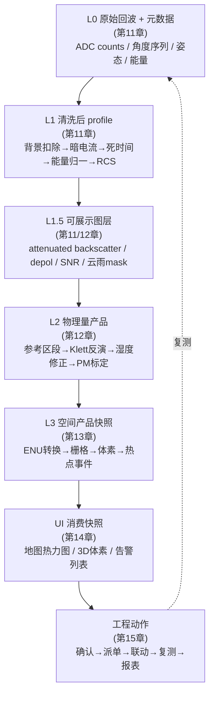
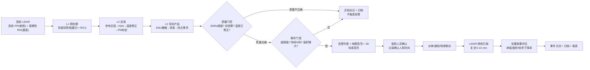
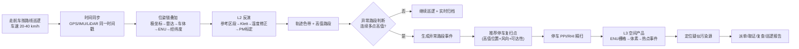
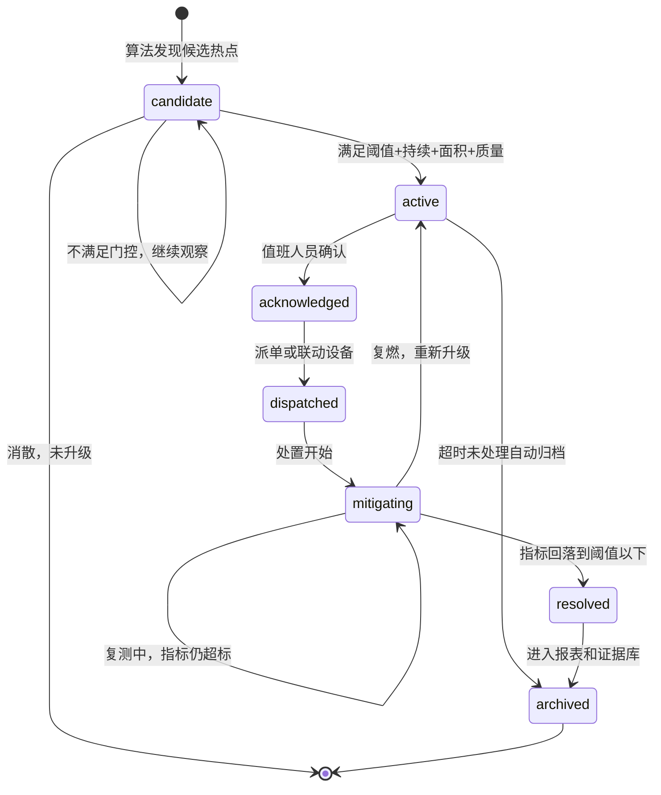

# 15. 一个最现实的工程闭环是什么样

前面几章已经把关键链路拆开了：

1. **第 11 章**：原始回波怎么从 L0 一步一步预处理到 L1 / L1.5（背景扣除、暗电流、死时间、能量归一化、RCS、attenuated backscatter、SNR）。
2. **第 12 章**：怎么从清洗后的回波经参考区段、Klett/Fernald 反演得到消光 $\alpha$ 和后向散射 $\beta$，怎么用 $f(RH)$ 做湿度修正得到干态 $\alpha_{dry}$、$\beta_{dry}$，怎么用本地标定模型（线性回归 / 随机森林）换算 PM2.5/PM10。
3. **第 13 章**：怎么把极坐标 $(R, \text{azimuth}, \text{elevation})$ 转成 ENU，走航车怎么叠加 GPS/IMU/安装偏置位姿链，怎么栅格化和体素化，怎么从体素连通域提取热点事件 JSON，怎么统一产出 L3 空间产品快照。
4. **第 14 章**：软件怎么用 Qt Widgets + QOpenGLWidget 展示地图主屏、PPI 热力图、走航轨迹色带、3D 半透明体素（instancing + alpha 混合）、告警列表、时间轴回放。

第 15 章要把它们重新合成一个工程闭环。

最现实的目标不是一开始就做“全自动智慧环保大平台”，而是先做一个能在工地或城市巡逻中跑通的闭环：

> 发现污染热点 → 定位到地图 → 判断是否可信 → 告警 → 人工确认或自动派单 → 现场处置 → LiDAR 复测 → 生成证据和报表。

这条链跑通了，系统才真正从“能画图”变成“能用”。判断“能用”的标准也很具体：

```text
非闭环：能出一张 PM 热力图截图
半闭环：能出图 + 能告警 + 能点击查看属性
真闭环：能出图 + 能告警 + 能确认派单 + 能联动处置 + 能复测证明有效 + 能生成带证据链的报表
```

---

### 15.1 从一条回波到一个处置决定：全链路打通

在展开两个具体闭环（固定式和走航式）之前，先把整条链路从头到尾走一遍，标清楚每一环对应第几章、产出什么、在哪一层。



这张图里有几个“必须咬合的齿轮”，任何一个断了，闭环就断了：

| 齿轮 | 上游产出 | 下游消费 | 断了会怎样 |
| --- | --- | --- | --- |
| 时间戳 | GPS/IMU/LiDAR 各自打时间戳 | 所有层的插值和对齐 | 走航热点偏位、回放对不上、联动喷淋打错方向 |
| 质量标记 | SNR、湿度、雨雾 mask（L1.5） | 热点触发条件（L3）、UI 灰色标记 | 雨雾/低 SNR 被当成污染，大量误报 |
| 坐标统一 | ENU / 经纬度（L3） | 地图、3D、告警、回放共用 | 同一个热点在不同页面显示在不同位置 |
| 热点事件 JSON | 连通域分析 + 统计（L3） | 告警列表、派单、联动、报表 | 算法和业务层没有共同语言 |
| 操作日志 | 确认/派单/联动/关闭 | 报表和证据链 | 无法证明谁处理过、是否有效 |

下面两节分别从固定式和走航式两个场景，把这条链路拆成可落地的工程步骤。

---

### 15.2 闭环一：固定式工地 / 厂界监测

固定式最适合工地、厂界、园区和城市固定站。设备不动，坐标转换简单（只需 ENU，没有车载位姿链），但目标是 7x24 无人值守，对质量控制和告警可靠性要求最高。



#### 15.2.1 固定式扫描策略

固定站的扫描不是“一个 PPI 扫到底”。最实用的是 PPI 和 RHI 交替：

| 扫描模式 | 作用 | 频率建议 | 产出 |
| --- | --- | --- | --- |
| PPI（固定低仰角水平扫一圈） | 地图主屏热力图、热点平面定位 | 持续，每圈 30-90 秒 | PPI 栅格 + 热点质心 |
| RHI（固定方位角上下扫仰角） | 垂直结构、判断粉尘是否抬升逸散 | 每 5-10 分钟一次，或发现热点后立即补扫 | RHI 剖面 + 体素垂直边界 |
| 体积扫描（多个仰角 PPI 堆叠） | 真正的 3D 体素 | 有条件时做，数据量大 | 3D 体素连通域 |

为什么需要 RHI 或体积扫描：第 13 章讲过，只有 PPI 时，3D 污染体只能做“拉伸式”近似（Level 2），不是真实的垂直浓度分布。工地场景最关心的是“粉尘有没有越过围墙飘出去”，这必须看高度，所以 RHI 不能省。

#### 15.2.2 固定式的 5 个核心判断

固定式系统里，最关键的不是某一个公式，而是 5 个判断。每一个都要回到第 11-12 章的预处理和反演链路去理解“为什么会误判”：

| 判断 | 为什么重要 | 误判来源（对应章节） | 防御措施 |
| --- | --- | --- | --- |
| 是否真超标 | 避免把噪声、雨雾、湿度膨胀当成污染 | SNR 低（§11）、$f(RH)$ 未修正导致虚高（§12.8） | 质量门控：SNR ≥ 3、湿度已修正、雨雾 mask 合格 |
| 是否持续 | 瞬时尖峰不一定值得派单 | 单脉冲噪声、鸟虫飞过、近距离遮挡 | 持续 N 秒 + 连续多帧达标 |
| 是否在管控区域内 | 判断属于哪个工地、厂界或道路 | ENU 原点设错、工地边界多边形过期 | 统一 ENU 原点 + 可编辑边界图层 |
| 是否可能外逸 | 结合风向和边界判断是否影响周边 | 风向数据缺失或延迟 | 风向箭头必须实时叠加，外逸用风向 + 位置联合判断 |
| 处置后是否下降 | 闭环必须证明处理有效 | 处置期间正好遇到雨/雾，PM 自然下降被误认为有效 | 对比处置区和非处置区（参考区段）的下降差异 |

#### 15.2.3 质量门控怎么做

“是否真超标”这一步最容易出错，值得单独展开。第 11 章 L1.5 层产出的质量信息，必须在热点触发之前起作用：

```text
一个 PM 高值格子要变成候选热点，必须同时满足：

  1. SNR ≥ 阈值（白天建议 ≥ 5，夜间可放宽到 ≥ 3）
  2. 不在云雨 mask 标记的区段
  3. 湿度修正已执行（f(RH) 已应用，不是原始 β）
  4. 不在设备近距离重叠不足区段（overlap < 90%）
  5. 参考区段本身稳定（第12章：参考段信号波动 < 20%）
```

任何一条不满足，这个高值格子只能标记为“不可靠”（UI 上用灰色或斜纹），不能进入告警流程。这比事后降噪高效得多——它从源头阻止了垃圾数据变成垃圾告警。

质量门控在数据结构上的体现，就是第 13 章热点事件 JSON 里的 `quality_flags` 字段：

```json
{
  "quality_flags": ["snr_ok", "humidity_corrected", "no_rain_fog", "reference_stable"]
}
```

如果 `quality_flags` 里缺少这些标记，或者包含 `low_snr` / `rain_fog_detected` / `reference_unstable`，告警引擎应该拒绝把这个候选热点升级为 `active` 状态。

#### 15.2.4 固定式处置动作

工地场景里最实用的处置动作链：

```text
系统触发告警 (active)
  ↓ 推送到值班终端（声光 + 告警列表红色）
值班人员查看地图和 3D (acknowledged)
  ↓ 判断是否需要现场处理
通知现场负责人 / 联动雾炮喷淋 (dispatched)
  ↓ 系统推荐方位角和俯仰角（§15.5）
处置计时开始 (mitigating)
  ↓ LiDAR 继续 PPI/RHI 扫描
每 1-2 分钟比较 PM 峰值和面积 (复测中)
  ↓ 指标回落到阈值以下
自动建议关闭 (resolved → archived)
```

第一版建议采用“人确认后执行”，不要一开始就全自动。原因：质量门控再严格，仍有可能遇到反演参数不匹配（换季节、换污染源后标定模型失效）的情况，需要人做最后一道判断。

固定站最实用的处置联动设备：

| 设备 | 作用 | 联动方式 |
| --- | --- | --- |
| 围挡喷淋 / 塔吊喷淋 | 抑制地面扬尘 | 开关量，按区域分组 |
| 移动雾炮车 | 定向喷射水雾 | 方位角 + 俯仰角 + 时长 |
| 雾炮机（固定式） | 定向压制高空逸散粉尘 | 方位角 + 俯仰角 + 时长 |
| 现场广播 / 闪光 | 提醒施工方注意 | 开关量 |

---

### 15.3 闭环二：走航车城市污染物巡逻

走航车适合城市道路、投诉点、重点工地巡查。它和固定站的根本区别在于：设备一直在动，坐标链多了一整套车载位姿转换（第 13 章 §13.6），而且时间是最大的工程风险。



#### 15.3.1 走航模式两种工作方式

走航车有边走边扫和停车精扫两种方式（第 13 章 §13.7），软件必须分开处理：

| 工作方式 | 采集策略 | 数据处理重点 | UI 表现 |
| --- | --- | --- | --- |
| 边走边扫 | 车速 20-40 km/h 持续采集 | 每条 profile 绑定 GPS/IMU，实时拼轨迹色带 | 地图彩色路线，红色段=高值 |
| 停车精扫 | 停在投诉点/工地边界做 PPI/RHI | 和固定站类似，但坐标原点随停车位置变 | 从停车点展开扫描扇区和 3D 污染团 |

边走边扫的数据密度远低于停车精扫。车速 36 km/h = 10 m/s，如果 LiDAR 每秒出 1 条 profile，沿路方向的空间采样间隔就是 10 m。这决定了：

> 边走边扫只能发现“异常路段”，不能精确定位“污染源在哪个建筑”。精确定位必须靠停车后的 PPI/RHI。

#### 15.3.2 时间同步：走航最大的工程风险

第 13 章强调过，车载系统最怕的不是公式难，而是时间不同步。这个风险值得在闭环层面再强调一遍：

```text
车速 36 km/h = 10 m/s
如果 LiDAR 和 GPS 时间差 0.5 秒 → 热点位置错 5 m
对巡查显示：偏一点，不致命
对执法取证：5 m 可能让你指错建筑，结论不可靠
```

走航系统的时间同步要求：

| 数据源 | 时间戳来源 | 同步精度要求 | 不同步的后果 |
| --- | --- | --- | --- |
| LiDAR 回波 | LiDAR 内部时钟 / PPS | ≤ 10 ms | 距离 bin 准但角度对不上 |
| GPS/RTK 位置 | GPS PPS | ≤ 10 ms | 位置偏移 |
| IMU 姿态 | IMU 内部时钟 | ≤ 5 ms | 姿态补偿错位 |
| 气象站 | 气象站时钟 | ≤ 1 s | 风向延迟（可接受） |

第一版如果做不到硬件 PPS 同步，至少要记录每个数据源的本地时间戳，在预处理阶段用软件插值对齐。绝对不能假设“数据到了就代表同时刻”。

#### 15.3.3 走航模式的闭环重点

| 阶段 | 软件要做什么 | 对应章节 |
| --- | --- | --- |
| 巡逻中 | 画车辆轨迹色带，实时标出高值路段 | §13.7 轨迹色带 + §14 走航页面 |
| 发现异常 | 判断是否连续多点高值（≥ 3 个轨迹点），而不是单点毛刺 | 本章 §15.4 事件门控 |
| 推荐复扫 | 根据高值位置、风向、道路可达性建议停车点 | 风向来自气象站 + 道路网 |
| 停车精扫 | 展示 PPI/RHI/3D 结果，把污染源从“路段”缩小到“方向和距离” | §13.5 PPI/RHI + §13.9 体素 |
| 归档取证 | 保存轨迹、地图截图、热点事件、原始产品快照 | 本章 §15.8 |

走航车第一版不需要追求“边开车边重建完整 3D 城市污染场”。更现实的路线是：

```text
边走边扫：快速发现哪里异常（轨迹色带 + 高值点，Level 1 足够）
停车精扫：认真判断异常从哪里来（PPI 热力图 + RHI 剖面 + 3D 体素，Level 2-3）
平台回放：形成证据和复查任务（L3 快照回放 + 报表）
```

---

### 15.4 告警状态机：从产生到关闭的全生命周期

告警不能只是弹窗。它应该是可追踪的事件状态机，每一步都有时间、操作人、前后数据对比。

#### 15.4.1 状态流转



#### 15.4.2 状态字段定义

| 状态 | 英文 | 说明 | UI 表现 | 谁触发 |
| --- | --- | --- | --- | --- |
| 候选热点 | `candidate` | 还只是算法候选，不满足全部门控 | 地图淡色显示，不进入正式告警 | 算法自动 |
| 已触发 | `active` | 满足全部触发条件 | 告警列表红色，高亮地图和 3D | 算法自动 |
| 已确认 | `acknowledged` | 值班人员已查看并确认 | 记录确认人和时间 | 值班人员 |
| 已派单 | `dispatched` | 已派给现场人员或已联动设备 | 显示责任人/设备 | 值班人员 |
| 处置中 | `mitigating` | 处置进行中 | 显示处置计时和实时复测曲线 | 系统/人工 |
| 已回落 | `resolved` | 指标回落到阈值以下 | 显示处置前后对比 | 算法自动 |
| 已归档 | `archived` | 进入报表和历史回放 | 灰色，可查询 | 系统自动/人工 |

#### 15.4.3 触发条件：不能只看瞬时 PM

触发条件不要只看一个瞬时 PM 值。更稳的规则是多条件 AND：

```text
PM 超过阈值（如 PM2.5 > 75 μg/m³ 或当地标准）
  AND 持续超过 N 秒（建议 30-120 秒，工地可短，城市可长）
  AND 连续面积超过 A m²（建议 ≥ 100 m²，过滤单点噪声）
  AND 质量标记合格（SNR ≥ 阈值 + 湿度已修正 + 非雨雾 + 参考段稳定）
  AND 不在设备盲区或无效区域（overlap 不足区、超探测距离区）
```

一个完整的触发判定伪代码：

```python
def should_trigger_hotspot(candidate):
    # 条件 1：浓度阈值
    if candidate.peak_pm25 < PM25_THRESHOLD:
        return False
    # 条件 2：持续时间
    if candidate.duration_s < MIN_DURATION_S:
        return False
    # 条件 3：面积
    if candidate.area_m2 < MIN_AREA_M2:
        return False
    # 条件 4：质量门控（第11-12章）
    if not all(flag in candidate.quality_flags for flag in REQUIRED_QUALITY_FLAGS):
        return False
    # 条件 5：不在无效区域
    if candidate.in_blind_zone or candidate.beyond_max_range:
        return False
    # 条件 6：置信度（连通域统计可靠性）
    if candidate.confidence < MIN_CONFIDENCE:
        return False
    return True
```

这样能明显减少误报。特别注意：走航模式（边走边扫）的触发条件应该比固定站更宽松的持续时间（因为车在移动，每个位置只经过一次），但更严格的“连续多点”要求（≥ 3 个轨迹点高值才算异常路段，而不是 1 个点）。

#### 15.4.4 置信度怎么算

热点事件 JSON 里的 `confidence` 字段不是随便填的。它应该综合几个因素：

| 因素 | 对置信度的影响 | 权重建议 |
| --- | --- | --- |
| SNR 水平 | SNR 越高越可信 | 高 |
| 连通域体积 | 体积越大越不可能是噪声 | 高 |
| 持续时间 | 越长越可信 | 中 |
| 与历史背景的差异 | 比本地背景值高越多越可信 | 中 |
| 参考区段稳定性 | 参考段越稳，反演越可靠 | 中 |
| 是否有气象佐证 | 风向指向已知污染源时更可信 | 低 |

第一版可以用简单的加权打分，不需要复杂模型。关键是让操作员理解“置信度 0.6 和 0.9 的告警，处理优先级不一样”。

---

### 15.5 固定站联动喷淋 / 雾炮时，软件要算什么

如果工地要做自动处置，最现实的是联动喷淋或雾炮。软件不是只发一个“开/关”，而是要把污染热点转换成设备能执行的目标。

#### 15.5.1 从热点事件到控制指令

从第 13 章的热点事件里可以拿到：

```json
{
  "event_id": "dust_20260618_102315_001",
  "center_enu_m": [76.0, 90.5, 20.8],
  "center_azimuth_deg": 40.0,
  "range_m": 120.0,
  "height_agl_m": 38.8,
  "peak_pm25_ugm3": 186.0,
  "vertical_extent_m": [12.0, 35.0]
}
```

联动控制至少需要转换成：

| 控制量 | 含义 | 怎么算 |
| --- | --- | --- |
| 目标方位角 | 雾炮转向哪个方向 | 热点中心相对于雾炮安装位置的方位角 |
| 目标俯仰角 | 是否需要抬高 | 由 `height_agl_m` 和 `range_m` 决定：$\text{pitch} = \arctan(\text{height} / \text{ground\_dist})$ |
| 目标距离 | 判断喷射是否够得到 | 热点 `range_m` vs 雾炮最大射程 |
| 处置时长 | 喷多久 | 按 `area_m2` 和 `peak_pm25` 估算，经验值 |
| 安全限制 | 是否允许执行 | 越界检查、人车区域检查、时间限制 |

#### 15.5.2 设备外参标定

要注意一个现实问题：

> LiDAR 看到的是污染团，喷淋/雾炮打的是水雾。两者不一定在同一个安装位置，也不一定有同样的坐标原点。

所以联动前还要做设备外参标定：

```text
热点中心 (LiDAR ENU 坐标)
  ↓ 减去 LiDAR 到雾炮的平移偏置
雾炮本地坐标系下的目标位置
  ↓ 转极坐标
雾炮方位角 + 俯仰角 + 距离
  ↓ 安全检查
是否越界? 是否对准人车区域? 是否超射程?
  ↓ 通过
下发控制指令
```

设备外参标定的数据结构：

```json
{
  "lidar_origin_enu": [0.0, 0.0, 12.5],
  "sprinkler_origin_enu": [15.0, -8.0, 3.0],
  "sprinkler_max_range_m": 80.0,
  "sprinkler_azimuth_range_deg": [0, 270],
  "sprinkler_pitch_range_deg": [-10, 60],
  "exclusion_zones": [
    {"type": "road", "polygon_enu": [[...]], "reason": "主干道，禁止喷射"},
    {"type": "office", "polygon_enu": [[...]], "reason": "办公区，禁止喷射"}
  ]
}
```

#### 15.5.3 安全检查

自动联动最大的风险不是“打不准”，而是“打错地方”。下发指令前必须做安全检查：

```text
安全检查清单：
  1. 目标方位角是否在雾炮允许范围内？
  2. 目标距离是否在雾炮最大射程内？（够不到就不浪费水）
  3. 喷射路径是否穿过 exclusion_zones？（道路、办公区、居民区）
  4. 当前时间是否允许自动喷淋？（夜间施工禁止、午休禁止）
  5. 是否已经有人在现场？（避免对人喷射）
  6. 上次喷淋距今多久？（防止频繁重复喷淋）
```

第一版建议采用“人确认后自动执行”，不要一开始就全自动。也就是说：

1. 系统推荐喷淋方向和时长。
2. 值班人员点击确认。
3. 系统下发控制命令。
4. LiDAR 继续复测。
5. 软件自动判断是否有效。

全自动模式可以作为第二阶段目标，条件是：前 100 次人工确认的处置中，系统推荐方向和人工选择方向的吻合率超过 90%。

---

### 15.6 处置效果怎么量化

闭环的最后一步不是“告警消失”，而是要证明处置有效。第 14 章要求告警是“可追踪事件”，追踪的重点就是处置前后的量化对比。

#### 15.6.1 时间窗设计

建议保存处置前后三个时间窗：

| 时间窗 | 示例 | 用途 |
| --- | --- | --- |
| 处置前（基线） | 告警触发前 5 分钟 | 计算基线和污染峰值 |
| 处置中 | 喷淋/派单后的 5-15 分钟 | 看下降速度和趋势 |
| 处置后（验证） | 指标回落后 5 分钟 | 判断是否稳定，是否复燃 |

同时必须保留一个**参考区段**（远离处置区的同类区域），用于排除“自然沉降”的干扰：

```text
如果处置区 PM 下降 60%，参考区 PM 也下降了 50%
→ 可能是风变大 / 下雨 / 自然沉降，不能全归功于处置
→ 净处置效果 = 处置区下降率 - 参考区下降率 = 10%（效果有限）
```

#### 15.6.2 核心指标

| 指标 | 计算方式 | 说明 |
| --- | --- | --- |
| 峰值下降率 | `(处置前峰值 - 处置后峰值) / 处置前峰值` | 看最严重位置是否下降 |
| 均值下降率 | `(处置前均值 - 处置后均值) / 处置前均值` | 看整体是否下降 |
| 面积下降率 | `(处置前超标面积 - 处置后超标面积) / 处置前超标面积` | 看污染范围是否缩小 |
| 体积下降率 | `(处置前超标体素数 - 处置后超标体素数) / 处置前超标体素数` | 看 3D 污染体是否变小 |
| 高度下降 | `处置前 vertical_extent 上界 - 处置后 vertical_extent 上界` | 看粉尘是否被压低 |
| 回落时间 | 从处置开始到低于阈值的时间 | 看措施响应速度 |
| 是否复燃 | 关闭后 N 分钟内是否再次超标 | 防止刚压下去又起来 |
| 净效果 | 处置区下降率 - 参考区下降率 | 排除自然因素干扰 |

#### 15.6.3 UI 结论模板

UI 上最好给一个简单结论，而不是让操作员自己从曲线里判断：

```text
处置效果：有效（净效果 52%）
峰值 PM2.5：186 → 72 μg/m³，下降 61%
均值 PM2.5：122 → 58 μg/m³，下降 52%
超标面积：950 → 210 m²，下降 78%
超标体积：1,420 → 180 体素，下降 87%
粉尘高度：12-35 m → 8-15 m，上界下降 20 m
回落时间：8 分 20 秒
参考区同步下降：9%（自然因素占比小）
复燃：未发生（关闭后 15 分钟内稳定）
```

如果净效果低于 20%，结论应自动标注“效果不显著，建议调整处置策略”。

---

### 15.7 报表和证据链应该自动生成

工地、城市巡逻和执法辅助都需要报表。报表不是把所有曲线截图堆在一起，而是围绕事件组织。

#### 15.7.1 每个事件至少归档什么

每个事件至少归档 9 类信息：

| 序号 | 归档内容 | 数据来源 | 为什么需要 |
| --- | --- | --- | --- |
| 1 | 事件编号、时间、地点、设备 | 热点事件 JSON | 唯一标识和追溯 |
| 2 | 污染物类型和数值 | L2 PM/消光产品 | 核心业务数据 |
| 3 | 峰值、均值、面积、高度、持续时间 | L3 连通域统计 | 量化严重程度 |
| 4 | 地图截图 | UI 自动截图 | 一眼看清位置 |
| 5 | 3D 截图 | UI 自动截图 | 看清高度和体积 |
| 6 | 质量信息 | L1.5 SNR/湿度/雨雾/参考段 | 证明数据可靠 |
| 7 | 处置记录 | 操作日志 | 证明处置过程 |
| 8 | 处置前后对比 | L3 快照差分 | 证明处置有效 |
| 9 | 原始产品快照路径 | L0-L3 文件索引 | 支持复核和重算 |

#### 15.7.2 三种报表

报表可以分三种，面向不同角色：

| 报表 | 面向谁 | 核心内容 | 生成频率 |
| --- | --- | --- | --- |
| 值班日报 | 运营人员 | 今日告警数、处理状态、设备状态、数据有效率 | 每日 |
| 工地周报 | 项目负责人 | 超标次数、热点分布热力图、处置效果汇总、趋势曲线 | 每周 |
| 事件取证报告 | 管理/执法 | 单次事件全过程（发现→确认→处置→复测→关闭）、地图截图、3D 截图、数据质量声明、处置前后对比、净效果 | 按事件 |

取证报告是最重要的，因为它可能用于执法或纠纷处理。它必须能让一个没看过系统的人，只读报告就能理解：

1. 什么时候发现的（时间戳）。
2. 在哪里（地图截图 + 经纬度 + 工地/路段名称）。
3. 有多严重（峰值/均值/面积/高度/持续时间）。
4. 数据可不可信（SNR、湿度、雨雾、参考段状态）。
5. 做了什么处置（操作日志）。
6. 有没有效果（处置前后对比 + 净效果）。
7. 能不能复核（原始快照路径）。

---

### 15.8 数据存储：不要只存截图

截图只能给人看，不能复算。真正可追溯的系统至少要存 4 层数据，对应第 11 章的 L0-L3 分层：

#### 15.8.1 四层存储

| 层级 | 要存什么 | 数据量级 | 存储格式建议 | 为什么 |
| --- | --- | --- | --- | --- |
| L0/L1 | 原始文件路径、采集元数据、设备状态、清洗后 profile | 大（GB/天） | 二进制原始文件 + SQLite 元数据索引 | 出问题时能追溯到原始信号 |
| L2 | 消光、PM、质量标记、参考区段状态 | 中（百MB/天） | Parquet / NetCDF / 二进制 | 方便算法复核和参数重算 |
| L3 | 栅格、体素、轨迹、热点事件、空间快照 | 小（MB/天） | JSON（事件）+ 二进制（栅格/体素） | 支持回放、报表、联动 |
| 操作日志 | 确认、派单、联动、关闭、参数变更 | 极小 | SQLite | 形成闭环证据链 |

#### 15.8.2 为什么不能只存截图

不要只存最终截图。以后遇到这些情况时，只有产品快照和元数据能帮你：

| 场景 | 只有截图 | 有 L2/L3 快照 |
| --- | --- | --- |
| PM 标定模型更新 | 历史事件数值无法更新 | 用新模型重新计算 L2 → L3 |
| 阈值标准变化 | 历史是否超标无法重判 | 用新阈值重新跑事件门控 |
| 报表口径调整 | 历史报表无法重生成 | 从 L3 快照重新统计 |
| 算法参数调优 | 无法对比新旧算法效果 | 用同一份 L0 重算 L1-L3，对比差异 |
| 执法复核 | 无法证明数据可靠性 | 查 L1.5 质量标记 + L2 反演参数 |

#### 15.8.3 第一版存储方案

第一版可以用最简单的组合：

```text
SQLite：
  - 事件表（event_id, timestamp, status, ...）
  - 告警表（event_id, triggered_at, acknowledged_by, ...）
  - 操作日志表（event_id, action, operator, timestamp）
  - 文件索引表（event_id, l0_path, l2_path, l3_path, screenshot_path）

Parquet / 二进制文件：
  - L2 产品（按小时/按扫描分文件）
  - L3 空间快照（栅格、体素、轨迹）

PNG / JPEG：
  - 自动生成的证据截图（地图 + 3D + 处置前后对比）
```

---

### 15.9 两个最小可用闭环

如果资源有限，建议先做两个最小闭环。不要追求一步到位的全功能系统。

#### 15.9.1 MVP A：固定式工地闭环

```text
LiDAR 固定 PPI 扫描
  ↓
L1 预处理 + L2 PM 反演（先用第12章简化 Klett）
  ↓
PPI PM 热力图（Level 1，QPainter + QImage）
  ↓
质量门控（先只做 SNR + 湿度）
  ↓
热点事件（连通域 + 阈值 + 持续时间）
  ↓
地图告警（列表 + 点击定位）
  ↓
人工确认 + 处置记录
  ↓
处置前后 PM 对比（峰值下降率）
  ↓
日报导出
```

第一版可以不做全自动喷淋，只要能记录“谁在什么时候做了什么，PM 有没有下降”，就已经是闭环。关键验收标准：

1. 能出 PPI 热力图。
2. 能自动识别热点并告警。
3. 告警有状态（不是只弹窗）。
4. 能记录确认和处置。
5. 能对比处置前后。
6. 能导出日报。

#### 15.9.2 MVP B：走航巡逻闭环

```text
走航车采集（GPS + LiDAR + IMU）
  ↓
时间同步 + 位姿链叠加
  ↓
轨迹 PM 色带（Level 1）
  ↓
异常路段识别（连续多点高值）
  ↓
停车精扫（PPI + RHI）
  ↓
热点定位（ENU + 地图）
  ↓
巡逻报告（轨迹 + 高值路段 + 热点截图）
```

第一版可以不做复杂 3D，只要能把高值路段和复扫结果留成报告，就有实用价值。关键验收标准：

1. 能实时画轨迹色带。
2. 能标出异常路段。
3. 能推荐停车复扫点。
4. 停车后能出 PPI 热力图。
5. 能导出巡逻报告。

两个 MVP 的共同点是：**不追求 3D 效果，追求数据链路和业务闭环跑通。** 3D 体素（Level 2-3）是第二步，等数据稳定了再加。

---

### 15.10 最容易失败的地方

这类系统最容易失败的不是 UI 不够漂亮，而是下面这些工程细节。每一条都能从前面章节找到对应的根因：

| 风险 | 后果 | 根因（对应章节） | 解决办法 |
| --- | --- | --- | --- |
| 时间不同步 | 走航热点偏位、回放对不上、联动打错方向 | GPS/IMU/LiDAR 各自时钟（§13.6） | 硬件 PPS 同步 + 软件插值 + 记录每源时间戳 |
| 质量控制缺失 | 雨雾、湿度膨胀、低 SNR 造成大量误报 | 未做 L1.5 质量门控（§11/§12.8） | 每个产品带 quality_flags，告警前检查 |
| 参考区段选错 | 整条反演结果漂移，PM 系统性偏高/偏低 | 参考段信号不稳定（§12.2） | 自动参考段筛选 + 稳定性检查 |
| PM 标定失效 | 换季节/换污染源后 PM 偏差大 | $K_{ext}$ 非常数（§12.9） | 定期用地面站重新标定，记录模型版本 |
| 只看瞬时阈值 | 告警太多，没人信 | 无持续时间和面积门控 | 多条件 AND 门控（§15.4.3） |
| 坐标各页面各算各的 | 地图、3D、告警位置不一致 | UI 直接吃原始回波（§13.11） | 统一 L3 空间快照，所有页面共用 |
| 只做炫酷 3D | 业务人员不知道该做什么 | 功能优先级错（§14） | 告警、派单、处置、回放优先于 3D |
| 不存操作日志 | 无法证明谁处理过、是否有效 | 无审计机制 | 事件状态机 + 操作日志表 |
| 只存截图 | 算法更新后无法重算历史 | 未存 L2/L3 快照（§15.8） | 四层存储 + 文件索引 |
| 联动不标定外参 | 喷淋打错方向 | LiDAR 和雾炮原点不同（§15.5） | 设备外参标定 + 安全检查 |

---

### 15.11 这一章真正想让你记住什么

一个现实可落地的工程闭环可以写成：

```text
回波 (L0)
  ↓ 第11章：背景扣除/能量归一/RCS/SNR
清洗后信号 (L1/L1.5)
  ↓ 第12章：参考区段/Klett反演/湿度修正/PM标定
消光 + PM + 质量标记 (L2)
  ↓ 第13章：ENU转换/栅格/体素/热点事件
空间产品快照 (L3)
  ↓ 第14章：地图热力图/3D体素/告警列表/时间轴
地图和 3D 展示
  ↓ 第15章：质量门控/事件门控
热点事件触发
  ↓
告警确认（状态机：candidate→active→acknowledged）
  ↓
派单或联动处置（外参标定 + 安全检查）
  ↓
LiDAR 复测（处置区 vs 参考区）
  ↓
处置效果评估（峰值/面积/体积下降率 + 净效果）
  ↓
报表和证据链（四层存储 + 操作日志）
```

如果只记 6 句话：

1. 只会画 PM 热力图还不算闭环，必须能推动处置并证明有效。
2. 固定站负责持续值守（PPI + RHI + 质量门控），走航车负责机动发现（轨迹色带 + 停车精扫）。
3. 告警必须有状态机、有质量门控、有多条件触发，不能只看瞬时 PM。
4. 联动处置前必须做设备外参标定和安全检查，第一版用人确认后执行。
5. 处置后要用 LiDAR 复测，对比处置区和参考区，算净效果，不能只看“告警消失了”。
6. 最小可用系统先跑通“发现、定位、确认、处置、回放、报表”，再谈全自动和高级 3D。
