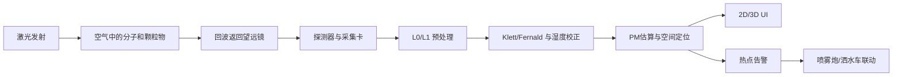

# 3. 整个系统由哪些部分组成

很多小白会以为“激光雷达就是一个激光器”。其实完全不是。一个能工作的颗粒物激光雷达系统至少包含下面 6 部分：

1. 发射端：激光器、扩束镜、安全快门、能量监测。
2. 接收端：望远镜、滤光片、分光器、探测器。
3. 采集端：模数采样卡、光子计数器、同步时钟。
4. 姿态与定位：GPS、IMU、车体姿态、云台角度编码器。
5. 算法软件：预处理、反演、标定、融合、告警。
6. 显示与控制：2D 图、3D 地图、热点告警、喷雾联动。

用流程图来看会更直观：

你可以把它理解成：

- 激光器负责"问空气一个问题"。
- 望远镜和探测器负责"听空气怎么回答"。
- 算法负责"把回答翻译成人能看懂的数据"。
- UI 和控制系统负责"把结论用图和动作表现出来"。

---

