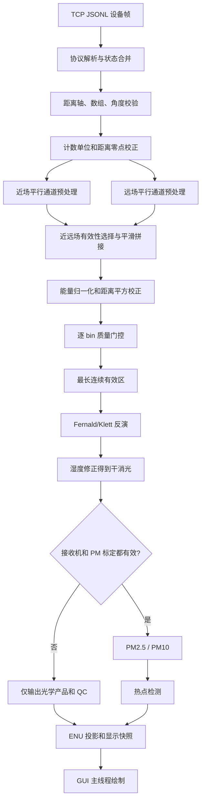
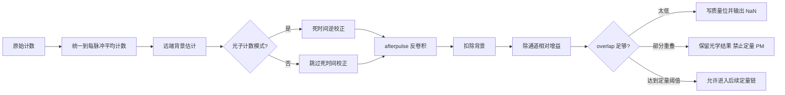
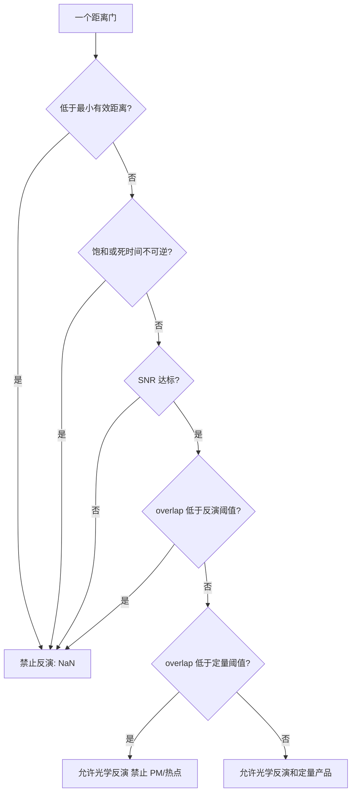

# YLJ5 客户端实时处理链

更新日期：2026-07-14。

本文描述 `cpp/client` 当前实际执行的实时处理路径。商用设备的厂商算法、通道标定矩阵
和 PM 系数并未公开，因此项目只采用可追溯的公开方法；无法由公开证据确定的环节会输出
QC 或保持产品为空，不用经验常数冒充厂家结果。

## 0. 初学者先从这里开始

### 0.1 客户端算法到底在做什么

激光雷达收到的不是一张 PM2.5 地图，而是一条条“沿着激光方向、随距离变化的计数曲线”。
原始计数同时混合了大气回波、太阳背景、电子学响应、距离衰减、望远镜几何、探测器非
线性和随机噪声。客户端算法的任务可以概括成三句话：

1. 先判断原始计数里哪些部分是仪器造成的，并尽可能校正；
2. 再判断每个距离门是否可靠，不可靠就明确屏蔽；
3. 最后才把可靠的光学信号反演成消光，并在有实测标定时换算 PM 和热点。

这里有一个非常重要的原则：

> 算法不能把“没有可靠测量”写成 0。0 表示测到了、结果为零；`NaN` 表示这个距离门
> 因为盲区、饱和、低信噪比等原因没有可信结果。

### 0.2 先认识三个数据对象

| 名称 | 在代码中的含义 | 初学者可以怎么理解 |
|---|---|---|
| 距离门 `bin` | 距离轴上的一个采样点，默认间隔 3.75 m | 一条尺子上的一个刻度 |
| 射线 `profile/ray` | 某个方位角、仰角下的整条距离曲线 | 雷达朝一个方向拍的一张“一维照片” |
| 扫描周期 `StepResult` | 一圈 PPI 加可选垂直观测和辅助帧 | 多个方向的一维照片组成的一轮扫描 |

一条默认射线有 5334 个距离门。客户端先逐射线处理，再等 `heartbeat` 把同一轮的射线
封装成 `StepResult`，最后生成 PPI 图、垂直廓线和热点列表。

### 0.3 从网络帧到界面的总流程



这张图可以按四层理解：

| 层次 | 主要输出 | 回答的问题 |
|---|---|---|
| L0 原始层 | `raw_counts`、角度、能量、overlap | 设备实际采到了什么 |
| L1 校正层 | `l1_signal`、`snr`、`bin_quality` | 信号洗干净了吗，哪些距离可信 |
| L1.5 光学层 | `attenuated_backscatter`、消光、干消光 | 大气光学结构是什么样 |
| L2 定量层 | PM2.5、PM10、热点 | 在实测标定支持下，业务量是多少 |

### 0.4 一条物理通道内部怎么处理



这里的顺序有物理原因。死时间作用在探测器看到的总计数上，所以要在扣背景之前校正；
afterpulse 是前面距离门泄漏到后面距离门的拖尾，所以要按距离顺序递推扣除；overlap 是
光学收光比例，必须在净信号得到以后校正。

### 0.5 “几何盲区”和“探测器死时间”不是一回事

| 概念 | 原因 | 在曲线上的表现 | 当前客户端怎么处理 |
|---|---|---|---|
| 几何盲区/低 overlap | 激光束和望远镜视场近距离没有充分重合 | 近端信号偏低，除 overlap 后噪声可能暴涨 | 低于阈值直接 mask；部分重叠只保留光学产品 |
| 光子计数死时间 | 计数器记录一个光子后需要恢复，强信号会漏记 | 近端强回波被压扁，计数与真实入射不再线性 | 仅 photon counting 模式执行解析逆校正，过高占用率直接 mask |
| 饱和 | ADC 或计数器达到满量程 | 多个强回波点被截成同一上限 | 提前使用饱和保护阈值标记无效 |
| afterpulse | 强信号在电子学/探测器中留下延迟拖尾 | 强峰后面出现并不存在的大气回波 | 使用暗帧标定的卷积核递推扣除 |

双望远镜“零盲区”指近场和远场光路互相补充，不代表可以删除软件质量控制，也不代表
从 0 m 起每个距离门都具有定量精度。当前默认最小有效距离和 overlap 曲线仍是仿真假设，
接实机后必须替换成设备序列号对应的标定结果。

### 0.6 每个距离门如何决定能不能继续算



判断结果保存在 `bin_quality` 位掩码中。同一个 bin 可以同时具有多个原因，例如“近端 +
饱和 + afterpulse 上游不可恢复”。位掩码比单个布尔值更适合现场排查，因为它保留了
为什么无效，而不仅仅是“无效”这个结论。

### 0.7 近场和远场为什么要拼接

双望远镜的两路信号各有擅长区间：

```text
距离增加  ------------------------------------------------------------>

近场通道      最可靠区 ==================== 逐渐变弱 ---------
远场通道      低 overlap ---- 逐渐可靠 ===============================
                              |<--- 共同有效区 --->|
                                      估比例并平滑拼接
```

当前默认在 75-300 m 交叉区寻找两路都有效的距离门，计算
`near_corrected / far_corrected` 的中位数作为幅度比例。随后使用 smoothstep 权重过渡，避免
在拼接起止点产生明显折线。如果某一路在某个 bin 低 SNR、饱和或 overlap 不足，算法直接
选择另一路，不让坏通道通过加权混进来。

### 0.8 为什么先有消光，后有 PM

激光雷达直接观测的是光学回波，不是颗粒物质量。当前链路的关系是：

```text
原始光子/ADC 计数
  -> 校正后的相对光学信号
  -> 衰减后向散射代理量
  -> Fernald/Klett 假设下的消光
  -> 湿度修正后的干消光
  -> 目标站点共址标定
  -> PM2.5 / PM10
```

所以加载一个通用斜率不能让设备自动变成定量 PM 仪器。接收机标定决定“光学幅度是否
可信”，站点 PM 标定决定“这个地区的干消光如何映射到质量浓度”，两者缺一不可。

## 1. 线程和周期边界

Linux Qt 客户端只有 GUI 模式。`LidarClientWorker` 被移动到专用 `QThread`，线程内依次
执行：

```text
QTcpSocket 收包
  -> JSONL 拆帧和协议解析
  -> DeviceStatusModel 增量合并
  -> ScanCycleMonitor 完整性统计
  -> FrameProcessor L0-L2 处理
  -> heartbeat 或时间戳变化时封口 StepResult
  -> 预计算 PPI 色标、ENU 栅格和垂直显示快照
  -> queued signal 交给 GUI
```

GUI 线程只接收 `shared_ptr<const StepResult>`、`shared_ptr<const DisplaySnapshot>` 和设备
状态快照，不访问 socket，也不执行背景扣除、反演、标定、热点检测或百万点 PPI 栅格化。
断开连接和关闭窗口时，worker 会先封口尚未完成的周期。

## 2. 输入校验

每条 `lidar_raw` 进入处理链前检查：

- 距离轴至少 8 个 bin，严格递增且数值有限；
- 近远场拼接主通道 `raw_counts` 和 `overlap` 与距离轴等长；
- 方位角位于 `[0, 360)`，仰角位于 `[0, 180]`；
- 每条物理接收通道的计数和 overlap 与距离轴等长。
- 可选的固件/适配器逐 bin 质量数组与距离轴等长。

未来实机适配器若完全缺失主通道 overlap，会临时填充 1.0 并添加
`main-channel-overlap-assumed-unity`；非空但尺寸错误的数据会被拒绝。结构或数值不合法的
帧不会进入反演，周期结果记录 `malformed-or-unprocessable-lidar-frame`。

### 2.1 `bin_quality` 质量位字典

`bin_quality` 与距离轴等长，每个整数都是一个位掩码。同一位置可以同时设置多位，读取时
应使用 `has_quality(mask, flag)`，不要用整数相等判断。当前质量位含义如下：

| 质量位 | 初学者解释 | 能否做光学反演 | 能否做 PM/热点 |
|---|---|---:|---:|
| `none` | 当前没有发现问题 | 是 | 是，但还必须具备组合标定 |
| `below_minimum_range` | 位于触发瞬态或最小有效距离内 | 否 | 否 |
| `overlap_unusable` | 收发视场重叠太低，校正会严重放大误差 | 否 | 否 |
| `partial_overlap` | overlap 足够观察结构，但尚未达到定量要求 | 是 | 否 |
| `saturated` | 探测器已到饱和保护区，真实强度不可恢复 | 否 | 否 |
| `dead_time_uncorrectable` | 光子计数占用率过高，死时间逆校正接近发散 | 否 | 否 |
| `low_snr` | 信号相对噪声太弱 | 否 | 否 |
| `non_finite_input` | 输入含 `NaN` 或 `Inf` | 否 | 否 |
| `no_valid_channel` | 近场和远场通道在该位置都不可用 | 否 | 否 |
| `invalid_laser_energy` | 激光能量缺失或非正，无法归一化 | 否 | 否 |
| `upstream_invalid` | 固件已判无效，或 afterpulse 依赖的前序值不可恢复 | 否 | 否 |
| `retrieval_unavailable` | 没进入最终连续反演区，或反演结果不是有限值 | 否 | 否 |

这里要区分两种 QC：`bin_quality` 指出某个具体距离门为什么无效；`qc_flags` 是整条射线或
整个扫描周期的文字摘要。现场排错时先看周期 `qc_flags` 判断问题类别，再看
`bin_quality` 定位问题出现在哪些距离。

## 3. 接收通道预处理

YLJ5 仿真帧携带近场/远场与平行/垂直偏振四条路径。当前定量主信号使用
`near_parallel_532nm` 和 `far_parallel_532nm`；两条垂直偏振通道会接受形状校验并随原始
廓线保留，退偏比使用协议中的 `depolarization_ratio`。在获得实机偏振串扰矩阵前，项目
不会伪造偏振标定。

每条参与拼接的通道先按协议声明的计数单位归一到每脉冲平均计数，再执行：

```text
background = 15 km 以外尾段分块低四分位线性拟合；不足时退回设备背景元数据
linearized = raw / (1 - dead_time_loss * raw)
afterpulse_corrected = linearized - calibrated_afterpulse_kernel (*) previous_bins
signal = max(afterpulse_corrected - corrected_background, 0)
corrected = signal / relative_gain / overlap
snr = signal * sqrt(integrated_pulses) / sqrt(raw + background)
```

低于最小有效距离、overlap 低于反演阈值、接近饱和、死时间占用率不可逆、低 SNR 或
上游声明无效的 bin 不再用钳位常数强行计算，而是写入位掩码并阻断反演。处于部分 overlap
但仍高于反演阈值的 bin 可保留光学结果，默认 overlap 达到 90% 前不进入 PM 和热点。

在 75-300 m 默认交叉区内，只有近、远场 SNR 均达到门限的 bin 才参与比例估计。比例
样本不少于 5 个时取中位数作为远场尺度，随后按 smoothstep 距离权重拼接；某一路 SNR、
饱和或 overlap 不合格时自动偏向另一条路径。输出包含：

- 背景、增益和 overlap 修正后的 `l1_signal`；
- 能量归一和距离平方修正后的 `attenuated_backscatter`；
- 脉冲积分修正后的 `snr`；
- `near-far-channels-glued`、`channel-gluing-ratio-unverified` 等 QC。
- 与距离轴对齐的 `bin_quality`，记录近场、overlap、饱和、死时间、SNR 和反演状态。

这套近远场 gluing 顺序与 EARLINET Single Calculus Chain 的公开处理分层一致，但具体
交叉区、增益和 overlap 仍是待实机标定参数，不是 YLJ5 厂家值。

## 4. 分子参考场

实时协议默认不发送仿真真值和分子场。若 `molecular_backscatter` 或
`molecular_extinction` 缺失，客户端按 532 nm 标准大气近似生成分子参考：采用 8 km
指数尺度高度和波长四次方缩放，并添加 `molecular-reference-standard-atmosphere`。

该回退能保证反演有明确边界条件，但不能替代站点探空、温压廓线或标准气象模式。接入
真实设备后，应优先用同期气象廓线计算分子消光和后向散射。

## 5. Fernald/Klett 弹性反演

`FernaldInversionStep` 在最长连续有效距离区间内选择远端参考窗，并按实际距离门间距从
远端向近端反向积分，分别输出总消光、气溶胶消光和气溶胶后向散射。无效区保持 `NaN`，
不会被零值伪装成晴空。该方法建立在经典 Klett/Fernald 弹性后向散射反演上：

```text
attenuated_backscatter + molecular profile
  -> 远端参考尺度
  -> 双程透过率反向积分
  -> aerosol_backscatter
  -> aerosol_extinction = lidar_ratio * aerosol_backscatter
  -> total_extinction = molecular_extinction + aerosol_extinction
```

单波长弹性回波无法独立确定激光雷达比，结果必须结合参考区、天气掩膜和敏感性分析。
当前代码还没有厂商云雾降水分类，也没有逐 bin 不确定度传播。

## 6. 湿度修正和坐标投影

`HumidityCorrectionStep` 用简化的 κ-Kohler 风格增长因子把环境湿态气溶胶消光修正到干
参考状态。分子消光不参与气溶胶吸湿修正：

```text
dry_extinction = aerosol_extinction / g(relative_humidity)
```

`CoordinateProjectionStep` 再把距离、方位和仰角转换为本地 ENU：

```text
East  = r * cos(elevation) * sin(azimuth)
North = r * cos(elevation) * cos(azimuth)
Up    = r * sin(elevation)
```

因此 0 度水平圈提供近地平面的二维分布，5 度锥扫提供随距离升高的浅锥层，90 度观测
提供垂直廓线。当前 0/5/90 度调度不是密集多仰角体扫，不能仅凭单个周期宣称完整三维
层析重建。

## 7. PM 标定门控

光学消光不能用一个通用固定倍数直接变成 PM2.5/PM10。只有同时加载目标设备接收机标定
和目标站点共址 PM 标定后，客户端才执行：

```text
PM2.5 = max(0, intercept25 + slope25 * dry_extinction)
PM10  = max(0, intercept10 + slope10 * dry_extinction)
```

其中 `dry_extinction` 明确表示干态气溶胶消光，不包含分子 Rayleigh 消光。

PM 模型字段和 `receiver_calibration` 必须位于同一个组合标定文件，完整结构见
`configs/ylj5_calibration.template.json`。接收机部分包含设备序列号对应的探测模式、距离
零点、最小有效距离、overlap 阈值、饱和上限、死时间系数和 afterpulse 核。切换标定时
处理器会先封口当前周期，避免一个扫描周期混用两套系数。

PM 模型字段为：

```json
{
  "calibration_id": "site-cal-001",
  "valid_from": "2026-07-01",
  "pm25_intercept_ugm3": 0.0,
  "pm25_slope_ugm3_per_km": 0.0,
  "pm10_intercept_ugm3": 0.0,
  "pm10_slope_ugm3_per_km": 0.0
}
```

未标定时，`pm25`、`pm10` 和 `hotspots` 保持空数组；接收机标定缺失时添加
`receiver-calibration-required-for-pm`。组合标定有效后，近场部分重叠、饱和、低 SNR 等
bin 仍保持 `NaN`，GUI 和热点检测显式跳过。当前线性模型只是明确的适配接口，正式系数
仍需训练/验证切分、漂移监控和不确定度报告。

## 8. 周期质量控制

`heartbeat` 或时间戳变化触发周期封口。`StepResult` 汇总有效/拒绝射线数、有效/屏蔽
距离门、PPI/垂直射线数、仰角层数、接收机与 PM 标定 ID、平均处理时延和去重后的 QC。
`ScanCycleMonitor` 根据
`scan_cycle_id`、`ray_index`、`rays_in_cycle` 识别重复和缺失射线；不完整周期添加
`scan-cycle-incomplete`。周期摘要交付后立即释放缓存；重新连接时清空未完成周期，避免
循环扫描和断线重连造成状态长期增长或误报重复帧。

回归测试 `TestClientFrameProcessor.cpp` 固定验证以下边界：

- 缺失分子场时标准大气回退不崩溃；
- 四通道输入执行近远场平行通道拼接；
- 未标定时 PM 数组为空；
- 加载有效组合标定后 PM 与距离轴等长；
- 最小有效距离、部分 overlap、饱和和缺失能量不会进入 PM；
- 5334 距离门四通道仿真帧可端到端完成探测器校正、掩膜和反演。

## 9. 怎样从文档跟到代码

初学者不必从 `FrameProcessor.cpp` 第一行读到最后一行。按下面顺序跟踪一条射线，会更容易
把网络、算法和显示分开：

| 想看什么 | 代码入口 | 主要职责 |
|---|---|---|
| 网络数据怎样进入客户端 | `cpp/client/src/LidarClientWorker.cpp` 的 `process_line` | JSONL 解析、状态合并、周期监控，把帧交给处理器 |
| 一条射线的总调度 | `cpp/client/src/FrameProcessor.cpp` 的 `process_device_profile` | 距离校正、模式合同、L1、反演、PM 门控、ENU 和结果封装 |
| 背景怎样估计 | 同文件的 `estimate_background` | 远端候选区、分块低四分位包络和稳健线性基线 |
| 死时间、afterpulse 和逐 bin QC | 同文件的 `correct_channel` | 单物理通道校正及质量位生成 |
| 近场和远场怎样拼接 | 同文件的 `preprocess_receiver_channels` | 通道选择、比例估计、smoothstep 拼接和能量/range² 校正 |
| Fernald、湿度和坐标公式 | `cpp/src/LidarDemo/RealtimeProcessingAlgorithms.hpp` | 公共数值算法实现 |
| 热点如何过滤无效 PM | `cpp/src/LidarDemo/RealtimeHotspotDetection.hpp` | 只使用有限且通过定量 QC 的距离门 |
| 处理结果怎样送去显示 | `cpp/client/src/DisplaySnapshot.cpp` | 把不可变周期结果预计算成 GUI 快照 |

### 9.1 当前实现到了哪一步

| 状态 | 能力 | 使用时应该怎么表述 |
|---|---|---|
| 已实现，主链有回归测试 | 输入校验、标准大气回退、四通道接收、背景估计、死时间、afterpulse、近远场拼接、逐 bin QC、Fernald、湿度修正、PM 门控、ENU | 可以说明“客户端已实现该处理链” |
| 已实现接口，但结果依赖实测标定 | 距离零点、最小有效距离、overlap、相对增益、饱和、死时间、afterpulse、接收机幅度和 PM 系数 | 只能说明“代码支持加载标定”，不能把默认值称作厂家值 |
| 尚未实现 | 偏振串扰矩阵、基于实测温压的分子场、云雾/降水分类、逐 bin 不确定度传播、厂家 L1/L2 复现 | 不应从现有输出推断这些能力已经具备 |

### 9.2 推荐阅读顺序

1. 第 0 节：先理解对象、总流程、盲区和质量门控；
2. 第 2、3 节：理解一条原始通道怎样变成可反演信号；
3. 第 5、7 节：理解“光学反演”和“PM 标定”为什么是两层问题；
4. 第 9 节：带着流程图进入源码；
5. 需要补原理时，再阅读[第 11 章：颗粒物数据处理](11.%20颗粒物版本的数据处理到底怎么走.md)和
   [第 12 章：从回波到消光、PM 和热点](12.%20算法部分展开讲：从回波到消光、PM%20和热点.md)。

后两章是通用教学材料，示例参数和伪代码不等同于当前客户端实现；遇到差异时，以本文、
源码和回归测试为准。

## 10. 仍需实机资料

达到实机级还原还缺少：厂家原始帧/SDK、ADC 或光子计数单位、通道增益、overlap、偏振
串扰、距离零点、背景区定义、激光能量监测值、气象输入、厂家 L1/L2 对照产品以及站点
PM 共址标定数据。拿到资料后应通过独立适配器和 golden sample 测试接入，而不是修改
当前 QC 把假设隐藏起来。

## 11. 公开依据

- D'Amico et al., 2015, EARLINET Single Calculus Chain, Atmos. Meas. Tech.,
  https://doi.org/10.5194/amt-8-4891-2015
- Klett, 1981, Stable analytical inversion solution for processing lidar returns,
  https://doi.org/10.1364/AO.20.000211
- Fernald, 1984, Analysis of atmospheric lidar observations: some comments,
  https://doi.org/10.1364/AO.23.000652
- Ansmann et al., 1990, Independent measurement of extinction and backscatter profiles,
  https://doi.org/10.1364/OL.15.000746
