# 激光颗粒物监测系统入门手册

> 这份文档是给小白看的。目标不是一上来把你训练成大气激光雷达专家，而是先让你真正看懂：这套系统到底在测什么、为什么能测、公式每一项是什么意思、工程上应该怎么做、软件界面应该长什么样。
> 这份文档聚焦的是颗粒物和扬尘，也就是 PM2.5、PM10、施工扬尘、道路积尘再悬浮、烟羽、粉尘团这类目标。它不是一份“什么气体都能测”的大全，更不是一份只会堆公式的科研摘要。

---

## 0. 先用一句人话讲清楚这套系统

你可以把它理解成一套“会发光的空气扫描仪”：

1. 它向空气里打一束很窄的激光。
2. 空气里的分子、灰尘、烟雾、雾滴会把一小部分光散射回来。
3. 仪器接收这些返回光。
4. 因为不同距离的回波到达时间不同，所以可以知道“哪一段空间里有多少回波”。
5. 再通过算法把“回波强弱”变成“颗粒物分布、污染层位置、浓度热点、三维污染云图”。

如果你过去只接触过普通激光雷达或三维点云，这里最重要的区别是：

- 普通 3D LiDAR 主要看固体物体表面。
- 大气激光雷达主要看空气本身对光的散射和衰减。
- 它得到的原始结果不是建筑物轮廓，而是一条沿距离变化的回波曲线，或者一张时间-高度热力图。

---

## 1. 这套系统到底能做什么，不能做什么

### 1.1 它能做什么

如果目标是工地扬尘、道路扬尘、料场粉尘、烟羽、雾霾层，这套系统非常合适。它擅长：

1. 发现哪里有颗粒物或粉尘团。
2. 判断粉尘层大概在哪个高度、哪个方向、离设备多远。
3. 连续扫描，做出二维剖面和三维空间分布图。
4. 结合地面 PM 传感器、湿度和气象数据，估算 PM2.5 / PM10 浓度。
5. 提取污染热点的三维坐标，联动喷雾炮或洒水车做闭环控制。

### 1.2 它不能直接做到什么

作为小白，最容易误解的就是“既然都叫激光雷达，是不是打一束光就能直接读出 PM2.5 数值”。答案是不行。

它不能直接做到：

1. 不经过标定就直接输出绝对准确的 PM2.5、PM10 质量浓度。
2. 用一台设备同时准确测完所有气体污染物。
3. 像摄像头一样直接拍到“污染物真实外形”。
4. 不做安全设计就拿到户外随便打激光。

### 1.3 为什么它不能直接“称重”PM2.5

因为它本质上测到的是光学量，而不是颗粒物的实际重量。

它首先测到的是：

- 后向散射强不强。
- 激光在空气里被削弱得厉不厉害。
- 哪些高度、哪些方向回波更强。

真正的 PM2.5 / PM10 质量浓度，通常要通过这些光学量再去和下面这些信息一起标定：

- 地面 PM 参考仪。
- 相对湿度 RH。
- 温度、气压。
- 颗粒物类型。
- 本地季节和源类型。

所以更准确的人话是：

> 激光雷达先测“光学浓度特征”，再通过本地校准模型去估算“质量浓度”。

---

## 2. 先把几个最关键的词看懂

下面这些词后面会反复出现。先有一个直觉，后面看公式就轻松很多。

| 术语 | 小白解释 | 你为什么必须懂 |
| --- | --- | --- |
| 激光脉冲 | 一次很短的激光闪光 | 它是系统的“探测动作” |
| 回波 | 被空气和颗粒物打回来的一点光 | 这是仪器真正测到的信号 |
| 后向散射 | 光被散射后，刚好朝设备方向返回 | 不返回就收不到 |
| 消光 | 光在传播中被散射和吸收，越来越弱 | 决定远距离还能不能看见 |
| 后向散射系数 $\beta$ | 某一层空气把光打回来的能力 | 决定这一层“亮不亮” |
| 消光系数 $\alpha$ | 某一层空气削弱激光的能力 | 决定光路损耗有多大 |
| overlap 重叠函数 | 发射光束和接收视场在近距离有没有完全对上 | 决定近距离盲区 |
| RCS 距离平方校正 | 把天然的 $R^{-2}$ 几何衰减先补回来 | 便于看真实结构 |
| Klett/Fernald | 一种经典反演算法 | 把回波变成消光和后向散射 |
| ENU 坐标 | 东、北、天的本地三维坐标系 | 把扫描点投到地图和 3D 场景里 |

---

## 3. 整个系统由哪些部分组成

很多小白会以为“激光雷达就是一个激光器”。其实完全不是。一个能工作的颗粒物激光雷达系统至少包含下面 6 部分：

1. 发射端：激光器、扩束镜、安全快门、能量监测。
2. 接收端：望远镜、滤光片、分光器、探测器。
3. 采集端：模数采样卡、光子计数器、同步时钟。
4. 姿态与定位：GPS、IMU、车体姿态、云台角度编码器。
5. 算法软件：预处理、反演、标定、融合、告警。
6. 显示与控制：2D 图、3D 地图、热点告警、喷雾联动。

用流程图来看会更直观：

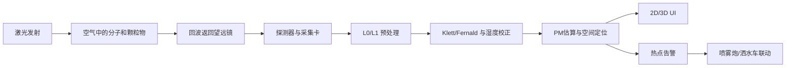

你可以把它理解成：

- 激光器负责"问空气一个问题"。
- 望远镜和探测器负责"听空气怎么回答"。
- 算法负责"把回答翻译成人能看懂的数据"。
- UI 和控制系统负责"把结论用图和动作表现出来"。

---

## 3.5 补课：关于光，你需要知道的最少知识

如果你对光的物理基础不太熟，这一节帮你快速补上。只讲和 LiDAR 有关的，不扯远了。

### 光是波吗？

**是的，光是一种电磁波。**

"波"你可以想象成水面上的涟漪：

```
平静水面          扔一块石头后

───────          ╱╲  ╲╱  ╲╱  ╲╱
                 ╱  ╲╱  ╲╱  ╲╱  ╲
─────────        ╱                  ╲
```

水面波是水在上下振动，光波则是**电场和磁场在交替振动**。区别在于：

| | 水面波 | 光波 |
| --- | --- | --- |
| 什么在振 | 水分子上下运动 | 电场和磁场交替变化 |
| 需要介质吗 | 需要水 | **不需要，真空中也能传播** |
| 传播速度 | 很慢（几米/秒） | 极快（约 $3 \times 10^8$ m/s） |

所以光的全名叫"电磁波"——电场和磁场自己在那交替振荡，不需要任何介质来"托着"它。

### 激光和普通光有什么区别？

手电筒发的光和激光器发的光，本质都是电磁波，但区别很大：

```
普通光（手电筒、太阳光）：           激光：

  各个方向乱跑                       几乎只往一个方向
  ╲  │  ╲                           ──────────→
   ╲ │ ╲
  ──●──                             像一束"平行线"
   ╱ │ ╲
  ╱  │  ╲

  各种颜色混在一起                   几乎只有一个波长（一种颜色）
  🔴🟡🟢🔵🟣                        纯🔴 或纯🟢

  各个波"步调不一致"                 所有波"步调完全一致"
  ∿∿∿∿∿∿                           ∿∿∿∿∿∿
  （随机相位）                       （同相，像阅兵方阵）
```

三个关键词：

1. **方向性好**：激光几乎只往一个方向走，不散开。这对 LiDAR 至关重要——你打出去的光才不会浪费，也才能精确知道"打到了哪里"。
2. **单色性好**：激光几乎只有一个波长，滤光片可以非常精准地只让这个波长的回波进来，把太阳光等杂光挡掉。
3. **相干性好**：所有光波的步调一致，能量集中。

一个形象类比：

> 普通光 = 广场上乱走的一群人，各走各的方向，各穿各的衣服。
> 激光 = 一支阅兵方阵，统一服装、统一方向、统一步伐。

### 光在真空中传播会有损耗吗？

**不会。**

光在真空中传播时，没有任何东西和它发生相互作用，所以：

- 能量不会减少。
- 方向不会改变。
- 速度恒定为 $c \approx 3 \times 10^8$ m/s。

你可以想象一个人在完全空旷的太空里匀速直线走——没有摩擦力、没有风阻、没有障碍物，他可以一直走下去，速度和体力都不会变。

```
真空中：                          大气中：

  激光 ──────────────────→          激光 ───╳╳──→
                                    ↑
  完好无损，能量不变                空气分子和颗粒物
                                    在不断"吃掉"光
```

**那为什么 LiDAR 的信号会衰减？** 因为我们在大气中工作，不是真空中。大气里充满了：

- 空气分子（氮气、氧气等）
- 水汽
- 灰尘、PM2.5、PM10
- 雾滴、烟尘

这些东西会：

1. **吸收**光：把光能变成热能（光被"吃掉"了）。
2. **散射**光：把光打到别的方向去（光被"拐跑"了）。

这就是 LiDAR 方程里消光系数 $\alpha(R)$ 存在的原因。

### 发出去的光和收到的光，原始样子是什么？

#### 发出去的光：一个极短、极亮的光脉冲

LiDAR 不是一直开着激光，而是**打一枪、听一下、再打一枪**。每一枪是一个极短的光脉冲：

```
时间 →

发射的激光脉冲：

光强
  ↑    ┌┐
  │    ││
  │    ││          ← 整个脉冲可能只有 10 纳秒（0.00000001 秒）
  │    ││            在这么短的时间里，光走了约 3 米
  │    ││
  └────┴┴────────────────→ 时间
    近处     稍远       更远          很远
    回波     回波       回波          回波

  整体趋势：越远越弱（因为 R⁻² 几何扩散 + 消光衰减）
```

形象地说，发射出去的不是一个持续的光柱，而更像**一颗子弹**——一颗由光组成的、极短极亮的"子弹"，嗖地一下飞出去。

这颗"子弹"在空间中的样子：

```
    ← 约3米长 →
    ┌──────────┐
    │██████████│  ← 一个亮斑，3米长，很窄
    └──────────┘
         ↓
    飞行方向
```

#### 收到的光：无数个极弱的回波

这颗光子弹飞出去后，沿途每一段空气都会"弹回来"一点点光：

```
光子弹飞出去：

    LiDAR ──→ ██████████ ──→ 空气1 ──→ 空气2 ──→ 空气3 ──→ ...

每段空气弹回来一点点：

    LiDAR ←─ 弱 ←─ 弱 ←─ 更弱 ←─ 极弱
            空气1    空气2    空气3    空气4
```

接收望远镜收到的信号长这样：

```
光强
  ↑
  │ ▓▓
  │ ▓▓▓
  │ ▓▓▓▓▓
  │ ▓▓▓▓▓▓▓▓
  │ ▓▓▓▓▓▓▓▓▓▓▓▓▓
  │ ▓▓▓▓▓▓▓▓▓▓▓▓▓▓▓▓▓▓▓
  │ ▓▓▓▓▓▓▓▓▓▓▓▓▓▓▓▓▓▓▓▓▓▓▓▓░░░░░░░░░░░░░░░
  └──────────────────────────────────────→ 采样点
    近处（信号强）                   远处（信号弱，淹没在噪声里）
```

这就是第 4 节要讲的"距离-回波强度曲线"的原始形态——横轴是采样时间（等价于距离），纵轴是信号强度。

### 波长是什么？怎么测出来的？

#### 波长的直觉理解

波有"波峰"和"波谷"，两个相邻波峰之间的距离就叫**波长**：

```
     波峰   波峰   波峰
      ↓     ↓     ↓
     ╱╲   ╱╲   ╱╲
    ╱  ╲ ╱  ╲ ╱  ╲
───╱────╲╱────╲╱────╲───
        ↑     ↑
       波谷   波谷

   |←──→|  |←──→|
    波长     波长
```

不同颜色的光，本质就是波长不同：

```
可见光光谱（波长从短到长）：

  紫    蓝    青    绿    黄    橙    红
  380nm 450nm 480nm 520nm 570nm 600nm 700nm

  ←── 波长越短 ──────────── 波长越长 ──→
  ←── 能量越高 ──────────── 能量越低 ──→

  1 nm（纳米）= 0.000000001 米 = 十亿分之一米
```

LiDAR 常用的激光波长不在可见光范围，而在红外线区域（人眼看不见）：

| 激光类型 | 波长 | 用途 |
| --- | --- | --- |
| Nd:YAG | 1064 nm（近红外） | 最常见的气溶胶 LiDAR |
| Nd:YAG 倍频 | 532 nm（绿光） | 常用于拉曼/偏振 LiDAR |
| 人眼安全 Er:glass | 1550 nm（近红外） | 可用于较高功率的扫描 |

#### 波长是怎么测出来的？

历史上测波长经历过几种方法，从粗糙到精确：

**方法1：衍射光栅（最直观）**

```
原理：让光穿过一条很密的缝（光栅），不同波长的光会偏折到不同角度。

         光栅（很多平行细缝）
           │││││││││
  白光 →   │││││││││   → 红光偏折大
           │││││││││   → 绿光偏折中
           │││││││││   → 紫光偏折小

就像三棱镜把白光分成彩虹一样，
但光栅分得更精确。

屏幕上看到：
  紫 蓝 青 绿 黄 橙 红
  ←─ 波长已知的标准灯 ─→

  对比位置就能算出波长。
```

类比：你往河里扔不同大小的石子，小石子溅起的水波纹密（波长短），大石子溅起的波纹稀（波长长）。光栅就像一个"读波纹密度的尺子"。

**方法2：迈克尔逊干涉仪（更精确）**

```
原理：把一束光分成两半，走不同路径再合在一起。
  如果两束光的路径差恰好等于一个波长，合在一起就会"亮"（相长干涉）。
  如果差半个波长，就会"暗"（相消干涉）。

  光源 → 分光镜 ──→ 镜子1（固定）
              │           ↓
              │        返回
              ↓
           镜子2（可移动）
              ↓
           返回 → 合在一起 → 探测器

  慢慢移动镜子2，探测器会交替出现"亮-暗-亮-暗"。
  数"亮了多少次"和"镜子移了多远"，就能算出波长。
```

类比：两个人跑步，步长一样时齐步走声音大（亮），步长差半步时互相踩脚（暗）。你量了一个人跑了多远，再数齐步了多少次，就能算出步长。

**方法3：现代方法（最精确）**

现代实验室用**频率梳**——一种能产生极其精确频率间隔的激光器。因为光速 $c$ 已经被定义为精确值（299792458 m/s），而频率 $f$ 可以用原子钟极其精确地测量，所以：

$$
\lambda = \frac{c}{f}
$$

频率测到多少位有效数字，波长就有多少位。现在的精度可以到小数点后 15 位以上。

**但对 LiDAR 使用者来说，你不需要测波长。** 激光器出厂时波长就已经标定好了，写在参数表里。你只需要知道"我的激光是 1064nm 还是 532nm"，因为不同波长和颗粒物的相互作用方式不同，反演算法要考虑这个。

### 脉冲是怎么控制"打一枪、停一下"的？

#### 先纠正一个误解

我前面说"10 纳秒"是指**单个脉冲的持续时间**（脉冲宽度），不是"每 10 纳秒打一发"。

实际的工作节奏更像是：

```
发射一个脉冲（持续约 10 ns）
         ↓
等待回波全部回来（约 100~200 μs）
                              ↓
发下一个脉冲
                              ↓
等待回波...

时间轴：
  ├─10ns─┤────── 100~200 μs ──────├─10ns─┤────── 100~200 μs ──────┤
  │脉冲1 │     等回波回来          │脉冲2 │     等回波回来          │
```

- 脉冲宽度：~10 ns（决定了距离分辨率，约 1.5 m）
- 脉冲间隔：~100-200 μs（决定了最大探测距离，约 15-30 km）
- 重复频率：~5-20 Hz（每秒打 5~20 发，不是几千万发）

#### 脉冲是怎么"切"出来的？

激光器内部有一套**调 Q（Q-switch）** 机制，相当于一个极快的"快门"：

```
谐振腔的基本结构：

  全反射镜 ═══════════════════════════════ 激光介质 ═══════════════════════════════ 半反射镜
  （100%反射）     （Nd:YAG 晶体等）                               （部分透光，光从这里出去）

光在两面镜子之间来回弹，每经过激光介质就被放大一次。
```

**调 Q 的工作过程**（类比一个"蓄水-放水"的过程）：

```
第1步：蓄能（Q 值低，不产生激光）

  全反射镜 ════ [开关关闭] ════ 激光介质 ════ 半反射镜

  激光介质被泵浦灯/二极管持续注入能量，
  但开关关闭，光无法在腔内来回反射放大。
  能量越攒越多，就像水库蓄水。

         ⚡⚡⚡⚡⚡⚡  ← 持续注入能量
         ██████████  ← 激光介质储存了大量能量


第2步：瞬间打开开关（Q 值突然变高）

  全反射镜 ════ [开关打开] ════ 激光介质 ════ 半反射镜

  所有储存的能量在极短时间内（~10ns）全部释放！
  就像水库大坝瞬间开闸，洪水喷涌而出。

         ════════════════════→  ← 一个极短、极强的光脉冲飞出去！
         10 ns 内释放完毕
```

**开关是怎么实现的？** 有几种方式：

1. **电光开关**：在腔内放一块晶体，加电压时光不能通过（关闭），撤掉电压瞬间光可以通过（打开）。切换速度在纳秒级。

2. **声光开关**：用超声波在晶体中制造"衍射光栅"，把光偏折到别处（关闭），关掉超声波光就直通（打开）。

3. **被动调 Q**：放一种"漂白晶体"，弱光时吸收（关闭），能量攒够后突然变透明（打开）。不需要外部电路控制，自己就会"蓄满就放"。

```
整个发射时序的控制：

  主控电路发出触发信号
         │
         ▼
  ┌──────────────┐
  │  Q 开关控制   │ ← 接到触发信号后，关闭→打开→关闭
  └──────┬───────┘
         │
         ▼
  ┌──────────────┐
  │  激光器      │ ← 产生 10 ns 光脉冲
  └──────┬───────┘
         │
         ▼
  ┌──────────────┐
  │  采集卡      │ ← 同步开始采样（和发射精确同步）
  └──────────────┘

  发射脉冲和开始采样的时间必须严格同步，
  否则"0 时刻"就不准，距离就会算错。
  同步精度要求在纳秒级。
```

#### 一句话总结脉冲控制

**激光器内部像水库蓄水：持续攒能量 → Q 开关瞬间打开 → 10 纳秒内全部释放 → 关闭 → 再攒 → 再放。** 主控电路控制"什么时候放"，Q 开关控制"放多快"，采集卡同步"什么时候开始听"。

---

### 一句话总结

**光是电磁波，激光是一支"阅兵方阵"式的光，真空中不损耗但在大气中会被吸收和散射，LiDAR 发出去的是一颗极短的光子弹，收到的是沿途每段空气弹回来的连续衰减的弱信号。**

---

## 4. 从一束脉冲到一条距离曲线，中间发生了什么

### 4.1 为什么时间能换成距离

激光飞得非常快，接近光速 $c$。设备发出脉冲后，系统开始计时。某一段空间的回波返回得越晚，说明它离设备越远。

距离公式是：

$$
R = \frac{ct}{2}
$$

这里的 $2$ 很关键，因为光不是单程，而是：

1. 从设备飞到目标体积。
2. 再从目标体积飞回设备。

所以如果回波晚了 $t$ 秒，真正的单程距离只是一半。

### 4.2 为什么原始数据不是照片，而是一条曲线

因为设备每次发射只知道"不同时间收到了多强的回波"，所以原始结果更像：

- 横轴是距离。
- 纵轴是回波强度。

每次激光脉冲打出去，你只能得到**一根线**：

```
回波强度
  ↑
  │    ╱╲
  │   ╱  ╲        ╱╲
  │  ╱    ╲      ╲  ╲
  │ ╱      ╲    ╲    ╲
  │╱        ╲  ╲      ╲________
  └──────────────────────────→ 距离
  近                远
```

这是 1 维的：只有"距离"和"强度"两个量。就像你用手电筒照一条直线，只能知道沿这条线上各处亮不亮。

#### 从一条线到多种图：维度是怎么一步步增加的

如果持续采样很多次，再把时间拼起来，维度就增加了。关键在于：**每次脉冲之间改变某个参数（时间 / 仰角 / 方位角），拼接后就能看到更高维度的结构。**

##### 第 1 种：时间-高度图（最常见）

**做法**：激光方向固定不动（比如一直垂直向上打），每隔几秒打一发，持续几小时。

```
时刻1:  ___╱╲____╱╲________  ← 第1条曲线
时刻2:  ___╱╲____╱╲________  ← 第2条曲线（可能略有变化）
时刻3:  ___╱╲___╱╲_________  ← 第3条曲线
  ...
时刻N:  ___╱╲____╱╲________  ← 第N条曲线

把这些曲线像"手风琴"一样左右展开：

高度↑
     │ ██░░████░░░░░░░░░░░░
     │ ██░░████░░░░░░░░░░░░
     │ ███░░███░░░░░░░░░░░░   ← 每一列是一个时刻的距离剖面
     │ ███░░████░░████░░░░░   ← 颜色深浅 = 回波强度
     │ █████░████░█████░░░░
     └────────────────────→ 时间
        0h   2h   4h   6h
```

直观理解：就像监控摄像头——单帧是一张照片，连续播放就是视频。时间-高度图就是大气层的"延时摄影"，能看到云层怎么飘过来、污染层怎么升高。

实际效果示意：

```
高度(km)
8 │░░░░░░░░░░░░░░░░░░░░░░░░░░░  ← 高空干净，信号弱
  │░░░░░░░░░░░░░░░░░░░░░░░░░░░
6 │████░░░░░░░░░░░░████░░░░░░░  ← 有云层 / 气溶胶层
  │████░░░░░░░░░░░░████░░░░░░░
4 │████████░░░░░░░░██████░░░░░  ← 污染边界层
  │██████████████████████████░
2 │███████████████████████████  ← 近地面污染最浓
  │███████████████████████████
0 └──────────────────────────→ 时间
    06:00    12:00    18:00
```

##### 第 2 种：距离-仰角图（RHI 扫描）

**做法**：激光在同一方位角，但**上下摆动**，从低仰角扫到高仰角，每个仰角打一发。

```
        仰角90°(正上方)
         │  ╲
         │╱
  仰角45°├─────╲
        ╲│      ╲
       ╲ │       ╲
      ╲  │        ╲
  仰角0°├──────────╲──→ 水平
    LiDAR

每个仰角得到一条距离-强度曲线，拼接后：

高度↑
     │      ╱╲
     │     ╱  ╲          ← 仰角越高，同一距离对应的高度越高
     │    ╱    ╲  ╲
     │   ╱      ╲╱  ╲
     │  ╱             ╲
     │ ╱               ╲
     └──────────────────→ 地面距离
```

直观理解：就像你站在原地，从地面到头顶慢慢抬头，眼睛扫过的地方就"画"出了一个竖直切面。这张图相当于把天空"切了一刀"，看这一刀上颗粒物的分布。

###### RHI 扫描详解：高度从哪来？

一个常见的疑问是：**假如正前方有一团沙尘暴，RHI 为什么能得到"距离-高度"图？这个"高度"是什么意思？**

关键在于：**沙尘暴不是一个点，它有垂直厚度**。

```
你直觉中的沙尘暴：        实际的沙尘暴：

   ？？？                 ████████████  ← 顶部（比如 500m 高）
                         ████████████
                         ████████████     它是一整面"墙"，
                         ████████████     从地面到 500m 都是沙尘
                         ████████████
                         ████████████  ← 底部（贴着地面）

    LiDAR →               LiDAR →
```

如果只打一发（1D 曲线），你只知道"2km 处有东西"，但**不知道这东西从地面延伸到多高**。

RHI 就是让你上下摆头，每个仰角打一发：

```
                    仰角45°  →  这束光穿过沙尘暴的高处
                  ╱
                ╱
              ╱
  仰角15° → ╱            →  这束光穿过沙尘暴的中部
          ╱
        ╱
  仰角5°→╱                →  这束光穿过沙尘暴的底部（贴地）
      ╱
  仰角0°→                 →  这束光沿地面，遇到沙尘暴最底部
    LiDAR               沙尘暴（2km 外）
```

每个仰角得到一条"斜距-强度"曲线，但每条曲线的**几何含义不同**：

| 仰角 | 在哪里碰到沙尘（斜距） | 换算后的地面距离 | 换算后的高度 | 含义 |
| --- | --- | --- | --- | --- |
| 0° | 2.00 km | 2.00 km | 0 m | 贴地打进了沙尘底部 |
| 5° | 2.01 km | 2.00 km | 175 m | 稍微抬高，也在沙尘里 |
| 15° | 2.07 km | 2.00 km | 535 m | 打进沙尘中部 |
| 45° | 2.83 km | 2.00 km | 2000 m | 打进沙尘高处 |
| 60° | 4.00 km | 2.00 km | 3464 m | 光束从沙尘暴顶部越过去了，信号弱 |

换算公式很简单：

$$
\text{高度} = \text{斜距} \times \sin(\text{仰角})，\quad \text{地面距离} = \text{斜距} \times \cos(\text{仰角})
$$

把所有点换算完拼起来，就得到了距离-高度图：

```
高度↑
500m │         ████████░░░░          ← 沙尘暴顶部（仰角高的光束越过这里时信号变弱）
     │         ████████████
     │         ████████████          ← 颜色深 = 回波强 = 沙尘浓度高
     │         ████████████
200m │         ████████████          ← 沙尘暴中部
     │         ████████████
     │         ████████████
  0m │─────────████████████───────── ← 沙尘暴底部（贴地）
     └──────────────────────→ 地面距离
       0km      2km      4km
              ↑
           沙尘暴在这里
```

所以：

- **"高度"不是"刚遇到沙尘暴的高度"**，而是**每个数据点本身的真实垂直高度**。
- 图上每个像素都有各自的高度——沙尘内部每个点的高度你都能看到，不只是"边界"的高度。
- **RHI 就是把沙尘暴竖着切了一刀**，让你看到这面"墙"从地面到高空有多高、多厚、哪里最浓。

##### 第 3 种：方位-距离图（PPI 扫描）

**做法**：激光保持在同一仰角（比如水平），但**水平旋转 360°**，每个方位角打一发。

```
俯视图：

         N (0°)
         │
    315° ╲│╱ 45°
     ╲    │    ╲
      ╲   │   ╲
  270°──LiDAR──90°       ← 激光像雷达一样旋转扫描
      ╲   │   ╲
     ╲    │    ╲
    225° ╱│╲ 135°
         │
        S (180°)

每个方位得到一条距离曲线，拼接后：

           N
      ┌─────────────┐
      │    ░░██░░    │    ← 中心 = LiDAR 位置
      │   ░░████░░   │    ← 向外辐射 = 距离增加
   W  │  ░░██████░░  │ E  ← 颜色 = 回波强度
      │ ░░██████░░░  │    ← 某方向颜色深 = 该方向污染重
      │░░██████░░░░  │
      └─────────────┘
           S
```

直观理解：这就像天气雷达的"回波图"——你在地图上看到哪个方向有雨。PPI 扫描让你知道"哪个方向上、多远处有颗粒物"，是水平面上的俯瞰。

##### 第 4 种：三维体素图

**做法**：同时改变仰角和方位角，做一个**完整的立体扫描**（volume scan）。

先回顾一下前两种扫描：

- **PPI**：固定仰角，水平转一圈 → 得到**一个水平切面**（像切了一片"煎饼"）
- **RHI**：固定方位，上下扫一遍 → 得到**一个竖直切面**（像切了一刀"蛋糕"）

三维体素扫描 = **在每个仰角都做一圈 PPI，然后把所有仰角的"煎饼"叠起来**。

```
第1步：低仰角（5°）转一圈 PPI

    俯视图：          侧视图：
    ┌─────┐           ╱ ← 5°仰角
    │░░░░░│          ╱
    │░░░░░│         ╱
    │░░░░░│        ╱
    └──●───┘       ● LiDAR

第2步：中仰角（30°）转一圈 PPI

    俯视图：          侧视图：
    ┌─────┐              ╱ ← 30°仰角
    │░░░░░│            ╱
    │░░░░░│           ╱
    │░░░░░│          ╱
    └──●───┘       ● LiDAR

第3步：高仰角（60°）转一圈 PPI

    俯视图：          侧视图：
    ┌─────┐                 ╱ ← 60°仰角
    │░░░░░│               ╱
    │░░░░░│              ╱
    │░░░░░│             ╱
    └──●───┘       ● LiDAR

把所有仰角叠起来：

    侧视图：                3D 俯瞰：

         ╱ 60°层                ┌───┐  ← 高仰角层（小圆片）
       ╱  30°层              ╱░░░░░╲
     ╱    5°层             ╱█████████╲ ← 低仰角层（大圆片）
    ● LiDAR              ╱███████████╲
                         └──────●──────┘
                              LiDAR
```

###### 为什么是半球形？

因为 LiDAR 只能往"上方"打光，不能打到地下去。所以扫描范围是：

```
        侧视图：                 3D 视角：

    仰角90°(正上方)                ╱╲
        │  ╲                     ╱  ╲
        │╱                      ╲    ╲
    45° ┤╲                    ╱ ████ ╲
       ╲│  ╲                 ╱████████╲
      ╲ │    ╲              ╱██████████╲
  0° ─┤──┤────┤           ────────●────────
        LiDAR                LiDAR（原点）

    扫描覆盖的区域               合在一起就是一个半球
    就是上半部分
```

- 仰角从 0° 扫到 90°（半个竖直圆）
- 方位角从 0° 转到 360°（一整圈水平圆）
- 组合起来 = **以 LiDAR 为圆心、最大探测距离为半径的上半球**

你说的没错：**最终得到的确实是一个以雷达为原点的半球形 3D 模型。**

###### 每个体素是什么？

整个半球被切成了无数小方块（体素 = 体积像素），每个体素代表空间中一个小区域：

```
体素的坐标 = (方位角, 仰角, 斜距)

例如：(方位角 45°, 仰角 30°, 斜距 2km)

换算成真实三维坐标：
  x = 2 × cos(30°) × cos(45°) = 1.22 km
  y = 2 × cos(30°) × sin(45°) = 1.22 km
  z = 2 × sin(30°)             = 1.00 km

含义：在空间位置 (1.22, 1.22, 1.00) km 处，回波强度是多少。
```

整个半球的所有体素拼起来，就是完整的大气颗粒物 3D 分布图：

```
          ████████
        ██░░░░░░░░██          ← 高空：信号弱
       █░░░░░░░░░░░░█
      █░░████████░░░░█        ← 中层：有污染层
     █░░██████████░░░░█
    █░░████████████░░░░█      ← 低层：污染最浓
    █░░████████████░░░░█
    ████████████████████      ← 地面层
    ─────────●─────────
          LiDAR

你可以在电脑里：
  - 旋转看整体形状
  - 切任意方向的截面
  - 只显示浓度超过某阈值的区域
  - 看污染层的三维边界在哪里
```

直观理解：就像医学 CT 扫描——一层一层切片，合起来就是整个 3D 结构。只不过 CT 扫的是人体，LiDAR 扫的是大气层。

##### 维度增加总结

```
┌──────────────────────────────────────────────────────────┐
│  单次脉冲:  1D  距离-强度曲线                              │
│      ↓ + "时间"维度（方向不动，重复打）                      │
│  时间-高度图: 2D  ← 最常用的"延时摄影"                      │
│      ↓ + "仰角"维度（上下摆头）                             │
│  距离-仰角图: 2D  ← 竖直切面                               │
│      ↓ + "方位角"维度（左右转头）                           │
│  方位-距离图: 2D  ← 水平切面                               │
│      ↓ + 同时有仰角和方位角                                 │
│  三维体素图: 3D  ← 完整 3D 结构                             │
└──────────────────────────────────────────────────────────┘
```

一句话总结：**单条曲线只告诉你"这条线上有什么"，通过在不同时间 / 仰角 / 方位角重复采样并拼接，你才能看到大气结构在时间上怎么演变、在空间上怎么分布。**

### 4.3 为什么近处和远处信号差很多

原因主要有 4 个：

1. 距离越远，几何扩散越明显，信号天然按 $R^{-2}$ 变弱。
2. 激光沿途被空气和颗粒物衰减。
3. 近距离 overlap 不完整，存在盲区。
4. 白天太阳背景光和电子噪声会抬高底噪。

---

## 5. 最核心的 LiDAR 方程，必须真正看懂

颗粒物弹性后向散射 LiDAR 的经典形式可以写成：

$$
P(R) = C E \frac{O(R)}{R^2} \beta(R) \exp\left[-2\int_0^R \alpha(r)\,dr\right]
$$

第一次看到这个式子不用怕。你先不要想着推导它，而是先读懂它在说什么。

### 5.1 一句人话版

这条方程说的是：

> 设备在距离 $R$ 这一层空气收到的回波强度，等于“设备本身有多强”乘以“这一层有多少东西把光打回来”再乘以“光在来回路上还剩多少”。

### 5.2 每一项分别是什么意思

| 符号 | 含义 | 你可以怎么理解 |
| --- | --- | --- |
| $P(R)$ | 距离 $R$ 处的回波信号 | 设备真正测到的东西 |
| $C$ | 系统常数 | 仪器整体效率打包值 |
| $E$ | 单脉冲能量 | 这一枪激光打得有多强 |
| $O(R)$ | 重叠函数 | 发射和接收在该距离有没有对准（详见下文） |
| $R^{-2}$ | 几何扩散项 | 距离越远，回波天然越弱 |
| $\beta(R)$ | 后向散射系数 | 这一层空气把光打回来的能力 |
| $\alpha(r)$ | 消光系数 | 光在传播中被削弱的程度 |
| $\exp[-2\int_0^R \alpha(r)dr]$ | 双程传输项 | 去一趟再回来，最后还剩多少光 |

#### 几何扩散和消光系数是两回事，没有重合

表格里有两个看起来都在说"越远越弱"的东西：

- $R^{-2}$（几何扩散项）：距离越远，回波天然越弱。
- $\exp[-2\int_0^R \alpha(r)dr]$（双程传输项）：光在来回路上被削弱。

这两者**完全不是一回事**，它们是两种完全不同的物理机制导致的衰减。下面用最直观的方式说清楚。

##### 类比：打手电筒照远处的墙

想象你拿着手电筒，在一条长长的走廊里照前方的墙：

```
你 ════════════════════════════════════════ 墙
     ←────── 走廊 ──────→
```

**几何扩散（$R^{-2}$）** 是说：就算走廊里是完美的真空，没有任何灰尘、没有任何空气，你离墙越远，墙上被照到的面积就越大，单位面积上的光就越暗。

```
近处照墙：         远处照墙：

  ┌──┐              ┌──────────┐
  │██│              │░░░░░░░░░░│
  │██│              │░░░░░░░░░░│    同样的总光量，
  └──┘              │░░░░░░░░░░│    铺到更大的面积上，
                    └──────────┘    每个地方分到的就少了

  很亮              比较暗
  （光集中）         （光分散了）
```

这就是纯粹的**几何原因**——光从一点向四面八方扩散，距离翻倍，球面面积变成 4 倍，单位面积上的光就变成 1/4。这跟环境有没有灰尘完全无关，**即使在真空中也会发生**。

**消光（$\alpha$）** 是说：走廊里有灰尘和烟雾，光在传播过程中被灰尘挡住了一部分，**还没到墙上就已经变弱了**。

```
干净走廊（无消光）：    有灰尘的走廊（有消光）：

  你 ════════════ 墙     你 ──╳╳──╳╳── 墙
                         灰尘  烟雾
  光全部到达墙           光被中途截走了一部分
```

这跟几何扩散无关——**不是因为光"铺开了"，而是因为光被"吃掉"了**。

##### 两者叠加的效果

实际情况是两者同时存在，叠加在一起：

```
纯几何扩散（真空中）：     纯消光（假设光不扩散）：    实际（两者叠加）：

  1 → 0.25 → 0.11          1 → 0.6 → 0.3              1 → 0.15 → 0.033
  （按 1/R² 递减）           （按指数递减）               （1/R² × 指数，衰减更快）
```

在 LiDAR 方程里，这两种衰减是**乘在一起**的：

$$
P(R) \propto \frac{1}{R^2} \times \exp\left[-2\int_0^R \alpha(r)\,dr\right]
$$

- $\frac{1}{R^2}$：不管大气干不干净，只要距离变远，信号就按这个比例变弱。这是**逃不掉的几何规律**。
- $\exp[-2\int \alpha\,dr]$：如果大气越脏（灰尘越多），信号额外变弱得越多。这是**大气污染造成的额外惩罚**。

##### 一个生活类比

你去 KTV 唱歌：

```
几何扩散 ≈ 你离朋友越远，他听到的声音自然越小
  （声音球面扩散，和房间有没有家具无关）

消光 ≈ 房间里铺了厚地毯、挂了吸音棉，声音被吸收掉了
  （额外衰减，安静房间比空房间弱得多）

  离得远 + 房间吸音 = 声音更小
  距离远 + 大气脏   = 信号更弱
```

##### 如果只有几何扩散，没有消光，会怎样？

如果大气完全干净（$\alpha = 0$），方程变成：

$$
P(R) \propto \frac{\beta(R)}{R^2}
$$

信号还是会随距离变弱，但变弱得比较"温和"——只是 $1/R^2$ 的递减。在 1km 处信号是 1，那 2km 处信号就是 1/4，10km 处是 1/100。这是纯几何原因。

##### 如果只有消光，没有几何扩散，会怎样？

假设光不扩散（像一根完美光纤，能量不分散），但大气有消光：

$$
P(R) \propto \exp\left[-2\int_0^R \alpha(r)\,dr\right]
$$

信号按**指数衰减**——这比 $1/R^2$ 狠得多。比如 $\alpha = 0.2/\text{km}$（能见度约 10km 的雾霾天），在 5km 处双程消光只剩 $\exp(-2) \approx 13.5\%$，10km 处只剩 $\exp(-4) \approx 1.8\%$。

##### 总结对比

| | 几何扩散 $R^{-2}$ | 消光 $\exp[-2\int\alpha\,dr]$ |
| --- | --- | --- |
| 原因 | 光向四面八方扩散 | 空气中的颗粒物吸收/散射了光 |
| 和大气干净程度有关吗？ | **无关**，真空中也一样 | **有关**，大气越脏衰减越狠 |
| 衰减方式 | 幂律递减（温和） | 指数递减（凶猛） |
| 能消除吗？ | **不能**，这是几何规律 | 理论上可以（如果大气完全干净，$\alpha=0$） |
| 谁衰减更快？ | 近处占主导 | 远处占主导（指数衰减最终会压过幂律） |

**一句话：几何扩散是"光铺开了所以变弱"，消光是"光被吃掉了所以变弱"。两个是独立的原因，叠加在一起，让远处的信号更弱。**

#### O(R) 重叠函数到底在说什么

表格里 $O(R)$ 的解释是"发射和接收在该距离有没有对准"。这句话看着简单，但到底是什么意思？下面一步步拆开。

##### 先搞清楚 LiDAR 的物理结构

大多数 LiDAR 不是"一个镜头又发射又接收"，而是**两套独立的光学系统**：

```
              ← 发射方向 →
         发射望远镜                接收望远镜
         (激光从这出去)            (回波从这进来)
            ┃                        ┃
            ┃  ← 望远镜面垂直于      ┃  ← 望远镜面也垂直于
            ┃     发射方向            ┃     接收方向
            ┃                        ┃
     ┌──────┨                        ┃──────┐
     │  镜筒┃                        ┃镜筒  │
     │      ┃                        ┃      │
     └──────┸────────────────────────┸──────┘
                    LiDAR 设备
                    ↑
              两个望远镜并排，间距约 20~50 cm
              镜面都垂直于前方，光轴平行
```

两个望远镜是**并排平放**的，镜面都朝前方（垂直于光传播方向），就像两只眼睛都朝前看。

##### 先搞清楚一个问题：偏移了的接收望远镜，为什么也能收到回波？

很多人会想：发射镜在左边打光，接收镜在右边收光，光打到远处的东西后如果像镜面一样原路弹回来，那不就回到发射镜的位置了吗？接收镜偏移了，怎么收得到？

**关键区别：大气中的散射不是镜面反射，而是向四面八方散射。**

```
镜面反射（比如镜子）：              大气散射（空气中的颗粒物）：

  激光 →  │  镜子                    激光 →  ● 颗粒物
          │  ← 光原路返回                    ↑╱←╲→↓
          │                                  光向四面八方散射！
  光回到出发位置                        不管接收镜在哪个位置，
  只有发射镜自己能收到                  只要在散射范围内都能收到
```

颗粒物把光打散了，就像雾天开车——对面车的灯光在雾里变成一团光晕，你在旁边也能看到，不需要正对着车灯。

用一个生活类比：

```
你在黑暗的房间里，拿手电筒照一面镜子：

  你 ══════════ 镜子 ══════════ 你
  （光原路返回，只有你自己被晃眼）

你在黑暗的房间里，拿手电筒照一团烟雾：

  你 ══════════ 烟雾 ●●●
                 ╱  │  ╲
               ╱    │    ╲
             ╱      │      ╲
           你      旁边的人  更旁边的人
          （收到）  （也收到） （也收到，弱一些）

  烟雾把光打散了，站在旁边的人也能看到烟雾被照亮了。
```

所以 LiDAR 的接收望远镜虽然偏移了一点，但只要颗粒物散射的光有一部分朝向它的方向，它就能收到。当然，偏移越远能收到的比例越小——这就是 O(R) 要解决的问题。

##### 等一下，既然四面八方都在散射光，接收镜怎么确认"这是我发射的那束光"？

这个问题问得太好了。大气中不止有你的激光在飞，还有太阳光、月光、城市灯光、甚至其他设备的激光。你的接收镜面对的是一个"光的大杂烩"，它怎么把"自己人"挑出来？

靠的是**四道筛选**，一层一层把不是你的光淘汰掉：

```
阳光、灯光、其他激光等杂光
         │
    ┌────▼────┐
    │ 第1道筛选 │  方向：接收望远镜只看前方一个小锥角
    └────┬────┘
         │  淘汰掉：从侧面、背面来的光
    ┌────▼────┐
    │ 第2道筛选 │  时间：只在发射脉冲后的极短时间窗口内接收
    └────┬────┘
         │  淘汰掉：持续存在的太阳光、灯光
    ┌────▼────┐
    │ 第3道筛选 │  波长：滤光片只让激光波长的光通过
    └────┬────┘
         │  淘汰掉：其他波长的光
    ┌────▼────┐
    │ 第4道筛选 │  算法：信号处理时用背景扣除、累加平均
    └────┬────┘
         │  淘汰掉：残留的随机噪声
         ▼
  干净的回波信号
```

**第1道：方向筛选**

接收望远镜有一个有限的视场角（FOV），通常只有几个毫弧度（mrad），相当于一个很窄的锥形视野：

```
           ╱·····╲         ← 接收视野（很窄的锥形）
          ╱·······╲
         ╱·········╲
        ╱···········╲
       └─────────────┘
         接收望远镜

       视场角只有 ~1 mrad
       意味着 1km 外只能看到 ~1m 宽的范围

从侧面、背面、斜上方来的光，根本进不来。
```

**第2道：时间筛选**（最关键的一道！）

LiDAR 的工作方式是"打一枪、听一下"。发射脉冲后，系统精确计时，只在你**预期回波会到达的时间窗口**内接收信号：

```
时间轴（发射一个脉冲后）：

  0μs    1μs     10μs           200μs
  │      │       │               │
  ▼      ▼       ▼               ▼
  ├──发──┤       ├──只在这段─────┤
  │射脉冲│       │  时间内接收    │发射下一个脉冲
  │      │       │               │
  │      │       │  回波在这段   │
  │      │       │  时间陆续到达  │
  │      │       │               │

太阳光：一直都在 ═════════════════════════════
灯光：  一直都在 ═════════════════════════════

但太阳光和灯光是"持续"的，
你的回波是"跟脉冲同步、按时间依次到达"的。
通过只看"脉冲后那段时间窗口"，就能把大部分背景光排除。
```

为什么时间筛选这么重要？因为太阳光虽然强，但它是**恒定的背景**，不会"跟着你的脉冲节奏变"。所以：

- 你发射脉冲前先测一下背景光的强度（暗电流 + 太阳光 + 噪声）
- 发射脉冲后测到的信号减去背景 = 真正的回波信号

```
测到的总信号 = 回波信号 + 背景光（太阳等）
实际回波   = 测到的总信号 - 背景光

     总信号：     ▂▂█▂▂▂▂█▂▂▂▂█▂▂▂▂
     背景光：     ▂▂▂▂▂▂▂▂▂▂▂▂▂▂▂▂▂▂  ← 恒定不变
     回波信号：   ▂▂█▂▂▂▂█▂▂▂▂█▂▂▂▂  ← 减去背景后的净信号
```

**第3道：波长筛选**

激光几乎是单一波长（比如 532 nm 绿光），接收端前面装了**窄带滤光片**，只让这个波长附近极窄范围的光通过：

```
太阳光光谱（各种波长都有）：
  紫 蓝 青 绿 黄 橙 红  ← 很宽
           ↑
  ┃ ┃ ← 滤光片只让 532nm 附近 ±0.3nm 通过
        带宽只有 0.6nm，而可见光总带宽约 300nm
        通过率只有 0.6/300 = 0.2%

太阳光被挡掉了 99.8%！
但 532nm 的激光回波几乎 100% 通过。
```

这就像你在一个嘈杂的房间里，戴了只让某个频率声音通过的耳机——虽然周围什么声音都有，但你只听得见那个频率。

**第4道：算法筛选**

即使经过前三道筛选，还是会残留一些噪声。算法层面再做两件事：

1. **累加平均**：发射 1000 个脉冲，把回波信号叠加平均。真正的回波每次都在同一个位置出现，越加越明显；随机噪声有时正有时负，平均后趋近于零。
   
```
脉冲1回波：  ▂▂█▂▂█▂▂▂█▂   + 随机噪声
脉冲2回波：  ▂▂█▂▂█▂▂█▂▂   + 随机噪声
脉冲3回波：  ▂▂█▂▂█▂▂▂█▂   + 随机噪声
  ...
脉冲1000回波：▂▂█▂▂█▂▂▂█▂  + 随机噪声

1000次累加平均后：
             ▂▂██████▂█████▂   ← 回波清晰，噪声被压低
```

2. **背景扣除**：在脉冲间隙测量背景光水平，实时减掉。

##### 四道筛选的总效果

```
初始信号组成：
  你的回波：0.001  ← 很弱
  太阳光：  1.000  ← 强 1000 倍！
  其他杂光：0.01

第1道（方向筛选）后：
  你的回波：0.001  ← 不变（方向对）
  太阳光：  0.01   ← 减少了 100 倍
  其他杂光：0.001

第2道（时间筛选）后：
  你的回波：0.001  ← 不变（时间对）
  太阳光：  0.001  ← 背景扣除后只剩恒定底噪
  其他杂光：0.0001

第3道（波长筛选）后：
  你的回波：0.0009 ← 略有损耗，但大部分通过
  太阳光：  0.000002 ← 几乎全部挡掉
  其他杂光：0.0000001

第4道（算法筛选）后：
  你的回波：0.0009 ← 清晰
  噪声：    0.00001 ← 远小于信号

信噪比从 1:1000 变成了 90:1！
```

**一句话总结：靠方向、时间、波长、算法四道筛选，LiDAR 能从"光的大杂烩"里精确挑出自己发射的回波。其中时间同步和波长滤光是最核心的两道防线。**

不过还有一个物理事实：即使散射是四面八方的，**光束和接收视野也必须在空间上有重叠**，接收镜才能看到"被照亮的那块空气"。这就引出了下一个问题——

##### 两个望远镜的视野，在什么距离才开始"重叠"？

想象你两只眼睛看前方：

- **很近的物体**：左眼和右眼看到的东西差别很大（你可以闭一只眼试试，近处的东西会"跳"）。这说明两眼视野在近处几乎没有重叠。
- **很远的物体**：左眼和右眼看到的东西几乎一样。两眼视野在远处几乎完全重叠。

LiDAR 的发射和接收望远镜也是同理：

```
情况1：非常近的距离（比如 50 米）
━━━━━━━━━━━━━━━━━━━━━━━━━━━━━━━━━━
  发射光束覆盖范围：    ▓▓▓▓
  接收视野覆盖范围：          ▓▓▓▓
                       ↑ 没有重叠！
  O(R) ≈ 0

  发射的光打到了这个距离的空气，但接收望远镜"看"不到这块空气，
  因为两个望远镜的视野在这里还没交到一起。
  回波再强，你也收不到。


情况2：中等距离（比如 200 米）
━━━━━━━━━━━━━━━━━━━━━━━━━━━━━━━━━━
  发射光束覆盖范围：    ▓▓▓▓▓▓▓▓
  接收视野覆盖范围：        ▓▓▓▓▓▓▓▓
                           ████
                           ↑ 部分重叠
  O(R) ≈ 0.5

  发射光束有一部分落在接收视野内，这部分光才能被收到。
  大概有一半能收到，一半收不到。


情况3：足够远的距离（比如 500 米以上）
━━━━━━━━━━━━━━━━━━━━━━━━━━━━━━━━━━
  发射光束覆盖范围：    ▓▓▓▓▓▓▓▓▓▓▓▓
  接收视野覆盖范围：      ▓▓▓▓▓▓▓▓▓▓▓▓▓▓
                         ████████████
                         ↑ 几乎完全重叠
  O(R) ≈ 1

  发射光束完全在接收视野内，能收到所有回波。
```

##### O(R) 随距离变化的曲线

把上面三种情况连起来，$O(R)$ 长这样：

```
O(R)
1.0 │                        ─────────────────
    │                    ╱
    │                 ╱
0.5 │              ╱
    │           ╱
    │        ╱
    │     ╱
0.0 │────╱─────────────────────────────────→ R
    0   R_full                    远
         ↑
      完全重叠距离
```

- $R < R_{\text{full}}$：发射和接收还没完全对上，$O(R) < 1$，信号被人为压低。
- $R \geq R_{\text{full}}$：完全重叠，$O(R) = 1$，信号不再受这个因素影响。

##### 一个生活类比

想象你站在窗前，拿手电筒往外照：

```
手电筒              窗户
   ╲               ││
    ╲  光束        ││  窗户能"接收"的范围
     ╲            ││
      ╲          ││
       ╲        ││
        ╲      ││
         ╲    ││
          ╲  ││
           ╲││
            ╳  ← 近处：手电筒照的地方和窗户能看到的范围不重合
           ╱│╲
          ╱ │ ╲
         ╱  │  ╲    ← 远处：手电筒的光完全在窗户视野内
        ╱   │   ╲
```

- **近处**：手电筒照到的东西，窗户不一定看得到（光束和视野没重叠）。
- **远处**：手电筒照到的所有东西，窗户全能看到（完全重叠）。

##### 为什么这件事很重要

1. **近场盲区**：$O(R) \approx 0$ 的那段距离，即使近处有很浓的污染，设备也"看不见"。这不是因为那里没东西，而是因为发射和接收还没对上。这就是 4.3 节提到的"近距离 overlap 不完整，存在盲区"。

2. **信号失真**：在 $0 < O(R) < 1$ 的过渡区，原始信号被 $O(R)$ 压低了。如果你不修正这个因素，就会误以为近处颗粒物少——其实不是少，是"没看到"。

3. **不同设备差异很大**：同轴系统（发射和接收共用一个望远镜）的 $O(R)$ 很快就到 1；双轴系统（两个分开的望远镜）的完全重叠距离可能要几百米。设备参数里通常会标注 $R_{\text{full}}$ 是多少。

##### 回到方程里看 O(R)

$$
P(R) = C E \frac{O(R)}{R^2} \beta(R) \exp\left[-2\int_0^R \alpha(r)\,dr\right]
$$

$O(R)$ 出现在分子上，它是一个 **0 到 1 之间的乘数**：

- $O(R) = 1$：满分，发射和接收完美对上，信号不受影响。
- $O(R) = 0$：零分，发射的光根本不在接收视野里，什么都收不到。
- $0 < O(R) < 1$：部分对上，信号被按比例打折。

所以 O(R) 的本质就是一句话：**在这个距离上，发射的光有多少比例落在接收望远镜的视野里。**

### 5.3 为什么会有一个指数函数 exp

式子里的 $\exp(x)$ 就是 $e^x$。如果你对指数函数不熟，可以只把它理解成“衰减开关”。

几个最直观的值：

- $\exp(0) = 1$，表示完全不衰减。
- $\exp(-1) \approx 0.368$，表示只剩 36.8%。
- $\exp(-2) \approx 0.135$，表示只剩 13.5%。

所以：

$$
\exp\left[-2\int_0^R \alpha(r)\,dr\right]
$$

实际上就是在回答一个问题：

> 光从仪器出发，走到距离 $R$ 的目标层，再从那一层返回仪器，最后还能剩下多少比例？

### 5.4 这里的积分到底在干什么

积分

$$
\int_0^R \alpha(r)\,dr
$$

不是在炫数学，它只是表示：

> 把 0 到 $R$ 这一路上每一小段空气造成的衰减，全部加起来。

这里的 $r$ 只是一个中间位置变量，你可以理解成“我现在走到哪一段空气了”。

### 5.5 为什么前面要乘以 -2

因为光会穿过同一段大气两次：

1. 去程一次。
2. 回程一次。

所以衰减要算双程，前面自然就是 $-2$。

### 5.6 一个非常粗略的数值例子

假设整条路径上消光系数近似不变：

$$
\alpha = 0.1\ \mathrm{km}^{-1}
$$

如果目标层在：

$$
R = 3\ \mathrm{km}
$$

那就有：

$$
\int_0^R \alpha(r)dr \approx \alpha R = 0.1 \times 3 = 0.3
$$

双程衰减项就是：

$$
\exp(-2 \times 0.3) = \exp(-0.6) \approx 0.55
$$

这说明什么？

说明激光去一趟再回来之后，大约只剩 55% 的强度还能贡献给回波。

如果空气更脏、雾更大、距离更远，这个数字还会继续掉。

### 5.7 为什么看起来“远处很弱”不一定代表远处没有污染

这是初学者非常容易犯的判断错误。

远处回波弱，可能有两种完全不同的原因：

1. 那里真的颗粒物少，后向散射小。
2. 那里其实颗粒物很多，但前面路径上的衰减太强，光到那里时已经没剩多少了。

所以你不能直接把“亮度”当成“浓度”。这也是为什么必须做反演，而不是直接目测颜色深浅。

---

## 6. 为什么单靠一条回波曲线，不能直接把所有物理量都解出来

方程里最关键的两个未知量是：

- $\beta(R)$：后向散射系数。
- $\alpha(R)$：消光系数。

很多人的第一反应是：**这俩不都是"颗粒物把光挡住了"吗？为什么是两个不同的量？** 下面先把这个搞清楚，再说为什么"解不出来"。

### 6.1 后向散射系数 β 和消光系数 α 到底有什么区别

#### 用一个生活场景类比

想象你站在一条长长的雾走廊里，拿手电筒往前照：

```
你 ═══ 手电筒光 ══════════════→ 雾走廊
```

**消光（α）** 回答的问题是：

> 你往前看，走廊能见度多远？光走了多远就"看不见了"？

这是**你往前看，光整体被吃掉了多少**。

**后向散射（β）** 回答的问题是：

> 你站在原地，往回看，能看到雾被照亮的那团光晕有多亮？

这是**有多少光被弹回来**。

```
    ╔══════════════════════════════════╗
    ║ 你 ═══ 光往前走 ════→ 雾 ════→  ║ ← 消光 α：光在路上被吃掉了多少？
    ║   ←── 雾弹回来一点光 ──→       ║ ← 后向散射 β：有多少光被弹回来了？
    ╚══════════════════════════════════╝
```

**两个量描述的是完全不同的事情**：

| | 消光系数 $\alpha$ | 后向散射系数 $\beta$ |
| --- | --- | --- |
| 光的方向 | 所有方向 | **只有往回（180°）的方向** |
| 在说什么 | 光在前进过程中总共损失了多少 | 损失的光里，有多少恰好往回弹 |
| 类比 | 走廊的能见度（雾有多浓） | 你能看到雾被照亮的亮度 |
| 量级关系 | 大（所有方向的损失加起来） | 小（只有其中一个方向的份额） |

#### 用一个更直白的例子：往水里扔泥沙

```
清水池塘，你用手电筒照：

  你 ════→ 水 ════→
  
  消光很低（水很清，光能传很远）
  后向散射也很低（水没有东西把光弹回来）


往水里倒一桶泥沙：

  你 ════→ 泥沙水 ════→
  
  消光变高了（水变浑了，光传不远了）
  后向散射也变高了（你能看到水被照亮了一团）

但是！消光变高的程度 ≠ 后向散射变高的程度。
```

**关键区别在于：消光包含了所有方向的光损失，而后向散射只是其中180°方向的那一小部分。**

```
一束光撞上一颗颗粒物后发生的事：

           前向散射（光继续往前，但偏了一点角度）
              ╱
             ╱
  入射光 → ● ──→ 前向散射（光继续往前走）
             ╲
              ╲
               ← 后向散射（光往回弹）

  消光 = 前向散射 + 侧向散射 + 后向散射 + 吸收
         （所有方向的损失总和）

  后向散射 = 只有 ← 这个方向的份额
             （只占总消光的很小一部分）
```

用一个数字感受一下差异：

```
典型的气溶胶情况：

  消光系数 α ≈ 0.1 ~ 1.0 /km
  后向散射系数 β ≈ 0.0001 ~ 0.01 /km/sr

  α 比 β 大约大 10 ~ 100 倍
  
  这就像你往河里扔了一块石头：
  水花飞溅到四面八方（消光），但弹回你身上的水滴只是一小部分（后向散射）
```

#### 再换一个角度：从 LiDAR 方程看它们各自的角色

回到方程：

$$
P(R) = C E \frac{O(R)}{R^2} \beta(R) \exp\left[-2\int_0^R \alpha(r)\,dr\right]
$$

- **$\beta(R)$ 出现在乘法项里**：它决定的是"这一层空气本身能给你弹回多少信号"。$\beta$ 大，弹回来的光就多，信号就强。$\beta$ 是**信号的来源**。
- **$\alpha(R)$ 出现在指数项里**：它决定的是"光在来去路上被吃掉了多少"。$\alpha$ 大，光在路上损失就多，信号就弱。$\alpha$ 是**信号的衰减**。

```
β 是"给你加分"的：这一层颗粒物多 → 弹回来的光多 → 信号强
α 是"给你扣分"的：沿途颗粒物多 → 光被吃掉得多 → 信号弱

实际信号 = 加分 × 扣分

  同样浓的颗粒物层：
  - 它让回波变强（因为 β 大，弹回来的多） ← 好事
  - 它也让光被衰减（因为 α 大，路上被吃掉的多）← 坏事

  两个效应同时存在、互相打架！
```

这就引出了一个非常要命的工程问题——

### 6.2 为什么两个量不能同时解出来

现在你已经知道 β 和 α 不是一回事了。但问题来了：**LiDAR 测到的回波信号 $P(R)$ 只是一个数字，而方程里同时有 $\alpha$ 和 $\beta$ 两个未知量。**

```
方程：P(R) = [已知常数] × β(R) × exp[-2∫α(r)dr]

已知：P(R) —— 你测到了
未知：β(R) 和 α(R) —— 两个都是你想求的

一个方程，两个未知数 → 解不出来！
```

就好比你只知道 $x \times y = 6$，你没法确定 $x=2, y=3$ 还是 $x=1, y=6$ —— 一条方程锁不定两个变量。

所以一定要引入额外假设或额外信息。

最常见的做法就是假设 lidar ratio：

$$
S = \frac{\alpha_{\mathrm{aerosol}}}{\beta_{\mathrm{aerosol}}}
$$

你可以把它理解成：

> 先假设某一类气溶胶的"消光"和"后向散射"之间有一个经验比例关系，然后用这个关系把未知数数量降下来。

这也是 Klett / Fernald 反演的基本前提。

用类比来说：

```
你知道 x × y = 6，解不出来。
但如果你还知道 y = 2x（一个额外的比例关系），
那就可以代入：x × 2x = 6 → x = √3, y = 2√3

lidar ratio S = α/β 就是这个"额外的比例关系"。
它把"两个未知数"的问题，降成了"一个未知数"的问题。
```

---

## 7. 什么是 Rayleigh、Mie、偏振，为什么颗粒物主要看 Mie

这一章要讲三种和颗粒物监测最紧密相关的光学概念。它们不是并列的分类，而是**从不同角度描述光和颗粒物怎么互相作用**：

```
光撞上颗粒物 → 发生散射 → 散射的"风格"取决于颗粒物大小
                          ├── 颗粒 << 波长 → Rayleigh 散射
                          └── 颗粒 ≈ 波长 → Mie 散射

光撞上颗粒物 → 发生散射 → 散射光的"振动方向"可能改变
                          └── 这就是偏振变化（depolarization）
```

下面逐个讲。

---

### 7.1 Rayleigh 散射是什么

#### 核心条件：颗粒远远小于光的波长

先回忆一下波长：你发射的激光波长大约 532 nm（绿光）或 1064 nm（红外），也就是 0.0005 毫米级别。

```
空气分子（N₂、O₂）的直径 ≈ 0.0003 μm
激光波长 ≈ 0.5 μm

分子直径 / 波长 ≈ 1/1700

分子相对于光波来说，就像一粒芝麻放在一列火车旁边。
```

当散射体这么小的时候，光和它碰撞的方式就很"温和"，物理学上叫 **Rayleigh 散射**。

#### Rayleigh 散射的三大特点

**特点一：短波被散射得更多（和波长的4次方成反比）**

$$
\text{散射强度} \propto \frac{1}{\lambda^4}
$$

这是什么意思？

```
蓝光波长 ≈ 450 nm
红光波长 ≈ 650 nm

蓝光被散射的概率 / 红光被散射的概率 ≈ (650/450)^4 ≈ 4.3

→ 蓝光被空气分子散射的概率是红光的 4 倍多！
```

**这就解释了为什么天是蓝的、晚霞是红的：**

```
白天，太阳光穿过大气层到你眼睛：

  太阳 ──────── 白光（红橙黄绿蓝靛紫混合）────────→ 大气层 ────→ 你的眼睛
  
  蓝光在路上被空气分子散射掉了（往四面八方弹）
  红光不太被散射，直接穿过
  
  所以你抬头看天（不是看太阳的方向）→ 看到的是被弹开的蓝光 → 天是蓝的


傍晚，太阳很低，光穿过更厚的大气层：

  太阳 ══════ 穿过很厚的大气 ══════→ 你的眼睛
  
  蓝光在长距离上被散射殆尽，几乎到不了你眼睛
  红光扛得住散射，直接穿透来了
  
  所以你看夕阳 → 看到的是红光 → 晚霞是红的
```

**特点二：散射比较均匀，前后差不多**

```
Rayleigh 散射的方向图（从上往下看，光是竖直入射的）：

          前向（光继续走）
              ↑
              |
  侧向 ← ── ● ──→ 侧向    ← 各方向散射量差不多
              |
              ↓
          后向（光弹回来）

  前向和后向的散射强度几乎相等。
```

**特点三：对 LiDAR 来说，它是"背景噪声"**

```
你关心的是颗粒物（灰尘、PM2.5、扬尘）→ 这些走 Mie 散射
但空气分子无处不在 → 它们产生 Rayleigh 散射

Rayleigh 散射对你的回波信号来说就是"底噪"。
反演的时候要把这一部分先减掉。
```

---

### 7.2 Mie 散射是什么

#### 核心条件：颗粒大小和光的波长相近或更大

```
PM2.5 颗粒直径 ≈ 0.1 ~ 2.5 μm
PM10 颗粒直径 ≈ 2.5 ~ 10 μm
工地扬尘 ≈ 1 ~ 100 μm
激光波长 ≈ 0.5 μm

颗粒直径 / 波长 ≈ 0.2 ~ 200

颗粒相对于光波来说，就像篮球、甚至汽车放在火车旁边。
```

当散射体比较大的时候，光不是"温柔地绕过去"，而是直接撞上去，发生复杂的散射。这叫 **Mie 散射**。

#### Mie 散射的三大特点

**特点一：散射强度大得多，和波长关系不那么强**

```
Rayleigh：散射强度 ∝ 1/λ⁴（蓝光比红光散射多很多）
Mie：     散射强度对波长的依赖没那么大（相对平坦）

这意味着：
  - 不管你用绿光还是红外，颗粒物都会给你弹回不少信号
  - 这对 LiDAR 是好事：信号强，好测
```

**特点二：散射主要往前走，后向相对少**

```
Mie 散射的方向图（颗粒比波长大很多时）：

              前向（光继续走）
              ↑↑↑↑↑↑↑↑↑↑↑↑↑↑    ← 绝大部分光被往前弹
              |
  侧向 ← ── ● ──→ 侧向         ← 侧向有一些
              |
              ↓
              后向（光弹回来）      ← 后向比较少，但比 Rayleigh 的总量大得多

  前向 >> 后向
  
  但注意：即使后向只是"小部分"，因为总量大，所以 LiDAR 还是能收到足够信号。
```

用一个生活例子感受一下：

```
雾天开远光灯：

  你的车灯 ════→ 雾 ════→ 前方
  
  你看到前方一片白茫茫的光墙
  
  这就是因为雾滴（Mie 散射体）把大量光往前和往侧面散射了
  你看到的"光墙"就是 Mie 前向散射的结果

  同时，你的眼睛（接收器）也能看到雾被照亮
  这就是 Mie 后向散射——LiDAR 靠的就是这个
```

**特点三：颗粒越大、越浓，信号越强**

```
干净空气：  β(Rayleigh) ≈ 0.000001 /m/sr   （很弱）
轻度雾霾：  β(Mie)      ≈ 0.00001 /m/sr    （强了 10 倍）
扬尘工地：  β(Mie)      ≈ 0.0001 ~ 0.001 /m/sr  （强了 100~1000 倍）

颗粒物浓度越高 → Mie 后向散射越强 → LiDAR 信号越强 → 越容易探测
```

#### 为什么 Mie 散射是颗粒物 LiDAR 的"主力军"

```
你的监测目标          主要散射类型       LiDAR 能看到吗？
─────────────────────────────────────────────────
空气分子（N₂,O₂）     Rayleigh           能，但信号弱，算底噪
PM2.5（0.1~2.5μm）    Mie                能，信号强 ← 主力
PM10（2.5~10μm）      Mie                能，信号更强 ← 主力
工地扬尘（1~100μm）   Mie                能，信号很强 ← 主力
雾滴（1~10μm）        Mie                能，信号强
雨滴（0.1~5mm）       Mie                能，但回波会"饱和"

结论：你关心的颗粒物几乎全走 Mie 散射，所以 LiDAR 对它们特别敏感。
```

---

### 7.3 偏振是什么，为什么它能帮你区分颗粒物类型

#### 先理解"偏振"：光的振动方向

光是一种电磁波，它在传播的时候会"振动"。普通光源（太阳、灯泡）发出的光，振动方向是随机的：

```
普通光（自然光）：振动方向四面八方都有

  光往前走的方向 →
  
  ↗ ↕ ↙ ← → ↑ ↓    ← 各种振动方向都有，没有偏好
```

但是激光不一样——**激光是线偏振光**，振动方向只有一个：

```
激光（线偏振光）：所有光子都在同一个方向振动

  光往前走的方向 →

  ↕ ↕ ↕ ↕ ↕ ↕ ↕    ← 全部上下振动，非常整齐
```

你可以把偏振想象成**光的"握手方式"**：

```
自然光 = 一群人伸手，有的伸左手、有的伸右手、有的伸脚
偏振光 = 一群人全部只伸右手，整整齐齐
```

#### 当偏振光撞上不同形状的颗粒，会发生什么

**关键发现：颗粒物的形状会改变偏振方向！**

```
场景一：偏振光撞上球形颗粒（如水滴、雾滴）

  偏振光 →  ● (球形)  → 偏振光
  
  振动方向没变，还是 ↕↕↕
  
  → 散射光保持原来的偏振方向
  → 偏振改变量（depolarization）≈ 0


场景二：偏振光撞上不规则颗粒（如灰尘、冰晶、沙尘）

  偏振光 →  ✦ (不规则)  → ？？？
  
  光被乱七八糟的表面弹来弹去，振动方向被打乱了
  
  → 散射光里混入了其他方向的振动
  → 偏振改变量（depolarization）> 0
```

用生活类比：

```
偏振光像一队整齐的士兵（全部面向前方）

撞上球形水滴：
  → 像撞上光滑的圆球 → 反弹后还是整齐的 → 偏振不变

撞上不规则灰尘：
  → 像撞上一堆乱放的石头 → 反弹后方向乱了 → 偏振变了
  → 有人面朝左、有人面朝右、有人面朝上 → 偏振被打乱了
```

#### 双通道偏振 LiDAR 就是利用这个原理

```
LiDAR 发射：严格偏振的激光 ↕↕↕

           ↕↕↕ 激光发射 → 大气 → 回波

LiDAR 接收时分两路：

  通道1（平行通道）：只收 ↕ 方向的光  → 这是没变偏振的回波
  通道2（垂直通道）：只收 ↔ 方向的光  → 这是偏振被打乱的回波

计算退偏振比：

  δ = 垂直通道信号 / 平行通道信号

  δ ≈ 0    → 散射体很可能是球形（水滴、雾滴）
  δ > 0.1  → 散射体可能是不规则的（灰尘、沙尘、冰晶）
```

**这在实际业务中非常有用：**

```
场景：你的 LiDAR 探测到一个高信号层

  是水雾还是扬尘？
  
  如果没有偏振信息 → 你只知道"那里有东西"，不知道是什么
  如果有偏振信息   → δ低→水雾（不用管）  δ高→扬尘（要报警！）

  → 偏振帮你区分"要不要采取行动"
```

---

### 7.4 为什么工地和道路场景优先做弹性 Mie 后向散射

把上面三个概念串起来，你就明白了：

```
你的目标：监测 PM2.5、PM10、工地扬尘、道路灰尘

这些颗粒物的特点：
  1. 尺寸和激光波长相近或更大 → Mie 散射 ← 信号强
  2. 形状大多不规则 → 有退偏振信号 ← 可以区分类型
  3. 浓度变化大 → 回波信号变化明显 ← 容易探测

所以弹性 Mie 后向散射 LiDAR 对你来说是：
  ✓ 硬件成熟（单波长激光 + 望远镜就够了）
  ✓ 成本可控（不需要超稳激光、不需要两个波长）
  ✓ 算法链条成熟（Klett/Fernald 反演已经用了几十年）
  ✓ 对粉尘团、扬尘层、污染羽流特别敏感
  
  如果加偏振通道（成本增加不多），还能区分水雾和灰尘

  这就是颗粒物监测最务实的第一步。
```

如果你的目标是先把"哪里脏、哪边起尘、喷雾该打向哪里"这件事做出来，那先做颗粒物弹性 LiDAR 是最实际的路线。
---

## 8. 为什么第一版不建议直接做气体 DIAL

这不是说 DIAL 不强，而是说它不适合作为小白第一步。

原因很现实：

1. 两个波长都要稳定，而且必须稳定在目标吸收线附近。
2. 激光线宽、波长漂移、温压修正都很敏感。
3. 硬件、校准、法规和安全难度都更高。
4. 软件链路更复杂，调试周期更长。

如果你的实际业务是工地扬尘监管、道路保洁联动、料场抑尘，那最优先的路线不是“上来就做最难的”，而是：

1. 先把颗粒物和粉尘空间监测跑通。
2. 先把闭环控制跑通。
3. 等团队掌握了扫描、反演、标定和 UI，再考虑是否追加单一气体功能。

---

## 9. 工程上应该怎么部署：固定式和车载式为什么都重要

### 9.1 固定式高点扫描

固定式一般装在：

- 楼顶。
- 塔吊平台。
- 高杆。
- 园区边缘高点。

它的优势是：

1. 视野高，覆盖大。
2. 适合做持续监控。
3. 适合看工地整体扬尘扩散趋势。
4. 适合联动固定喷雾炮。

它比较像一个“区域总控哨兵”。

### 9.1 固定式高点扫描

固定式一般装在：

- **楼顶 / 建筑顶部**——城市大气监测站最常见的部署方式。北京、上海等城市的超级站里，LiDAR 就安静地蹲在楼顶一个小棚子里，向天空发射不可见的激光脉冲。
- **铁塔 / 高杆**——工业园区边界通常建 30–50 m 的监测塔，LiDAR 装在塔顶，俯瞰整个厂区。
- **气象站 / 超级站**——与 PM2.5 采样器、风速风向仪、太阳光度计等设备并排安装，数据共享互补。

它的优势是：

1. **7×24 不间断运行**：插上电和网线就不用管了，适合长期趋势监测和预警。
2. **稳定的环境**：可以给设备加装温控箱，避免极端天气影响。
3. **数据连续性好**：同一点位、同一角度的时间序列，非常适合分析污染传输过程的日变化和季节变化。
4. **多台组网**：在城市不同方位各部署一台，就能追踪污染团的水平和垂直传输路径。

**真实工程案例**：

- **Vaisala CL31 / CL51 云高仪**——全球机场标配。每天数千架航班降落前，飞行员看到的云底高度数据就来自这类设备。它们使用 910 nm 近红外激光，功率极低（人眼安全级别），装在跑道边的白色圆筒里，高度约 0.5–1 m，外壳看起来像一个"圆滚滚的小柱子"。
- **Leosphere / Vaisala WindCube**——测风 LiDAR，用于风力发电场选址和风场监测。1550 nm 人眼安全波长，设备约 1 m 见方，部署在风电场中与风塔并排。
- **中科院大气物理研究所**——北京铁塔（325 m）上安装有多波段 LiDAR 系统，包括 532 nm 偏振通道，长期观测北京上空气溶胶垂直分布。夜间有时能看到绿色光柱。
- **日本 EKO Instruments DIAL 系统**——2025 年在长崎福江岛部署了微脉冲差分吸收 LiDAR（DIAL），用于水汽和温度廓线测量，辅助洪水预测。使用 NSF NCAR 提供的设备。

> **想象一下**：你在北京 325 米气象塔旁边，晚上抬头看，可能会看到一条细细的绿色光束从塔顶直射上去，穿过雾霾逐渐变淡——那就是 532 nm LiDAR 在工作。而旁边机场跑道边的云高仪，虽然也在发射激光，但你看不到，因为它用的是 910 nm 的红外光。

---

### 9.2 车载移动式走航扫描

车载式把 LiDAR 装在车顶（或拖车里），**边走边扫**：

- 通常配一个小型发电机或者直接用车载电源。
- 激光朝天顶方向发射（也可斜扫）。
- GPS + IMU（惯性导航）记录每时每刻的精确位置和姿态。
- 软件实时生成"污染浓度 vs 位置"的走航图。

优势：

1. **灵活机动**：哪里有投诉就去哪里，哪里有工地扬尘就开过去。
2. **大面积覆盖**：一个下午可以走完整个城区的主干道。
3. **热点追踪**：发现异常高值可以停下来细扫，做"污染侦探"。
4. **执法辅助**：在环保检查中，走航车可以快速锁定排放源头位置。

**真实工程案例**：

- **中国各城市走航车**——很多环保公司和监测站已经配备了车载 LiDAR。典型配置是车顶装一个小型望远镜筒（直径约 20–30 cm，高度约 50 cm），内部封装激光器和接收器。车后座放数据采集电脑和 GPS。
- **美国 NASA 移动 LiDAR 单元**——NASA 的 MPLNET（微脉冲 LiDAR 网络）使用可移动部署的仪器，在野火监测和火山灰追踪中发挥关键作用。
- **ESA Aeolus 卫星**——虽然是卫星而不是车载，但原理相同：2018 年发射的 Aeolus 搭载了全球首个太空多普勒测风 LiDAR（355 nm 紫外），从 400 km 高空向下扫描全球风场，2023 年已退役，但其数据彻底改变了数值天气预报精度。

> **想象一下**：一辆白色面包车，车顶上竖着一个圆筒形的"小炮筒"朝天指着，在城市道路上缓缓行驶。你从外面看不到任何光——因为使用的是红外激光。但车里的人正盯着屏幕上的实时热力图，看着一团红色（高颗粒物浓度）从某个工地方向飘来。

---

### 9.3 为什么要"固定 + 车载"双管齐下

对真正要落地的工地或园区系统来说，最理想的架构往往不是二选一，而是组合：

1. **高点固定式**负责区域大范围扫描和告警。
2. **车载式**收到任务后去热点附近复扫。
3. **结果再回传平台**，形成闭环证据链。

这就像城市的安防系统：**固定摄像头负责日常监控，巡逻车负责接警后赶赴现场**——两种手段缺一不可。

---

### 9.4 设备长什么样？（真实图片指引）

由于本文档是 Markdown 格式，无法直接嵌入网络图片。以下是你可以搜索的关键词和推荐图片：

| 设备类型 | 搜索关键词 | 你会看到什么 |
|---------|-----------|------------|
| 云高仪（ceilometer） | `Vaisala CL31 photo` 或 `ceilometer airport` | 白色圆筒状设备，约 0.5 m 高，像一个小柱子，蹲在跑道边 |
| 大气 LiDAR 系统 | `atmospheric lidar system photo` 或 `MPLNET lidar` | 一个较大的方形或圆筒形设备，带望远镜窗口，通常装在楼顶或卡车上 |
| 车载走航 LiDAR | `车载激光雷达走航` 或 `mobile lidar vehicle` | 白色面包车或皮卡，车顶装着一个圆筒形"炮筒" |
| 测风 LiDAR | `WindCube lidar photo` 或 `wind lidar` | 方形或六边形设备，约 1 m 高，像个小冰箱，装在空旷地面 |
| 532 nm 激光光束 | `green laser beam atmosphere night` 或 `lidar 532nm beam` | 夜空中一条直上直下的绿色光柱，在雾霾中逐渐变淡 |
| 卫星 LiDAR | `CALIPSO lidar satellite` 或 `Aeolus satellite` | 一颗带太阳能帆板的卫星，内部封装激光发射器 |

> 💡 **小贴士**：搜索时优先选择厂商官网（Vaisala、Leosphere、Kipp & Zonen）或科研机构（NASA、ESA、中科院大气物理所）的图片，画质和标注更可靠。

以下是一些可以直接访问的公开图片链接：

1. **大气 LiDAR 设备外观**：维基百科 Lidar 词条中有多种 LiDAR 设备的照片——访问 `en.wikipedia.org/wiki/Lidar`，页面中有"Components"章节配图。
2. **机场云高仪**：搜索 `Vaisala CL51 product image` 可以看到典型的白色圆筒外观。
3. **ESA Aeolus 卫星**：ESA 官网有 Aeolus 卫星及其 Aladin 仪器的详细图片——搜索 `ESA Aeolus satellite image`。
4. **北京铁塔 LiDAR**：中科院大气物理所的公开论文和报告中有多张 325 m 铁塔上 LiDAR 的实拍照片。
5. **车载走航**：在中国环保设备展览会上，无锡中科光电、安徽蓝盾等公司的展位上可以看到实际的车载 LiDAR 产品。

## 10. 硬件怎么选，小白先抓住哪些原则

### 10.1 波长怎么选

如果只做颗粒物和扬尘，常见路线大致如下：

| 路线 | 常见波长 | 优点 | 缺点 | 适用阶段 |
| --- | --- | --- | --- | --- |
| 微脉冲/云高仪路线 | 905 / 910 / 1064 / 1550 nm | 相对更安全、连续运行容易 | 定量能力较弱，近距离重叠问题突出 | 入门和工程首版 |
| 532 nm 弹性 LiDAR | 532 nm | 对颗粒物敏感，资料多 | 安全压力大，法规要求高 | 进阶工程版 |
| 多波长偏振 | 355 / 532 / 1064 nm | 分类能力更强 | 光路复杂、成本高 | 高级版 |

### 10.2 接收端为什么也很重要

很多人会把注意力全放在激光器上，其实接收端同样关键。

接收端决定了：

1. 你能收回多少微弱光子。
2. 白天背景光能压掉多少。
3. 多通道能不能分开。
4. 远距离和低浓度目标能不能看见。

### 10.3 近距离盲区为什么总被反复强调

因为发射光束和接收视场在很近的地方不一定完全重合。

这意味着：

1. 很近的粉尘可能明明就在设备前面。
2. 但系统却收不到完整回波。
3. 结果就是近距离数据偏低甚至失真。

这部分必须靠 overlap 校正或光机设计优化解决。

---

## 11. 颗粒物版本的数据处理到底怎么走

这一节是整份文档里最重要的工程部分之一。因为真正把系统做出来时，你面对的不是“一个公式”，而是一整条数据流水线。

### 11.0 如果你数学基础比较弱，先看这张总流程图


你可以先不要急着记公式，先把这张图读顺：

1. 最左边是机器真正测到的原始回波，它里面既有目标信息，也有各种噪声。
2. 中间每一个方框都在解决一种具体误差，例如背景光、探测器失真、发射能量波动、近距离重叠不足。
3. 最右边的意思是：只有把这些非目标因素先拿掉，后面才值得做反演。

如果你现在只想抓住一句话，那就是：

> 算法链前半段不是在“炫技术”，而是在努力回答一个更朴素的问题：我看到的回波，到底有多少是真的空气和颗粒物，多少只是设备和环境带来的假信号。

如果你更想先看一张网上现成、最经典的基础示意图，可以看 NOAA 这张：


这张图特别适合数学基础弱的读者，因为它同时把两件事画出来了：

1. 左边是空间过程：激光脉冲打出去，沿路不断有微弱回波返回。
2. 右边是数据结果：返回信号会随着距离变化形成一条曲线。
3. 这张图把“空间里发生了什么”和“电脑里最后看到什么”直接连在一起了。

你读这张图时，建议只抓住 3 个问题：

1. 为什么越远回波越晚回来。
2. 为什么回波曲线不是平的，而会有起伏和峰值。
3. 为什么曲线里的高值区，往往对应空气里有更多散射体的区域。

来源：NOAA Chemical Sciences Laboratory 的 LIDAR 原理页，适合做入门直觉图。

#### 老师讲课版：这张图请按 4 眼来看

第 1 眼，只看左边，不看右边。

你先把自己想象成站在设备旁边，看到一束很短的激光脉冲打出去。它不是一下子照亮整片天空，而是像一个很短的光包沿着前方飞出去。

第 2 眼，继续只看左边，注意“沿路每一段空气都会给一点点回波”。

空气分子、颗粒物、粉尘、烟雾，都可以把极少量光散射回来。离设备近的那一段空气，会先把回波送回来；离设备远的那一段空气，会更晚才把回波送回来。

第 3 眼，再去看右边曲线。

右边这条曲线，本质上就是把“不同距离上返回了多少光”按距离排成一列。也就是说：

1. 左边空间里每一小段空气。
2. 在右边曲线上都会对应一个自己的位置。
3. 哪一段空气散射更强，曲线在那个距离上就更高。

第 4 眼，把左右两边连起来。

这一步最关键。你要建立一个稳定直觉：

> 左边看到的是物理世界里光怎么走，右边看到的是电脑把这些返回光按距离排好之后的结果。

如果你只能记住一句最核心的话，那就是：

> 空间里哪一段空气更容易把光打回来，曲线在那个距离位置就更容易鼓起来。

这就是后面所有预处理、反演、识别算法的起点。因为算法并不是凭空制造信息，它只是想办法把这条曲线里的结构，重新翻译回空间里的粉尘分布。

建议把数据链分成 5 个层级，这样工程上最好管理。

| 级别 | 内容 | 典型数据形态 | 小白理解 |
| --- | --- | --- | --- |
| L0 | 原始 ADC / photon counts / 元数据 | 一维波形、二维时距矩阵、角度序列、姿态序列 | 机器刚吐出来的原始记录 |
| L1 | 背景扣除、暗电流、死时间、能量归一化、RCS | 已清洗的 profile | 先把脏信号洗干净 |
| L1.5 | attenuated backscatter、depol、云雨 mask、SNR | 可展示的物理图层 | 可以先给人看图了 |
| L2 | backscatter、extinction、PM 估算、层顶层底 | 物理量剖面和扫描面产品 | 真正进入业务指标 |
| L3 | 2D/3D 网格、热点轨迹、统计报表、告警事件 | 体素、栅格、事件表、质心点 | 平台和联动控制直接消费 |

### 11.1 一次原始采样到底长什么样

很多初学者会以为设备每次输出的是一张图。其实不是。设备最底层拿到的通常是一串“按距离分箱的回波数组”。

最基础的一次 profile 往往包含：

1. 时间戳。
2. 通道编号。
3. 发射能量。
4. 方位角和仰角。
5. 回波数组。
6. 设备状态。
7. GPS 和 IMU 信息。

一个很简化的记录可以长这样：

```json
{
  "timestamp": "2026-05-27T10:23:15.120Z",
  "channel": "532_elastic",
  "azimuth_deg": 35.0,
  "elevation_deg": 12.0,
  "laser_energy_mj": 1.82,
  "range_resolution_m": 7.5,
  "signal_counts": [128, 124, 119, 116, 109, 98, 91],
  "gps": [121.4737, 31.2304, 28.5],
  "imu": [0.2, -0.5, 37.1]
}
```

这里的 `signal_counts` 只是示意。真实系统里它一般会更长，常常是几百到几千个 range bin。

如果做的是连续垂直观测，数据更像：

$$
\mathrm{signal}[t, r]
$$

也就是“时间 × 距离”的二维矩阵。

如果做的是 PPI 或 RHI 扫描，数据更像：

$$
\mathrm{signal}[\mathrm{scan}, \mathrm{angle}, r]
$$

如果做的是车载扫描，还要再叠加：

$$
\mathrm{signal}[t, r] + \mathrm{pose}[t] + \mathrm{gps}[t]
$$

也就是说，同一时刻的回波必须和同一时刻的姿态、位置严格绑定，否则后面做三维地图时就会飘。

### 11.2 从 L0 到 L3 的全链路应该怎么理解

最推荐你记住的是下面这条链：

```mermaid
flowchart LR
    A[L0 原始波形] --> B[背景和暗电流校正]
    B --> C[死时间与afterpulse校正]
    C --> D[发射能量归一化]
    D --> E[RCS与overlap校正]
    E --> F[SNR和异常mask]
    F --> G[Klett/Fernald反演]
    G --> H[湿度修正]
    H --> I[PM标定模型]
    I --> J[ENU坐标映射]
    J --> K[2D/3D网格化]
    K --> L[热点提取与联动控制]
```

这个流程里，每一步都不是“可有可无的优化”，而是在解决一种明确的误差来源。

### 11.3 为什么预处理不能省

因为原始回波里混着很多不属于目标的信息，例如：

1. 太阳背景光。
2. 探测器暗电流。
3. photon counting 死时间效应。
4. 发射能量波动。
5. afterpulse 假回波。
6. 近距离 overlap 缺陷。
7. 云、雨、雾、强反射导致的异常点。

如果不先清理这些问题，后面的反演几乎一定会偏，而且偏得并不直观。

### 11.4 小白先记住的预处理顺序

1. 时间同步和角度同步。
2. 背景扣除。
3. 暗电流扣除。
4. 死时间和 afterpulse 校正。
5. 发射能量归一化。
6. 时间平均和距离重采样。
7. 距离平方校正。
8. overlap 校正。
9. SNR 估计。
10. 云、雨、雾、异常点 mask。

### 11.5 每一步到底在做什么

#### 第 1 步：时间同步和角度同步

这是整条数据链最容易被忽视的地方。

你必须保证：

1. 这一条回波对应的是哪一次激光发射。
2. 这一条回波对应的是哪个方位角和仰角。
3. 如果是车载，还要知道这一刻车在哪里、姿态如何。

如果时间对不上，后果会非常严重：

1. 地图投影错位。
2. RHI 和 PPI 图像撕裂。
3. 热点看起来像在跳动。
4. 喷雾指令会打偏。

#### 第 2 步：背景光扣除

背景光主要来自太阳散射、城市光、电子底噪。最简单的做法是取远距离无有效回波的尾部区间，求一个平均背景值：

$$
B = \frac{1}{N} \sum_{i=r_1}^{r_2} P_{\mathrm{raw}}(i)
$$

然后：

$$
P_1(R) = P_{\mathrm{raw}}(R) - B
$$

这一步的直观意义是：

> 先把“不属于目标的常亮底噪”减掉。

#### 第 3 步：暗电流扣除

探测器即使没有光，也可能自己产生电信号，这部分叫暗电流。它通常通过实验室暗场测量或定期关快门采集得到：

$$
P_2(R) = P_1(R) - D(R)
$$

其中 $D(R)$ 可以是一个常数，也可以是随距离变化的标定曲线。

#### 第 4 步：死时间校正

如果用 photon counting，探测器或计数电子学在记录了一个光子之后，需要很短一段恢复时间，这段时间叫死时间 $\tau$。高计数率时会出现“漏记数”。

非瘫痪模型下，一个常见近似是：

$$
N_{\mathrm{true}} = \frac{N_{\mathrm{obs}}}{1 - \tau N_{\mathrm{obs}}}
$$

意思是：

- 观测计数 $N_{\mathrm{obs}}$ 偏低。
- 真值 $N_{\mathrm{true}}$ 要往上修正。

如果不做这一步，近距离强信号区会被压扁。

#### 第 5 步：afterpulse 校正

afterpulse 可以理解为探测器或电子链路在主脉冲之后留下的“拖尾假信号”。

它常用一条实验标定得到的参考曲线来扣除：

$$
P_3(R) = P_2(R) - A(R)
$$

其中 $A(R)$ 是 afterpulse 模板。

#### 第 6 步：发射能量归一化

每一枪激光的能量不可能完全一样。为了让不同 profile 可以直接比较，通常要做能量归一化：

$$
P_4(R) = \frac{P_3(R)}{E_{\mathrm{laser}}}
$$

如果没有这一步，你看到的波动可能不是空气变了，而只是激光器输出抖了。

#### 第 7 步：时间平均和距离重采样

单发回波通常很噪，所以工程里经常把若干发脉冲平均成一个 profile。

例如 1000 Hz 重复频率、每 1 秒输出一帧，那就是平均 1000 发。平均后信噪比会提升，直观上近似满足：

$$
\mathrm{SNR} \propto \sqrt{N_{\mathrm{shots}}}
$$

意思是：

- 平均 4 倍发数，SNR 大约提高 2 倍。
- 但时间分辨率会下降。

所以工程上永远是在“稳定”和“灵敏”之间找平衡。

#### 第 8 步：距离平方校正 RCS

最基础的一步就是：

$$
\mathrm{RCS}(R) = P_4(R) R^2
$$

它的作用不是“直接得到浓度”，而是先把最显眼的几何扩散趋势补回来，让曲线更容易观察结构变化。

你可以理解成：

> 先把“远处天然更暗”这件事粗略补偿掉，再去看哪里真的是结构变化。

#### 第 9 步：overlap 校正

近距离时，发射光束和接收视场没有完全重合，所以实际能收回的回波比例偏低。通常用一个重叠函数 $O(R)$ 来描述：

$$
P_{\mathrm{corr}}(R) = \frac{P_4(R)}{O(R)}
$$

如果 $O(R)$ 在近距离小于 1，而你又不校正，那么近端粉尘会被严重低估。

#### 第 10 步：SNR 估计和质量标志

一个很常见的简化写法是：

$$
\mathrm{SNR}(R) = \frac{P_{\mathrm{signal}}(R)}{\sigma_{\mathrm{noise}}(R)}
$$

或者在 photon counting 近似下：

$$
\mathrm{SNR}(R) \approx \frac{N(R)}{\sqrt{N(R) + N_{\mathrm{bg}}}}
$$

SNR 的作用非常大，因为后面很多反演步骤只应该在 SNR 足够高的区间做。

### 11.6 一个工程上能落地的预处理伪代码

```python
def preprocess_profile(raw_signal, ranges, laser_energy, background_slice, overlap_curve):
    background = raw_signal[background_slice].mean()
    signal = raw_signal - background
    signal = deadtime_correct(signal)
    signal = signal - afterpulse_template(ranges)
    signal = signal / max(laser_energy, 1e-9)
    signal = range_resample(signal, ranges)
    rcs = signal * ranges**2
    corrected = rcs / np.maximum(overlap_curve, 1e-6)
    snr = estimate_snr(corrected)
    mask = build_quality_mask(corrected, snr)
    return corrected, snr, mask
```

这段伪代码传达的核心思想只有一句话：

> 预处理的本质不是“美化数据”，而是把不属于目标本身的误差因素尽量先拿掉。

如果你想看一张“有羽流”和“没羽流”时信号会差成什么样的图，下面这张理论示意特别有帮助：

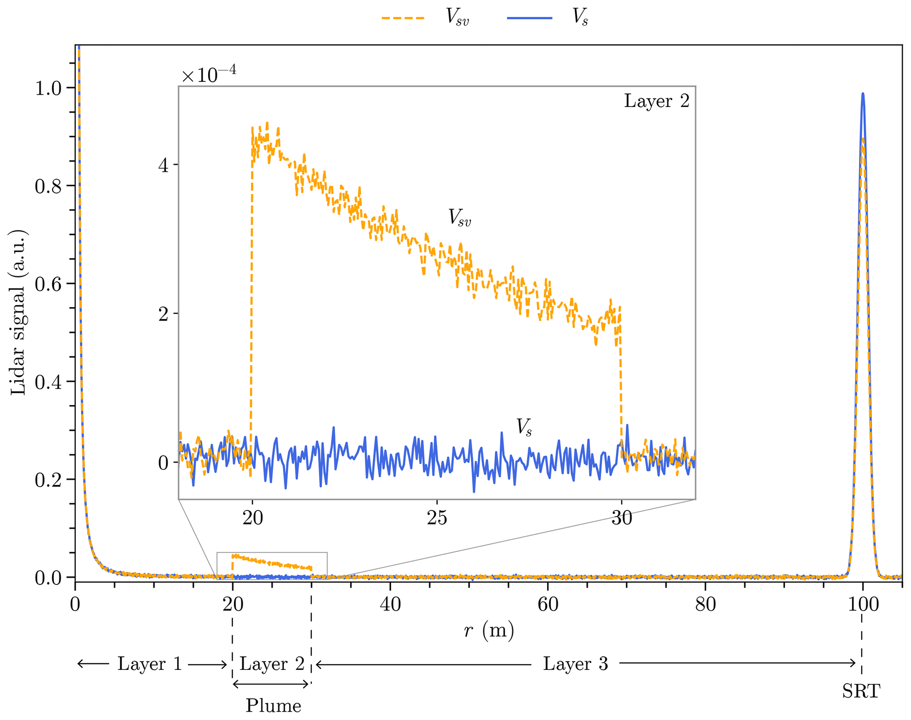

这张图怎么读：

1. 蓝线可以理解成“没有额外羽流时”的参考信号。
2. 橙色虚线可以理解成“路径上多了一层气溶胶羽流后”的信号。
3. 中间放大的小窗最重要，它告诉你真正的差异往往发生在某个局部距离段，而不是整条曲线同时一起变化。
4. 最右边很高的尖峰是表面参考目标回波，小白先不用深究它的光学定义，只要知道它是一个非常强、非常明显的参考峰。

这张图对理解算法特别有用，因为它让你直观看见：

> 算法不是从空气里“凭空算浓度”，而是先从“有无羽流时曲线到底差在哪里”开始读信息。

#### 老师讲课版：这张图不要一上来全看，按顺序拆开看

第 1 步，先只看横轴。

你可以把横轴理解成“离设备有多远”。现在先不要管单位细节，只要知道曲线上的每个位置，都对应前方某个距离段。

第 2 步，再只看蓝线和橙线是不是完全重合。

如果两条线几乎重合，说明有无羽流差别不大；如果某个距离段开始明显分开，就说明那个距离段很可能出现了额外的散射或衰减结构。

第 3 步，再去看中间的小放大窗。

小白最容易忽略的恰恰是这里。作者单独开一个放大窗，就是想告诉你：

1. 真正有业务意义的差异，有时并不大。
2. 但只要它持续出现在同一个距离段，就不能当成随机噪声忽略。
3. 算法后面做差分、做阈值、做识别，本质上就是在盯这种局部但持续的差别。

第 4 步，最后再看最右边的大尖峰。

这个尖峰可以暂时理解成一个很强的参考回波。它提醒你一件重要事实：真实曲线里并不只有羽流信息，还会混着参考目标、边界回波、仪器和场景条件带来的强响应。

所以这张图真正教你的，不只是“橙线比蓝线高一点”，而是下面这句话：

> 算法要做的，是先在整条复杂曲线里找出“哪一段差异是稳定且有物理意义的”，再把这段差异解释成空间中的羽流或颗粒物变化。

如果你再看一张真实测量图，会发现真实世界的曲线比理论图更乱、更粗糙：

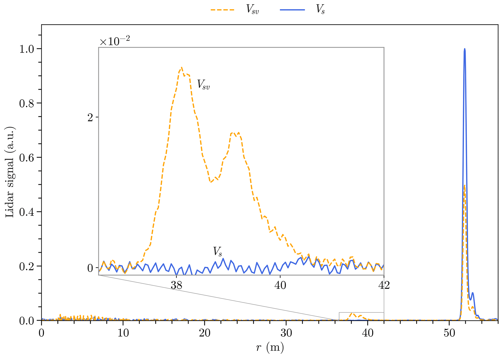

这张真实图最值得你注意的是：

1. 真实曲线不像理想示意图那么平滑。
2. 噪声、小起伏、局部尖峰都会出现。
3. 但只要羽流足够明显，橙线和蓝线在关键距离段仍然会拉开差距。

这正是为什么前面那些背景扣除、平均、SNR、mask 不能省，因为：

> 真实数据永远比教材图更脏，预处理就是把这些脏东西尽量压下去，让真正的羽流差异留下来。

#### 老师讲课版：这张真实图最适合拿来理解“为什么算法必须分步骤做”

你可以按下面这个顺序读：

1. 先不要追求看懂每一个抖动，只先看蓝线和橙线的大体走势。
2. 再问自己：它们在哪一段距离开始出现系统性分离，而不是偶然碰一下就分开。
3. 如果只是单个尖点，很可能是噪声、瞬时扰动或局部异常；如果是一整段范围都分开，就更值得怀疑那里有真实羽流。

对初学者来说，这一步非常关键，因为很多人第一次看真实数据时会犯两个极端错误：

1. 要么把每一个小尖峰都当成真实污染事件。
2. 要么因为曲线太乱，干脆觉得什么也看不出来。

正确的做法是：

> 不看单个点，先看一整段距离里有没有连续、稳定、成片的差异。

这也正是时间平均、空间平均、SNR 门限和质量标志存在的原因。它们不是为了把图修得好看，而是为了帮助你区分“稳定结构”和“随机毛刺”。

如果把它翻译成工程动作，就是：

1. 先压噪声。
2. 再找连续异常距离段。
3. 然后才去做反演和 PM 估算。

来源：Gaudfrin 等人在 Atmospheric Measurement Techniques 2020 的公开论文图，CC BY 4.0，可用于教学说明。

---

## 12. 算法部分展开讲：从回波到消光、PM 和热点

这一节开始，我们不再停留在“知道有哪些算法”，而是逐步讲清楚数据是怎么一步一步被变成业务指标的。

### 12.0 先把 LiDAR 方程看成 4 个功能块

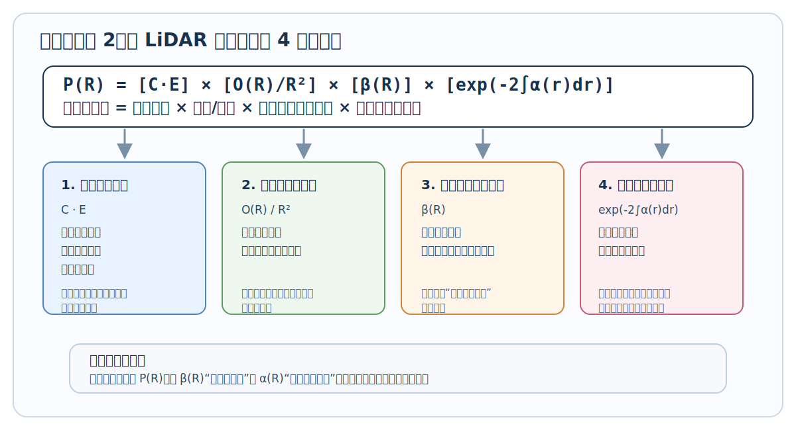

如果你一看到公式就紧张，可以先完全不碰推导，只看这张图。

这张图真正想表达的是：

1. 回波强弱不只取决于颗粒物本身。
2. 仪器强不强、几何扩散大不大、这一层会不会把光打回来、来回路上损耗有多大，都会同时影响结果。
3. 反演之所以难，是因为你只测到了一个回波 $P(R)$，但里面至少混着后向散射和消光这两个未知量。

所以对数学基础弱的读者来说，最重要的不是先背公式，而是先记住这个因果关系：

> 曲线变高，不一定只是颗粒物变多，也可能是仪器、几何或传播条件在变化。

### 12.1 第一个能看的物理量：attenuated backscatter

很多系统不会一上来就展示绝对定标后的 backscatter，而是先展示 attenuated backscatter，也就是“受传播衰减影响的后向散射图层”。

它常常和 RCS 接近，但会带一个整体定标因子：

$$
\beta'_{\mathrm{att}}(R) \propto P(R) R^2
$$

为什么这个量很常见：

1. 它比原始信号更容易看结构。
2. 它不需要立刻把所有绝对标定都做完。
3. 时间-高度图和扫描剖面一般直接用它来做主视觉层。

### 12.2 参考区段为什么重要

Klett/Fernald 不是凭空把所有东西都解出来，它必须有一个边界条件。最常见的做法是在远端选一个相对稳定、相对干净的参考区段 $R_c$。

理想的参考区段通常满足：

1. SNR 还够用。
2. 没有明显浓烟或强尘团。
3. 不在云、雨、雾强回波里。
4. 与分子背景或历史统计更接近。

简单说：

> 你得先找一段“相对可信”的空气，算法才能从这里开始往回推。

### 12.3 Klett/Fernald 到底在算什么

单波长弹性 LiDAR 的难点在于：

1. 后向散射系数 $\beta(R)$ 未知。
2. 消光系数 $\alpha(R)$ 也未知。
3. 只看一条回波曲线，未知量太多。

所以需要引入 lidar ratio：

$$
S = \frac{\alpha_{\mathrm{aerosol}}}{\beta_{\mathrm{aerosol}}}
$$

在很多工程实现里，会假设 $S$ 在一段距离内近似恒定，或者分区段取不同常数。

### 12.4 Klett 反演的连续形式怎么理解

Klett 思路的关键是：

1. 把回波先转换成更适合处理的形式。
2. 给出远端参考边界值。
3. 从参考端往近端递推。

常见写法之一可概念化表示为：

$$
\alpha(r) = \frac{\exp\left[\frac{S(r) - S(R_c)}{k}\right]}{\frac{1}{\alpha(R_c)} + \frac{2}{k}\int_r^{R_c} \exp\left[\frac{S(r') - S(R_c)}{k}\right]dr'}
$$

初学者不一定要马上推导这条式子，但一定要理解它在工程上的逻辑：

1. 先给一个参考端边界值。
2. 把信号和假设的 lidar ratio 结合起来。
3. 再从远端一步一步往回恢复每个距离上的光学量。

如果你对“为什么一定要找参考区段”还是没有直觉，可以先看下面这张图：

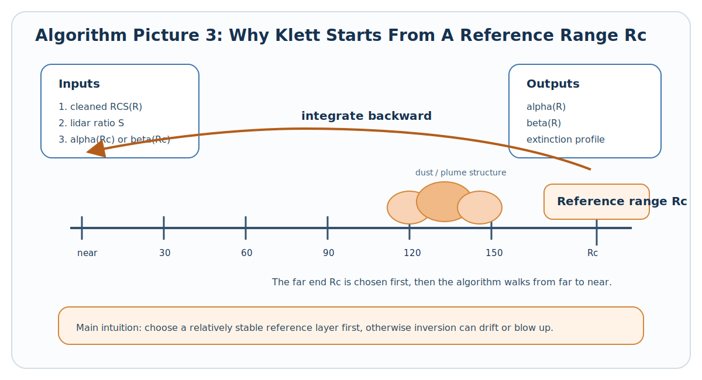

你可以把它理解成：

1. 算法并不是从近处瞎猜到远处。
2. 它通常先在远端找一个相对稳定、相对干净的参考层。
3. 然后从这个参考层往近端一格一格递推。

这也是为什么参考区段选坏了，后面整条反演曲线都会跟着漂。

如果你想看一张“论文作者自己怎么把反演步骤画成流程图”的现成图，可以看这张：

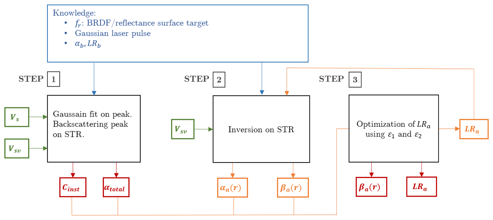

这张图虽然是论文图，但你完全可以把它翻译成人话来读：

1. Step 1：先盯住参考目标或参考峰，把仪器常数和总衰减这类基础量先估出来。
2. Step 2：带着这些基础量，先做一轮初始反演，拿到第一版的后向散射和消光信息。
3. Step 3：继续做优化，让模型生成的信号和真实测到的信号尽量对上。

对数学基础弱的读者来说，这张图最大的价值是让你明白：

> 反演不是一次按下按钮就出结果，而是“先给起点，再算第一版，再不断逼近更合理结果”的过程。

也就是说，Klett / Fernald 这类方法更像“带约束的反推”，而不是普通的直接代公式。

#### 老师讲课版：把这张流程图当成“做一道反推题”的步骤表

你可以把它想成下面这个过程：

1. 先拿到一条真实测得的回波曲线。
2. 但这条曲线里面混着仪器影响、传播损耗和颗粒物信息，不能直接读成浓度。
3. 所以算法必须先给自己找一个起点，也就是参考峰、参考区段或者某种边界条件。
4. 有了这个起点，先做第一版估计。
5. 第一版通常还不够好，所以还要继续比较“算出来的信号”和“真实测到的信号”像不像。
6. 如果还不像，就继续调，直到逼近一个更合理的结果。

如果你把这张图用最朴素的话重讲一遍，其实只有三句话：

1. 先定起点。
2. 再反推中间过程。
3. 最后检查推出来的结果能不能解释原始数据。

这就是为什么很多反演算法看上去公式很复杂，但工程实现时可以理解成一个很直白的闭环：

> 用假设去解释测量，如果解释得不够好，就继续修正假设，直到解释得更合理。

对零基础读者来说，只要你先接受“反演是反推，不是直接测量”，后面的公式就不会那么吓人了。

来源：Gaudfrin 等人在 Atmospheric Measurement Techniques 2020 的公开论文 Figure 2，CC BY 4.0。

### 12.5 离散化后程序到底怎么做

真实软件不会写连续积分，而是按距离分箱递推。

假设距离序列是：

$$
R_0, R_1, \ldots, R_n
$$

每一小段的间隔是：

$$
\Delta R_i = R_{i+1} - R_i
$$

那么程序常做的事就是：

1. 在最远端给定 $\alpha_n$ 或 $\beta_n$。
2. 利用第 $i+1$ 个 bin 的结果，计算第 $i$ 个 bin。
3. 一直往前推到近端。

一个帮助理解的简化版本如下：

```python
import numpy as np

def klett_inversion(rcs, ranges, lidar_ratio, alpha_ref):
    rcs = np.asarray(rcs, dtype=float)
    ranges = np.asarray(ranges, dtype=float)

    alpha = np.zeros_like(rcs)
    beta = np.zeros_like(rcs)

    alpha[-1] = alpha_ref
    beta[-1] = alpha_ref / lidar_ratio

    for i in range(len(ranges) - 2, -1, -1):
        dr = ranges[i + 1] - ranges[i]
        trans = np.exp(-2.0 * alpha[i + 1] * dr)
        beta[i] = max(rcs[i] / max(trans, 1e-12), 1e-12)
        alpha[i] = lidar_ratio * beta[i]

    return alpha, beta
```

这段代码不是严格科研版，但它对初学者有两个好处：

1. 能看清楚“从远往近递推”的结构。
2. 能直观看到 $\alpha$ 和 $\beta$ 是如何互相耦合的。

### 12.6 lidar ratio 对结果影响有多大

这是工程里非常关键的敏感参数。

如果 $S$ 取小了：

1. 算出来的消光偏小。
2. PM 估算可能整体偏低。

如果 $S$ 取大了：

1. 算出来的消光偏大。
2. 远端容易放大噪声。
3. 热点阈值判断可能偏激进。

所以常见做法是：

1. 先给一个行业经验范围。
2. 再根据地面 PM 站和历史样本反调。
3. 必要时按天气类型或源类型分场景取值。

### 12.7 为什么反演前后都要平滑

因为原始噪声在指数运算和递推里很容易被放大。

常见方法有：

1. 距离向滑动平均。
2. 时间向滑动平均。
3. Savitzky-Golay 滤波。
4. 小波或正则化平滑。

原则不是“磨到好看”，而是：

1. 不破坏真实羽流边界。
2. 不放大噪声尖峰。
3. 让结果足够稳定可用于阈值判断。

### 12.8 湿度修正为什么必须进入主流程

颗粒物会吸湿。空气越潮，散射越强，所以只看光学量很容易把“湿了”误判成“浓了”。

常见的工程修正思想可以写成：

$$
\alpha_{\mathrm{dry}}(R) = \alpha(R) \cdot \left[1 - \frac{RH(R)}{100}\right]^\gamma
$$

你可以这样理解：

1. $\alpha(R)$ 是未经干化的光学消光。
2. $RH$ 越高，修正幅度越明显。
3. $\gamma$ 由本地经验决定，不同地区可能不同。

这一步的目的不是把湿度彻底“消灭”，而是尽量让光学量更接近颗粒物本身的干质量特征。

### 12.9 PM2.5 / PM10 估算到底怎么做

在真正做 PM 估算之前，最建议你先把下面这张图看懂：

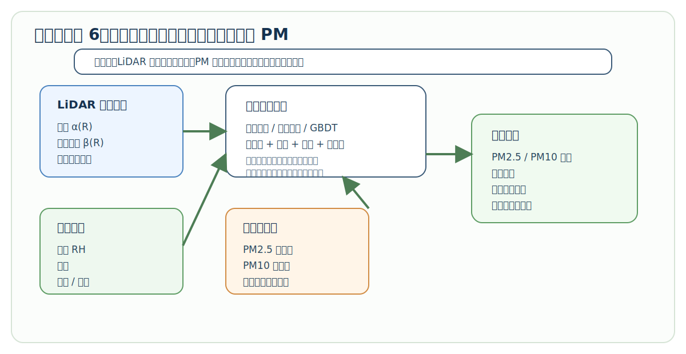

这张图想强调一个对初学者最重要的事实：

1. LiDAR 先测到的是光学响应，不是质量浓度。
2. 光学量要先经过湿度和气象修正。
3. 再结合本地地面 PM 参考站，才能训练出适合这个场地的标定模型。
4. 最后业务系统真正拿去告警和联动的是 PM 地图、热点事件和控制目标，而不是单纯的消光曲线。

如果只记一句话，就是：

> 光学量不等于 PM 质量浓度，中间一定还隔着“本地标定”这一层。

到了这一步，很多初学者以为“有了消光系数就等于有了 PM”。实际上还差最后一层标定。

最简单的经验模型可以写成：

$$
\mathrm{PM}_{2.5} = a \cdot \alpha_{\mathrm{dry}} + b \cdot RH + c \cdot T + d
$$

更完整一点的模型会把多个特征一起送进去：

$$
\mathrm{PM}_{2.5} = f(\alpha, \beta, RH, T, WS, WD, hour, season, aerosol\_type)
$$

其中：

1. $WS$ 是风速。
2. $WD$ 是风向。
3. `hour` 和 `season` 用来吸收日周期和季节性差异。

### 12.10 PM 标定的训练和上线流程

一个实用的工程流程通常是：

1. 取和地面 PM 站时间对齐的数据。
2. 把 LiDAR 的低层若干 range bin 做平均或加权平均。
3. 提取同一时刻的湿度、温度、风速风向。
4. 构造训练样本。
5. 用线性回归、岭回归、随机森林或梯度提升树训练。
6. 留出验证集评估偏差和相关系数。
7. 模型上线后持续监控漂移。

注意一个关键点：

> LiDAR 看到的是一段空间，而地面 PM 站只测一个点，所以训练时必须考虑代表性高度和空间匹配问题。

### 12.11 一个简单但实用的 PM 推理流程

```python
def infer_pm(alpha, beta, rh, temp, wind_speed, model):
    alpha_dry = humidity_correct(alpha, rh)
    features = [alpha_dry, beta, rh, temp, wind_speed]
    return model.predict([features])[0]
```

虽然这段代码很短，但它背后其实对应着完整的数据治理逻辑：

1. 先反演光学量。
2. 再修正湿度。
3. 再和气象量融合。
4. 最后才交给 PM 模型。

### 12.12 怎么从 PM 场里提取热点

当你已经有扫描面的 PM 或消光场之后，热点提取通常分成 4 步：

1. 设阈值，例如 PM2.5 大于某阈值，或消光高于背景均值若干倍标准差。
2. 做形态学清理，去掉孤立噪点。
3. 做连通域分析，把连续高值区域作为一个 plume 或 dust patch。
4. 计算每个连通域的面积、强度、质心、最大值。

如果用加权质心，一个常见写法是：

$$
x_c = \frac{\sum_i w_i x_i}{\sum_i w_i}, \qquad
y_c = \frac{\sum_i w_i y_i}{\sum_i w_i}, \qquad
z_c = \frac{\sum_i w_i z_i}{\sum_i w_i}
$$

这里的 $w_i$ 可以是 PM 值、消光值或后向散射值。

### 12.13 算法链里每个输出分别给谁用

你可以把算法链想成一条加工流水线：

1. L1 给算法工程师和质量控制用。
2. L1.5 给值班人员看 quicklook 和异常。
3. L2 给业务模型和告警系统用。
4. L3 给地图、3D、报表和喷雾联动用。

这意味着不同页面不应该直接乱读底层原始数据，而应该各自消费适合自己的那一级产品。

---

## 13. 从极坐标到地图坐标，再到 UI 图层

前面讲的是“怎么算出光学量和 PM”，这一节讲“怎么算出它到底在空间里的哪个位置”。

### 13.1 激光雷达天然输出的是极坐标

激光雷达最直接测到的是：

1. 距离 $R$。
2. 方位角 azimuth。
3. 仰角 elevation。

也就是说，每一个数据点本质上都是一根射线上的一个小体元，而不是地图上的现成经纬度点。

### 13.2 固定式系统怎么转成 ENU

最常用的本地坐标系就是 ENU：

1. $E$：East，东。
2. $N$：North，北。
3. $U$：Up，天。

最基础的转换公式是：

$$
\begin{aligned}
x &= R \cos(\mathrm{elevation}) \sin(\mathrm{azimuth}) \\
y &= R \cos(\mathrm{elevation}) \cos(\mathrm{azimuth}) \\
z &= R \sin(\mathrm{elevation})
\end{aligned}
$$

这一步做完后，你就可以把每个 range bin 放到本地三维场景里。

下面是一个很基础的转换示意：

```python
import numpy as np

def polar_to_enu(ranges, azimuth, elevation):
    az = np.deg2rad(azimuth)
    el = np.deg2rad(elevation)

    x = ranges * np.cos(el) * np.sin(az)
    y = ranges * np.cos(el) * np.cos(az)
    z = ranges * np.sin(el)
    return x, y, z
```

### 13.3 车载系统为什么要多做一步姿态补偿

如果设备安装在车上，还要再乘上车体姿态矩阵。因为车不是静止平台，它会：

1. 横滚 Roll。
2. 俯仰 Pitch。
3. 航向 Yaw。
4. 随时间移动位置。

所以更完整的空间关系是：

$$
\mathbf{p}_{\mathrm{world}} = \mathbf{t}_{\mathrm{gps}} + \mathbf{R}_{\mathrm{vehicle}} \left(\mathbf{t}_{\mathrm{mount}} + \mathbf{R}_{\mathrm{scanner}} \mathbf{p}_{\mathrm{sensor}}\right)
$$

这里可以这样理解：

1. $\mathbf{p}_{\mathrm{sensor}}$ 是传感器本体坐标下的点。
2. $\mathbf{R}_{\mathrm{scanner}}$ 是扫描头姿态。
3. $\mathbf{t}_{\mathrm{mount}}$ 是安装偏置。
4. $\mathbf{R}_{\mathrm{vehicle}}$ 是车体姿态。
5. $\mathbf{t}_{\mathrm{gps}}$ 是车辆位置。

如果你漏掉其中任何一个量，移动扫描点云都会产生系统性偏差。

### 13.4 为什么还要做网格化

因为 UI 和算法不喜欢直接处理一大堆离散射线点。很多时候你需要把点云落到规则网格上。

例如三维体素索引可以写成：

$$
i = \left\lfloor \frac{x - x_0}{\Delta x} \right\rfloor, \qquad
j = \left\lfloor \frac{y - y_0}{\Delta y} \right\rfloor, \qquad
k = \left\lfloor \frac{z - z_0}{\Delta z} \right\rfloor
$$

然后把同一个体素内的多个点做统计，例如：

1. 平均值。
2. 最大值。
3. 加权平均。
4. 命中次数。

### 13.5 不同页面实际吃什么数据

这是很多项目早期架构里最容易混乱的地方。建议你一开始就把页面和数据层对应清楚。

| 页面 | 主要输入 | 刷新节奏 | 典型显示 |
| --- | --- | --- | --- |
| 时间-高度主图 | L1.5 attenuated backscatter | 1 到 10 秒 | curtain plot |
| RHI/PPI 剖面 | L2 extinction / PM | 每个扫描周期 | 扇区热力图 |
| 3D 页面 | L3 voxel / point cloud | 5 到 30 秒 | 体素、切片、热点 |
| 告警页面 | 热点事件表 | 实时 | 阈值告警、位置、等级 |
| 质量控制页面 | L0 / L1 / SNR / energy | 实时或分钟级 | 原始信号和QA图 |

### 13.6 一个热点事件最终长什么样

平台层真正喜欢消费的不是整条回波，而是一条结构化事件记录，例如：

```json
{
  "event_id": "dust_20260527_102315_001",
  "timestamp": "2026-05-27T10:23:15Z",
  "type": "dust_hotspot",
  "center_enu_m": [85.0, 130.0, 22.5],
  "peak_pm25_ugm3": 186.0,
  "mean_extinction_km_1": 0.42,
  "area_m2": 950.0,
  "confidence": 0.91,
  "recommended_action": "spray"
}
```

你可以看到，这已经不是科研数组，而是业务系统真正能执行动作的结构化对象。

### 13.7 从事件到喷雾联动

当热点事件已经有了质心坐标，后面通常就是：

1. 把 ENU 坐标换成喷雾设备参考坐标。
2. 计算目标方位角和俯仰角。
3. 判断是否在喷雾炮机械行程范围内。
4. 发送控制指令。
5. 继续观测联动后的压尘效果。

所以从软件视角看，一条完整的数据链并不是“画图结束”，而是：

> 原始回波数组 -> 预处理 -> 反演 -> PM 估算 -> 空间定位 -> 热点事件 -> 联动控制 -> 效果评估

---

## 14. 软件到底应该做成什么样，小白先建立正确的 UI 预期

很多人一说到激光雷达 UI，就先想到炫酷 3D 点云。对颗粒物系统来说，这其实不是第一优先级。

真正高频、好用、工程上有效的界面通常是：

1. 时间-高度热力图。
2. 距离-高度剖面图。
3. 地图上的扫描扇区叠加。
4. 当前廓线曲线。
5. 告警列表和设备状态栏。

3D 当然也重要，但通常是第二屏或分析屏，而不是唯一主屏。

### 14.1 你应该从公开软件界面里学什么

主要学 3 件事：

1. 信息组织方式。
2. 图层和质量控制怎么展示。
3. 操作员最常盯的指标到底是什么。

下面这些 UI 图都来自公开资料，已经放进本项目的 assets 目录，可以直接在 Markdown 中查看。

### 14.2 CloudnetPy / Cloudnet 风格：科研型 quicklook

来源：[CloudnetPy quickstart](https://actris-cloudnet.github.io/cloudnetpy/quickstart.html)

这类界面最适合你理解“时间-高度 curtain plot 才是大气遥感系统的主战场”。

典型 LiDAR attenuated backscatter：


怎么看：

1. 横轴通常是时间。
2. 纵轴通常是高度。
3. 颜色表示后向散射强弱。
4. 一整天的污染层抬升、云底变化、低层气溶胶累积都能直接看出来。

目标分类图：

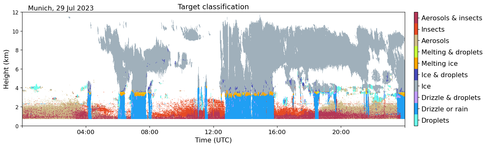

怎么看：

1. 不同颜色不是“浓淡”，而是不同目标类型。
2. 这类图特别适合未来加入云、雾、雨、昆虫、沙尘等质量控制标签。
3. 对颗粒物系统来说，它能启发你做“有效数据”和“无效数据”的分层展示。

多仪器联合 quicklook：

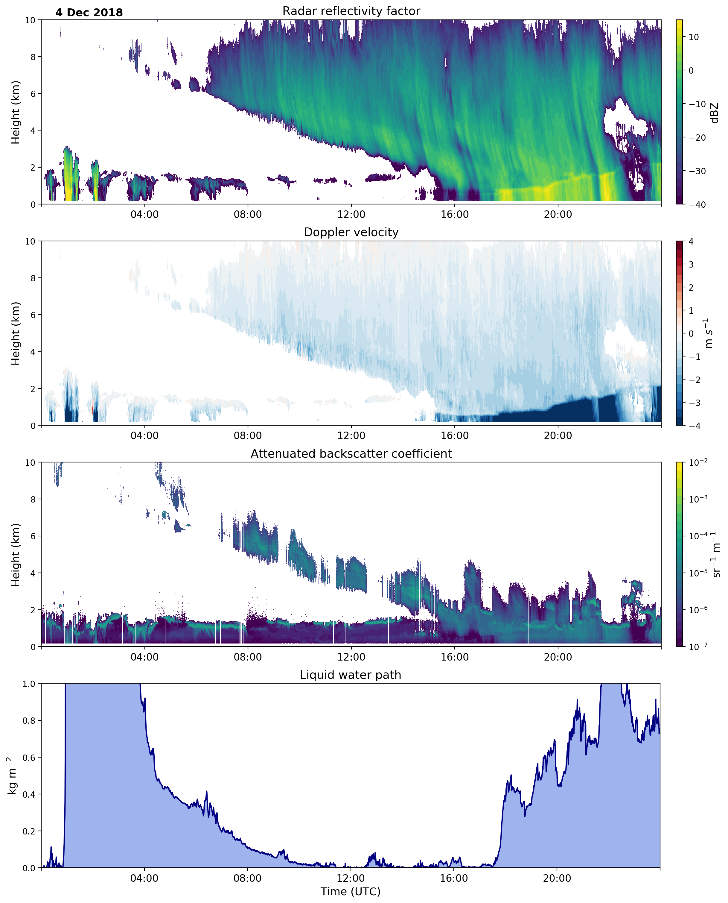

怎么看：

1. 同一时间轴上放多个产品，判断效率会高很多。
2. 平台不应该只有一张图，而应该让用户能同时看回波、气象、质量标志和算法结果。

### 14.3 Vaisala BL-View 风格：运维值守型 UI

来源：[Vaisala BL-View 文档](https://docs.vaisala.com/r/M211185EN-E/en-US/GUID-EF63D824-E0FA-437C-A1F8-FCFC6DFDADD7)

BL-View 主界面：


归档图界面：

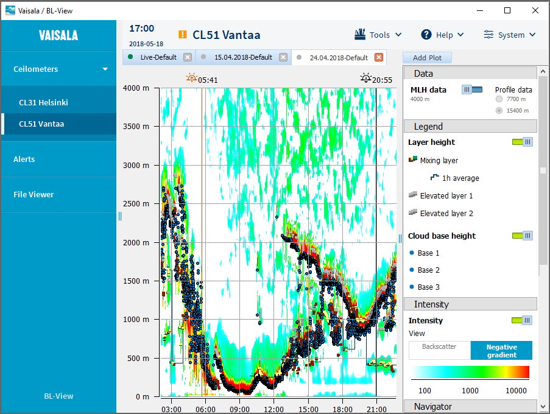

这两张图给你的启发：

1. 顶部状态栏非常重要，不能只顾画图，不顾设备状态。
2. 业务系统必须同时支持实时查看和历史回放。
3. 告警、数据延迟、设备健康度应该一直可见。

### 14.4 Vaisala CL61 风格：颗粒物业务最接近的显示形态

来源：[Vaisala CL61 文档](https://docs.vaisala.com/r/M212721EN-D/en-US/GUID-34D2DC29-AC43-404F-9F80-3199EF7F9E36)

CL61 后向散射图：

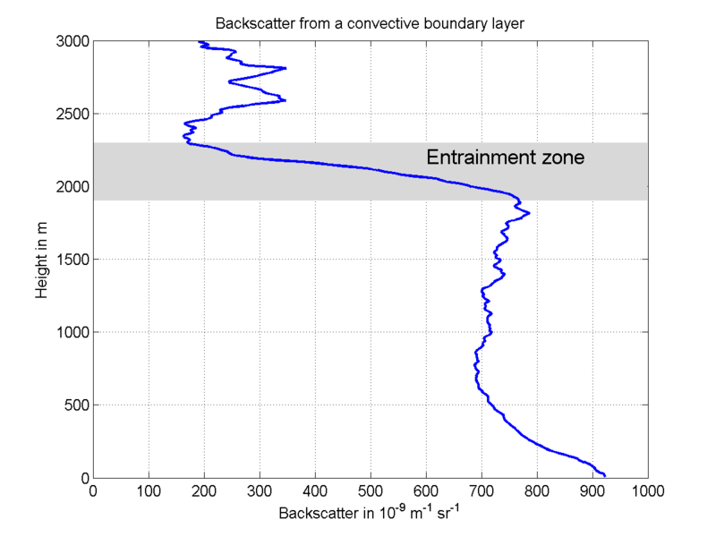

为什么这张图特别值得参考：

1. 它和颗粒物遥感的主图形态几乎一致。
2. 颜色直接表达强弱，非常适合业务用户。
3. 上面可以继续叠加云底、污染层顶、边界层高度、质量标志线。

### 14.5 如果做自己的系统，建议至少有 4 个页面

#### 页面 1：实时总览

应该包含：

1. 站点和设备状态栏。
2. 当前风速风向、湿度、温度。
3. 时间-高度热力图。
4. 当前时刻垂直廓线。
5. 当前告警列表。

#### 页面 2：扫描剖面

应该包含：

1. RHI 距离-高度剖面。
2. PPI 扫描扇区图。
3. 产品切换：RCS、消光、PM2.5、PM10、depol。
4. 风场和污染源叠加。

#### 页面 3：三维空间页面

应该包含：

1. 本地底图或三维地形。
2. ENU 点云或体素。
3. 热点质心位置。
4. 时间轴播放控件。
5. 地面站和喷雾设备位置。

#### 页面 4：质量控制与标定页面

应该包含：

1. 原始信号。
2. 背景值和发射能量趋势。
3. SNR 与异常标志。
4. 地面 PM 对比散点图。
5. 模型漂移和误差统计。

### 14.6 如果最后软件要用 Qt + OpenGL，这几类公开界面最值得参考

你这次明确提到“最终做成 Qt + OpenGL 的软件”，那参考图就不能只看气象 quicklook 了，还要看真正的桌面软件形态。

最值得参考的是下面 3 类：

1. CloudCompare 这种“左侧对象树 + 中间 OpenGL 三维视图 + 底部日志”的三维分析界面。
2. QGIS 这种“左侧图层树 + 中间地图画布 + 右侧属性面板”的 GIS 业务界面。
3. 把两者结合起来，做成“实时监控主屏偏 2D，分析页面偏 3D”的工业上位机。

如果你现在看到的是 Markdown 源码编辑区，而不是预览面板，那么下面这些图片不会像 Word 那样直接展开，这是正常现象。要看渲染后的图片，请打开 Markdown 预览。

#### 参考图 1：CloudCompare 主界面

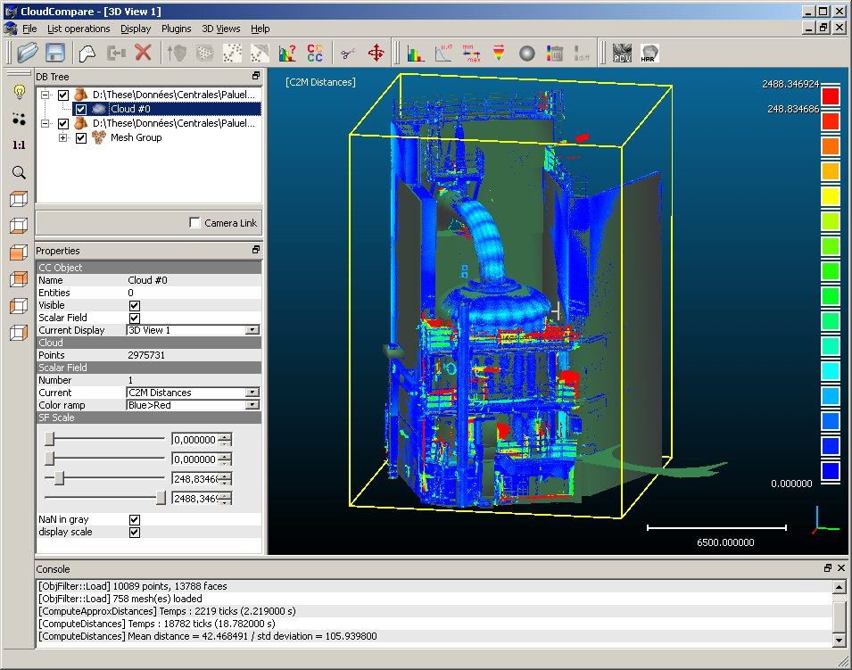

原图链接：[CloudCompare 主界面快照](assets/qt_ui_refs/cloudcompare_snapshot.jpg)

这张图最值得学的不是配色，而是结构：

1. 左侧是对象树，适合放扫描任务、图层、热点、设备和历史结果。
2. 中间是 OpenGL 主视口，适合放 ENU 点云、体素、PPI 扇面、RHI 剖面和热点质心。
3. 右侧色标告诉你当前颜色到底代表什么物理量，这对 PM、消光、SNR 特别重要。
4. 底部日志区非常实用，适合放设备连接状态、数据延迟、算法异常和控制回执。

如果把它翻译成你的项目，就是：

> 一定要把“图层树”“主视口”“色标”“日志/状态栏”做成固定骨架，而不是只有一块大画布。

来源：CloudCompare 官方介绍页。官方页面明确写明 CloudCompare 依赖 Qt 和 OpenGL，这张图很适合拿来理解 Qt 桌面软件的典型布局。

#### 参考图 2：QGIS 风格的业务应用界面


原图链接：[QGIS 业务应用界面](assets/qt_ui_refs/qgis_workflow_app.png)

这张图更接近“工业上位机”的日常工作状态，因为它不是只展示结果，而是把工具、图层、主画布和底部操作区全部放在一个窗口里。

你重点看 4 个位置：

1. 左侧图层树：适合放底图、道路、工地边界、喷雾炮、雷达站位、热点区域。
2. 中间地图区：适合放 PPI 扫描扇区、热点多边形、风向箭头、历史轨迹。
3. 顶部工具栏：适合放开始扫描、暂停、回放、阈值切换、联动开关。
4. 底部参数区：适合放当前目标角、选中区域属性、设备控制参数。

对你的系统来说，这张图最有启发的一点是：

> 真正高频使用的主屏通常不是纯 3D，而是“地图 + 图层 + 参数区 + 状态区”的组合界面。

来源：QGIS Hub 截图页，CC0。

#### 参考图 3：QGIS 风格的地图主屏 + 侧边样式面板

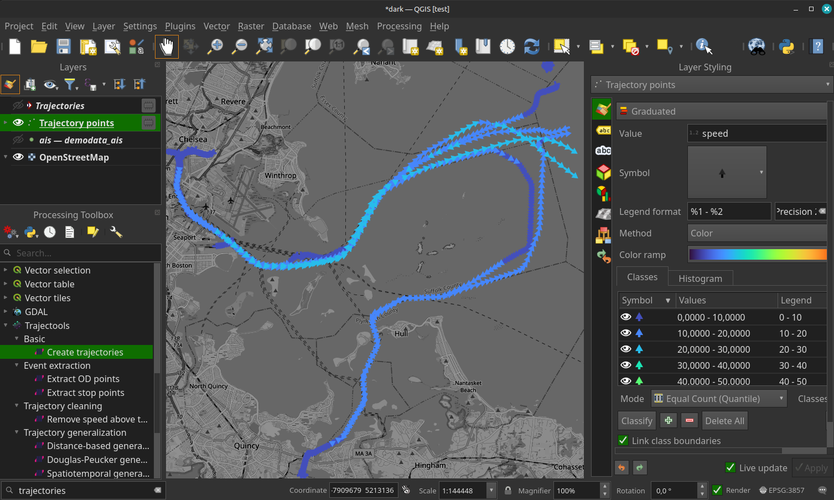

原图链接：[QGIS 深色地图主屏](assets/qt_ui_refs/qgis_dark_mode.png)

这张图适合拿来理解“分析屏”应该怎么布局：

1. 左边可以是事件树、历史任务树、算法工具箱。
2. 中间是主地图或主剖面区。
3. 右边是样式和阈值面板，适合放颜色表、量程、阈值、图层透明度。

这对颗粒物系统特别重要，因为同一份数据常常要切换成不同显示模式：

1. RCS。
2. 消光系数。
3. PM2.5。
4. PM10。
5. SNR。
6. 告警 mask。

如果没有右侧这种随时可调的样式面板，值班人员很难快速把图调到“看得出问题”的状态。

来源：QGIS Hub 截图页，CC0。

#### 参考图 4：OpenGL 实时渲染效果为什么重要

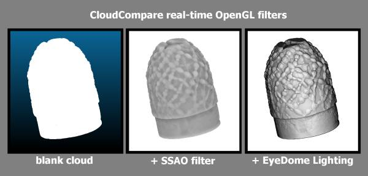

原图链接：[CloudCompare OpenGL filters](assets/qt_ui_refs/cloudcompare_gl_filters.jpg)

这张图虽然不是完整软件界面，但它很适合解释一个工程事实：

1. 同一份三维数据，渲染方式不同，视觉可读性会差很多。
2. 如果没有基本的阴影、边缘增强或深度感，三维点云会很平，值班人员不容易看清结构。
3. 所以 OpenGL 在这套软件里不只是“为了炫酷”，而是为了把三维结构看清楚。

来源：CloudCompare 官方介绍页中的 OpenGL filters 示例图。

### 14.7 最推荐的落地路线：Qt Widgets 做外壳，OpenGL 做高性能视图内核

如果你的目标是工业上位机，而不是做一个偏展示的概念 Demo，我更推荐：

1. Qt Widgets 负责主窗口、菜单、停靠面板、表格、参数页、设备状态页。
2. QOpenGLWidget 负责时间高度图、PPI、RHI、地图叠加和三维场景。
3. 曲线和表格继续用 Qt 原生控件或成熟绘图库，不要强行全都塞进 3D 引擎。

这样选的原因很现实：

1. QMainWindow + QDockWidget 很适合做工业软件常见的多面板布局。
2. OpenGL 只处理真正需要高刷新的图形层，性能和维护成本更平衡。
3. 参数配置、日志、设备树、告警表这些内容，用 Widgets 比 QML 或纯 OpenGL 更稳。

如果用一句话概括这条路线，就是：

> 外壳用 Qt 桌面软件的成熟能力，重图形区域再交给 OpenGL，不要把所有事情都变成三维渲染问题。

### 14.8 软件模块建议怎么拆

下面这张表是比较适合 MVP 到工程版演进的拆法：

| 模块 | 推荐技术 | 作用 |
| --- | --- | --- |
| 主窗口 AppShell | QMainWindow + QDockWidget + QSplitter | 组织页面、停靠面板、工具栏、状态栏 |
| 数据接入层 | QTcpSocket / QUdpSocket / QSerialPort / QThread | 接 LiDAR、气象站、GPS、IMU、喷雾炮控制器 |
| 算法调度层 | QObject worker + 线程池 | 背景扣除、RCS、Klett/Fernald、PM 标定、热点检测 |
| 产品缓存层 | 环形缓冲区 + 快照对象 | 给 UI 提供稳定的 L1/L2/L3 产品快照 |
| 2D 图层视图 | QOpenGLWidget | 时间高度图、PPI、RHI、热力图、地图叠加 |
| 3D 视图 | QOpenGLWidget | ENU 点云、体素、热点质心、喷雾方向线 |
| 曲线与表格 | QTableView + QTreeView + 绘图库 | 当前廓线、设备状态、告警列表、误差统计 |
| 回放与归档 | SQLite / 文件索引 / 时间轴控件 | 历史查询、事件回放、前后对比 |
| 联动控制层 | 命令服务 + 状态回执 | 向喷雾炮、云台、继电器发送控制指令 |

你可以把它理解成 3 层：

1. 下层负责收数据和发命令。
2. 中层负责把原始数据变成产品。
3. 上层负责把产品画出来，并让人能操作。

### 14.9 线程和数据流一定要这样设计，UI 才不会卡死

Qt + OpenGL 软件最容易犯的错，就是一边采数据、一边算算法、一边在 UI 线程里直接画原始数组。这样数据一大，界面就会卡。

更合理的结构应该是：

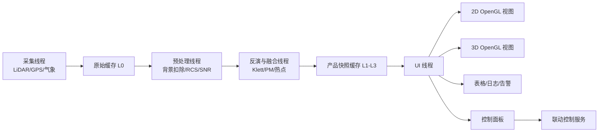

你要特别记住 4 条工程规则：

1. QOpenGLWidget 的真正绘制发生在 UI 线程，不要在工作线程里直接碰 OpenGL 上下文。
2. 算法线程只生产“产品快照”，不要直接操作界面控件。
3. UI 线程只消费最新快照，不回头扫大批历史原始数据。
4. 采集、算法、UI 之间尽量用 signal/slot 的队列连接或线程安全队列隔开。

也就是说：

> 算法线程负责算，UI 线程负责看，控制线程负责发命令，三者不要混在一起。

### 14.10 每一种图在 OpenGL 里分别怎么画

#### 视图 1：时间-高度图

这个视图最适合做成一张持续刷新的二维纹理：

1. 横轴是时间列。
2. 纵轴是距离或高度 bin。
3. 每来一条新 profile，就更新一列像素。
4. 颜色映射由 shader 或颜色查找表完成。

工程上最常用的做法是：

1. CPU 先把当前产品整理成浮点矩阵。
2. 再上传成 OpenGL texture。
3. 最后由 fragment shader 按色标显示。

这样做的好处是，哪怕矩阵比较大，滚动显示也比用普通 QWidget 一格一格画快得多。

#### 视图 2：PPI 和 RHI

PPI 和 RHI 有两条实现路线：

1. 简单路线：先在 CPU 上把极坐标重采样到规则网格，再当作二维纹理画出来。
2. 进阶路线：直接在 GPU 上按射线和距离插值，实时生成扇形或剖面图层。

如果是你现在这个项目，我建议先走简单路线，因为：

1. 更容易调试。
2. 算法和显示更容易对齐。
3. 出问题时更容易检查是哪一步错了。

等到 MVP 稳定以后，再考虑把极坐标插值搬到 GPU。

#### 视图 3：地图叠加层

地图页不要直接把所有东西都做成三维。更实用的做法是：

1. 底图作为纹理或瓦片图层。
2. 热点多边形、扫描扇区、设备图标、风向箭头作为叠加图层。
3. 选中某个热点后，在右侧面板显示区域面积、均值、峰值和持续时间。

这类图层最关键的不是炫酷，而是坐标准确。你必须把下面这些对象统一到同一坐标系里：

1. 雷达位置。
2. GPS/IMU 姿态。
3. ENU 结果点。
4. 底图坐标。
5. 喷雾炮目标角。

#### 视图 4：三维点云和体素场

三维视图建议只承担 4 件事：

1. 看热点空间位置。
2. 看喷雾方向和热点是否对准。
3. 看扫描覆盖范围。
4. 做事后分析和回放。

实现时可以这样理解：

1. 点云模式用 VBO 存点坐标和颜色。
2. 体素模式用 instancing 或立方体批量绘制。
3. 色标统一由 PM、消光或 backscatter 对应的查找表控制。
4. 鼠标点击用 picking 或射线相交，拿到选中点或选中体素。

#### 视图 5：当前廓线和质量控制曲线

这一类图不一定非要 OpenGL。更现实的选择是：

1. 用普通 2D 绘图库画当前 profile。
2. 用表格控件画告警和日志。
3. 让 OpenGL 重点负责热力图、地图和三维场景。

这样分工更稳，也更容易维护。

### 14.11 真正做工程时，页面建议这样拆

如果最后软件要能上线值守，我建议页面按“主屏看态势，副屏做分析”来拆：

1. 实时总览页：时间高度图、当前风场、告警列表、设备状态。
2. 扫描页：PPI、RHI、扇区热力图、扫描参数。
3. 地图联动页：底图、热点区、喷雾炮方向、联动按钮。
4. 三维分析页：ENU 点云、体素、热点轨迹、时间轴回放。
5. 质量控制页：原始信号、能量趋势、背景、SNR、标定散点图。

这样拆的好处是：

1. 值班人员有主屏可看。
2. 算法人员有分析页可查。
3. 运维人员有质量页可排错。
4. 领导或客户演示时也有一页看起来足够直观。

### 14.12 一个现实可落地的 Qt + OpenGL 开发顺序

如果你们现在准备开始做软件，我建议按下面顺序推进，而不是一开始就做全功能三维系统：

1. 第一步先搭 Qt 主窗口、菜单、状态栏和停靠面板。
2. 第二步先做时间高度图和当前廓线，这样最容易尽快看到成果。
3. 第三步再做 PPI/RHI 和地图叠加。
4. 第四步补三维 ENU 场景和热点选中。
5. 第五步再接历史回放、告警管理和喷雾联动。

这样推进的原因很简单：

1. 最先有业务价值的是 quicklook、剖面和地图页。
2. 三维页很重要，但通常不是 MVP 最先证明价值的页面。
3. 如果一开始就把大量时间砸在 3D 特效上，反而容易把真正关键的数据链和联动控制拖慢。

---

## 15. 一个最现实的工程闭环是什么样

如果把“发现扬尘热点并自动处置”作为目标，完整链条可以是：

1. 固定式 LiDAR 连续扫描工地区域。
2. 算法识别高消光或高 PM 估算区域。
3. 系统把该区域转成 ENU 或地理坐标。
4. 平台判断热点是否持续存在、是否超过阈值。
5. 如果满足条件，向喷雾炮发送目标方位角和俯仰角。
6. 喷雾炮执行定向喷雾。
7. LiDAR 继续观测处理后的变化，评估压尘效果。

这个闭环里最重要的不是某一个公式，而是下面 3 个点：

1. 热点识别要稳，不能乱报。
2. 坐标映射要准，不然喷错方向。
3. UI 要能让值班人员一眼看懂“为什么报、报在哪里、有没有压下去”。

---

## 16. 两周 MVP 应该怎么排，不要一开始就铺太大

### 第 1 周：先把数据链跑通

目标：

1. 打通原始采集或样例数据导入。
2. 完成背景扣除、RCS、基础质量控制。
3. 做出时间-高度图和单帧廓线图。
4. 接一个地面 PM 参考站。

第 1 周做到这一步，其实已经能演示“设备能看见颗粒物结构变化”。

### 第 2 周：再把业务闭环补上

目标：

1. 加入 Klett/Fernald 的简化版 L2 产品。
2. 做湿度修正和简单 PM 标定。
3. 把扫描数据转到 ENU 坐标。
4. 在地图或 3D 页面上画出热点。
5. 输出告警和喷雾炮控制目标点。

两周 MVP 的核心不是追求“科研终极精度”，而是证明下面这件事成立：

> 这套系统能够稳定发现工地或道路上的粉尘热点，并在软件上看见、定位、记录、联动处置。

---

## 17. 小白最容易掉进去的坑

1. 以为回波强就一定等于 PM 高。
2. 以为只要有激光器就能做系统。
3. 以为 3D 页面一定比 2D 页面更重要。
4. 以为一开始就要追求气体 DIAL。
5. 以为不需要地面参考仪也能做绝对定量。
6. 以为不做 overlap 校正也没关系。
7. 以为湿度影响可以忽略。
8. 以为算法准确就等于工程可用，忽略状态监控和质量控制。

---

## 18. 你现在应该先记住哪几句话

如果今天只能带走 6 句话，那就记住这 6 句：

1. 大气颗粒物激光雷达测到的首先是光学回波，不是直接称重。
2. LiDAR 方程里最重要的是“这一层会不会把光打回来”和“整条路径把光吃掉了多少”。
3. 单波长弹性 LiDAR 不能凭一条曲线把所有未知量直接解出来，所以需要假设和标定。
4. 工地扬尘第一版最现实的路线是弹性 Mie 后向散射，不是 DIAL 气体方案。
5. 真正高频使用的 UI 往往是时间-高度图、剖面图、地图扇区图，而不是只有炫酷 3D。
6. 工程价值来自“发现热点、准确定位、闭环联动、持续评估”，不是只生成一张漂亮图片。

---

## 19. 一个完整算例：从原始回波到热点告警

前面讲了很多概念和算法，现在用一组简化的假数据，把整条链路真正走一遍。你可以把这一节当成“把前面所有内容串起来的练习题”。

这组数据不是某台真实设备的标定结果，所以它不用于科研发表，但非常适合建立工程直觉。

### 19.1 先设定一个具体场景

假设我们有一台固定式颗粒物 LiDAR，装在工地高点平台上：

1. 设备安装高度为 18 m。
2. 当前在看一个固定方位附近的低仰角扫描。
3. 距离分辨率为 30 m。
4. 我们先只看一条射线上的 6 个 range bin。
5. 然后再把这条射线扩展成一个小扫描扇面，最后提取热点。

为了便于说明，先定义 6 个距离 bin：

$$
R = [30, 60, 90, 120, 150, 180]\ \mathrm{m}
$$

原始 photon counts 假设如下：

$$
P_{\mathrm{raw}} = [34, 38, 55, 110, 82, 45]
$$

同时假设：

1. 远端背景均值 $B = 20$ counts。
2. 这一帧的激光单脉冲能量 $E = 2.0\ \mathrm{mJ}$。
3. overlap 曲线在近距离不完整：

$$
O(R) = [0.40, 0.70, 0.90, 1.00, 1.00, 1.00]
$$

### 19.2 第一步：背景扣除

背景扣除公式是：

$$
P_1(R) = P_{\mathrm{raw}}(R) - B
$$

带入这组数据后：

$$
P_1 = [14, 18, 35, 90, 62, 25]
$$

这里最值得注意的是：

1. 原始 34 counts 并不表示有 34 counts 都来自目标。
2. 其中有 20 counts 只是背景底噪。
3. 真正属于目标回波的只有扣背景之后的部分。

你可以把这一步理解成：

> 先把房间里的环境光关掉，再看手电筒真正照到了什么。

### 19.3 第二步：发射能量归一化

能量归一化公式是：

$$
P_2(R) = \frac{P_1(R)}{E}
$$

带入 $E = 2.0\ \mathrm{mJ}$ 后：

$$
P_2 = [7.00, 9.00, 17.50, 45.00, 31.00, 12.50]
$$

单位你可以先理解成“每毫焦对应的计数”。

为什么这一步不能省：

1. 因为不同脉冲的发射能量会抖动。
2. 不归一化的话，两帧之间的差别不一定来自空气变化，也可能只是激光器输出变强或变弱。

### 19.4 第三步：overlap 校正

现在把近距离重叠不完整的问题补回来：

$$
P_3(R) = \frac{P_2(R)}{O(R)}
$$

计算后得到：

$$
P_3 \approx [17.50, 12.86, 19.44, 45.00, 31.00, 12.50]
$$

这一步有一个很重要的现象：

1. 30 m 处本来只有 7.00。
2. 但因为 overlap 只有 0.40，校正后变成了 17.50。

这说明近距离如果不做 overlap 校正，近端粉尘会被严重低估。

### 19.5 第四步：RCS 距离平方校正

距离平方校正公式：

$$
\mathrm{RCS}(R) = P_3(R) R^2
$$

把每个距离 bin 算出来：

| 距离 R (m) | 原始计数 Praw | 扣背景后 P1 | 能量归一化 P2 | overlap 校正后 P3 | RCS |
| --- | --- | --- | --- | --- | --- |
| 30 | 34 | 14 | 7.00 | 17.50 | 15750 |
| 60 | 38 | 18 | 9.00 | 12.86 | 46296 |
| 90 | 55 | 35 | 17.50 | 19.44 | 157464 |
| 120 | 110 | 90 | 45.00 | 45.00 | 648000 |
| 150 | 82 | 62 | 31.00 | 31.00 | 697500 |
| 180 | 45 | 25 | 12.50 | 12.50 | 405000 |

从这个表里你可以立刻看到两件事：

1. 120 m 到 150 m 之间是这条射线里最显著的高回波区。
2. 150 m 的 RCS 比 120 m 还高，说明那里可能仍然存在明显颗粒物结构。

但注意，这里还不能直接说“150 m 的 PM 一定最高”，因为传播衰减还没有真正被反演掉。

### 19.6 第五步：给 Klett/Fernald 反演准备边界条件

现在开始做反演。我们先给出一个工程上常见的简化假设：

1. 取 lidar ratio $S = 45\ \mathrm{sr}$。
2. 取最远端 180 m 作为参考 bin。
3. 假设参考端消光系数：

$$
\alpha_{\mathrm{ref}} = 0.18\ \mathrm{km}^{-1}
$$

这相当于告诉算法：

> 最远端那一格我先给你一个可接受的起点，你从这里往回推。

### 19.7 第六步：做一个简化版 Klett 反演

为了便于教学，我们直接给出这组假数据经过简化递推后的结果。你可以把它理解成“程序已经根据 RCS、边界条件和 lidar ratio 算好的输出”。

| 距离 R (m) | backscatter $\beta$ ($\mathrm{km}^{-1}\ \mathrm{sr}^{-1}$) | extinction $\alpha = S\beta$ ($\mathrm{km}^{-1}$) |
| --- | --- | --- |
| 30 | 0.0019 | 0.086 |
| 60 | 0.0022 | 0.099 |
| 90 | 0.0030 | 0.135 |
| 120 | 0.0063 | 0.284 |
| 150 | 0.0051 | 0.230 |
| 180 | 0.0040 | 0.180 |

这里的结果比单看 RCS 更有物理意义，因为它试图把双程传播衰减的影响部分剥离掉。

从结果上看：

1. 120 m 的消光系数最高。
2. 150 m 也仍然偏高。
3. 说明这条射线上真正的主污染区大致位于 120 m 到 150 m。

这就是为什么：

> 你不能只看 RCS 或颜色深浅，而必须通过反演去判断真正的光学浓度结构。

### 19.8 第七步：加入湿度修正

现在假设这条路径上的相对湿度随距离略有变化：

$$
RH = [72, 74, 76, 78, 80, 82]\ \%
$$

并且取吸湿增长经验参数：

$$
\gamma = 0.45
$$

湿度修正公式：

$$
\alpha_{\mathrm{dry}}(R) = \alpha(R) \cdot \left[1 - \frac{RH(R)}{100}\right]^\gamma
$$

计算后得到：

| 距离 R (m) | 原始消光 $\alpha$ | RH (%) | 干态消光 $\alpha_{\mathrm{dry}}$ |
| --- | --- | --- | --- |
| 30 | 0.086 | 72 | 0.048 |
| 60 | 0.099 | 74 | 0.054 |
| 90 | 0.135 | 76 | 0.071 |
| 120 | 0.284 | 78 | 0.144 |
| 150 | 0.230 | 80 | 0.112 |
| 180 | 0.180 | 82 | 0.083 |

这个表最值得你注意的点是：

1. 所有点的消光都下降了。
2. 120 m 仍然是最高值。
3. 说明它的高值不只是“湿度太大造成的虚高”，而是真有明显颗粒物结构。

### 19.9 第八步：把干态消光转成 PM2.5 / PM10

为了教学简单，我们先用一个非常朴素的线性模型：

$$
\mathrm{PM}_{2.5} = 500 \cdot \alpha_{\mathrm{dry}} + 10
$$

再假设：

$$
\mathrm{PM}_{10} = 1.6 \cdot \mathrm{PM}_{2.5}
$$

注意：这只是教学用经验关系，真实项目里必须用本地标定模型替代。

带入后得到：

| 距离 R (m) | 干态消光 $\alpha_{\mathrm{dry}}$ | PM2.5 ($\mu g/m^3$) | PM10 ($\mu g/m^3$) |
| --- | --- | --- | --- |
| 30 | 0.048 | 34.0 | 54.4 |
| 60 | 0.054 | 37.0 | 59.2 |
| 90 | 0.071 | 45.5 | 72.8 |
| 120 | 0.144 | 82.0 | 131.2 |
| 150 | 0.112 | 66.0 | 105.6 |
| 180 | 0.083 | 51.5 | 82.4 |

如果我们把热点阈值设成：

$$
\mathrm{PM}_{2.5} > 60\ \mu g/m^3
$$

那么这条射线上会有两个连续高值 bin：

1. 120 m。
2. 150 m。

到这里为止，你已经从一条原始回波数组，走到了“这条射线上的高污染区在哪里”。

### 19.10 第九步：把单条射线扩展成一个小扫描扇面

现在我们不只看一条射线，而是假设相邻两个方位角也扫到了类似高值。为了简化说明，只取 4 个热点点元：

| 点编号 | 方位角 (deg) | 仰角 (deg) | 距离 R (m) | PM2.5 |
| --- | --- | --- | --- | --- |
| A | 40 | 10 | 120 | 82 |
| B | 40 | 10 | 150 | 66 |
| C | 42 | 10 | 120 | 79 |
| D | 42 | 10 | 150 | 63 |

这些点说明：

1. 高值区不只出现在一条射线上。
2. 它已经在相邻扫描角里形成了一个连续的二维小斑块。
3. 这就具备了“提取热点区域”的基础。

### 19.11 第十步：把热点点元转成 ENU 坐标

仍然使用固定式系统的 ENU 公式：

$$
\begin{aligned}
x &= R \cos(\mathrm{elevation}) \sin(\mathrm{azimuth}) \\
y &= R \cos(\mathrm{elevation}) \cos(\mathrm{azimuth}) \\
z &= R \sin(\mathrm{elevation})
\end{aligned}
$$

算出来的近似结果如下：

| 点编号 | ENU x (m) | ENU y (m) | ENU z (m) | 权重 PM2.5 |
| --- | --- | --- | --- | --- |
| A | 75.9 | 90.5 | 20.8 | 82 |
| B | 94.9 | 113.2 | 26.0 | 66 |
| C | 79.0 | 87.8 | 20.8 | 79 |
| D | 98.8 | 109.7 | 26.0 | 63 |

此时这些点已经不是抽象的“第几个 bin”，而是真正的空间点。

### 19.12 第十一步：计算热点质心

如果用 PM2.5 做权重，那么热点加权质心公式是：

$$
x_c = \frac{\sum_i w_i x_i}{\sum_i w_i}, \qquad
y_c = \frac{\sum_i w_i y_i}{\sum_i w_i}, \qquad
z_c = \frac{\sum_i w_i z_i}{\sum_i w_i}
$$

带入 A、B、C、D 四个点之后，可以得到近似质心：

$$
(x_c, y_c, z_c) \approx (86.1, 99.1, 23.2)\ \mathrm{m}
$$

这意味着什么？

意思是如果你要驱动一个喷雾炮去瞄准这个热点，那么它最值得优先瞄准的位置，不是 A、B、C、D 某一个点，而是这个加权质心附近。

### 19.13 第十二步：把质心转成控制目标

对于固定式喷雾炮，平台通常还要继续算两个量：

1. 水平距离。
2. 控制方位角和俯仰角。

水平距离：

$$
R_{\mathrm{horizontal}} = \sqrt{x_c^2 + y_c^2} \approx 131.2\ \mathrm{m}
$$

目标方位角近似为：

$$
    heta = \arctan\left(\frac{x_c}{y_c}\right) \approx 41^\circ
$$

目标仰角近似为：

$$
\phi = \arctan\left(\frac{z_c}{R_{\mathrm{horizontal}}}\right) \approx 10^\circ
$$

这个结果很合理，因为它正好落在前面 40 到 42 度、10 度仰角那一小片高值区中间。

### 19.14 第十三步：形成热点事件记录

到平台层，通常会把它整理成一条可消费事件：

```json
{
    "event_id": "dust_demo_001",
    "timestamp": "2026-05-27T10:23:15Z",
    "type": "dust_hotspot",
    "center_enu_m": [86.1, 99.1, 23.2],
    "target_azimuth_deg": 41.0,
    "target_elevation_deg": 10.0,
    "peak_pm25_ugm3": 82.0,
    "mean_pm25_ugm3": 72.5,
    "recommended_action": "spray"
}
```

此时这条数据已经非常适合：

1. 给前端画告警卡片。
2. 给地图画一个热点标记。
3. 给喷雾联动模块发控制指令。
4. 给报表系统留痕。

### 19.15 用一段代码把这个算例串起来

下面是一段非常简化但逻辑完整的示意代码，用来把这一节的算例串起来：

```python
import numpy as np

ranges = np.array([30, 60, 90, 120, 150, 180], dtype=float)
raw_counts = np.array([34, 38, 55, 110, 82, 45], dtype=float)
background = 20.0
laser_energy = 2.0
overlap = np.array([0.40, 0.70, 0.90, 1.00, 1.00, 1.00], dtype=float)
rh = np.array([72, 74, 76, 78, 80, 82], dtype=float)

signal_bg = raw_counts - background
signal_norm = signal_bg / laser_energy
signal_overlap = signal_norm / overlap
rcs = signal_overlap * ranges**2

beta = np.array([0.0019, 0.0022, 0.0030, 0.0063, 0.0051, 0.0040])
alpha = 45.0 * beta
alpha_dry = alpha * (1.0 - rh / 100.0) ** 0.45

pm25 = 500.0 * alpha_dry + 10.0
pm10 = 1.6 * pm25

hot_mask = pm25 > 60.0
hot_ranges = ranges[hot_mask]
hot_pm25 = pm25[hot_mask]

print("RCS:", np.round(rcs, 1))
print("alpha:", np.round(alpha, 3))
print("PM2.5:", np.round(pm25, 1))
print("热点距离:", hot_ranges)
print("热点PM2.5:", np.round(hot_pm25, 1))
```

你可以看到，这段代码虽然不长，但它已经完整体现了这条思路：

1. 原始回波先做清洗。
2. 再做 RCS。
3. 再做反演输出光学量。
4. 再做湿度修正。
5. 再做 PM 推断。
6. 最后再做热点判别。

### 19.16 这个完整算例真正想让你学会什么

如果你把这节真正看懂了，其实就已经建立了一个很重要的工程直觉：

1. 原始回波不是业务结果，它只是起点。
2. 预处理不是锦上添花，而是决定后面会不会全盘跑偏。
3. 反演解决的是“把回波变成光学量”的问题。
4. 湿度修正和地面标定解决的是“把光学量变成 PM”的问题。
5. ENU 映射和热点提取解决的是“把 PM 场变成可行动坐标”的问题。
6. 最终平台真正消费的，不是一条波形，而是一条结构化事件。

如果你愿意，下一步完全可以把这一节再继续升级成：

1. 带真实 Python 可运行脚本的版本。
2. 带图表输出的 notebook 版本。
3. 带 RHI 或 PPI 小矩阵示例的二维版本。

### 19.17 再进一步：二维 PPI 扫描面小矩阵算例

上面的例子本质上还是“少量热点点元”。现在我们把它再往前推进一步，真正做成一个二维扫描面。

这里选择 PPI 作为例子，因为它更贴近工地和道路场景里最常见的“水平扩散监控”。

PPI 的意思是：

1. 仰角固定。
2. 方位角不断变化。
3. 每个方位角上都有一串距离 bin。

所以 PPI 的数据天然就是一个二维矩阵：

$$
\mathrm{PM}[\mathrm{azimuth}, R]
$$

你可以把它理解成：

> 每一行是一条射线，每一列是这条射线上的一个距离格子，整张表拼起来就是一个扫描扇面。

### 19.18 先定义一个最小 PPI 小矩阵

假设：

1. 固定仰角为 $10^\circ$。
2. 方位角一共扫 3 条：$38^\circ$、$40^\circ$、$42^\circ$。
3. 距离 bin 取 4 个：60 m、90 m、120 m、150 m。
4. 每个格子的 PM2.5 都已经经过前面的整条算法链，也就是已经完成了预处理、反演和湿度修正后的标定输出。

得到的二维 PM2.5 小矩阵如下：

| 方位角 \ 距离 | 60 m | 90 m | 120 m | 150 m |
| --- | --- | --- | --- | --- |
| 38 deg | 34 | 46 | 78 | 58 |
| 40 deg | 37 | 51 | 82 | 66 |
| 42 deg | 35 | 49 | 79 | 63 |

读这个表时，你要这样看：

1. 同一行表示同一条扫描射线。
2. 同一列表示相近的距离圈层。
3. 右上区域数值更高，说明热点不是单点，而是一个小片区。

### 19.19 第一步：做阈值分割

仍然使用前面的业务阈值：

$$
\mathrm{PM}_{2.5} > 60\ \mu g/m^3
$$

把矩阵转成二值 mask 后：

| 方位角 \ 距离 | 60 m | 90 m | 120 m | 150 m |
| --- | --- | --- | --- | --- |
| 38 deg | 0 | 0 | 1 | 1 |
| 40 deg | 0 | 0 | 1 | 1 |
| 42 deg | 0 | 0 | 1 | 1 |

这里的 `1` 表示热点候选单元，`0` 表示非热点单元。

从这个二值表里，你已经能直观看见一件事：

1. 高值区主要集中在 120 m 到 150 m。
2. 并且跨越了多个相邻方位角。
3. 这说明它不是随机噪点，而是一个连续粉尘斑块。

### 19.20 第二步：连通域判断这个热点是不是一个整体

对二维扫描面来说，阈值分割之后通常还要做连通域分析。

在这个小例子里，值为 1 的格子共有 5 个：

1. 38 deg, 120 m。
2. 40 deg, 120 m。
3. 40 deg, 150 m。
4. 42 deg, 120 m。
5. 42 deg, 150 m。

如果采用 8 邻域连通规则，这 5 个格子会被识别为同一个热点区域，而不是 5 个彼此无关的小点。

这一步非常关键，因为平台真正关心的是：

> 这里是不是存在一个连续污染团，而不是某一个像素偶然超阈值。

### 19.21 第三步：把二维热点格子转成空间坐标

现在把这 5 个热点格子真正转换到 ENU 坐标。

固定仰角仍然是 $10^\circ$，转换公式与前面一致：

$$
\begin{aligned}
x &= R \cos(10^\circ) \sin(\mathrm{azimuth}) \\
y &= R \cos(10^\circ) \cos(\mathrm{azimuth}) \\
z &= R \sin(10^\circ)
\end{aligned}
$$

算出来的热点格子中心坐标近似如下：

| 热点格子 | PM2.5 | x (m) | y (m) | z (m) |
| --- | --- | --- | --- | --- |
| 38 deg, 120 m | 78 | 72.8 | 93.1 | 20.8 |
| 40 deg, 120 m | 82 | 76.0 | 90.5 | 20.8 |
| 42 deg, 120 m | 79 | 79.0 | 87.8 | 20.8 |
| 40 deg, 150 m | 66 | 94.9 | 113.2 | 26.0 |
| 42 deg, 150 m | 63 | 98.8 | 109.7 | 26.0 |

到了这里，二维扫描面上的“5 个高值格子”就已经被转换成了“5 个真实空间点”。

### 19.22 第四步：估算二维热点的加权质心

现在用 PM2.5 作为权重，计算这 5 个热点单元的加权质心。

公式和前面一样：

$$
x_c = \frac{\sum_i w_i x_i}{\sum_i w_i}, \qquad
y_c = \frac{\sum_i w_i y_i}{\sum_i w_i}, \qquad
z_c = \frac{\sum_i w_i z_i}{\sum_i w_i}
$$

把这 5 个单元代入之后，可以得到近似结果：

$$
(x_c, y_c, z_c) \approx (83.3, 97.9, 22.7)\ \mathrm{m}
$$

这个结果怎么理解：

1. 这条剖面里的主要污染团，平均位于设备前方约 130 m。
2. 它的主质量中心大约在 39 m 高度。
3. 如果你要做垂直剖面的人工研判，这两个数比盯着矩阵本身更有用。

### 19.23 第五步：把二维热点质心转成喷雾目标角

有了质心坐标之后，控制系统常要继续算：

1. 水平距离。
2. 目标方位角。
3. 目标仰角。

水平距离：

$$
R_{\mathrm{horizontal}} = \sqrt{x_c^2 + y_c^2} \approx 128.5\ \mathrm{m}
$$

目标方位角近似为：

$$
\mathrm{az}_{\mathrm{target}} = \arctan\left(\frac{x_c}{y_c}\right) \approx 40.4^\circ
$$

目标仰角近似为：

$$
\phi_{\mathrm{target}} = \arctan\left(\frac{z_c}{R_{\mathrm{horizontal}}}\right) \approx 10.0^\circ
$$

从这个结果你可以看到，二维扫描面算出来的热点目标角，仍然稳定落在 40 度左右、10 度左右，这和我们一开始的人眼直观判断是一致的。

### 19.24 第六步：如果把这个二维结果画到 UI 上，会长什么样

在 PPI 页面上，它不会表现成 5 个孤立数字，而会更像一个扇形网格中的连续高值区。

你可以把它抽象成下面这样：

```text
PPI fixed elevation = 10 deg

azimuth \ range   60m   90m   120m  150m
38 deg            low   low   high  high
40 deg            low   low   high  high
42 deg            low   low   high  high

centroid -> (83.3, 97.9, 22.7) m
target   -> az=40.4 deg, el=10.0 deg
```

真正的前端显示里，通常会同时叠加：

1. 热力图颜色。
2. 阈值轮廓线。
3. 热点质心点。
4. 当前建议喷雾指向。

这时候值班人员看到的就不再是抽象矩阵，而是一张可直接决策的业务图。

### 19.25 第七步：用代码把这个二维算例串起来

下面这段示意代码把二维 PPI 小矩阵的核心步骤连起来：

```python
import numpy as np

azimuths = np.array([38.0, 40.0, 42.0], dtype=float)
ranges = np.array([60.0, 90.0, 120.0, 150.0], dtype=float)
elevation = 10.0

pm25 = np.array([
    [34.0, 46.0, 78.0, 58.0],
    [37.0, 51.0, 82.0, 66.0],
    [35.0, 49.0, 79.0, 63.0],
])

mask = pm25 > 60.0
hotspots = []

for iaz, azimuth in enumerate(azimuths):
    az = np.deg2rad(azimuth)
    el = np.deg2rad(elevation)

    for ir, radius in enumerate(ranges):
        if not mask[iaz, ir]:
            continue

        value = pm25[iaz, ir]
        x = radius * np.cos(el) * np.sin(az)
        y = radius * np.cos(el) * np.cos(az)
        z = radius * np.sin(el)
        hotspots.append((value, x, y, z))

weights = np.array([row[0] for row in hotspots])
xyz = np.array([[row[1], row[2], row[3]] for row in hotspots])
centroid = (weights[:, None] * xyz).sum(axis=0) / weights.sum()

print("hotspot_count =", len(hotspots))
print("centroid_xyz =", np.round(centroid, 2))
```

这段代码体现的是二维扫描面的标准流程：

1. 二维矩阵先做阈值筛选。
2. 保留热点单元。
3. 把热点单元逐个转成三维坐标。
4. 最后再算质心和控制目标。

### 19.27 这个二维算例真正想让你明白什么

这一节最重要的，不是记住某个数字，而是建立下面这套直觉：

1. 一维射线算例解决的是“单条光路怎么看”。
2. 二维 PPI 算例解决的是“一个扫描面怎么看”。
3. 真正的业务热点，不是单个 bin，而是二维或三维上的连续区域。
4. 平台做告警和联动时，核心对象不是波形，而是区域、质心、面积和目标角。

### 19.28 再补一个垂直剖面例子：RHI 到底怎么看

前面的 PPI 解决的是“热点在平面上扩到哪里去了”。

RHI 解决的则是另外一个非常关键的问题：

> 这个污染羽流抬升到了多高、层底层顶在哪里、是不是正在往上翻卷。

RHI 的含义是：

1. 方位角固定。
2. 仰角不断变化。
3. 在一个固定方向上把空间剖开，得到一张“距离-高度”剖面图。

对工地扬尘、料场扬尘、烟羽抬升判断来说，RHI 特别有用，因为它能直接告诉你：

1. 粉尘是贴地扩散，还是已经被抬到半空。
2. 热点的垂直厚度有多大。
3. 喷雾是该打近地面，还是该打更高的位置。

### 19.29 先定义一个最小 RHI 小矩阵

假设：

1. 固定方位角为 40 deg。
2. 设备安装高度为 18 m。
3. 仰角扫 4 条：4 deg、8 deg、12 deg、16 deg。
4. 距离 bin 取 4 个：60 m、90 m、120 m、150 m。
5. 每个格子的值依然是假设已经经过完整算法链输出的 PM2.5。

于是得到一个二维 RHI 小矩阵：

| 仰角 \ 距离 | 60 m | 90 m | 120 m | 150 m |
| --- | --- | --- | --- | --- |
| 4 deg | 28 | 45 | 72 | 65 |
| 8 deg | 32 | 58 | 95 | 84 |
| 12 deg | 30 | 55 | 88 | 76 |
| 16 deg | 24 | 41 | 62 | 54 |

你可以先直接目测这张表：

1. 主要高值集中在 120 m 到 150 m。
2. 高值覆盖了多个仰角。
3. 说明这不是地面一条很薄的带，而是一个向上抬起的垂直污染羽流。

### 19.30 第一步：做阈值分割

还是沿用前面的业务阈值：

$$
\mathrm{PM}_{2.5} > 60\ \mu g/m^3
$$

转成二值 mask 之后：

| 仰角 \ 距离 | 60 m | 90 m | 120 m | 150 m |
| --- | --- | --- | --- | --- |
| 4 deg | 0 | 0 | 1 | 1 |
| 8 deg | 0 | 0 | 1 | 1 |
| 12 deg | 0 | 0 | 1 | 1 |
| 16 deg | 0 | 0 | 1 | 0 |

这个结果说明：

1. 热点主要存在于 120 m 到 150 m 这一带。
2. 从 4 deg 一直延伸到 16 deg。
3. 所以它不是单点，而是一条有厚度的竖向污染剖面。

### 19.31 第二步：把 RHI 格子转成地距-高度坐标

对固定方位角的 RHI 来说，最常用的不是先转完整三维 ENU，而是先转成剖面坐标：

1. 地面投影距离 $s$。
2. 高度 $h$。

公式是：

$$
\begin{aligned}
s &= R \cos(\mathrm{elevation}) \\
h &= h_0 + R \sin(\mathrm{elevation})
\end{aligned}
$$

其中：

1. $h_0 = 18\ \mathrm{m}$ 是设备安装高度。
2. $s$ 表示沿这个固定方位方向，离设备有多远。
3. $h$ 表示这个格子真正处在多高的位置。

把所有热点格子换算后，得到近似结果：

| 热点格子 | PM2.5 | 地距 s (m) | 高度 h (m) |
| --- | --- | --- | --- |
| 4 deg, 120 m | 72 | 119.7 | 26.4 |
| 4 deg, 150 m | 65 | 149.6 | 28.5 |
| 8 deg, 120 m | 95 | 118.8 | 34.7 |
| 8 deg, 150 m | 84 | 148.5 | 38.9 |
| 12 deg, 120 m | 88 | 117.4 | 42.9 |
| 12 deg, 150 m | 76 | 146.7 | 49.2 |
| 16 deg, 120 m | 62 | 115.4 | 51.1 |

这张表特别重要，因为到这一步你终于能回答：

1. 污染并不是只在地面附近。
2. 它已经从大约 26 m 一直抬升到 51 m 左右。
3. 这说明这是一个有明显竖向结构的羽流，而不是单纯贴地积尘。

### 19.32 第三步：估算层底、层顶和剖面厚度

RHI 最常见的一个业务动作，就是从热点区里估算：

1. 层底高度。
2. 层顶高度。
3. 垂直厚度。

对这组数据：

$$
h_{\mathrm{bottom}} \approx 26.4\ \mathrm{m}
$$

$$
h_{\mathrm{top}} \approx 51.1\ \mathrm{m}
$$

所以剖面厚度约为：

$$
\mathrm{depth}_{\mathrm{vertical}} = h_{\mathrm{top}} - h_{\mathrm{bottom}} \approx 24.7\ \mathrm{m}
$$

这一组量在业务里非常有价值，因为它直接回答了：

1. 羽流最高抬到了多高。
2. 近地喷雾能不能覆盖到它。
3. 这个污染区是“薄薄一层”还是“厚厚一团”。

### 19.33 第四步：计算 RHI 剖面的加权质心

如果用 PM2.5 作为权重，那么在 RHI 平面里我们常先算一个剖面质心：

$$
s_c = \frac{\sum_i w_i s_i}{\sum_i w_i}, \qquad
h_c = \frac{\sum_i w_i h_i}{\sum_i w_i}
$$

把上面 7 个热点格子代入之后，可得到近似结果：

$$
(s_c, h_c) \approx (130.5, 38.7)\ \mathrm{m}
$$

这个结果怎么理解：

1. 这条剖面里的主要污染团，平均位于设备前方约 130 m。
2. 它的主质量中心大约在 39 m 高度。
3. 如果你要做垂直剖面的人工研判，这两个数比盯着矩阵本身更有用。

### 19.34 第五步：如果还要转回三维 ENU 怎么做

RHI 只是固定在一个方位角上的二维切片。如果还要把剖面质心放回三维地图，则需要再把固定方位角 40 deg 代入：

$$
\begin{aligned}
x_c &= s_c \sin(40^\circ) \\
y_c &= s_c \cos(40^\circ) \\
z_c &= h_c
\end{aligned}
$$

得到近似三维质心：

$$
(x_c, y_c, z_c) \approx (83.9, 100.0, 38.7)\ \mathrm{m}
$$

和前面的 PPI 热点相比，你会发现：

1. 水平位置仍然接近同一片区域。
2. 但这次额外知道了它在竖直方向上的主中心高度更高。
3. 这就是为什么 PPI 和 RHI 最好配合使用，而不是只用其中一种。

### 19.35 第六步：如果把这个 RHI 结果画到 UI 上，会长什么样

在 RHI 页面上，它更像下面这种“地距-高度”结构：

```text
RHI fixed azimuth = 40 deg

elevation \ range   60m   90m   120m  150m
4 deg               low   low   high  high
8 deg               low   low   high  high
12 deg              low   low   high  high
16 deg              low   low   high  low

section centroid -> ground_range=130.5 m, height=38.7 m
layer bottom     -> 26.4 m
layer top        -> 51.1 m
```

前端真正展示时，通常会把它画成：

1. 距离-高度热力图。
2. 叠加热点轮廓线。
3. 叠加层顶、层底和质心标记。
4. 必要时叠加风向或喷雾可达范围。

### 19.36 第七步：用代码把这个 RHI 算例串起来

下面是一段示意代码，把二维 RHI 小矩阵从阈值筛选一路串到剖面质心：

```python
import numpy as np

elevations = np.array([4.0, 8.0, 12.0, 16.0], dtype=float)
ranges = np.array([60.0, 90.0, 120.0, 150.0], dtype=float)
sensor_height = 18.0

pm25 = np.array([
    [28.0, 45.0, 72.0, 65.0],
    [32.0, 58.0, 95.0, 84.0],
    [30.0, 55.0, 88.0, 76.0],
    [24.0, 41.0, 62.0, 54.0],
])

mask = pm25 > 60.0
section_points = []

for iel, elevation in enumerate(elevations):
    el = np.deg2rad(elevation)

    for ir, radius in enumerate(ranges):
        if not mask[iel, ir]:
            continue

        value = pm25[iel, ir]
        ground_range = radius * np.cos(el)
        height = sensor_height + radius * np.sin(el)
        section_points.append((value, ground_range, height))

weights = np.array([row[0] for row in section_points])
sh = np.array([[row[1], row[2]] for row in section_points])
centroid = (weights[:, None] * sh).sum(axis=0) / weights.sum()

layer_bottom = sh[:, 1].min()
layer_top = sh[:, 1].max()

print("section_point_count =", len(section_points))
print("section_centroid_sh =", np.round(centroid, 2))
print("layer_bottom_top =", np.round([layer_bottom, layer_top], 2))
```

这段代码的逻辑很直接：

1. 先在二维 RHI 矩阵上做阈值筛选。
2. 再把超阈值格子转成剖面坐标。
3. 再从这些剖面点里提取层底、层顶和质心。

### 19.37 这个 RHI 算例真正想让你学会什么

这一节真正想让你建立的是下面这套判断框架：

1. PPI 更擅长看水平扩散和热点平面位置。
2. RHI 更擅长看垂直结构、抬升高度和层顶层底。
3. 如果只看 PPI，你知道热点在哪，但不一定知道它抬多高。
4. 如果只看 RHI，你知道它抬多高，但不一定知道它横向扩到哪。
5. 真正成熟的业务系统，往往需要 PPI 和 RHI 配合，才能同时支持告警、研判和联动控制。

---

## 20. 一个适合你的学习顺序

如果你现在真的是零基础，建议就按这个顺序学，不要跳：

1. 先看懂“激光打一枪，为什么能换成距离”。
2. 再看懂 LiDAR 方程每一项的物理意思。
3. 再理解为什么不能直接从回波读出 PM 浓度。
4. 再学 RCS、Klett/Fernald、湿度修正这几个实用算法。
5. 再看 ENU 坐标和 2D/3D UI。
6. 最后才去碰多波长、偏振、Raman、DIAL 这些更高级内容。

只要前 4 步走扎实，你对这套系统的理解就已经不再是“听起来很高级”，而是真正能跟工程团队讨论需求了。

---

## 21. 参考资料

下面这些资料适合继续往下读：

1. [NOAA LIDAR principle page](https://csl.noaa.gov/groups/csl3/instruments/dial/lidar.html)
2. [JPL NDACC instruments overview](https://lidar.jpl.nasa.gov/ndacc/instruments/general.php)
3. [CloudnetPy quickstart](https://actris-cloudnet.github.io/cloudnetpy/quickstart.html)
4. [Klett 1981 paper abstract](https://pubmed.ncbi.nlm.nih.gov/20309093/)
5. [Fernald 1984 paper abstract](https://opg.optica.org/abstract.cfm?uri=ao-23-5-652)
6. [PyMieScatt documentation](https://pymiescatt.readthedocs.io/)
7. [Gaudfrin et al. 2020, AMT article with inversion flow and signal figures](https://amt.copernicus.org/articles/13/1921/2020/)
8. [CloudCompare presentation page stating the UI relies on Qt and OpenGL](https://www.cloudcompare.org/presentation.html)
9. [QGIS screenshot: application for topological wastewater management](https://hub.qgis.org/screenshots/4/)
10. [QGIS screenshot: Trajectools dark mode](https://hub.qgis.org/screenshots/2/)

如果后面你要继续深化，我建议下一份文档再单独拆成三部分：

1. 纯入门版，只讲概念和图。
2. 算法版，只讲反演和标定。
3. 工程版，只讲设备、通信、UI 和联动控制。
