# 激光颗粒物监测系统入门手册

> 这份文档是给小白看的。目标不是一上来把你训练成大气激光雷达专家，而是先让你真正看懂：这套系统到底在测什么、为什么能测、公式每一项是什么意思、工程上应该怎么做、软件界面应该长什么样。
> 这份文档聚焦的是颗粒物和扬尘，也就是 PM2.5、PM10、施工扬尘、道路积尘再悬浮、烟羽、粉尘团这类目标。它不是一份“什么气体都能测”的大全，更不是一份只会堆公式的科研摘要。

---

## 0. 先用一句人话讲清楚这套系统

你可以把它理解成一套“会发光的空气扫描仪”：

1. 它向空气里打一束很窄的激光。
2. 空气里的分子、灰尘、烟雾、雾滴会把一小部分光散射回来。
3. 仪器接收这些返回光。
4. 因为不同距离的回波到达时间不同，所以可以知道“哪一段空间里有多少回波”。
5. 再通过算法把“回波强弱”变成“颗粒物分布、污染层位置、浓度热点、三维污染云图”。

如果你过去只接触过普通激光雷达或三维点云，这里最重要的区别是：

- 普通 3D LiDAR 主要看固体物体表面。
- 大气激光雷达主要看空气本身对光的散射和衰减。
- 它得到的原始结果不是建筑物轮廓，而是一条沿距离变化的回波曲线，或者一张时间-高度热力图。

---

## 1. 这套系统到底能做什么，不能做什么

### 1.1 它能做什么

如果目标是工地扬尘、道路扬尘、料场粉尘、烟羽、雾霾层，这套系统非常合适。它擅长：

1. 发现哪里有颗粒物或粉尘团。
2. 判断粉尘层大概在哪个高度、哪个方向、离设备多远。
3. 连续扫描，做出二维剖面和三维空间分布图。
4. 结合地面 PM 传感器、湿度和气象数据，估算 PM2.5 / PM10 浓度。
5. 提取污染热点的三维坐标，联动喷雾炮或洒水车做闭环控制。

### 1.2 它不能直接做到什么

作为小白，最容易误解的就是“既然都叫激光雷达，是不是打一束光就能直接读出 PM2.5 数值”。答案是不行。

它不能直接做到：

1. 不经过标定就直接输出绝对准确的 PM2.5、PM10 质量浓度。
2. 用一台设备同时准确测完所有气体污染物。
3. 像摄像头一样直接拍到“污染物真实外形”。
4. 不做安全设计就拿到户外随便打激光。

### 1.3 为什么它不能直接“称重”PM2.5

因为它本质上测到的是光学量，而不是颗粒物的实际重量。

它首先测到的是：

- 后向散射强不强。
- 激光在空气里被削弱得厉不厉害。
- 哪些高度、哪些方向回波更强。

真正的 PM2.5 / PM10 质量浓度，通常要通过这些光学量再去和下面这些信息一起标定：

- 地面 PM 参考仪。
- 相对湿度 RH。
- 温度、气压。
- 颗粒物类型。
- 本地季节和源类型。

所以更准确的人话是：

> 激光雷达先测“光学浓度特征”，再通过本地校准模型去估算“质量浓度”。

---

## 2. 先把几个最关键的词看懂

下面这些词后面会反复出现。先有一个直觉，后面看公式就轻松很多。

| 术语 | 小白解释 | 你为什么必须懂 |
| --- | --- | --- |
| 激光脉冲 | 一次很短的激光闪光 | 它是系统的“探测动作” |
| 回波 | 被空气和颗粒物打回来的一点光 | 这是仪器真正测到的信号 |
| 后向散射 | 光被散射后，刚好朝设备方向返回 | 不返回就收不到 |
| 消光 | 光在传播中被散射和吸收，越来越弱 | 决定远距离还能不能看见 |
| 后向散射系数 $\beta$ | 某一层空气把光打回来的能力 | 决定这一层“亮不亮” |
| 消光系数 $\alpha$ | 某一层空气削弱激光的能力 | 决定光路损耗有多大 |
| overlap 重叠函数 | 发射光束和接收视场在近距离有没有完全对上 | 决定近距离盲区 |
| RCS 距离平方校正 | 把天然的 $R^{-2}$ 几何衰减先补回来 | 便于看真实结构 |
| Klett/Fernald | 一种经典反演算法 | 把回波变成消光和后向散射 |
| ENU 坐标 | 东、北、天的本地三维坐标系 | 把扫描点投到地图和 3D 场景里 |

---

## 3. 整个系统由哪些部分组成

很多小白会以为“激光雷达就是一个激光器”。其实完全不是。一个能工作的颗粒物激光雷达系统至少包含下面 6 部分：

1. 发射端：激光器、扩束镜、安全快门、能量监测。
2. 接收端：望远镜、滤光片、分光器、探测器。
3. 采集端：模数采样卡、光子计数器、同步时钟。
4. 姿态与定位：GPS、IMU、车体姿态、云台角度编码器。
5. 算法软件：预处理、反演、标定、融合、告警。
6. 显示与控制：2D 图、3D 地图、热点告警、喷雾联动。

用流程图来看会更直观：

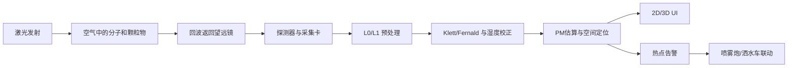

你可以把它理解成：

- 激光器负责"问空气一个问题"。
- 望远镜和探测器负责"听空气怎么回答"。
- 算法负责"把回答翻译成人能看懂的数据"。
- UI 和控制系统负责"把结论用图和动作表现出来"。

---

## 3.5 补课：关于光，你需要知道的最少知识

如果你对光的物理基础不太熟，这一节帮你快速补上。只讲和 LiDAR 有关的，不扯远了。

### 光是波吗？

**是的，光是一种电磁波。**

"波"你可以想象成水面上的涟漪：

```
平静水面          扔一块石头后

───────          ╱╲  ╲╱  ╲╱  ╲╱
                 ╱  ╲╱  ╲╱  ╲╱  ╲
─────────        ╱                  ╲
```

水面波是水在上下振动，光波则是**电场和磁场在交替振动**。区别在于：

| | 水面波 | 光波 |
| --- | --- | --- |
| 什么在振 | 水分子上下运动 | 电场和磁场交替变化 |
| 需要介质吗 | 需要水 | **不需要，真空中也能传播** |
| 传播速度 | 很慢（几米/秒） | 极快（约 $3 \times 10^8$ m/s） |

所以光的全名叫"电磁波"——电场和磁场自己在那交替振荡，不需要任何介质来"托着"它。

### 激光和普通光有什么区别？

手电筒发的光和激光器发的光，本质都是电磁波，但区别很大：

```
普通光（手电筒、太阳光）：           激光：

  各个方向乱跑                       几乎只往一个方向
  ╲  │  ╲                           ──────────→
   ╲ │ ╲
  ──●──                             像一束"平行线"
   ╱ │ ╲
  ╱  │  ╲

  各种颜色混在一起                   几乎只有一个波长（一种颜色）
  🔴🟡🟢🔵🟣                        纯🔴 或纯🟢

  各个波"步调不一致"                 所有波"步调完全一致"
  ∿∿∿∿∿∿                           ∿∿∿∿∿∿
  （随机相位）                       （同相，像阅兵方阵）
```

三个关键词：

1. **方向性好**：激光几乎只往一个方向走，不散开。这对 LiDAR 至关重要——你打出去的光才不会浪费，也才能精确知道"打到了哪里"。
2. **单色性好**：激光几乎只有一个波长，滤光片可以非常精准地只让这个波长的回波进来，把太阳光等杂光挡掉。
3. **相干性好**：所有光波的步调一致，能量集中。

一个形象类比：

> 普通光 = 广场上乱走的一群人，各走各的方向，各穿各的衣服。
> 激光 = 一支阅兵方阵，统一服装、统一方向、统一步伐。

### 光在真空中传播会有损耗吗？

**不会。**

光在真空中传播时，没有任何东西和它发生相互作用，所以：

- 能量不会减少。
- 方向不会改变。
- 速度恒定为 $c \approx 3 \times 10^8$ m/s。

你可以想象一个人在完全空旷的太空里匀速直线走——没有摩擦力、没有风阻、没有障碍物，他可以一直走下去，速度和体力都不会变。

```
真空中：                          大气中：

  激光 ──────────────────→          激光 ───╳╳──→
                                    ↑
  完好无损，能量不变                空气分子和颗粒物
                                    在不断"吃掉"光
```

**那为什么 LiDAR 的信号会衰减？** 因为我们在大气中工作，不是真空中。大气里充满了：

- 空气分子（氮气、氧气等）
- 水汽
- 灰尘、PM2.5、PM10
- 雾滴、烟尘

这些东西会：

1. **吸收**光：把光能变成热能（光被"吃掉"了）。
2. **散射**光：把光打到别的方向去（光被"拐跑"了）。

这就是 LiDAR 方程里消光系数 $\alpha(R)$ 存在的原因。

### 发出去的光和收到的光，原始样子是什么？

#### 发出去的光：一个极短、极亮的光脉冲

LiDAR 不是一直开着激光，而是**打一枪、听一下、再打一枪**。每一枪是一个极短的光脉冲：

```
时间 →

发射的激光脉冲：

光强
  ↑    ┌┐
  │    ││
  │    ││          ← 整个脉冲可能只有 10 纳秒（0.00000001 秒）
  │    ││            在这么短的时间里，光走了约 3 米
  │    ││
  └────┴┴────────────────→ 时间
    近处     稍远       更远          很远
    回波     回波       回波          回波

  整体趋势：越远越弱（因为 R⁻² 几何扩散 + 消光衰减）
```

形象地说，发射出去的不是一个持续的光柱，而更像**一颗子弹**——一颗由光组成的、极短极亮的"子弹"，嗖地一下飞出去。

这颗"子弹"在空间中的样子：

```
    ← 约3米长 →
    ┌──────────┐
    │██████████│  ← 一个亮斑，3米长，很窄
    └──────────┘
         ↓
    飞行方向
```

#### 收到的光：无数个极弱的回波

这颗光子弹飞出去后，沿途每一段空气都会"弹回来"一点点光：

```
光子弹飞出去：

    LiDAR ──→ ██████████ ──→ 空气1 ──→ 空气2 ──→ 空气3 ──→ ...

每段空气弹回来一点点：

    LiDAR ←─ 弱 ←─ 弱 ←─ 更弱 ←─ 极弱
            空气1    空气2    空气3    空气4
```

接收望远镜收到的信号长这样：

```
光强
  ↑
  │ ▓▓
  │ ▓▓▓
  │ ▓▓▓▓▓
  │ ▓▓▓▓▓▓▓▓
  │ ▓▓▓▓▓▓▓▓▓▓▓▓▓
  │ ▓▓▓▓▓▓▓▓▓▓▓▓▓▓▓▓▓▓▓
  │ ▓▓▓▓▓▓▓▓▓▓▓▓▓▓▓▓▓▓▓▓▓▓▓▓░░░░░░░░░░░░░░░
  └──────────────────────────────────────→ 采样点
    近处（信号强）                   远处（信号弱，淹没在噪声里）
```

这就是第 4 节要讲的"距离-回波强度曲线"的原始形态——横轴是采样时间（等价于距离），纵轴是信号强度。

### 波长是什么？怎么测出来的？

#### 波长的直觉理解

波有"波峰"和"波谷"，两个相邻波峰之间的距离就叫**波长**：

```
     波峰   波峰   波峰
      ↓     ↓     ↓
     ╱╲   ╱╲   ╱╲
    ╱  ╲ ╱  ╲ ╱  ╲
───╱────╲╱────╲╱────╲───
        ↑     ↑
       波谷   波谷

   |←──→|  |←──→|
    波长     波长
```

不同颜色的光，本质就是波长不同：

```
可见光光谱（波长从短到长）：

  紫    蓝    青    绿    黄    橙    红
  380nm 450nm 480nm 520nm 570nm 600nm 700nm

  ←── 波长越短 ──────────── 波长越长 ──→
  ←── 能量越高 ──────────── 能量越低 ──→

  1 nm（纳米）= 0.000000001 米 = 十亿分之一米
```

LiDAR 常用的激光波长不在可见光范围，而在红外线区域（人眼看不见）：

| 激光类型 | 波长 | 用途 |
| --- | --- | --- |
| Nd:YAG | 1064 nm（近红外） | 最常见的气溶胶 LiDAR |
| Nd:YAG 倍频 | 532 nm（绿光） | 常用于拉曼/偏振 LiDAR |
| 人眼安全 Er:glass | 1550 nm（近红外） | 可用于较高功率的扫描 |

#### 波长是怎么测出来的？

历史上测波长经历过几种方法，从粗糙到精确：

**方法1：衍射光栅（最直观）**

```
原理：让光穿过一条很密的缝（光栅），不同波长的光会偏折到不同角度。

         光栅（很多平行细缝）
           │││││││││
  白光 →   │││││││││   → 红光偏折大
           │││││││││   → 绿光偏折中
           │││││││││   → 紫光偏折小

就像三棱镜把白光分成彩虹一样，
但光栅分得更精确。

屏幕上看到：
  紫 蓝 青 绿 黄 橙 红
  ←─ 波长已知的标准灯 ─→

  对比位置就能算出波长。
```

类比：你往河里扔不同大小的石子，小石子溅起的水波纹密（波长短），大石子溅起的波纹稀（波长长）。光栅就像一个"读波纹密度的尺子"。

**方法2：迈克尔逊干涉仪（更精确）**

```
原理：把一束光分成两半，走不同路径再合在一起。
  如果两束光的路径差恰好等于一个波长，合在一起就会"亮"（相长干涉）。
  如果差半个波长，就会"暗"（相消干涉）。

  光源 → 分光镜 ──→ 镜子1（固定）
              │           ↓
              │        返回
              ↓
           镜子2（可移动）
              ↓
           返回 → 合在一起 → 探测器

  慢慢移动镜子2，探测器会交替出现"亮-暗-亮-暗"。
  数"亮了多少次"和"镜子移了多远"，就能算出波长。
```

类比：两个人跑步，步长一样时齐步走声音大（亮），步长差半步时互相踩脚（暗）。你量了一个人跑了多远，再数齐步了多少次，就能算出步长。

**方法3：现代方法（最精确）**

现代实验室用**频率梳**——一种能产生极其精确频率间隔的激光器。因为光速 $c$ 已经被定义为精确值（299792458 m/s），而频率 $f$ 可以用原子钟极其精确地测量，所以：

$$
\lambda = \frac{c}{f}
$$

频率测到多少位有效数字，波长就有多少位。现在的精度可以到小数点后 15 位以上。

**但对 LiDAR 使用者来说，你不需要测波长。** 激光器出厂时波长就已经标定好了，写在参数表里。你只需要知道"我的激光是 1064nm 还是 532nm"，因为不同波长和颗粒物的相互作用方式不同，反演算法要考虑这个。

### 脉冲是怎么控制"打一枪、停一下"的？

#### 先纠正一个误解

我前面说"10 纳秒"是指**单个脉冲的持续时间**（脉冲宽度），不是"每 10 纳秒打一发"。

实际的工作节奏更像是：

```
发射一个脉冲（持续约 10 ns）
         ↓
等待回波全部回来（约 100~200 μs）
                              ↓
发下一个脉冲
                              ↓
等待回波...

时间轴：
  ├─10ns─┤────── 100~200 μs ──────├─10ns─┤────── 100~200 μs ──────┤
  │脉冲1 │     等回波回来          │脉冲2 │     等回波回来          │
```

- 脉冲宽度：~10 ns（决定了距离分辨率，约 1.5 m）
- 脉冲间隔：~100-200 μs（决定了最大探测距离，约 15-30 km）
- 重复频率：~5-20 Hz（每秒打 5~20 发，不是几千万发）

#### 脉冲是怎么"切"出来的？

激光器内部有一套**调 Q（Q-switch）** 机制，相当于一个极快的"快门"：

```
谐振腔的基本结构：

  全反射镜 ═══════════════════════════════ 激光介质 ═══════════════════════════════ 半反射镜
  （100%反射）     （Nd:YAG 晶体等）                               （部分透光，光从这里出去）

光在两面镜子之间来回弹，每经过激光介质就被放大一次。
```

**调 Q 的工作过程**（类比一个"蓄水-放水"的过程）：

```
第1步：蓄能（Q 值低，不产生激光）

  全反射镜 ════ [开关关闭] ════ 激光介质 ════ 半反射镜

  激光介质被泵浦灯/二极管持续注入能量，
  但开关关闭，光无法在腔内来回反射放大。
  能量越攒越多，就像水库蓄水。

         ⚡⚡⚡⚡⚡⚡  ← 持续注入能量
         ██████████  ← 激光介质储存了大量能量


第2步：瞬间打开开关（Q 值突然变高）

  全反射镜 ════ [开关打开] ════ 激光介质 ════ 半反射镜

  所有储存的能量在极短时间内（~10ns）全部释放！
  就像水库大坝瞬间开闸，洪水喷涌而出。

         ════════════════════→  ← 一个极短、极强的光脉冲飞出去！
         10 ns 内释放完毕
```

**开关是怎么实现的？** 有几种方式：

1. **电光开关**：在腔内放一块晶体，加电压时光不能通过（关闭），撤掉电压瞬间光可以通过（打开）。切换速度在纳秒级。

2. **声光开关**：用超声波在晶体中制造"衍射光栅"，把光偏折到别处（关闭），关掉超声波光就直通（打开）。

3. **被动调 Q**：放一种"漂白晶体"，弱光时吸收（关闭），能量攒够后突然变透明（打开）。不需要外部电路控制，自己就会"蓄满就放"。

```
整个发射时序的控制：

  主控电路发出触发信号
         │
         ▼
  ┌──────────────┐
  │  Q 开关控制   │ ← 接到触发信号后，关闭→打开→关闭
  └──────┬───────┘
         │
         ▼
  ┌──────────────┐
  │  激光器      │ ← 产生 10 ns 光脉冲
  └──────┬───────┘
         │
         ▼
  ┌──────────────┐
  │  采集卡      │ ← 同步开始采样（和发射精确同步）
  └──────────────┘

  发射脉冲和开始采样的时间必须严格同步，
  否则"0 时刻"就不准，距离就会算错。
  同步精度要求在纳秒级。
```

#### 一句话总结脉冲控制

**激光器内部像水库蓄水：持续攒能量 → Q 开关瞬间打开 → 10 纳秒内全部释放 → 关闭 → 再攒 → 再放。** 主控电路控制"什么时候放"，Q 开关控制"放多快"，采集卡同步"什么时候开始听"。

---

### 一句话总结

**光是电磁波，激光是一支"阅兵方阵"式的光，真空中不损耗但在大气中会被吸收和散射，LiDAR 发出去的是一颗极短的光子弹，收到的是沿途每段空气弹回来的连续衰减的弱信号。**

---

## 4. 从一束脉冲到一条距离曲线，中间发生了什么

### 4.1 为什么时间能换成距离

激光飞得非常快，接近光速 $c$。设备发出脉冲后，系统开始计时。某一段空间的回波返回得越晚，说明它离设备越远。

距离公式是：

$$
R = \frac{ct}{2}
$$

这里的 $2$ 很关键，因为光不是单程，而是：

1. 从设备飞到目标体积。
2. 再从目标体积飞回设备。

所以如果回波晚了 $t$ 秒，真正的单程距离只是一半。

### 4.2 为什么原始数据不是照片，而是一条曲线

因为设备每次发射只知道"不同时间收到了多强的回波"，所以原始结果更像：

- 横轴是距离。
- 纵轴是回波强度。

每次激光脉冲打出去，你只能得到**一根线**：

```
回波强度
  ↑
  │    ╱╲
  │   ╱  ╲        ╱╲
  │  ╱    ╲      ╲  ╲
  │ ╱      ╲    ╲    ╲
  │╱        ╲  ╲      ╲________
  └──────────────────────────→ 距离
  近                远
```

这是 1 维的：只有"距离"和"强度"两个量。就像你用手电筒照一条直线，只能知道沿这条线上各处亮不亮。

#### 从一条线到多种图：维度是怎么一步步增加的

如果持续采样很多次，再把时间拼起来，维度就增加了。关键在于：**每次脉冲之间改变某个参数（时间 / 仰角 / 方位角），拼接后就能看到更高维度的结构。**

##### 第 1 种：时间-高度图（最常见）

**做法**：激光方向固定不动（比如一直垂直向上打），每隔几秒打一发，持续几小时。

```
时刻1:  ___╱╲____╱╲________  ← 第1条曲线
时刻2:  ___╱╲____╱╲________  ← 第2条曲线（可能略有变化）
时刻3:  ___╱╲___╱╲_________  ← 第3条曲线
  ...
时刻N:  ___╱╲____╱╲________  ← 第N条曲线

把这些曲线像"手风琴"一样左右展开：

高度↑
     │ ██░░████░░░░░░░░░░░░
     │ ██░░████░░░░░░░░░░░░
     │ ███░░███░░░░░░░░░░░░   ← 每一列是一个时刻的距离剖面
     │ ███░░████░░████░░░░░   ← 颜色深浅 = 回波强度
     │ █████░████░█████░░░░
     └────────────────────→ 时间
        0h   2h   4h   6h
```

直观理解：就像监控摄像头——单帧是一张照片，连续播放就是视频。时间-高度图就是大气层的"延时摄影"，能看到云层怎么飘过来、污染层怎么升高。

实际效果示意：

```
高度(km)
8 │░░░░░░░░░░░░░░░░░░░░░░░░░░░  ← 高空干净，信号弱
  │░░░░░░░░░░░░░░░░░░░░░░░░░░░
6 │████░░░░░░░░░░░░████░░░░░░░  ← 有云层 / 气溶胶层
  │████░░░░░░░░░░░░████░░░░░░░
4 │████████░░░░░░░░██████░░░░░  ← 污染边界层
  │██████████████████████████░
2 │███████████████████████████  ← 近地面污染最浓
  │███████████████████████████
0 └──────────────────────────→ 时间
    06:00    12:00    18:00
```

##### 第 2 种：距离-仰角图（RHI 扫描）

**做法**：激光在同一方位角，但**上下摆动**，从低仰角扫到高仰角，每个仰角打一发。

```
        仰角90°(正上方)
         │  ╲
         │╱
  仰角45°├─────╲
        ╲│      ╲
       ╲ │       ╲
      ╲  │        ╲
  仰角0°├──────────╲──→ 水平
    LiDAR

每个仰角得到一条距离-强度曲线，拼接后：

高度↑
     │      ╱╲
     │     ╱  ╲          ← 仰角越高，同一距离对应的高度越高
     │    ╱    ╲  ╲
     │   ╱      ╲╱  ╲
     │  ╱             ╲
     │ ╱               ╲
     └──────────────────→ 地面距离
```

直观理解：就像你站在原地，从地面到头顶慢慢抬头，眼睛扫过的地方就"画"出了一个竖直切面。这张图相当于把天空"切了一刀"，看这一刀上颗粒物的分布。

###### RHI 扫描详解：高度从哪来？

一个常见的疑问是：**假如正前方有一团沙尘暴，RHI 为什么能得到"距离-高度"图？这个"高度"是什么意思？**

关键在于：**沙尘暴不是一个点，它有垂直厚度**。

```
你直觉中的沙尘暴：        实际的沙尘暴：

   ？？？                 ████████████  ← 顶部（比如 500m 高）
                         ████████████
                         ████████████     它是一整面"墙"，
                         ████████████     从地面到 500m 都是沙尘
                         ████████████
                         ████████████  ← 底部（贴着地面）

    LiDAR →               LiDAR →
```

如果只打一发（1D 曲线），你只知道"2km 处有东西"，但**不知道这东西从地面延伸到多高**。

RHI 就是让你上下摆头，每个仰角打一发：

```
                    仰角45°  →  这束光穿过沙尘暴的高处
                  ╱
                ╱
              ╱
  仰角15° → ╱            →  这束光穿过沙尘暴的中部
          ╱
        ╱
  仰角5°→╱                →  这束光穿过沙尘暴的底部（贴地）
      ╲
  仰角0°→                 →  这束光沿地面，遇到沙尘暴最底部
    LiDAR               沙尘暴（2km 外）
```

每个仰角得到一条"斜距-强度"曲线，但每条曲线的**几何含义不同**：

| 仰角 | 在哪里碰到沙尘（斜距） | 换算后的地面距离 | 换算后的高度 | 含义 |
| --- | --- | --- | --- | --- |
| 0° | 2.00 km | 2.00 km | 0 m | 贴地打进了沙尘底部 |
| 5° | 2.01 km | 2.00 km | 175 m | 稍微抬高，也在沙尘里 |
| 15° | 2.07 km | 2.00 km | 535 m | 打进沙尘中部 |
| 45° | 2.83 km | 2.00 km | 2000 m | 打进沙尘高处 |
| 60° | 4.00 km | 2.00 km | 3464 m | 光束从沙尘暴顶部越过去了，信号弱 |

换算公式很简单：

$$
\text{高度} = \text{斜距} \times \sin(\text{仰角})，\quad \text{地面距离} = \text{斜距} \times \cos(\text{仰角})
$$

把所有点换算完拼起来，就得到了距离-高度图：

```
高度↑
500m │         ████████░░░░          ← 沙尘暴顶部（仰角高的光束越过这里时信号变弱）
     │         ████████████
     │         ████████████          ← 颜色深 = 回波强 = 沙尘浓度高
     │         ████████████
200m │         ████████████          ← 沙尘暴中部
     │         ████████████
     │         ████████████
  0m │─────────████████████───────── ← 沙尘暴底部（贴地）
     └──────────────────────→ 地面距离
       0km      2km      4km
              ↑
           沙尘暴在这里
```

所以：

- **"高度"不是"刚遇到沙尘暴的高度"**，而是**每个数据点本身的真实垂直高度**。
- 图上每个像素都有各自的高度——沙尘内部每个点的高度你都能看到，不只是"边界"的高度。
- **RHI 就是把沙尘暴竖着切了一刀**，让你看到这面"墙"从地面到高空有多高、多厚、哪里最浓。

##### 第 3 种：方位-距离图（PPI 扫描）

**做法**：激光保持在同一仰角（比如水平），但**水平旋转 360°**，每个方位角打一发。

```
俯视图：

         N (0°)
         │
    315° ╲│╱ 45°
     ╲    │    ╲
      ╲   │   ╲
  270°──LiDAR──90°       ← 激光像雷达一样旋转扫描
      ╲   │   ╲
     ╲    │    ╲
    225° ╱│╲ 135°
         │
        S (180°)

每个方位得到一条距离曲线，拼接后：

           N
      ┌─────────────┐
      │    ░░██░░    │    ← 中心 = LiDAR 位置
      │   ░░████░░   │    ← 向外辐射 = 距离增加
   W  │  ░░██████░░  │ E  ← 颜色 = 回波强度
      │ ░░██████░░░  │    ← 某方向颜色深 = 该方向污染重
      │░░██████░░░░  │
      └─────────────┘
           S
```

直观理解：这就像天气雷达的"回波图"——你在地图上看到哪个方向有雨。PPI 扫描让你知道"哪个方向上、多远处有颗粒物"，是水平面上的俯瞰。

##### 第 4 种：三维体素图

**做法**：同时改变仰角和方位角，做一个**完整的立体扫描**（volume scan）。

先回顾一下前两种扫描：

- **PPI**：固定仰角，水平转一圈 → 得到**一个水平切面**（像切了一片"煎饼"）
- **RHI**：固定方位，上下扫一遍 → 得到**一个竖直切面**（像切了一刀"蛋糕"）

三维体素扫描 = **在每个仰角都做一圈 PPI，然后把所有仰角的"煎饼"叠起来**。

```
第1步：低仰角（5°）转一圈 PPI

    俯视图：          侧视图：
    ┌─────┐           ╱ ← 5°仰角
    │░░░░░│          ╱
    │░░░░░│         ╱
    │░░░░░│        ╱
    └──●───┘       ● LiDAR

第2步：中仰角（30°）转一圈 PPI

    俯视图：          侧视图：
    ┌─────┐              ╱ ← 30°仰角
    │░░░░░│            ╱
    │░░░░░│           ╱
    │░░░░░│          ╱
    └──●───┘       ● LiDAR

第3步：高仰角（60°）转一圈 PPI

    俯视图：          侧视图：
    ┌─────┐                 ╱ ← 60°仰角
    │░░░░░│               ╱
    │░░░░░│              ╱
    │░░░░░│             ╱
    └──●───┘       ● LiDAR

把所有仰角叠起来：

    侧视图：                3D 俯瞰：

         ╱ 60°层                ┌───┐  ← 高仰角层（小圆片）
       ╱  30°层              ╱░░░░░╲
     ╱    5°层             ╱█████████╲ ← 低仰角层（大圆片）
    ● LiDAR              ╱███████████╲
                         └──────●──────┘
                              LiDAR
```

###### 为什么是半球形？

因为 LiDAR 只能往"上方"打光，不能打到地下去。所以扫描范围是：

```
        侧视图：                 3D 视角：

    仰角90°(正上方)                ╱╲
        │  ╲                     ╱  ╲
        │╱                      ╲    ╲
    45° ┤╲                    ╱ ████ ╲
       ╲│  ╲                 ╱████████╲
      ╲ │    ╲              ╱██████████╲
  0° ─┤──┤────┤           ────────●────────
        LiDAR                LiDAR（原点）

    扫描覆盖的区域               合在一起就是一个半球
    就是上半部分
```

- 仰角从 0° 扫到 90°（半个竖直圆）
- 方位角从 0° 转到 360°（一整圈水平圆）
- 组合起来 = **以 LiDAR 为圆心、最大探测距离为半径的上半球**

你说的没错：**最终得到的确实是一个以雷达为原点的半球形 3D 模型。**

###### 每个体素是什么？

整个半球被切成了无数小方块（体素 = 体积像素），每个体素代表空间中一个小区域：

```
体素的坐标 = (方位角, 仰角, 斜距)

例如：(方位角 45°, 仰角 30°, 斜距 2km)

换算成真实三维坐标：
  x = 2 × cos(30°) × cos(45°) = 1.22 km
  y = 2 × cos(30°) × sin(45°) = 1.22 km
  z = 2 × sin(30°)             = 1.00 km

含义：在空间位置 (1.22, 1.22, 1.00) km 处，回波强度是多少。
```

整个半球的所有体素拼起来，就是完整的大气颗粒物 3D 分布图：

```
          ████████
        ██░░░░░░░░██          ← 高空：信号弱
       █░░░░░░░░░░░░█
      █░░████████░░░░█        ← 中层：有污染层
     █░░██████████░░░░█
    █░░████████████░░░░█      ← 低层：污染最浓
    █░░████████████░░░░█
    ████████████████████      ← 地面层
    ─────────●─────────
          LiDAR

你可以在电脑里：
  - 旋转看整体形状
  - 切任意方向的截面
  - 只显示浓度超过某阈值的区域
  - 看污染层的三维边界在哪里
```

直观理解：就像医学 CT 扫描——一层一层切片，合起来就是整个 3D 结构。只不过 CT 扫的是人体，LiDAR 扫的是大气层。

##### 维度增加总结

```
┌──────────────────────────────────────────────────────────┐
│  单次脉冲:  1D  距离-强度曲线                              │
│      ↓ + "时间"维度（方向不动，重复打）                      │
│  时间-高度图: 2D  ← 最常用的"延时摄影"                      │
│      ↓ + "仰角"维度（上下摆头）                             │
│  距离-仰角图: 2D  ← 竖直切面                               │
│      ↓ + "方位角"维度（左右转头）                           │
│  方位-距离图: 2D  ← 水平切面                               │
│      ↓ + 同时有仰角和方位角                                 │
│  三维体素图: 3D  ← 完整 3D 结构                             │
└──────────────────────────────────────────────────────────┘
```

一句话总结：**单条曲线只告诉你"这条线上有什么"，通过在不同时间 / 仰角 / 方位角重复采样并拼接，你才能看到大气结构在时间上怎么演变、在空间上怎么分布。**

### 4.3 为什么近处和远处信号差很多

原因主要有 4 个：

1. 距离越远，几何扩散越明显，信号天然按 $R^{-2}$ 变弱。
2. 激光沿途被空气和颗粒物衰减。
3. 近距离 overlap 不完整，存在盲区。
4. 白天太阳背景光和电子噪声会抬高底噪。

---

## 5. 最核心的 LiDAR 方程，必须真正看懂

颗粒物弹性后向散射 LiDAR 的经典形式可以写成：

$$
P(R) = C E \frac{O(R)}{R^2} \beta(R) \exp\left[-2\int_0^R \alpha(r)\,dr\right]
$$

第一次看到这个式子不用怕。你先不要想着推导它，而是先读懂它在说什么。

### 5.1 一句人话版

这条方程说的是：

> 设备在距离 $R$ 这一层空气收到的回波强度，等于“设备本身有多强”乘以“这一层有多少东西把光打回来”再乘以“光在来回路上还剩多少”。

### 5.2 每一项分别是什么意思

| 符号 | 含义 | 你可以怎么理解 |
| --- | --- | --- |
| $P(R)$ | 距离 $R$ 处的回波信号 | 设备真正测到的东西 |
| $C$ | 系统常数 | 仪器整体效率打包值 |
| $E$ | 单脉冲能量 | 这一枪激光打得有多强 |
| $O(R)$ | 重叠函数 | 发射和接收在该距离有没有对准（详见下文） |
| $R^{-2}$ | 几何扩散项 | 距离越远，回波天然越弱 |
| $\beta(R)$ | 后向散射系数 | 这一层空气把光打回来的能力 |
| $\alpha(r)$ | 消光系数 | 光在传播中被削弱的程度 |
| $\exp[-2\int_0^R \alpha(r)dr]$ | 双程传输项 | 去一趟再回来，最后还剩多少光 |

#### 几何扩散和消光系数是两回事，没有重合

表格里有两个看起来都在说"越远越弱"的东西：

- $R^{-2}$（几何扩散项）：距离越远，回波天然越弱。
- $\exp[-2\int_0^R \alpha(r)dr]$（双程传输项）：光在来回路上被削弱。

这两者**完全不是一回事**，它们是两种完全不同的物理机制导致的衰减。下面用最直观的方式说清楚。

##### 类比：打手电筒照远处的墙

想象你拿着手电筒，在一条长长的走廊里照前方的墙：

```
你 ════════════════════════════════════════ 墙
     ←────── 走廊 ──────→
```

**几何扩散（$R^{-2}$）** 是说：就算走廊里是完美的真空，没有任何灰尘、没有任何空气，你离墙越远，墙上被照到的面积就越大，单位面积上的光就越暗。

```
近处照墙：         远处照墙：

  ┌──┐              ┌──────────┐
  │██│              │░░░░░░░░░░│
  │██│              │░░░░░░░░░░│    同样的总光量，
  └──┘              │░░░░░░░░░░│    铺到更大的面积上，
                    └──────────┘    每个地方分到的就少了

  很亮              比较暗
  （光集中）         （光分散了）
```

这就是纯粹的**几何原因**——光从一点向四面八方扩散，距离翻倍，球面面积变成 4 倍，单位面积上的光就变成 1/4。这跟环境有没有灰尘完全无关，**即使在真空中也会发生**。

**消光（$\alpha$）** 是说：走廊里有灰尘和烟雾，光在传播过程中被灰尘挡住了一部分，**还没到墙上就已经变弱了**。

```
干净走廊（无消光）：    有灰尘的走廊（有消光）：

  你 ════════════ 墙     你 ──╳╳──╳╳── 墙
                         灰尘  烟雾
  光全部到达墙           光被中途截走了一部分
```

这跟几何扩散无关——**不是因为光"铺开了"，而是因为光被"吃掉"了**。

##### 两者叠加的效果

实际情况是两者同时存在，叠加在一起：

```
纯几何扩散（真空中）：     纯消光（假设光不扩散）：    实际（两者叠加）：

  1 → 0.25 → 0.11          1 → 0.6 → 0.3              1 → 0.15 → 0.033
  （按 1/R² 递减）           （按指数递减）               （1/R² × 指数，衰减更快）
```

在 LiDAR 方程里，这两种衰减是**乘在一起**的：

$$
P(R) \propto \frac{1}{R^2} \times \exp\left[-2\int_0^R \alpha(r)\,dr\right]
$$

- $\frac{1}{R^2}$：不管大气干不干净，只要距离变远，信号就按这个比例变弱。这是**逃不掉的几何规律**。
- $\exp[-2\int \alpha\,dr]$：如果大气越脏（灰尘越多），信号额外变弱得越多。这是**大气污染造成的额外惩罚**。

##### 一个生活类比

你去 KTV 唱歌：

```
几何扩散 ≈ 你离朋友越远，他听到的声音自然越小
  （声音球面扩散，和房间有没有家具无关）

消光 ≈ 房间里铺了厚地毯、挂了吸音棉，声音被吸收掉了
  （额外衰减，安静房间比空房间弱得多）

  离得远 + 房间吸音 = 声音更小
  距离远 + 大气脏   = 信号更弱
```

##### 如果只有几何扩散，没有消光，会怎样？

如果大气完全干净（$\alpha = 0$），方程变成：

$$
P(R) \propto \frac{\beta(R)}{R^2}
$$

信号还是会随距离变弱，但变弱得比较"温和"——只是 $1/R^2$ 的递减。在 1km 处信号是 1，那 2km 处信号就是 1/4，10km 处是 1/100。这是纯几何原因。

##### 如果只有消光，没有几何扩散，会怎样？

假设光不扩散（像一根完美光纤，能量不分散），但大气有消光：

$$
P(R) \propto \exp\left[-2\int_0^R \alpha(r)\,dr\right]
$$

信号按**指数衰减**——这比 $1/R^2$ 狠得多。比如 $\alpha = 0.2/\text{km}$（能见度约 10km 的雾霾天），在 5km 处双程消光只剩 $\exp(-2) \approx 13.5\%$，10km 处只剩 $\exp(-4) \approx 1.8\%$。

##### 总结对比

| | 几何扩散 $R^{-2}$ | 消光 $\exp[-2\int\alpha\,dr]$ |
| --- | --- | --- |
| 原因 | 光向四面八方扩散 | 空气中的颗粒物吸收/散射了光 |
| 和大气干净程度有关吗？ | **无关**，真空中也一样 | **有关**，大气越脏衰减越狠 |
| 衰减方式 | 幂律递减（温和） | 指数递减（凶猛） |
| 能消除吗？ | **不能**，这是几何规律 | 理论上可以（如果大气完全干净，$\alpha=0$） |
| 谁衰减更快？ | 近处占主导 | 远处占主导（指数衰减最终会压过幂律） |

**一句话：几何扩散是"光铺开了所以变弱"，消光是"光被吃掉了所以变弱"。两个是独立的原因，叠加在一起，让远处的信号更弱。**

#### O(R) 重叠函数到底在说什么

表格里 $O(R)$ 的解释是"发射和接收在该距离有没有对准"。这句话看着简单，但到底是什么意思？下面一步步拆开。

##### 先搞清楚 LiDAR 的物理结构

大多数 LiDAR 不是"一个镜头又发射又接收"，而是**两套独立的光学系统**：

```
              ← 发射方向 →
         发射望远镜                接收望远镜
         (激光从这出去)            (回波从这进来)
            ┃                        ┃
            ┃  ← 望远镜面垂直于      ┃  ← 望远镜面也垂直于
            ┃     发射方向            ┃     接收方向
            ┃                        ┃
     ┌──────┨                        ┃──────┐
     │  镜筒┃                        ┃镜筒  │
     │      ┃                        ┃      │
     └──────┸────────────────────────┸──────┘
                    LiDAR 设备
                    ↑
              两个望远镜并排，间距约 20~50 cm
              镜面都垂直于前方，光轴平行
```

两个望远镜是**并排平放**的，镜面都朝前方（垂直于光传播方向），就像两只眼睛都朝前看。

##### 先搞清楚一个问题：偏移了的接收望远镜，为什么也能收到回波？

很多人会想：发射镜在左边打光，接收镜在右边收光，光打到远处的东西后如果像镜面一样原路弹回来，那不就回到发射镜的位置了吗？接收镜偏移了，怎么收得到？

**关键区别：大气中的散射不是镜面反射，而是向四面八方散射。**

```
镜面反射（比如镜子）：              大气散射（空气中的颗粒物）：

  激光 →  │  镜子                    激光 →  ● 颗粒物
          │  ← 光原路返回                    ↑╱←╲→↓
          │                                  光向四面八方散射！
  光回到出发位置                        不管接收镜在哪个位置，
  只有发射镜自己能收到                  只要在散射范围内都能收到
```

颗粒物把光打散了，就像雾天开车——对面车的灯光在雾里变成一团光晕，你在旁边也能看到，不需要正对着车灯。

用一个生活类比：

```
你在黑暗的房间里，拿手电筒照一面镜子：

  你 ══════════ 镜子 ══════════ 你
  （光原路返回，只有你自己被晃眼）

你在黑暗的房间里，拿手电筒照一团烟雾：

  你 ══════════ 烟雾 ●●●
                 ╱  │  ╲
               ╱    │    ╲
             ╱      │      ╲
           你      旁边的人  更旁边的人
          （收到）  （也收到） （也收到，弱一些）

  烟雾把光打散了，站在旁边的人也能看到烟雾被照亮了。
```

所以 LiDAR 的接收望远镜虽然偏移了一点，但只要颗粒物散射的光有一部分朝向它的方向，它就能收到。当然，偏移越远能收到的比例越小——这就是 O(R) 要解决的问题。

##### 等一下，既然四面八方都在散射光，接收镜怎么确认"这是我发射的那束光"？

这个问题问得太好了。大气中不止有你的激光在飞，还有太阳光、月光、其他激光。你的接收镜面对的是一个"光的大杂烩"，它怎么把"自己人"挑出来？

靠的是**四道筛选**，一层一层把不是你的光淘汰掉：

```
阳光、灯光、其他激光等杂光
         │
    ┌────▼────┐
    │ 第1道筛选 │  方向：接收望远镜只看前方一个小锥角
    └────┬────┘
         │  淘汰掉：从侧面、背面来的光
    ┌────▼────┐
    │ 第2道筛选 │  时间：只在发射脉冲后的极短时间窗口内接收
    └────┬────┘
         │  淘汰掉：持续存在的太阳光、灯光
    ┌────▼────┐
    │ 第3道筛选 │  波长：滤光片只让激光波长的光通过
    └────┬────┘
         │  淘汰掉：其他波长的光
    ┌────▼────┐
    │ 第4道筛选 │  算法：信号处理时用背景扣除、累加平均
    └────┬────┘
         │  淘汰掉：残留的随机噪声
         ▼
  干净的回波信号
```

**第1道：方向筛选**

接收望远镜有一个有限的视场角（FOV），通常只有几个毫弧度（mrad），相当于一个很窄的锥形视野：

```
           ╱·····╲         ← 接收视野（很窄的锥形）
          ╱·······╲
         ╱·········╲
        ╱···········╲
       └─────────────┘
         接收望远镜

       视场角只有 ~1 mrad
       意味着 1km 外只能看到 ~1m 宽的范围

从侧面、背面、斜上方来的光，根本进不来。
```

**第2道：时间筛选**（最关键的一道！）

LiDAR 的工作方式是"打一枪、听一下"。发射脉冲后，系统精确计时，只在你**预期回波会到达的时间窗口**内接收信号：

```
时间轴（发射一个脉冲后）：

  0μs    1μs     10μs           200μs
  │      │       │               │
  ▼      ▼       ▼               ▼
  ├──发──┤       ├──只在这段─────┤
  │射脉冲│       │  时间内接收    │发射下一个脉冲
  │      │       │               │
  │      │       │  回波在这段   │
  │      │       │  时间陆续到达  │
  │      │       │               │

太阳光：一直都在 ═════════════════════════════
灯光：  一直都在 ═════════════════════════════

但太阳光和灯光是"持续"的，
你的回波是"跟脉冲同步、按时间依次到达"的。
通过只看"脉冲后那段时间窗口"，就能把大部分背景光排除。
```

为什么时间筛选这么重要？因为太阳光虽然强，但它是**恒定的背景**，不会"跟着你的脉冲节奏变"。所以：

- 你发射脉冲前先测一下背景光的强度（暗电流 + 太阳光 + 噪声）
- 发射脉冲后测到的信号减去背景 = 真正的回波信号

```
测到的总信号 = 回波信号 + 背景光（太阳等）
实际回波   = 测到的总信号 - 背景光

     总信号：     ▂▂█▂▂▂▂█▂▂▂▂█▂▂▂▂
     背景光：     ▂▂▂▂▂▂▂▂▂▂▂▂▂▂▂▂▂▂  ← 恒定不变
     回波信号：   ▂▂█▂▂▂▂█▂▂▂▂█▂▂▂▂  ← 减去背景后的净信号
```

**第3道：波长筛选**

激光几乎是单一波长（比如 532 nm 绿光），接收端前面装了**窄带滤光片**，只让这个波长附近极窄范围的光通过：

```
太阳光光谱（各种波长都有）：
  紫 蓝 青 绿 黄 橙 红  ← 很宽
           ↑
  ┃ ┃ ← 滤光片只让 532nm 附近 ±0.3nm 通过
        带宽只有 0.6nm，而可见光总带宽约 300nm
        通过率只有 0.6/300 = 0.2%

太阳光被挡掉了 99.8%！
但 532nm 的激光回波几乎 100% 通过。
```

这就像你在一个嘈杂的房间里，戴了只让某个频率声音通过的耳机——虽然周围什么声音都有，但你只听得见那个频率。

**第4道：算法筛选**

即使经过前三道筛选，还是会残留一些噪声。算法层面再做两件事：

1. **累加平均**：发射 1000 个脉冲，把回波信号叠加平均。真正的回波每次都在同一个位置出现，越加越明显；随机噪声有时正有时负，平均后趋近于零。
   
```
脉冲1回波：  ▂▂█▂▂█▂▂▂█▂   + 随机噪声
脉冲2回波：  ▂▂█▂▂█▂▂█▂▂   + 随机噪声
脉冲3回波：  ▂▂█▂▂█▂▂▂█▂   + 随机噪声
  ...
脉冲1000回波：▂▂█▂▂█▂▂▂█▂  + 随机噪声

1000次累加平均后：
             ▂▂██████▂█████▂   ← 回波清晰，噪声被压低
```

2. **背景扣除**：在脉冲间隙测量背景光水平，实时减掉。

##### 四道筛选的总效果

```
初始信号组成：
  你的回波：0.001  ← 很弱
  太阳光：  1.000  ← 强 1000 倍！
  其他杂光：0.01

第1道（方向筛选）后：
  你的回波：0.001  ← 不变（方向对）
  太阳光：  0.01   ← 减少了 100 倍
  其他杂光：0.001

第2道（时间筛选）后：
  你的回波：0.001  ← 不变（时间对）
  太阳光：  0.001  ← 背景扣除后只剩恒定底噪
  其他杂光：0.0001

第3道（波长筛选）后：
  你的回波：0.0009 ← 略有损耗，但大部分通过
  太阳光：  0.000002 ← 几乎全部挡掉
  其他杂光：0.0000001

第4道（算法筛选）后：
  你的回波：0.0009 ← 清晰
  噪声：    0.00001 ← 远小于信号

信噪比从 1:1000 变成了 90:1！
```

**一句话总结：靠方向、时间、波长、算法四道筛选，LiDAR 能从"光的大杂烩"里精确挑出自己发射的回波。其中时间同步和波长滤光是最核心的两道防线。**

不过还有一个物理事实：即使散射是四面八方的，**光束和接收视野也必须在空间上有重叠**，接收镜才能看到"被照亮的那块空气"。这就引出了下一个问题——

##### 两个望远镜的视野，在什么距离才开始"重叠"？

想象你两只眼睛看前方：

- **很近的物体**：左眼和右眼看到的东西差别很大（你可以闭一只眼试试，近处的东西会"跳"）。这说明两眼视野在近处几乎没有重叠。
- **很远的物体**：左眼和右眼看到的东西几乎一样。两眼视野在远处几乎完全重叠。

LiDAR 的发射和接收望远镜也是同理：

```
情况1：非常近的距离（比如 50 米）
━━━━━━━━━━━━━━━━━━━━━━━━━━━━━━━━━━
  发射光束覆盖范围：    ▓▓▓▓
  接收视野覆盖范围：          ▓▓▓▓
                       ↑ 没有重叠！
  O(R) ≈ 0

  发射的光打到了这个距离的空气，但接收望远镜"看"不到这块空气，
  因为两个望远镜的视野在这里还没交到一起。
  回波再强，你也收不到。


情况2：中等距离（比如 200 米）
━━━━━━━━━━━━━━━━━━━━━━━━━━━━━━━━━━
  发射光束覆盖范围：    ▓▓▓▓▓▓▓▓
  接收视野覆盖范围：        ▓▓▓▓▓▓▓▓
                           ████
                           ↑ 部分重叠
  O(R) ≈ 0.5

  发射光束有一部分落在接收视野内，这部分光才能被收到。
  大概有一半能收到，一半收不到。


情况3：足够远的距离（比如 500 米以上）
━━━━━━━━━━━━━━━━━━━━━━━━━━━━━━━━━━
  发射光束覆盖范围：    ▓▓▓▓▓▓▓▓▓▓▓▓
  接收视野覆盖范围：      ▓▓▓▓▓▓▓▓▓▓▓▓▓▓
                         ████████████
                         ↑ 几乎完全重叠
  O(R) ≈ 1

  发射光束完全在接收视野内，能收到所有回波。
```

##### O(R) 随距离变化的曲线

把上面三种情况连起来，$O(R)$ 长这样：

```
O(R)
1.0 │                        ─────────────────
    │                    ╱
    │                 ╱
0.5 │              ╱
    │           ╱
    │        ╱
    │     ╱
0.0 │────╱─────────────────────────────────→ R
    0   R_full                    远
         ↑
      完全重叠距离
```

- $R < R_{\text{full}}$：发射和接收还没完全对上，$O(R) < 1$，信号被人为压低。
- $R \geq R_{\text{full}}$：完全重叠，$O(R) = 1$，信号不再受这个因素影响。

##### 一个生活类比

想象你站在窗前，拿手电筒往外照：

```
手电筒              窗户
   ╲               ││
    ╲  光束        ││  窗户能"接收"的范围
     ╲            ││
      ╲          ││
       ╲        ││
        ╲      ││
         ╲    ││
          ╲  ││
           ╲││
            ╳  ← 近处：手电筒照的地方和窗户能看到的范围不重合
           ╱│╲
          ╱ │ ╲
         ╱  │  ╲    ← 远处：手电筒的光完全在窗户视野内
        ╱   │   ╲
```

- **近处**：手电筒照到的东西，窗户不一定看得到（光束和视野没重叠）。
- **远处**：手电筒照到的所有东西，窗户全能看到（完全重叠）。

##### 为什么这件事很重要

1. **近场盲区**：$O(R) \approx 0$ 的那段距离，即使近处有很浓的污染，设备也"看不见"。这不是因为那里没东西，而是因为发射和接收还没对上。这就是 4.3 节提到的"近距离 overlap 不完整，存在盲区"。

2. **信号失真**：在 $0 < O(R) < 1$ 的过渡区，原始信号被 $O(R)$ 压低了。如果你不修正这个因素，就会误以为近处颗粒物少——其实不是少，是"没看到"。

3. **不同设备差异很大**：同轴系统（发射和接收共用一个望远镜）的 $O(R)$ 很快就到 1；双轴系统（两个分开的望远镜）的完全重叠距离可能要几百米。设备参数里通常会标注 $R_{\text{full}}$ 是多少。

##### 回到方程里看 O(R)

$$
P(R) = C E \frac{O(R)}{R^2} \beta(R) \exp\left[-2\int_0^R \alpha(r)\,dr\right]
$$

$O(R)$ 出现在分子上，它是一个 **0 到 1 之间的乘数**：

- $O(R) = 1$：满分，发射和接收完美对上，信号不受影响。
- $O(R) = 0$：零分，发射的光根本不在接收视野里，什么都收不到。
- $0 < O(R) < 1$：部分对上，信号被按比例打折。

所以 O(R) 的本质就是一句话：**在这个距离上，发射的光有多少比例落在接收望远镜的视野里。**

### 5.3 为什么会有一个指数函数 exp

式子里的 $\exp(x)$ 就是 $e^x$。如果你对指数函数不熟，可以只把它理解成“衰减开关”。

几个最直观的值：

- $\exp(0) = 1$，表示完全不衰减。
- $\exp(-1) \approx 0.368$，表示只剩 36.8%。
- $\exp(-2) \approx 0.135$，表示只剩 13.5%。

所以：

$$
\exp\left[-2\int_0^R \alpha(r)\,dr\right]
$$

实际上就是在回答一个问题：

> 光从仪器出发，走到距离 $R$ 的目标层，再从那一层返回仪器，最后还能剩下多少比例？

### 5.4 这里的积分到底在干什么

积分

$$
\int_0^R \alpha(r)\,dr
$$

不是在炫数学，它只是表示：

> 把 0 到 $R$ 这一路上每一小段空气造成的衰减，全部加起来。

这里的 $r$ 只是一个中间位置变量，你可以理解成“我现在走到哪一段空气了”。

### 5.5 为什么前面要乘以 -2

因为光会穿过同一段大气两次：

1. 去程一次。
2. 回程一次。

所以衰减要算双程，前面自然就是 $-2$。

### 5.6 一个非常粗略的数值例子

假设整条路径上消光系数近似不变：

$$
\alpha = 0.1\ \mathrm{km}^{-1}
$$

如果目标层在：

$$
R = 3\ \mathrm{km}
$$

那就有：

$$
\int_0^R \alpha(r)dr \approx \alpha R = 0.1 \times 3 = 0.3
$$

双程衰减项就是：

$$
\exp(-2 \times 0.3) = \exp(-0.6) \approx 0.55
$$

这说明什么？

说明激光去一趟再回来之后，大约只剩 55% 的强度还能贡献给回波。

如果空气更脏、雾更大、距离更远，这个数字还会继续掉。

### 5.7 为什么看起来“远处很弱”不一定代表远处没有污染

这是初学者非常容易犯的判断错误。

远处回波弱，可能有两种完全不同的原因：

1. 那里真的颗粒物少，后向散射小。
2. 那里其实颗粒物很多，但前面路径上的衰减太强，光到那里时已经没剩多少了。

所以你不能直接把“亮度”当成“浓度”。这也是为什么必须做反演，而不是直接目测颜色深浅。

---

## 6. 为什么单靠一条回波曲线，不能直接把所有物理量都解出来

方程里最关键的两个未知量是：

- $\beta(R)$：后向散射系数。
- $\alpha(R)$：消光系数。

很多人的第一反应是：**这俩不都是"颗粒物把光挡住了"吗？为什么是两个不同的量？** 下面先把这个搞清楚，再说为什么"解不出来"。

### 6.1 后向散射系数 β 和消光系数 α 到底有什么区别

#### 用一个生活场景类比

想象你站在一条长长的雾走廊里，拿手电筒往前照：

```
你 ═══ 手电筒光 ══════════════→ 雾走廊
```

**消光（α）** 回答的问题是：

> 你往前看，走廊能见度多远？光走了多远就"看不见了"？

这是**你往前看，光整体被吃掉了多少**。

**后向散射（β）** 回答的问题是：

> 你站在原地，往回看，能看到雾被照亮的那团光晕有多亮？

这是**有多少光被弹回来**。

```
    ╔══════════════════════════════════╗
    ║ 你 ═══ 光往前走 ════→ 雾 ════→  ║ ← 消光 α：光在路上被吃掉了多少？
    ║   ←── 雾弹回来一点光 ──→       ║ ← 后向散射 β：有多少光被弹回来了？
    ╚══════════════════════════════════╝
```

**两个量描述的是完全不同的事情**：

| | 消光系数 $\alpha$ | 后向散射系数 $\beta$ |
| --- | --- | --- |
| 光的方向 | 所有方向 | **只有往回（180°）的方向** |
| 在说什么 | 光在前进过程中总共损失了多少 | 损失的光里，有多少恰好往回弹 |
| 类比 | 走廊的能见度（雾有多浓） | 你能看到雾被照亮的亮度 |
| 量级关系 | 大（所有方向的损失加起来） | 小（只有其中一个方向的份额） |

#### 用一个更直白的例子：往水里扔泥沙

```
清水池塘，你用手电筒照：

  你 ════→ 水 ════→
  
  消光很低（水很清，光能传很远）
  后向散射也很低（水没有东西把光弹回来）


往水里倒一桶泥沙：

  你 ════→ 泥沙水 ════→
  
  消光变高了（水变浑了，光传不远了）
  后向散射也变高了（你能看到水被照亮了一团）

但是！消光变高的程度 ≠ 后向散射变高的程度。
```

**关键区别在于：消光包含了所有方向的光损失，而后向散射只是其中180°方向的那一小部分。**

```
一束光撞上一颗颗粒物后发生的事：

           前向散射（光继续往前，但偏了一点角度）
              ╱
             ╱
  入射光 → ● ──→ 前向散射（光继续往前走）
             ╲
              ╲
               ← 后向散射（光往回弹）

  消光 = 前向散射 + 侧向散射 + 后向散射 + 吸收
         （所有方向的损失总和）

  后向散射 = 只有 ← 这个方向的份额
             （只占总消光的很小一部分）
```

用一个数字感受一下差异：

```
典型的气溶胶情况：

  消光系数 α ≈ 0.1 ~ 1.0 /km
  后向散射系数 β ≈ 0.0001 ~ 0.01 /km/sr

  α 比 β 大约大 10 ~ 100 倍
  
  这就像你往河里扔了一块石头：
  水花飞溅到四面八方（消光），但弹回你身上的水滴只是一小部分（后向散射）
```

#### 再换一个角度：从 LiDAR 方程看它们各自的角色

回到方程：

$$
P(R) = C E \frac{O(R)}{R^2} \beta(R) \exp\left[-2\int_0^R \alpha(r)\,dr\right]
$$

- **$\beta(R)$ 出现在乘法项里**：它决定的是"这一层空气本身能给你弹回多少信号"。$\beta$ 大，弹回来的光就多，信号就强。$\beta$ 是**信号的来源**。
- **$\alpha(R)$ 出现在指数项里**：它决定的是"光在来去路上被吃掉了多少"。$\alpha$ 大，光在路上损失就多，信号就弱。$\alpha$ 是**信号的衰减**。

```
β 是"给你加分"的：这一层颗粒物多 → 弹回来的光多 → 信号强
α 是"给你扣分"的：沿途颗粒物多 → 光被吃掉得多 → 信号弱

实际信号 = 加分 × 扣分

  同样浓的颗粒物层：
  - 它让回波变强（因为 β 大，弹回来的多） ← 好事
  - 它也让光被衰减（因为 α 大，路上被吃掉的多）← 坏事

  两个效应同时存在、互相打架！
```

这就引出了一个非常要命的工程问题——

### 6.2 为什么两个量不能同时解出来

现在你已经知道 β 和 α 不是一回事了。但问题来了：**LiDAR 测到的回波信号 $P(R)$ 只是一个数字，而方程里同时有 $\alpha$ 和 $\beta$ 两个未知量。**

```
方程：P(R) = [已知常数] × β(R) × exp[-2∫α(r)dr]

已知：P(R) —— 你测到了
未知：β(R) 和 α(R) —— 两个都是你想求的

一个方程，两个未知数 → 解不出来！
```

就好比你只知道 $x \times y = 6$，你没法确定 $x=2, y=3$ 还是 $x=1, y=6$ —— 一条方程锁不定两个变量。

所以一定要引入额外假设或额外信息。

最常见的做法就是假设 lidar ratio：

$$
S = \frac{\alpha_{\mathrm{aerosol}}}{\beta_{\mathrm{aerosol}}}
$$

你可以把它理解成：

> 先假设某一类气溶胶的"消光"和"后向散射"之间有一个经验比例关系，然后用这个关系把未知数数量降下来。

这也是 Klett / Fernald 反演的基本前提。

用类比来说：

```
你知道 x × y = 6，解不出来。
但如果你还知道 y = 2x（一个额外的比例关系），
那就可以代入：x × 2x = 6 → x = √3, y = 2√3

lidar ratio S = α/β 就是这个"额外的比例关系"。
它把"两个未知数"的问题，降成了"一个未知数"的问题。
```

---

## 7. 什么是 Rayleigh、Mie、偏振，为什么颗粒物主要看 Mie

这一章要讲三种和颗粒物监测最紧密相关的光学概念。它们不是并列的分类，而是**从不同角度描述光和颗粒物怎么互相作用**：

```
光撞上颗粒物 → 发生散射 → 散射的"风格"取决于颗粒物大小
                          ├── 颗粒 << 波长 → Rayleigh 散射
                          └── 颗粒 ≈ 波长 → Mie 散射

光撞上颗粒物 → 发生散射 → 散射光的"振动方向"可能改变
                          └── 这就是偏振变化（depolarization）
```

下面逐个讲。

---

### 7.1 Rayleigh 散射是什么

#### 核心条件：颗粒远远小于光的波长

先回忆一下波长：你发射的激光波长大约 532 nm（绿光）或 1064 nm（红外），也就是 0.0005 毫米级别。

```
空气分子（N₂、O₂）的直径 ≈ 0.0003 μm
激光波长 ≈ 0.5 μm

分子直径 / 波长 ≈ 1/1700

分子相对于光波来说，就像一粒芝麻放在一列火车旁边。
```

当散射体这么小的时候，光和它碰撞的方式就很"温和"，物理学上叫 **Rayleigh 散射**。

#### Rayleigh 散射的三大特点

**特点一：短波被散射得更多（和波长的4次方成反比）**

$$
\text{散射强度} \propto \frac{1}{\lambda^4}
$$

这是什么意思？

```
蓝光波长 ≈ 450 nm
红光波长 ≈ 650 nm

蓝光被散射的概率 / 红光被散射的概率 ≈ (650/450)^4 ≈ 4.3

→ 蓝光被空气分子散射的概率是红光的 4 倍多！
```

**这就解释了为什么天是蓝的、晚霞是红的：**

```
白天，太阳光穿过大气层到你眼睛：

  太阳 ──────── 白光（红橙黄绿蓝靛紫混合）────────→ 大气层 ────→ 你的眼睛
  
  蓝光在路上被空气分子散射掉了（往四面八方弹）
  红光不太被散射，直接穿过
  
  所以你抬头看天（不是看太阳的方向）→ 看到的是被弹开的蓝光 → 天是蓝的


傍晚，太阳很低，光穿过更厚的大气层：

  太阳 ══════ 穿过很厚的大气 ══════→ 你的眼睛
  
  蓝光在长距离上被散射殆尽，几乎到不了你眼睛
  红光扛得住散射，直接穿透来了
  
  所以你看夕阳 → 看到的是红光 → 晚霞是红的
```

**特点二：散射比较均匀，前后差不多**

```
Rayleigh 散射的方向图（从上往下看，光是竖直入射的）：

          前向（光继续走）
              ↑
              |
  侧向 ← ── ● ──→ 侧向    ← 各方向散射量差不多
              |
              ↓
          后向（光弹回来）

  前向和后向的散射强度几乎相等。
```

**特点三：对 LiDAR 来说，它是"背景噪声"**

```
你关心的是颗粒物（灰尘、PM2.5、扬尘）→ 这些走 Mie 散射
但空气分子无处不在 → 它们产生 Rayleigh 散射

Rayleigh 散射对你的回波信号来说就是"底噪"。
反演的时候要把这一部分先减掉。
```

---

### 7.2 Mie 散射是什么

#### 核心条件：颗粒大小和光的波长相近或更大

```
PM2.5 颗粒直径 ≈ 0.1 ~ 2.5 μm
PM10 颗粒直径 ≈ 2.5 ~ 10 μm
工地扬尘 ≈ 1 ~ 100 μm
激光波长 ≈ 0.5 μm

颗粒直径 / 波长 ≈ 0.2 ~ 200

颗粒相对于光波来说，就像篮球、甚至汽车放在火车旁边。
```

当散射体比较大的时候，光不是"温柔地绕过去"，而是直接撞上去，发生复杂的散射。这叫 **Mie 散射**。

#### Mie 散射的三大特点

**特点一：散射强度大得多，和波长关系不那么强**

```
Rayleigh：散射强度 ∝ 1/λ⁴（蓝光比红光散射多很多）
Mie：     散射强度对波长的依赖没那么大（相对平坦）

这意味着：
  - 不管你用绿光还是红外，颗粒物都会给你弹回不少信号
  - 这对 LiDAR 是好事：信号强，好测
```

**特点二：散射主要往前走，后向相对少**

```
Mie 散射的方向图（颗粒比波长大很多时）：

              前向（光继续走）
              ↑↑↑↑↑↑↑↑↑↑↑↑↑↑    ← 绝大部分光被往前弹
              |
  侧向 ← ── ● ──→ 侧向         ← 侧向有一些
              |
              ↓
              后向（光弹回来）      ← 后向比较少，但比 Rayleigh 的总量大得多

  前向 >> 后向
  
  但注意：即使后向只是"小部分"，因为总量大，所以 LiDAR 还是能收到足够信号。
```

用一个生活例子感受一下：

```
雾天开远光灯：

  你的车灯 ════→ 雾 ════→ 前方
  
  你看到前方一片白茫茫的光墙
  
  这就是因为雾滴（Mie 散射体）把大量光往前和往侧面散射了
  你看到的"光墙"就是 Mie 前向散射的结果

  同时，你的眼睛（接收器）也能看到雾被照亮
  这就是 Mie 后向散射——LiDAR 靠的就是这个
```

**特点三：颗粒越大、越浓，信号越强**

```
干净空气：  β(Rayleigh) ≈ 0.000001 /m/sr   （很弱）
轻度雾霾：  β(Mie)      ≈ 0.00001 /m/sr    （强了 10 倍）
扬尘工地：  β(Mie)      ≈ 0.0001 ~ 0.001 /m/sr  （强了 100~1000 倍）

颗粒物浓度越高 → Mie 后向散射越强 → LiDAR 信号越强 → 越容易探测
```

#### 为什么 Mie 散射是颗粒物 LiDAR 的"主力军"

```
你的监测目标          主要散射类型       LiDAR 能看到吗？
─────────────────────────────────────────────────
空气分子（N₂,O₂）     Rayleigh           能，但信号弱，算底噪
PM2.5（0.1~2.5μm）    Mie                能，信号强 ← 主力
PM10（2.5~10μm）      Mie                能，信号更强 ← 主力
工地扬尘（1~100μm）   Mie                能，信号很强 ← 主力
雾滴（1~10μm）        Mie                能，信号强
雨滴（0.1~5mm）       Mie                能，但回波会"饱和"

结论：你关心的颗粒物几乎全走 Mie 散射，所以 LiDAR 对它们特别敏感。
```

---

### 7.3 偏振是什么，为什么它能帮你区分颗粒物类型

#### 先理解"偏振"：光的振动方向

光是一种电磁波，它在传播的时候会"振动"。普通光源（太阳、灯泡）发出的光，振动方向是随机的：

```
普通光（自然光）：振动方向四面八方都有

  光往前走的方向 →
  
  ↗ ↕ ↙ ← → ↑ ↓    ← 各种振动方向都有，没有偏好
```

但是激光不一样——**激光是线偏振光**，振动方向只有一个：

```
激光（线偏振光）：所有光子都在同一个方向振动

  光往前走的方向 →

  ↕ ↕ ↕ ↕ ↕ ↕ ↕    ← 全部上下振动，非常整齐
```

你可以把偏振想象成**光的"握手方式"**：

```
自然光 = 一群人伸手，有的伸左手、有的伸右手、有的伸脚
偏振光 = 一群人全部只伸右手，整整齐齐
```

#### 当偏振光撞上不同形状的颗粒，会发生什么

**关键发现：颗粒物的形状会改变偏振方向！**

```
场景一：偏振光撞上球形颗粒（如水滴、雾滴）

  偏振光 →  ● (球形)  → 偏振光
  
  振动方向没变，还是 ↕↕↕
  
  → 散射光保持原来的偏振方向
  → 偏振改变量（depolarization）≈ 0


场景二：偏振光撞上不规则颗粒（如灰尘、冰晶、沙尘）

  偏振光 →  ✦ (不规则)  → ？？？
  
  光被乱七八糟的表面弹来弹去，振动方向被打乱了
  
  → 散射光里混入了其他方向的振动
  → 偏振改变量（depolarization）> 0
```

用生活类比：

```
偏振光像一队整齐的士兵（全部面向前方）

撞上球形水滴：
  → 像撞上光滑的圆球 → 反弹后还是整齐的 → 偏振不变

撞上不规则灰尘：
  → 像撞上一堆乱放的石头 → 反弹后方向乱了 → 偏振被打乱了
  → 有人面朝左、有人面朝右、有人面朝上 → 偏振被打乱了
```

#### 双通道偏振 LiDAR 就是利用这个原理

```
LiDAR 发射：严格偏振的激光 ↕↕↕

           ↕↕↕ 激光发射 → 大气 → 回波

LiDAR 接收时分两路：

  通道1（平行通道）：只收 ↕ 方向的光  → 这是没变偏振的回波
  通道2（垂直通道）：只收 ↔ 方向的光  → 这是偏振被打乱的回波

计算退偏振比：

  δ = 垂直通道信号 / 平行通道信号

  δ ≈ 0    → 散射体很可能是球形（水滴、雾滴）
  δ > 0.1  → 散射体可能是不规则的（灰尘、沙尘、冰晶）
```

**这在实际业务中非常有用：**

```
场景：你的 LiDAR 探测到一个高信号层

  是水雾还是扬尘？
  
  如果没有偏振信息 → 你只知道"那里有东西"，不知道是什么
  如果有偏振信息   → δ低→水雾（不用管）  δ高→扬尘（要报警！）

  → 偏振帮你区分"要不要采取行动"
```

---

### 7.4 为什么工地和道路场景优先做弹性 Mie 后向散射

把上面三个概念串起来，你就明白了：

```
你的目标：监测 PM2.5、PM10、工地扬尘、道路灰尘

这些颗粒物的特点：
  1. 尺寸和激光波长相近或更大 → Mie 散射 ← 信号强
  2. 形状大多不规则 → 有退偏振信号 ← 可以区分类型
  3. 浓度变化大 → 回波信号变化明显 ← 容易探测

所以弹性 Mie 后向散射 LiDAR 对你来说是：
  ✓ 硬件成熟（单波长激光 + 望远镜就够了）
  ✓ 成本可控（不需要超稳激光、不需要两个波长）
  ✓ 算法链条成熟（Klett/Fernald 反演已经用了几十年）
  ✓ 对粉尘团、扬尘层、污染羽流特别敏感
  
  如果加偏振通道（成本增加不多），还能区分水雾和灰尘

  这就是颗粒物监测最务实的第一步。
```

如果你的目标是先把"哪里脏、哪边起尘、喷雾该打向哪里"这件事做出来，那先做颗粒物弹性 LiDAR 是最实际的路线。
---

## 8. 为什么第一版不建议直接做气体 DIAL

这不是说 DIAL 不强，而是说它不适合作为小白第一步。

原因很现实：

1. 两个波长都要稳定，而且必须稳定在目标吸收线附近。
2. 激光线宽、波长漂移、温压修正都很敏感。
3. 硬件、校准、法规和安全难度都更高。
4. 软件链路更复杂，调试周期更长。

如果你的实际业务是工地扬尘监管、道路保洁联动、料场抑尘，那最优先的路线不是“上来就做最难的”，而是：

1. 先把颗粒物和粉尘空间监测跑通。
2. 先把闭环控制跑通。
3. 等团队掌握了扫描、反演、标定和 UI，再考虑是否追加单一气体功能。

---

## 9. 工程上应该怎么部署：固定式和车载式为什么都重要

### 9.0 先回答一个大家都会好奇的问题——激光肉眼能看到吗？

这取决于**波长**。大气颗粒物激光雷达用的典型波长有三种：

| 波长 | 颜色/可见性 | 典型用途 | 眼睛安全 |
|------|------------|---------|---------|
| **532 nm** | 绿色，**肉眼可见** | 科研型大气 LiDAR、水深测量 | 需要防护措施 |
| **1064 nm** | 近红外，**完全不可见** | 机载测绘、大气气溶胶 | 需要防护措施 |
| **1550 nm** | 红外，**完全不可见** | 测风、自动驾驶、人眼安全型系统 | **人眼安全**（被眼球水吸收，不到达视网膜） |

> **关键记忆**：532 nm 绿光在潮湿或有粉尘的夜间，你能看到一条细细的绿色光束直射天际——科幻电影里那种激光效果其实是真的！但 1064 nm 和 1550 nm 就完全看不见了。

**微脉冲系统**（每脉冲能量约 1 μJ）即使使用可见光波长也往往满足人眼安全标准，所以很多商业化的云高仪（ceilometer）虽然使用 905–910 nm 近红外波段，但在机场全天候运行，不需要特别的安全措施。

**为什么大多数工程系统选择不可见光？**

- 安全：看不见 = 不容易引发恐慌，也不容易被人直视。
- 法规：很多国家要求使用激光的设备必须满足 IEC 60825 眼安全标准，不可见光 + 低功率更容易达标。
- 性能：近红外在某些大气条件下穿透力更强。

---

### 9.1 固定式高点扫描

固定式一般装在：

- **楼顶 / 建筑顶部**——城市大气监测站最常见的部署方式。北京、上海等城市的超级站里，LiDAR 就安静地蹲在楼顶一个小棚子里，向天空发射不可见的激光脉冲。
- **铁塔 / 高杆**——工业园区边界通常建 30–50 m 的监测塔，LiDAR 装在塔顶，俯瞰整个厂区。
- **气象站 / 超级站**——与 PM2.5 采样器、风速风向仪、太阳光度计等设备并排安装，数据共享互补。

它的优势是：

1. **7×24 不间断运行**：插上电和网线就不用管了，适合长期趋势监测和预警。
2. **稳定的环境**：可以给设备加装温控箱，避免极端天气影响。
3. **数据连续性好**：同一点位、同一角度的时间序列，非常适合分析污染传输过程的日变化和季节变化。
4. **多台组网**：在城市不同方位各部署一台，就能追踪污染团的水平和垂直传输路径。

**真实工程案例**：

- **Vaisala CL31 / CL51 云高仪**——全球机场标配。每天数千架航班降落前，飞行员看到的云底高度数据就来自这类设备。它们使用 910 nm 近红外激光，功率极低（人眼安全级别），装在跑道边的白色圆筒里，高度约 0.5–1 m，外壳看起来像一个"圆滚滚的小柱子"。

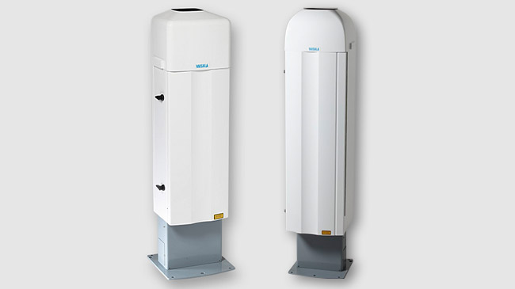

> 上图是 Vaisala CL31/CL51 云高仪产品图。白色圆筒状外壳，高度约 0.5–1 m，是全球机场跑道边的常见设备。图片来自 [Vaisala 官网](https://www.vaisala.com/en/products/weather-environmental-sensors/ceilometers-CL31-CL51-meteorology)。

- **Leosphere / Vaisala WindCube**——测风 LiDAR，用于风力发电场选址和风场监测。1550 nm 人眼安全波长，设备约 1 m 见方，部署在风电场中与风塔并排。

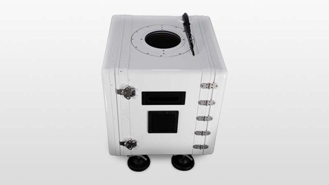

> 上图是 Vaisala WindCube 测风 LiDAR 的产品图。方形外壳约 1 m 见方，通常部署在空旷地面或风电场中。图片来自 [Vaisala 官网](https://www.vaisala.com/en/products/systems/external-systems/windcube)。

- **中科院大气物理研究所**——北京铁塔（325 m）上安装有多波段 LiDAR 系统，包括 532 nm 偏振通道，长期观测北京上空气溶胶垂直分布。夜间有时能看到绿色光柱。

> 🖼️ 你可以在百度搜索 `北京325米气象塔 激光雷达` 或 `中科院大气物理所 铁塔 lidar`，能看到铁塔顶部安装的 LiDAR 系统和夜间绿色光柱的照片。这个 325 米的铁塔位于北京市海淀区，是亚洲最高的气象观测塔。

- **日本 EKO Instruments DIAL 系统**——2025 年在长崎福江岛部署了微脉冲差分吸收 LiDAR（DIAL），用于水汽和温度廓线测量，辅助洪水预测。使用 NSF NCAR 提供的设备。

> 🖼️ 你可以搜索 `NCAR micro pulse lidar DIAL` 或 `EKO Instruments DIAL Fukue Island` 查看差分吸收 LiDAR 设备的实拍照片——通常是一个白色方箱形设备安装在海岸边或山顶的开阔地上。

> **想象一下**：你在北京 325 米气象塔旁边，晚上抬头看，可能会看到一条细细的绿色光束从塔顶直射上去，穿过雾霾逐渐变淡——那就是 532 nm LiDAR 在工作。而旁边机场跑道边的云高仪，虽然也在发射激光，但你看不到，因为它用的是 910 nm 的红外光。

---

### 9.2 车载移动式走航扫描

车载式把 LiDAR 装在车顶（或拖车里），**边走边扫**：

- 通常配一个小型发电机或者直接用车载电源。
- 激光朝天顶方向发射（也可斜扫）。
- GPS + IMU（惯性导航）记录每时每刻的精确位置和姿态。
- 软件实时生成"污染浓度 vs 位置"的走航图。

优势：

1. **灵活机动**：哪里有投诉就去哪里，哪里有工地扬尘就开过去。
2. **大面积覆盖**：一个下午可以走完整个城区的主干道。
3. **热点追踪**：发现异常高值可以停下来细扫，做"污染侦探"。
4. **执法辅助**：在环保检查中，走航车可以快速锁定排放源头位置。

**真实工程案例**：

- **中国各城市走航车**——很多环保公司和监测站已经配备了车载 LiDAR。典型配置是车顶装一个小型望远镜筒（直径约 20–30 cm，高度约 50 cm），内部封装激光器和接收器。车后座放数据采集电脑和 GPS。

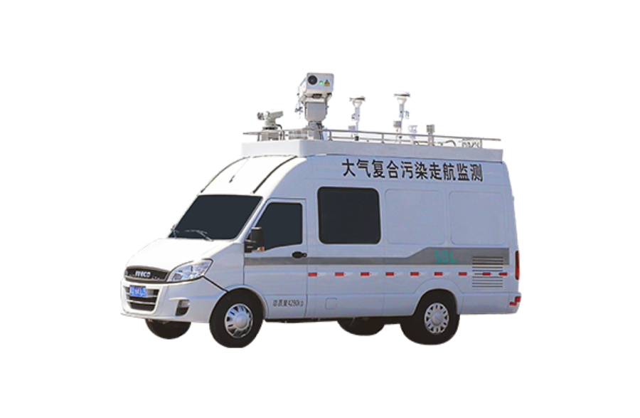

> 上图是典型的车载走航 LiDAR 系统。车顶装有圆筒形激光雷达传感器，车内配备数据采集电脑和 GPS，沿道路行驶时实时生成污染浓度分布图。

> 🖼️ 如果图片未显示，请将走航车图片保存为 `assets/images/mobile_lidar_vehicle.jpg`。你也可以搜索 `车载激光雷达 走航车` 查看更多同类设备的照片。

- **美国 NASA 移动 LiDAR 单元**——NASA 的 MPLNET（微脉冲 LiDAR 网络）使用可移动部署的仪器，在野火监测和火山灰追踪中发挥关键作用。

- **ESA Aeolus 卫星**——虽然是卫星而不是车载，但原理相同：2018 年发射的 Aeolus 搭载了全球首个太空多普勒测风 LiDAR（355 nm 紫外），从 400 km 高空向下扫描全球风场，2023 年已退役，但其数据彻底改变了数值天气预报精度。


> 上图是 ESA Aeolus 卫星，搭载了全球首个太空测风 LiDAR（Aladin 仪器）。图片来自 [ESA 官网](https://www.esa.int/Applications/Observing_the_Earth/Aeolus)。

---

### 9.3 为什么要"固定 + 车载"双管齐下

对真正要落地的工地或园区系统来说，最理想的架构往往不是二选一，而是组合：

1. **高点固定式**负责区域大范围扫描和告警。
2. **车载式**收到任务后去热点附近复扫。
3. **结果再回传平台**，形成闭环证据链。

这就像城市的安防系统：**固定摄像头负责日常监控，巡逻车负责接警后赶赴现场**——两种手段缺一不可。

---

### 9.4 设备长什么样？（真实图片指引）

下面是几类典型设备的**真实照片**（已下载到本地，可直接在 Markdown 预览中查看）：

#### ① 云高仪（Ceilometer）——Vaisala CL31 / CL51


> 这是全球机场标配的云高仪。白色圆筒状，高度约 0.5–1 m，装在跑道边或气象站里，使用 910 nm 近红外激光，人眼安全级别，7×24 不间断运行。上图来自 [Vaisala 官网](https://www.vaisala.com/en/products/weather-environmental-sensors/ceilometers-CL31-CL51-meteorology)。

#### ② 大气 LiDAR 系统安装实景

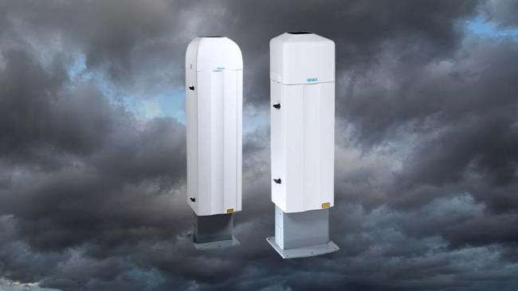

> LiDAR 设备通常安装在楼顶、铁塔或卡车上的保护罩内，望远镜窗口朝天。上图展示的是 Vaisala 云高仪的典型安装场景。

#### ③ CALIPSO 卫星——太空 LiDAR 的先驱

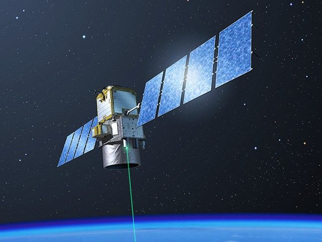

> CALIPSO（Cloud-Aerosol Lidar and Infrared Pathfinder Satellite Observation）是 NASA 和法国 CNES 联合研制的卫星，2006 年发射，搭载 532 nm / 1064 nm 双波长偏振 LiDAR，从太空向下扫描全球气溶胶和云的垂直分布。上图来自 [NASA CALIPSO 任务页](https://science.nasa.gov/mission/calipso)。

#### ④ ESA Aeolus 卫星——全球首个太空测风 LiDAR


> Aeolus 于 2018 年发射，搭载 355 nm 紫外多普勒测风 LiDAR（Aladin 仪器），从 400 km 高空向下扫描全球风场，2023 年退役。其数据使数值天气预报精度提升了约 10%。上图来自 [ESA Aeolus 任务页](https://www.esa.int/Applications/Observing_the_Earth/Aeolus)。

#### ⑤ 其他设备搜索指引

以下设备暂未找到可下载的公开图片，但你可以用关键词搜索查看：

| 设备类型 | 搜索关键词 | 你会看到什么 |
|---------|-----------|------------|
| 车载走航 LiDAR | `车载激光雷达走航` 或 `mobile lidar vehicle` | 白色面包车或皮卡，车顶装着一个圆筒形"炮筒" |
| 测风 LiDAR | `WindCube lidar photo` 或 `wind lidar` | 方形或六边形设备，约 1 m 高，像个小冰箱，装在空旷地面 |
| 532 nm 激光光束 | `green laser beam atmosphere night` 或 `lidar 532nm beam` | 夜空中一条直上直下的绿色光柱，在雾霾中逐渐变淡 |
| 北京铁塔 LiDAR | `中科院大气物理研究所 325米铁塔 激光雷达` | 铁塔顶部安装的多波段 LiDAR 系统 |

> 💡 **小贴士**：搜索时优先选择厂商官网（Vaisala、Leosphere）或科研机构（NASA、ESA、中科院大气物理所）的图片，画质和标注更可靠。

---

## 10. 硬件怎么选，小白先抓住哪些原则

> **本节只针对颗粒物（PM₂.₅ / PM₁₀ / 扬尘 / 粉尘）检测场景。**
> 如果你还想测风场、测温度廓线、测水汽，那需求会复杂很多，本节不覆盖。

### 10.1 波长怎么选——颗粒物场景只有两条主路

#### 先说结论

> **只做颗粒物检测，第一台设备推荐选近红外（905 / 1064 nm）微脉冲路线。**
> 理由：更容易做成人眼安全设计、7×24 连续运行、无需专人值守、法规和现场管理风险相对较低。
> 532 nm 虽然灵敏度高，但在城区部署时激光安全审批流程长、运维成本高，适合进阶阶段。

#### 三条路线对比

| 路线 | 常见波长 | 灵敏度 | 人眼安全 | 连续运行 | 法规难度 | 典型价格 | 适用场景 |
| --- | --- | --- | --- | --- | --- | --- | --- |
| **近红外微脉冲（推荐入门）** | 905 / 910 / 1064 / 1550 nm | ⭐⭐⭐ | ✅ Class 1M / 3R | ✅ 7×24 | 低 | 8–30 万 | 工地扬尘、园区边界、城市监测站 |
| **532 nm 弹性 LiDAR** | 532 nm（绿光） | ⭐⭐⭐⭐ | ⚠️ Class 3B/4 | ⚠️ 需审批 | 高 | 30–80 万 | 科研级气溶胶垂直廓线、沙尘暴传输 |
| **多波长偏振** | 355+532+1064 nm | ⭐⭐⭐⭐⭐ | ⚠️ 含紫外，需审批 | ⚠️ 需审批 | 很高 | 100–300 万 | 气溶胶分类、科研站、超级站 |

#### 为什么近红外适合颗粒物入门？

1. **更容易做成人眼安全设计**：1550 nm 主要被眼前节吸收，通常更容易实现视网膜安全；905/910 nm 虽然常用于低功率商用 LiDAR，但仍可能到达视网膜，最终安全性必须按脉冲能量、发散角、重复频率、扫描方式和 IEC 60825 / GB 7247.1 的 MPE 评估来判断，不能只凭波长下结论。
2. **法规和现场管理相对友好**：近红外微脉冲设备更容易做到 Class 1M / 3R 等较低风险等级，但具体部署要求仍要以制造商激光安全报告、当地监管要求、安装高度、扫描区域和现场风险评估为准。532 nm 同等发射条件下更容易落入 Class 3B/4，通常需要更严格的隔离、联锁和报备流程。
3. **7×24 运行**：微脉冲（单脉冲能量微焦耳级，重复频率 kHz）不像大能量 Nd:YAG 那样需要水冷和维护，插上电就能跑几个月不管。
4. **灵敏度够用**：颗粒物（尤其是 PM₁₀ 和扬尘）的后向散射截面大，905 nm 完全够检测。PM₂.₅ 在高湿度条件下虽然偏弱，但配合湿度校正算法（见第 11 节），近红外也能定量。

#### 什么时候该升级到 532 nm？

| 升级信号 | 具体表现 |
|---------|---------|
| 需要区分沙尘和雾霾 | 532 nm 偏振通道可提供退偏比，区分球形（雾/霾）和非球形（沙尘/扬尘）粒子 |
| 需要更远的探测距离 | 532 nm 大气透过率高、探测器（PMT）量子效率高，有效距离可达 10–15 km |
| 需要和科研数据对比 | 532 nm 是全球 AERONET 和 CALIPSO 的标准波长，数据可直接比对 |
| 客户或评审要求 | 某些省级监测站招标明确要求 532 nm |

### 10.2 接收端为什么也很重要

很多人会把注意力全放在激光器上，觉得"激光功率大 = 性能好"。实际上接收端同样关键——**光打得出去只是第一步，能不能把微弱回波收回来才是决定性能的瓶颈**。

#### 接收端的核心参数

| 参数 | 含义 | 颗粒物场景推荐值 | 为什么 |
| --- | --- | --- | --- |
| **望远镜口径** | 决定收集光子的面积 | **80–200 mm** | 口径太小，远距离回波信噪比不够；口径太大，体积和成本急剧上升。颗粒物场景 100 mm 是甜点。 |
| **视场角（FOV）** | 接收光束的锥角 | **0.5–2.0 mrad** | 小 FOV 背景光少、距离分辨率高，但需要更精密的光轴对准。颗粒物场景推荐 1.0 mrad 左右。 |
| **滤光片带宽** | 允许通过的波长范围 | **0.5–3 nm**（窄带干涉滤光片） | 白天太阳背景光很强，窄带滤光片可以把背景压低 1000 倍以上。带宽越窄，白天性能越好，但成本越高。 |
| **探测器类型** | 把光子变成电信号的器件 | 近红外 → **APD**（雪崩光电二极管）；532 nm → **PMT**（光电倍增管） | APD 适合 905/1064 nm，量子效率约 70%；PMT 适合 532 nm，量子效率约 20% 但增益极高。 |
| **探测器增益** | 电信号放大倍数 | APD：内增益 ~100；PMT：10⁶ | 颗粒物回波很弱（nW 级别），必须有足够增益才能被 ADC 采样。 |

#### 一个直观的比喻

想象你在夜间用手电筒照远处的墙壁：

- **激光器 = 手电筒的灯泡**：功率决定照多亮。
- **望远镜口径 = 你的眼睛大小**：口径越大，能看到的反射光越多。
- **滤光片 = 戴上只允许手电筒颜色通过的眼镜**：把周围路灯、月光等干扰全挡掉。
- **探测器 = 视网膜灵敏度**：APD/PMT 决定了你能感知多暗的光。

**灯泡再亮，如果眼睛不好、眼镜不对，还是看不清。** 这就是为什么接收端同等重要。

#### 颗粒物场景的接收端选择建议

1. **入门方案（905 nm）**：望远镜口径 80–100 mm，APD 探测器，1.5 nm 滤光片。成本可控，夜间性能不错，白天 3 km 以内可用。
2. **进阶方案（1064 nm 或 532 nm）**：望远镜口径 150–200 mm，APD/PMT 探测器，0.5 nm 窄带滤光片。白天有效距离 5–10 km，可做偏振测量。
3. **关键提醒**：口径和 FOV 要匹配激光发散角。如果激光发散角 0.5 mrad 而 FOV 设 2 mrad，背景光会大量涌入，白天性能严重下降。一般建议 FOV 略大于激光发散角（约 1.5–2 倍）。

### 10.3 近距离盲区——扬尘监测的"致命伤"

#### 什么是盲区？

发射激光束从激光器出来后，是一个逐渐变宽的锥形。接收望远镜的视场也是一个锥形。这两个锥形在很近的距离（比如 0–50 m）并不完全重合——**激光照到了，但望远镜看不到**。

这就叫 **几何重叠因子不完整（incomplete overlap）**，对应的区域就是"盲区"。

#### 盲区有多大？

| 设备类型 | 典型盲区范围 | 盲区内数据表现 |
| --- | --- | --- |
| 同轴设计（发射和接收共用主镜） | **0–30 m** | 盲区小，近距离数据可用性好 |
| 双轴分离设计（发射和接收并排） | **50–200 m** | 盲区大，需要 overlap 校正 |
| 大口径远距 LiDAR | **100–500 m** | 盲区最大，通常用软件校正补偿 |

#### 为什么扬尘场景必须关心盲区？

> **工地扬尘、道路扬尘的主要排放源都在地面以上 0–50 m。** 这恰好和很多设备的盲区重叠！

如果不处理盲区，可能出现这样的荒唐结果：
- 工地出口扬尘滚滚 → 设备显示浓度正常 → 环保部门说达标 → 实际上盲区把信号吃掉了。

#### 怎么解决盲区问题？

| 方法 | 原理 | 适用场景 |
| --- | --- | --- |
| **同轴光路设计** | 发射和接收共用一块反射镜，从根本上减小盲区 | 新采购设备时优先选择 |
| **overlap 校正函数** | 用实验测出重叠因子曲线，软件校正近距离信号 | 已有设备的补救方案 |
| **倾斜安装** | 设备不朝天顶，而是倾斜 15°–30° 扫描，让盲区对应的距离变成斜距上的高空 | 固定站点、需要避开盲区的场景 |
| **辅助近距传感器** | 在 0–50 m 范围加一个短距光学传感器（如浊度计）补盲 | 精度要求高的工程 |

> 💡 **采购建议**：如果主要监测工地扬尘和道路粉尘，**一定要问厂商要 overlap 曲线**（也就是几何重叠因子随距离变化的图）。如果厂商提供不了，说明他们的近距离数据可能不可靠。

### 10.4 人眼安全与法规要求——城区部署必须搞清楚

#### 激光安全等级（GB 7247.1 / IEC 60825-1）

| 等级 | 含义 | 典型设备 | 城区能否部署 |
| --- | --- | --- | --- |
| **Class 1** | 正常使用条件下安全 | 封装好的测距仪 | ✅ 通常最容易部署，但仍要按说明书安装 |
| **Class 1M** | 裸眼正常观察通常安全，但用望远镜等光学仪器直视有风险 | 905 nm 微脉冲 LiDAR | ✅ 通常较易部署，需避免光学放大直视 |
| **Class 3R** | 可见光 ≤ 5 mW，不可见光 ≤ 5–50 mW | 部分 1064 nm 微脉冲 | ⚠️ 需要张贴警示标识 |
| **Class 3B** | 直视光束有危害 | 532 nm 中等功率 LiDAR | ❌ 需要围栏、联锁、审批 |
| **Class 4** | 甚至漫反射都有危害 | 大能量 Nd:YAG LiDAR | ❌ 严格审批，通常只在实验室或野外 |

#### 颗粒物场景的法规实操

1. **905 / 1064 nm 微脉冲（Class 1M / 3R）**：
  - 装在楼顶或铁塔上，距离地面 >3 m，通常更容易通过现场安全评估。
  - 建议张贴"请勿直视镜头"标识，并明确禁止用望远镜、长焦镜头等光学设备直视出光口。
  - 大多数商用云高仪和微脉冲 LiDAR 会按较低风险等级设计，但仍应以厂商检测报告为准。

2. **532 nm 绿光（通常是 Class 3B）**：
   - 需要向当地环保局和公安局报备。
   - 设备周围需要物理隔离（围栏 + 警示灯）。
   - 夜间光束可能被市民看到并投诉，需要做好沟通预案。
   - 部分城市（如北京）对城区 532 nm 激光有额外限制。

3. **1550 nm（Class 1M / 3R）**：
   - 角膜和晶状体在 1550 nm 吸收极强，光几乎不到达视网膜，安全性最好。
   - 可以用比 905 nm 更高的功率，同时仍然安全。
   - 缺点：探测器和光学元件比 905 nm 贵。

> ⚠️ **合规红线**：无论选什么波长，设备最终的安全等级都要以**制造商提供的激光安全检测报告**和现场部署风险评估为准。不要自行改装或增大功率，否则安全等级、审批条件和事故责任都会发生变化。

### 10.5 颗粒物场景推荐配置清单

> 以下是基于当前市场情况的**参考配置**，具体选型以厂商报价和实测数据为准。

#### 方案 A：入门级（工地扬尘监测站）

| 参数 | 推荐值 | 说明 |
| --- | --- | --- |
| 波长 | 905 nm | 近红外，人眼安全 |
| 单脉冲能量 | 3–10 μJ | 微脉冲级别 |
| 重复频率 | 5–10 kHz | 高频累计提高信噪比 |
| 望远镜口径 | 80–100 mm | 够用，成本可控 |
| 探测器 | Si-APD | 905 nm 量子效率约 70% |
| 距离分辨率 | 7.5–15 m | 对应采样率 10–20 MHz |
| 有效探测距离 | 1–5 km（夜间）/ 0.5–3 km（白天） | 取决于气溶胶负载 |
| 盲区 | <30 m（同轴设计） | 需确认 overlap 曲线 |
| 供电 | DC 12–24 V / <50 W | 可用太阳能 + 蓄电池 |
| 通信 | 4G / 以太网 / RS485 | 接环保监测平台 |
| 防护等级 | IP65 以上 | 户外防雨防尘 |
| **参考价格** | **8–20 万/台** | 不含安装和平台软件 |

##### 🏗️ 方案 A 实战问答：工地扬尘 LiDAR 到底怎么工作？

> **Q1：需要 360° 无死角扫描吗？**
>
> **不需要。** 这是最常见的误解。工地扬尘 LiDAR 通常**垂直朝天发射**（天顶方向），就像一根光柱直直打上去。它测量的是正上方从地面到几公里高空这一条"柱子"里的颗粒物浓度廓线，而不是扫一圈看四周。
>
> 打个比方：它就像一根竖在工地上空的"温度计"，测的是头顶这条线上每一层高度的颗粒物浓度。你需要的是知道"扬尘飘到多高、浓度有多大"，而不是"哪个方向有扬尘"。

> **Q2：那要测不同方向怎么办？**
>
> 如果确实需要扫描不同方向（比如找出附近哪个工地在扬尘），那就需要**扫描式 LiDAR**（价格通常是固定式的 2–3 倍）。但 90% 的工地扬尘监测场景，**固定垂直朝天的单点观测就够了**，因为：
> - 工地扬尘很快就会扩散混合，垂直廓线已经能反映局地污染水平
> - 环保监管考核的是站点数据，不是方位图
> - 360° 扫描 LiDAR 数据量大、分析复杂，入门阶段没必要

> **Q3：装在哪里？**
>
> 工地扬尘 LiDAR 的典型安装方式：

| 安装方式 | 位置 | 优缺点 | 适用场景 |
| --- | --- | --- | --- |
| **立杆固定** | 工地围挡边 3–6 m 立杆顶部 | ✅ 最常见、安装简单；❌ 占地 | 长期监测、环保局要求 |
| **围墙/屋顶** | 工地临建房或围墙顶 | ✅ 不额外占地；❌ 需确保无遮挡 | 场地紧张的工地 |
| **集装箱监测站** | 标准环保监测小屋（2 m × 2 m） | ✅ 一体化、防盗；❌ 成本稍高 | 有预算的规范化站点 |
| **车载** | 巡逻车/工程车车顶 | ✅ 灵活机动；❌ 需减震、供电方案 | 走航巡查、临时监测 |

> **Q4：能装车上吗？**
>
> 可以，但有注意事项：
> - **减震**：LiDAR 内部有望远镜和精密光学元件，车载需要加装减震平台（橡胶垫/气弹簧），否则颠簸会严重影响数据质量
> - **供电**：方案 A 功耗 <50 W，车载电瓶或点烟器逆变器即可供电
> - **水平安装**：车载走航时 LiDAR 通常改为**水平发射**（朝前或朝后），而不是朝天，用来扫描道路沿线的扬尘分布
> - **价格提醒**：车载方案虽然 LiDAR 本身不贵，但减震平台 + GPS + 车载供电系统通常额外加 3–5 万

> **Q5：工地扬尘 LiDAR 日常怎么工作？**
>
> 一句话概括：**全自动，插上电就不用管。**
>
> 1. LiDAR 每隔几秒到几分钟发射一次激光脉冲（全自动，无需人工操作）
> 2. 回波信号经过内部处理器自动计算，得到一条从近地面到高空的**消光系数廓线**
> 3. 通过内置算法将消光系数换算为 PM2.5 / PM10 浓度的垂直分布
> 4. 数据通过 4G 自动上传到环保监测平台
> 5. 当某个高度层的颗粒物浓度超过阈值时，平台自动报警
> 6. 工地可以根据报警联动喷淋系统：扬尘大了自动喷水

```
  ☁️ 高空气溶胶层
   │
   │  ← LiDAR 测到这条线上的颗粒物浓度
   │
   │     ▓▓▓  ← 扬尘层（浓度高）
   │
   │
   ┌─┐
   │●│  ← LiDAR（朝天发射）
   └─┘
  ═════  工地地面
```

> 💡 **关键提醒**：工地扬尘 LiDAR 测的是**垂直廓线**（"空气柱"里的分层浓度），和地面上那种只测一个数值的点式 PM2.5 传感器是互补关系，不是替代。最理想的配置是：**地面一个点式传感器 + 一台朝天 LiDAR**，这样既有地面精确浓度，又有高空扩散信息。

#### 方案 B：进阶级（城市空气质量监测站 / 科研站点）

| 参数 | 推荐值 | 说明 |
| --- | --- | --- |
| 波长 | 532 nm + 1064 nm 双波长 | 偏振 + 近红外互补 |
| 单脉冲能量 | 532 nm: 20–100 μJ / 1064 nm: 50–200 μJ | 中等能量 |
| 重复频率 | 20–50 Hz（脉冲式） | 比 micro-pulse 能量高但频率低 |
| 望远镜口径 | 150–200 mm | 卡塞格林反射式 |
| 探测器 | 532 nm: PMT / 1064 nm: APD | 双通道同步采集 |
| 偏振通道 | 532 nm 平行 + 垂直偏振 | 提供退偏比，区分沙尘和雾霾 |
| 距离分辨率 | 3.75–7.5 m | 采样率 20–40 MHz |
| 有效探测距离 | 5–15 km | 夜间高空可达 15 km |
| 盲区 | 50–200 m（双轴设计） | 需要 overlap 校正 |
| 供电 | AC 220 V / 200–500 W | 需要稳定市电 |
| 通信 | 以太网 / 4G | 接监测平台和科研数据库 |
| 防护等级 | IP65 以上 + 温控舱 | 需要温控（激光器对温度敏感） |
| **参考价格** | **30–80 万/台** | 含偏振通道和温控系统 |

#### 方案 C：科研级（超级站 / 沙尘暴监测网）

| 参数 | 推荐值 | 说明 |
| --- | --- | --- |
| 波长 | 355 + 532 + 1064 nm 三波长 | 拉曼 + 偏振 + 弹性 |
| 偏振 | 355 nm 和 532 nm 双偏振 | 四通道以上 |
| 望远镜口径 | 200–400 mm | 大口径卡塞格林 |
| 探测器 | PMT 阵列 | 多通道同步 |
| 距离分辨率 | 3.75 m | 40 MHz 采样 |
| 有效探测距离 | 10–20 km | 高空卷云都能看到 |
| 附加功能 | 拉曼通道（N₂ / H₂O）、温控舱、自动校准 | 全自动运行 |
| **参考价格** | **100–300 万/台** | 进口设备可能更贵 |

> 💡 **选型建议**：90% 的颗粒物工程应用用**方案 A**就够了。只有当你需要区分气溶胶类型（沙尘 vs 雾霾 vs 烟尘）、或者探测距离要求 >5 km 时，才需要升级到方案 B。方案 C 基本是科研院所的事。

### 10.6 采购避坑指南

#### 问厂商的 10 个关键问题

1. **激光安全等级是多少？**（必须拿到检测报告，不是口头承诺）
2. **盲区多大？能提供 overlap 曲线吗？**
3. **白天和夜间的有效探测距离分别是多少？**（很多厂商只报夜间最佳值）
4. **距离分辨率是多少？**（7.5 m = 采样率 20 MHz，3.75 m = 40 MHz）
5. **望远镜口径和 FOV 各是多少？**
6. **有没有做过和标准仪器（如 BAM / TEOM）的比对实验？**（能提供相关系数 r² > 0.8 的数据最好）
7. **数据输出格式是什么？**（二进制 / NetCDF / CSV？有没有 API？）
8. **售后响应时间多长？**（野外设备坏了，多久能派人到现场？）
9. **有没有已部署项目的案例和客户联系方式？**（最好能打电话问真实用户）
10. **功耗和供电要求？**（能不能用太阳能？偏远地区很关键）

#### 常见陷阱

| 陷阱 | 表现 | 怎么识别 |
| --- | --- | --- |
| **虚标探测距离** | 宣称 10 km，实际白天只有 2 km | 要求看白天实测数据，不要只看夜间曲线 |
| **忽略盲区** | 从来不提 overlap 问题 | 主动问盲区范围和 overlap 曲线 |
| **混淆距离分辨率和空间分辨率** | 宣称"1 m 分辨率"，实际是过采样 | 问清楚是硬件分辨率还是软件插值 |
| **用实验室数据代替野外数据** | 只展示暗室里对硬靶的测试 | 要求提供真实大气环境下的测试数据 |
| **低价套路** | 报价很低但不含安装、软件、校准 | 问清楚报价包含哪些，不含哪些 |
| **波长不对** | 用测距用的 905 nm TOF 传感器冒充 LiDAR | 真正的 LiDAR 有后向散射廓线，不是单点测距 |

---

## 11. 颗粒物版本的数据处理到底怎么走

这一节是整份文档里最重要的工程部分之一。因为真正把系统做出来时，你面对的不是“一个公式”，而是一整条数据流水线。

### 11.0 如果你数学基础比较弱，先看这张总流程图


你可以先不要急着记公式，先把这张图读顺：

1. 最左边是机器真正测到的原始回波，它里面既有目标信息，也有各种噪声。
2. 中间每一个方框都在解决一种具体误差，例如背景光、探测器失真、发射能量波动、近距离重叠不足。
3. 最右边的意思是：只有把这些非目标因素先拿掉，后面才值得做反演。

如果你现在只想抓住一句话，那就是：

> 算法链前半段不是在“炫技术”，而是在努力回答一个更朴素的问题：我看到的回波，到底有多少是真的空气和颗粒物，多少只是设备和环境带来的假信号。

如果你更想先看一张网上现成、最经典的基础示意图，可以看 NOAA 这张：


这张图特别适合数学基础弱的读者，因为它同时把两件事画出来了：

1. 左边是空间过程：激光脉冲打出去，沿路不断有微弱回波返回。
2. 右边是数据结果：返回信号会随着距离变化形成一条曲线。
3. 这张图把“空间里发生了什么”和“电脑里最后看到什么”直接连在一起了。

> **🎯 关键原理：这条曲线是怎么来的？**
>
> 右边那条曲线，就是**发射一次激光脉冲**后收到的全部回波信号。注意，不是多次累加，是**一发一收**画出来的。
>
> 那 X 轴的"距离"是怎么知道的？LiDAR 并没有拿尺子去量，而是用了一个非常朴素的方法——**计时**：
>
> 1. 激光器发出一个极短的脉冲（纳秒级），同时计时器开始计时（t = 0）
> 2. 脉冲飞出去，遇到 500 m 处的颗粒物，一部分光被散射回来
> 3. 回波走了 500 m 去程 + 500 m 回程 = 1000 m，以光速飞行，耗时约 3.3 μs
> 4. 探测器收到这束回波时，计时器显示 3.3 μs
> 5. 电脑反算：$R = \frac{c \cdot \Delta t}{2} = \frac{3 \times 10^8 \times 3.3 \times 10^{-6}}{2} \approx 500 \text{ m}$
>
> 也就是说，**X 轴上每一个距离值，本质上就是一个时间戳除以 2 再乘以光速**。曲线上左边的点（近距离）先回来、右边的点（远距离）后回来——这条曲线本身就是回波信号按到达时间排好队的结果。
>
> 实际工程中，探测器以固定频率（比如 20 MHz，即每 50 ns 采一个点）连续采样，每个采样点对应一个距离门（range gate），一个采样点 = 7.5 m 的距离分辨率。

你读这张图时，建议只抓住 3 个问题：

1. 为什么越远回波越晚回来。——因为光要走来回，距离越远耗时越长，回波越晚被探测器收到。
2. 为什么回波曲线不是平的，而会有起伏和峰值。——因为不同高度上的颗粒物浓度不一样，浓度高的地方散射强、回波就强，曲线就鼓起来。
3. 为什么曲线里的高值区，往往对应空气里有更多散射体的区域。——因为回波强度直接反映了该距离处空气把多少光"弹回来"的能力。

来源：NOAA Chemical Sciences Laboratory 的 LIDAR 原理页，适合做入门直觉图。

#### 老师讲课版：这张图请按 4 眼来看

第 1 眼，只看左边，不看右边。

你先把自己想象成站在设备旁边，看到一束很短的激光脉冲打出去。它不是一下子照亮整片天空，而是像一个很短的光包沿着前方飞出去。

第 2 眼，继续只看左边，注意“沿路每一段空气都会给一点点回波”。

空气分子、颗粒物、粉尘、烟雾，都可以把极少量光散射回来。离设备近的那一段空气，会先把回波送回来；离设备远的那一段空气，会更晚才把回波送回来。

第 3 眼，再去看右边曲线。

右边这条曲线，本质上就是把“不同距离上返回了多少光”按距离排成一列。也就是说：

1. 左边空间里每一小段空气。
2. 在右边曲线上都会对应一个自己的位置。
3. 哪一段空气散射更强，曲线在那个距离上就更高。

第 4 眼，把左右两边连起来。

这一步最关键。你要建立一个稳定直觉：

> 左边看到的是物理世界里光怎么走，右边看到的是电脑把这些返回光按距离排好之后的结果。

如果你只能记住一句最核心的话，那就是：

> 空间里哪一段空气更容易把光打回来，曲线在那个距离位置就更容易鼓起来。

这就是后面所有预处理、反演、识别算法的起点。因为算法并不是凭空制造信息，它只是想办法把这条曲线里的结构，重新翻译回空间里的粉尘分布。

建议把数据链分成 5 个层级，这样工程上最好管理。

| 级别 | 内容 | 典型数据形态 | 小白理解 |
| --- | --- | --- | --- |
| L0 | 原始 ADC / photon counts / 元数据 | 一维波形、二维时距矩阵、角度序列、姿态序列 | 机器刚吐出来的原始记录 |
| L1 | 背景扣除、暗电流、死时间、能量归一化、RCS | 已清洗的 profile | 先把脏信号洗干净 |
| L1.5 | attenuated backscatter、depol、云雨 mask、SNR | 可展示的物理图层 | 可以先给人看图了 |
| L2 | backscatter、extinction、PM 估算、层顶层底 | 物理量剖面和扫描面产品 | 真正进入业务指标 |
| L3 | 2D/3D 网格、热点轨迹、统计报表、告警事件 | 体素、栅格、事件表、质心点 | 平台和联动控制直接消费 |

> **📖 初学者名词速查：表格里那些看不懂的词**
>
> 上面的表格用了很多专业缩写，如果你是初学者，一个一个搜很浪费时间。下面按从 L0 到 L3 的顺序，把每个词翻译成大白话：
>
> **L0 层（机器刚吐出来的原始数据）**
>
> | 术语 | 大白话解释 |
> | --- | --- |
> | **ADC** | Analog-to-Digital Converter，模数转换器。探测器收到的是模拟电压信号（连续的波浪），ADC 把它变成电脑能存的数字。就像用手机录音时，麦克风收到声波，ADC 把声波变成一串数字音频数据。ADC 采样率决定了距离分辨率（20 MHz → 7.5 m）。 |
> | **photon counts** | 光子计数。高端 LiDAR（比如光子计数型）不是测电压，而是"一个一个数光子"——每飞回来一个光子就记一个 1。就像用计数器数雨滴，滴一滴按一下。适合极弱信号（高空探测），但设备更贵。 |
> | **元数据** | 不是测量数据本身，而是"描述这次测量的附加信息"：什么时间测的、激光能量多大、设备温度多少、GPS 位置在哪。就像照片的 EXIF 信息（拍摄时间、光圈、ISO），不是画面内容但必不可少。 |
> | **一维波形** | 最基本的数据形态——一条"回波强度 vs 距离"的曲线，就是前面 NOAA 示意图右边那条线。一次激光脉冲 → 一条一维波形。 |
> | **二维时距矩阵** | 连续发射很多次脉冲，把每次的波形按时间排成一行，就变成一张二维图：横轴是距离，纵轴是时间，颜色代表回波强度。类似热力图，能看出颗粒物层随时间的演变。 |
>
> **L1 层（清洗后的数据）**
>
> | 术语 | 大白话解释 |
> | --- | --- |
> | **背景扣除** | 即使不发射激光，探测器也会收到太阳光、天空散射光等"背景噪声"。做法很简单：在两个激光脉冲之间的间隙，测一次没有激光时的信号，然后减掉。就像拍照时先拍一张"黑帧"（盖住镜头），再从每张照片里减去这个噪声。 |
> | **暗电流** | 探测器完全不见光时也会有微弱电流输出（因为温度导致电子热运动）。就像收音机没信号时也有嘶嘶声。通常通过测"盖住镜头时的输出"来估计并减掉。 |
> | **死时间** | 探测器收到一个光子后需要一小段恢复时间才能接收下一个（就像人眨眼的那一瞬间看不到东西）。高频信号下这会导致近处强回波被"数少了"，需要数学校正。 |
> | **能量归一化** | 每次脉冲的激光能量不可能完全一样（会有 ±5% 的波动）。如果不校正，能量大的那次回波就偏高、能量小的就偏低。做法：测出每次实际发射能量 E₀，把回波除以 E₀，这样就消除了发射能量波动的影响。 |
> | **RCS** | Range-Corrected Signal，距离校正信号。因为回波会随距离平方衰减（越远越弱），即使空气完全均匀，远处回波也会变小。公式是 RCS = P(R) × R²。做完这一步，曲线上的起伏才真正反映颗粒物浓度的变化，而不是"远了就弱"的数学假象。 |
> | **profile** | "廓线"——一条"某个物理量随高度/距离变化的曲线"。比如"消光系数廓线"就是消光系数随高度变化的曲线。LiDAR 的核心产品就是各种 profile。 |
>
> **L1.5 层（可以看图了）**
>
> | 术语 | 大白话解释 |
> | --- | --- |
> | **attenuated backscatter** | 衰减后向散射。简单说就是"每个距离上空气把多少光弹回来了"——但还没有做反演校正，所以只是一个半成品物理量。优点是不需要假设任何东西就能算出来，可以直接画图看。就像洗完菜但还没炒——干净了但还不能上桌。 |
> | **depol** | Depolarization ratio 的缩写，退偏比。激光发射时光是偏振的（振动方向一致），遇到球形颗粒（水滴）回波保持偏振，遇到非球形颗粒（沙尘、冰晶）回波偏振方向会变乱。退偏比 = 偏振变了多少 / 原来多少。退偏比高 → 多半是沙尘或冰晶；退偏比低 → 多半是水滴或球形气溶胶。这是区分颗粒物类型的**最关键参数之一**。 |
> | **云雨 mask** | 一张标记"哪些像素是云、哪些是雨、哪些是晴空"的分类标签图。就像修图软件里的"抠图蒙版"——把云和雨的区域标记出来，后续分析时可以单独处理或排除。 |
> | **SNR** | Signal-to-Noise Ratio，信噪比。信号强度 / 噪声强度。SNR = 10 表示信号是噪声的 10 倍（可靠）；SNR = 1 表示信号和噪声差不多大（不可靠，基本是猜的）。SNR < 3 的数据通常直接丢弃。就像你在一个嘈杂的酒吧里听朋友说话——他喊得越大声（信号越强）或者酒吧越安静（噪声越低），你听得越清楚（SNR 越高）。 |
>
> **L2 层（真正的业务指标）**
>
> | 术语 | 大白话解释 |
> | --- | --- |
> | **backscatter** | 后向散射系数 β。单位体积空气往 180° 方向（也就是往 LiDAR 方向）散射了多少光。这是 LiDAR 方程里最核心的物理量——β 越大，说明那个位置空气里的颗粒物越多或越大。 |
> | **extinction** | 消光系数 α。光每走 1 m 被空气"吃掉"多少（散射 + 吸收）。α 越大 → 空气越浑浊 → 能见度越低。PM2.5 浓度高时，消光系数也会高。α 和 β 的关系是 LiDAR 反演的核心难题。 |
> | **PM 估算** | 用 α 或 β 通过经验公式换算成 PM2.5 / PM10 浓度（μg/m³）。注意这是"估算"不是直接测量——LiDAR 测的是光学性质（光被散射了多少），要转换成质量浓度需要假设颗粒物的粒径分布、折射率等参数，有不确定性。 |
> | **层顶层底** | 颗粒物层（或云层）的顶部高度和底部高度。比如"今天边界层顶高 1.2 km"，意味着 1.2 km 以下污染物比较容易积累，1.2 km 以上空气比较干净。对空气质量预报非常重要。 |
>
> **L3 层（给平台和用户直接用的）**
>
> | 术语 | 大白话解释 |
> | --- | --- |
> | **体素** | Voxel = Volume + Pixel，三维像素。就像 2D 图片由像素（pixel）组成，3D 空间数据由体素组成。扫描式 LiDAR 把不同方位的廓线拼在一起，就能重建出 3D 的颗粒物分布，每个小方块就是一个体素。 |
> | **栅格** | Raster，规则的网格数据。把连续的空间数据切成整齐的小格子（类似棋盘），每个格子一个数值。是 GIS 和遥感中最常见的数据格式。 |
> | **事件表** | 一张记录"什么时候、什么地点、发生了什么事"的日志表。比如"14:23 工地北侧 200 m 高度 PM10 超标"就是一条事件记录。告警系统直接消费这个表。 |
> | **质心点** | 一个污染团的"重心"位置。就像用质心代表一个几何体的中心一样，质心点用来追踪一个扬尘团"漂到哪里了"。连续追踪质心点就能算出污染物的运动轨迹。 |

### 11.1 一次原始采样到底长什么样

很多初学者会以为设备每次输出的是一张图。其实不是。设备最底层拿到的通常是一串“按距离分箱的回波数组”。

最基础的一次 profile 往往包含：

1. 时间戳。
2. 通道编号。
3. 发射能量。
4. 方位角和仰角。
5. 回波数组。
6. 设备状态。
7. GPS 和 IMU 信息。

一个很简化的记录可以长这样：

```json
{
  "timestamp": "2026-05-27T10:23:15.120Z",
  "channel": "532_elastic",
  "azimuth_deg": 35.0,
  "elevation_deg": 12.0,
  "laser_energy_mj": 1.82,
  "range_resolution_m": 7.5,
  "signal_counts": [128, 124, 119, 116, 109, 98, 91],
  "gps": [121.4737, 31.2304, 28.5],
  "imu": [0.2, -0.5, 37.1]
}
```

这里的 `signal_counts` 只是示意。真实系统里它一般会更长，常常是几百到几千个 range bin。

> **🎯 关于接收窗口和 signal_counts，初学者最常问的几个问题**
>
> **Q1：发射一次激光后，要接收多久？怎么判断该接收多长时间？**
>
> 答案取决于你想测多远。回忆一下前面的公式 $R = \frac{c \cdot \Delta t}{2}$，反过来就是 $\Delta t = \frac{2R}{c}$：
>
> | 目标最远距离 | 回波最晚到达时间 | 接收窗口至少要多长 |
> | --- | --- | --- |
> | 1 km | 6.7 μs | ≈ 7 μs |
> | 5 km | 33.3 μs | ≈ 35 μs |
> | 10 km | 66.7 μs | ≈ 70 μs |
> | 20 km | 133.3 μs | ≈ 135 μs |
>
> 所以如果你宣称"探测距离 5 km"，接收窗口至少要开 35 μs。如果只开了 10 μs 就关闭接收，那 1.5 km 以外的回波确实还没回来就被丢了——**你说的完全正确，接收时间短了远处的数据就丢了**。
>
> 工程上，接收窗口的结束时刻由厂商预设（在设备配置里写死），通常比最大探测距离对应的时间再留 10–20% 余量。比如宣称 5 km 的设备，接收窗口可能设为 40 μs。
>
> **Q2：接收窗口和脉冲重复频率的关系**
>
> 这就引出一个关键约束：**两次脉冲之间必须留够时间让上一次的回波全部回来**。否则会出现"距离模糊"（range ambiguity）——你分不清某个回波是这一次脉冲的近处回波，还是上一次脉冲的远处回波。
>
> | 重复频率 PRF | 脉冲间隔 | 最大无模糊距离 |
> | --- | --- | --- |
> | 10 kHz | 100 μs | 15 km |
> | 5 kHz | 200 μs | 30 km |
> | 1 kHz | 1000 μs | 150 km |
> | 20 Hz | 50 ms | 7500 km |
>
> 所以方案 A（PRF = 5–10 kHz）对应最大无模糊距离 15–30 km，远超实际探测距离，没问题。而方案 B（PRF = 20–50 Hz）脉冲间隔很大（20–50 ms），不存在距离模糊问题，但每秒发射次数少，需要更长时间累计才能提高信噪比。
>
> **Q3：signal_counts 数组到底记录的是什么？**
>
> **是的，就是一次激光脉冲回波的多次采样结果。** 具体来说：
>
> 1. 激光脉冲发出的瞬间（t=0），ADC 开始以固定频率采样
> 2. 假设采样率 20 MHz（每 50 ns 采一个点），那么：
>    - 第 1 个采样点 → 对应距离 $R_1 = \frac{50 \text{ ns} \times c}{2} = 7.5$ m
>    - 第 2 个采样点 → 对应距离 $R_2 = 15$ m
>    - 第 3 个采样点 → 对应距离 $R_3 = 22.5$ m
>    - ……以此类推
> 3. 采样一直持续到接收窗口关闭
> 4. 这些采样值排成一列，就是 `signal_counts` 数组
>
> 所以 `signal_counts` 的**数组索引 = 距离门编号（range bin）**，每个值就是该距离处的回波强度。数组长度 = 采样点数 = 接收窗口时长 / 采样间隔。
>
> ```
> signal_counts[0]   →  7.5 m   处的回波强度
> signal_counts[1]   → 15.0 m   处的回波强度
> signal_counts[2]   → 22.5 m   处的回波强度
> ...
> signal_counts[666] → 5000 m   处的回波强度（5 km 设备的最后一个点）
> ```
>
> 打个比方：`signal_counts` 就像你站在路边，以固定频率拍照（比如每秒拍一张），每张照片记录的是那一瞬间路上有多少车经过。照片编号越靠后，对应的位置越远。
>
> 💡 **一句话总结**：一次脉冲 → 接收窗口打开 → ADC 以固定频率连续采样 → 采样值排成数组 → 数组索引就是距离 → 这就是 `signal_counts`。

> **Q4：采样率是不是就决定了空间精度？7.5 m 一个点，精度就是 7.5 米吗？**
>
> **对，但不完全对。** 需要区分两个概念：
>
> | 概念 | 含义 | 由什么决定 |
> | --- | --- | --- |
> | **距离分辨率** | 两个目标至少隔多远才能被区分开 | ADC 采样率（硬件） |
> | **空间定位精度** | 某个目标的位置测得有多准 | 采样率 + 脉冲宽度 + 系统校准 |
>
> **距离分辨率**确实是采样率直接决定的：
>
> $$
> \Delta R = \frac{c}{2 \cdot f_{\text{sample}}}
> $$
>
> | ADC 采样率 | 距离分辨率 | 每公里有多少个采样点 |
> | --- | --- | --- |
> | 10 MHz | 15 m | ≈ 67 个 |
> | 20 MHz | 7.5 m | ≈ 133 个 |
> | 40 MHz | 3.75 m | ≈ 267 个 |
> | 100 MHz | 1.5 m | ≈ 667 个 |
>
> 7.5 m 的意思就是：**如果一个扬尘层只有 5 m 厚，在 7.5 m 分辨率下它只会占不到一个采样点，你可能看不出它和周围空气的区别。** 这就像用 720p 和 4K 拍同一个画面——4K 能看清的细节，720p 可能就糊成一片了。
>
> **但是，"精度"不止看采样率，还有一个隐形瓶颈——脉冲宽度：**
>
> 激光脉冲不是数学上无限窄的 δ 函数，它有一个物理宽度（通常 5–20 ns）。脉冲宽度在空间上展开的距离是：
>
> $$
> \Delta R_{\text{pulse}} = \frac{c \cdot \tau}{2}
> $$
>
> | 脉冲宽度 τ | 脉冲空间长度 | 影响 |
> | --- | --- | --- |
> | 5 ns | 0.75 m | 很窄，几乎不影响分辨率 |
> | 10 ns | 1.5 m | 仍远小于 7.5 m 采样间距 |
> | 50 ns | 7.5 m | 和一个采样间距一样宽 |
> | 200 ns | 30 m | 远大于采样间距，成为真正的瓶颈 |
>
> 关键规则：**实际分辨率 = max(采样分辨率, 脉冲空间长度)**。
>
> - 如果采样率 20 MHz（7.5 m）且脉冲宽度 10 ns（1.5 m）→ 实际分辨率 **7.5 m**（采样率是瓶颈）
> - 如果采样率 100 MHz（1.5 m）但脉冲宽度 50 ns（7.5 m）→ 实际分辨率 **7.5 m**（脉冲宽度是瓶颈）
> - 厂商宣称"1 m 分辨率"但你一看脉冲宽度 100 ns（15 m）→ **假的**，实际分辨不出 15 m 以内的结构
>
> 这就是 10.6 采购避坑指南里那个"混淆距离分辨率和空间分辨率"陷阱的技术背景——有些厂商把采样率对应的理论分辨率当卖点，但脉冲宽度才是真正的物理极限。
>
> 💡 **一句话总结**：采样率决定"你每隔几米采一个点"，脉冲宽度决定"每个点其实模糊了几米"。真正的分辨率是两者中**较差**的那个。对于方案 A（采样率 10–20 MHz + 微脉冲宽度 5–10 ns），7.5–15 m 的分辨率对工地扬尘监测完全够用（扬尘层通常厚几十到几百米），不需要追求更精细。

> **Q5：方案 A 写着"有效探测距离 1–5 km"，这个距离是怎么来的？什么因素决定了它能看多远？**
>
> "探测距离"不是厂商随便写的，它有一个物理定义：**在最远处，回波信号的信噪比（SNR）还能达到某个阈值（通常 SNR ≥ 3）的最大距离**。超过这个距离，信号就淹没在噪声里，数据不可信了。
>
> 想象你在一个嘈杂的房间里听人说话：对方离你 5 米时你能听清（SNR 高），离你 50 米时声音太弱被噪音淹没（SNR < 1），中间有个临界距离就是"有效探测距离"。
>
> **探测距离受哪些因素影响？**
>
> | 因素 | 怎么影响探测距离 | 打个比方 |
> | --- | --- | --- |
> | **激光能量 E₀** | 能量越大 → 回波越强 → 看得越远。E₀ 翻倍，距离约增加 ~20% | 喊得越大声，远处越能听到 |
> | **望远镜口径 D** | 口径越大 → 收集的回波越多。D 翻倍，收集面积翻 4 倍 | 耳朵越大，收到的声音越多 |
> | **探测器灵敏度** | 量子效率越高、噪声越低 → 能分辨更弱信号 | 听力越好，越远的声音也能分辨 |
> | **波长** | 大气透过率随波长变化。532 nm 和 1064 nm 的透过率比 355 nm 好 | 用穿透力强的声音（低音）传得更远 |
> | **天气/气溶胶** | 空气越干净 → 散射少 → 回波弱 → 看不远；空气越脏 → 散射多 → 回波强但衰减也快 → 中等距离内信号好 | 空气越透明声音传得越远，但声音也越弱 |
> | **白天 vs 夜间** | 白天太阳光产生的背景噪声大 → SNR 降低 → 距离缩短 50% 以上 | 白天嘈杂时听不清远处说话 |
> | **脉冲累计次数** | 多次脉冲累加平均 → 噪声降低 √N 倍 → SNR 提高 → 距离增加 | 多听几遍同一段话，更容易听清 |
>
> **为什么方案 A 写 1–5 km 而不是一个固定值？**
>
> 因为"能看多远"不是设备单方面决定的，而是**设备和空气一起决定的**：
>
> - **空气很干净**（晴天、无污染）：空气中颗粒物少 → 激光沿路被散射的少 → 回波弱 → 可能只看到 1–2 km
> - **空气中等脏**（轻度污染）：颗粒物适中 → 散射回波够强且衰减不严重 → 能看到 3–5 km
> - **空气很脏**（重污染）：颗粒物太多 → 回波很强但衰减极快 → 远处信号被"吃掉" → 可能只能看到 2–3 km
> - **夜间 vs 白天**：白天背景光噪声大 → SNR 下降 → 同样条件下距离缩短 50% 或更多
>
> ```
> 回波强度
>   ↑
>   │ ████
>   │ ██████        夜间（背景噪声低）
>   │ ████████      ╲ 信号明显高于噪声 → 可探测到 5 km
>   │ ████████████   ╲
>   │ ████████████████──╲──── 噪声底线
>   │                                    5 km
>   │ ████
>   │ █████           白天（背景噪声高）
>   │ ██████  ──────────────── 噪声底线（高了！）
>   │                   ╲ 信号被噪声淹没 → 只能探测到 2 km
>   └──────────────────────────────→ 距离
> ```
>
> **这就是为什么 10.6 采购避坑指南里说"很多厂商只报夜间最佳值"** ——同样的设备，夜间能看 5 km，白天可能只有 2 km。买设备时必须问清楚白天和夜间分别是多少。
>
> 💡 **一句话总结**：探测距离 = 回波信号刚好能从噪声中分辨出来的最远距离。它不取决于单一因素，而是激光能量、望远镜口径、探测器灵敏度、天气、白天/夜间、累计次数等**多个因素共同决定**，所以厂商给的是一个范围（如 1–5 km）而不是固定值。

如果做的是连续垂直观测，数据更像：

$$
\mathrm{signal}[t, r]
$$

也就是“时间 × 距离”的二维矩阵。

> **🎯 从一维数组到二维矩阵——先纠正一个误解**
>
> 你说得完全对！**LiDAR 每次只给计算系统一条 `signal_counts`（一维数组），不是一次性把一整天的二维矩阵丢过来。** 真实的数据流是这样的：
>
> ```
> LiDAR 硬件                     计算系统（服务器/工控机）
> ┌─────────┐                    ┌─────────────────────┐
> │ 08:00:00 │ ── 1条 signal_counts ──→  保存到数据库     │
> │ 08:00:30 │ ── 1条 signal_counts ──→  保存到数据库     │
> │ 08:01:00 │ ── 1条 signal_counts ──→  保存到数据库     │
> │ 08:01:30 │ ── 1条 signal_counts ──→  保存到数据库     │
> │   ...    │     每30秒一条        │     ...            │
> │ 23:59:30 │ ── 1条 signal_counts ──→  保存到数据库     │
> └─────────┘                    │                     │
>                                │ 后台分析程序：        │
>                                │  把攒够的N条拼成矩阵   │
>                                │  → 画热力图 / 报警    │
>                                └─────────────────────┘
> ```
>
> 所以这里有两个角色、两个时间尺度：
>
> | 角色 | 它看到的"一次数据" | 频率 |
> | --- | --- | --- |
> | **LiDAR 硬件** | 1 条 `signal_counts`（一维数组） | 每 30 秒一条 |
> | **计算系统** | N 条攒起来的二维矩阵 `signal[t, r]` | 攒够再分析 |
>
> **那为什么前面要用 `signal[t, r]` 这个二维记号？**
>
> 因为虽然 LiDAR 是一条一条传的，但**你做分析时从来不会只看一条**。就像你不会只看股市某一秒的股价就判断涨跌——你得把一整天的股价画成 K 线图才能看出趋势。
>
> LiDAR 数据也一样：一条 `signal_counts` 只能告诉你"这一刻头顶空气柱里颗粒物怎么分布"，但你真正关心的是"扬尘什么时候来、什么时候散、升到多高了"——这需要**把很多条拼在一起看**。
>
> 所以 `signal[t, r]` 不是 LiDAR 传过来的格式，而是**分析时用的视角**：把很多条一维数组按时间排好，组成一张二维表。
>
> 打个比方：
> - LiDAR 每次传一条数据 = 每秒拍一张照片
> - 计算系统保存起来 = 照片存进相册
> - 拼成 `signal[t, r]` = 把相册里的照片按时间排好，快速翻看就成了延时摄影
> - **照片是一张一张拍的，但你要的是整段视频**——`signal[t, r]` 就是"视频"的数学记号
>
> 工程上这个二维矩阵通常画成**热力图（伪彩色图，也叫"瀑布图"）**：
>
> ```
>        距离 →
>        0m          1km         2km         3km         4km         5km
>  t↑   ┌──────────────────────────────────────────────────────────┐
>  08:00│▓▓▓▓▓░░░░░░░░░░░░░░░░░░░░░░░░░░░░░░░░░░░░░░░░░░░░░░░░░ │
>  09:00│▓▓▓▓▓▓▓▓░░░░░░░░░░░░░░░░░░░░░░░░░░░░░░░░░░░░░░░░░░░░░ │ ← 扬尘层升高
>  10:00│▓▓▓▓▓▓▓▓▓▓▓░░░░░░░░░░░░░░░░░░░░░░░░░░░░░░░░░░░░░░░░░ │
>  11:00│▓▓▓▓▓▓▓▓▓░░░░░░░░░░░░░░░░░░░░░░░░░░░░░░░░░░░░░░░░░░░░ │ ← 扬尘消散
>  12:00│▓▓▓▓▓░░░░░░░░░░░░░░░░░░░░░░░░░░░░░░░░░░░░░░░░░░░░░░░░ │
>       └──────────────────────────────────────────────────────────┘
>       ▓=高浓度  ░=低浓度
> ```
>
> 你在论文或产品演示里看到的 LiDAR "彩色瀑布图"，就是计算系统把几百上千条一维数据攒起来之后画出来的。
>
> 💡 **一句话总结**：LiDAR 每次**只传一条**一维数组（一次脉冲），`signal[t, r]` 是计算系统把很多条攒起来后排成的二维矩阵——是**分析的视角**，不是传输的格式。就像照片是一张一张拍的，K 线图是事后画出来的。

如果做的是 PPI 或 RHI 扫描，数据更像：

$$
\mathrm{signal}[\mathrm{scan}, \mathrm{angle}, r]
$$

> **🎯 PPI 和 RHI 是什么？扫描式 LiDAR 怎么工作？**
>
> 前面说的都是 LiDAR **固定不动、朝天发射**的情况（垂直观测）。但如果你需要知道"哪个方向有扬尘"，就要让 LiDAR **转起来**——这就是扫描式 LiDAR。
>
> **PPI（Plan Position Indicator，平面位置指示）**
>
> 想象雷达在天线上水平转圈扫描——PPI 就是这个意思。LiDAR 保持仰角不变（通常低仰角，比如 2°–5°），然后**水平旋转 360°**，每转到一个角度就发射一次脉冲，得到一条 `signal_counts`。
>
> ```
>         俯视图（从上往下看）
>
>              北 (0°)
>               ↑
>              ╱│╲
>            ╱  │  ╲
>          ╱ 5km│   ╲
>        ╱      │     ╲
>      ←────────●────────→  东 (90°)
>   (270°) ╲    │     ╱
>            ╲  │   ╱
>              ╲│╱
>               ↓
>              南 (180°)
>
>   ● = LiDAR 位置
>   每条辐射线 = 一个方位角上的一条 signal_counts
>   转一圈 = 几百条 signal_counts 拼成一张"水平扇面图"
> ```
>
> 转完一圈后，把所有方位角的回波数据拼在一起，就得到一张**水平面的颗粒物分布图**——就像气象雷达的"月饼图"。你能一眼看出"北边 2 km 处有一团高浓度扬尘"。
>
> | 参数 | 典型值 | 说明 |
> | --- | --- | --- |
> | 仰角 | 2°–5° | 几乎水平，看低层大气 |
> | 水平扫描范围 | 0°–360° | 也可以只扫某个扇区（如 0°–180°） |
> | 角度步长 | 1°–5° | 每隔几度打一发 |
> | 一圈耗时 | 1–10 分钟 | 取决于角分辨率和脉冲积累时间 |
>
> 工程场景：**工业园区边界监测**——LiDAR 装在园区中心或边界，PPI 扫描看哪个方向排放超标。
>
> **RHI（Range-Height Indicator，距离-高度指示）**
>
> RHI 和 PPI 刚好**反过来**：方位角固定不动，**仰角从低到高扫一遍**。就像一个人站着不动，只抬头点头——从地平线扫到天顶。
>
> ```
>         侧视图（从侧面看）
>
>       天顶(90°)
>          ↑
>          │  ╲
>          │    ╲   ← 每个仰角一条 signal_counts
>          │      ╲
>          │        ╲
>          │   ●──────→  地平线(0°)
>          │
>          ● = LiDAR 位置
>          扫出来的数据拼成一张"垂直剖面图"
> ```
>
> 扫完后拼出来的是一张**垂直剖面的颗粒物分布图**——你能直接看到"扬尘层在 0.5–1.2 km 高度，厚度约 700 m"。
>
> | 参数 | 典型值 | 说明 |
> | --- | --- | --- |
> | 方位角 | 固定（比如正北 0°） | 只看一个方向 |
> | 仰角扫描范围 | 0°–90° 或 0°–180° | 从地平线到天顶 |
> | 角度步长 | 1°–2° | 每隔一两度打一发 |
> | 一圈耗时 | 30 秒–5 分钟 | 比PPI快，因为只扫一个方向 |
>
> 工程场景：**边界层高度观测**——用 RHI 扫描得到垂直剖面，直接看出今天污染物被"盖"在多高以下。
>
> **PPI + RHI 的数据为什么写成 `signal[scan, angle, r]`？**
>
> - `scan`：第几次扫描（比如第 1 圈、第 2 圈……）
> - `angle`：第几个角度（PPI 是方位角，RHI 是仰角）
> - `r`：距离门编号
>
> 和前面垂直观测的 `signal[t, r]` 对比：
>
> | 观测模式 | 数据维度 | 每一维的含义 | 能看到什么 |
> | --- | --- | --- | --- |
> | 垂直固定 | `signal[t, r]` | 时间 × 距离 | 头顶空气柱的时间变化 |
> | PPI 扫描 | `signal[scan, azimuth, r]` | 扫描次 × 方位角 × 距离 | 水平面颗粒物分布 |
> | RHI 扫描 | `signal[scan, elevation, r]` | 扫描次 × 仰角 × 距离 | 垂直剖面颗粒物分布 |
>
> 注意：**扫描式 LiDAR 比固定式贵得多**（方案 B 或 C 级别），因为它需要精密的转动机构和角度编码器。入门级的方案 A（工地扬尘监测）通常不需要扫描功能。

如果做的是车载扫描，还要再叠加：

$$
\mathrm{signal}[t, r] + \mathrm{pose}[t] + \mathrm{gps}[t]
$$

> **🎯 车载扫描又是什么？多出了什么数据？**
>
> 前面三种模式（垂直固定 / PPI / RHI）都有一个共同前提：**LiDAR 装在固定位置不动**。所以数据只需要时间、角度、距离就够了。
>
> 但如果把 LiDAR **装在车上开**，问题就来了——**LiDAR 自己在动**，它的位置和朝向每一秒都在变。所以必须额外记录：
>
> ```
> 每次脉冲传回来的数据：
> ┌────────────────────────────────────────────┐
> │ signal_counts: 回波数组（和之前一样）        │
> │ gps[t]:        这一瞬间的经纬度和海拔高度     │  ← 车在哪？
> │ pose[t]:       这一瞬间的朝向和姿态          │  ← 车头朝哪？车体倾斜多少？
> └────────────────────────────────────────────┘
> ```
>
> 为什么要绑得这么紧？因为后续要把所有回波数据**拼成一张 3D 地图**。如果某一条 `signal_counts` 的 GPS 或姿态数据差了哪怕 0.1 秒，拼出来的地图就会出现"错位"——就像拼图时两块拼反了，整张图就歪了。
>
> ```
> 车载走航扫描的数据流：
>
>   LiDAR（车上）                     计算系统
>   ┌──────────┐                    ┌──────────────────┐
>   │ t=0.0s   │ ── signal+gps+pose ──→  保存            │
>   │ t=0.5s   │ ── signal+gps+pose ──→  保存            │
>   │ t=1.0s   │ ── signal+gps+pose ──→  保存            │
>   │  ...     │                      │  ...             │
>   │ t=3600s  │ ── signal+gps+pose ──→  保存            │
>   └──────────┘                    │                  │
>                                   │ 后台处理：         │
>                                   │  用 gps+pose 把    │
>                                   │  每条回波放到3D空间  │
>                                   │  → 拼成3D污染地图   │
>                                   └──────────────────┘
> ```
>
> | 额外传感器 | 记录什么 | 精度要求 | 为什么需要 |
> | --- | --- | --- | --- |
> | **GPS/RTK** | 经纬度、海拔 | 亚米级（RTK 厘米级） | 知道这条回波是在路上哪个位置打的 |
> | **IMU** | 三轴加速度、角速度、姿态角 | 0.1° 级别 | 知道 LiDAR 朝向有没有被车体颠歪 |
> | **里程计** | 车轮转速 | 厘米级 | GPS 信号丢失时（隧道、高架下）用轮子推算位置 |
>
> 💡 **一句话总结**：车载 LiDAR 的核心难题不是 LiDAR 本身，而是**定位和姿态**——你必须精确知道每一条回波是在"哪里的、朝哪个方向"打的，否则后面拼 3D 地图就会飘。这也是为什么车载方案比固定站方案复杂得多、贵得多。

### 11.2 从 L0 到 L3 的全链路应该怎么理解

最推荐你记住的是下面这条链：

```mermaid
flowchart LR
    A[L0 原始波形] --> B[背景和暗电流校正]
    B --> C[死时间与afterpulse校正]
    C --> D[发射能量归一化]
    D --> E[RCS与overlap校正]
    E --> F[SNR和异常mask]
    F --> G[Klett/Fernald反演]
    G --> H[湿度修正]
    H --> I[PM标定模型]
    I --> J[ENU坐标映射]
    J --> K[2D/3D网格化]
    K --> L[热点提取与联动控制]
```

这个流程里，每一步都不是“可有可无的优化”，而是在解决一种明确的误差来源。

### 11.3 为什么预处理不能省

因为原始回波里混着很多不属于目标的信息，例如：

1. 太阳背景光。
2. 探测器暗电流。
3. photon counting 死时间效应。
4. 发射能量波动。
5. afterpulse 假回波。
6. 近距离 overlap 缺陷。
7. 云、雨、雾、强反射导致的异常点。

如果不先清理这些问题，后面的反演几乎一定会偏，而且偏得并不直观。

### 11.4 小白先记住的预处理顺序

1. 时间同步和角度同步。
2. 背景扣除。
3. 暗电流扣除。
4. 死时间和 afterpulse 校正。
5. 发射能量归一化。
6. 时间平均和距离重采样。
7. 距离平方校正。
8. overlap 校正。
9. SNR 估计。
10. 云、雨、雾、异常点 mask。

### 11.5 每一步到底在做什么

#### 第 1 步：时间同步和角度同步

这是整条数据链最容易被忽视的地方。

你必须保证：

1. 这一条回波对应的是哪一次激光发射。
2. 这一条回波对应的是哪个方位角和仰角。
3. 如果是车载，还要知道这一刻车在哪里、姿态如何。

如果时间对不上，后果会非常严重：

1. 地图投影错位。
2. RHI 和 PPI 图像撕裂。
3. 热点看起来像在跳动。
4. 喷雾指令会打偏。

#### 第 2 步：背景光扣除

背景光主要来自太阳散射、城市光、电子底噪。最简单的做法是取远距离无有效回波的尾部区间，求一个平均背景值：

$$
B = \frac{1}{N} \sum_{i=r_1}^{r_2} P_{\mathrm{raw}}(i)
$$

然后：

$$
P_1(R) = P_{\mathrm{raw}}(R) - B
$$

> **🎯 背景光到底是什么？什么时候采集的？**
>
> **背景光是什么？**
>
> 即使不发射激光，探测器也一直在“看到”光——太阳光被空气散射进来、城市灯光、月光，甚至探测器自身的电子噪声。这些和激光回波混在一起，就像你在大白天听人说话，周围的车声、风声、音乐声都混在一起。
>
> **什么时候采集？有两种常见方式：**
>
> **方式一：用接收窗口的尾部（最常用）**
>
> 你的直觉是对的！但不是“最后一个点”，而是**尾部一段区间**。原理是：
>
> - 激光回波随距离衰减，到了很远处（比如 4–5 km），真正的回波信号已经弱到几乎为零
> - 但背景光不会随距离衰减（太阳光到处都有）
> - 所以接收窗口**最远处的那段信号 ≈ 纯背景光**
>
> ```
> signal_counts 数组（示意）：
>
> 回波强度
>   ↑
>   │ ████
>   │ ██████
>   │ ████████
>   │ ████████▓▓
>   │ ████████▓▓▓▓
>   │ ████████▓▓▓▓▓▓▓▓▓▓▓▓▓▓▓▓▓▓▓ ← 这一段全是背景光（远处回波已经没了）
>   │ ████████▓▓▓▓▓▓▓▓▓▓▓▓▓▓▓▓▓▓▓ ← 求平均值 = B
>   └────────────────────────────→ 距离
>   ├──── 有效回波区 ────┤├─ 背景区 ─┤
>                        r1        r2
> ```
>
> 假设设备探测距离 5 km，接收窗口可能开到 6 km（留余量）。那么 5–6 km 这段信号基本上全是背景光，求平均就得到 B。
>
> **方式二：脉冲间隙采集（更精确）**
>
> 前面说过，两次脉冲之间有一段间隔（比如 PRF = 5 kHz 时，间隔 200 μs）。方案 B/C 的设备会在**两次脉冲之间的间隙关闭激光**，但探测器继续采样——这时收到的就是纯背景光，没有任何激光回波。
>
> ```
> 时间轴：
> ┌──── 脉冲1 ────┐  间隔  ┌──── 脉冲2 ────┐  间隔
> │ 发射+接收回波  │        │ 发射+接收回波  │
> │ + 背景光（混合）│        │ + 背景光（混合）│
>                  └─ 这里只采集背景光（激光关闭）─┘
> ```
>
> 这种方式更干净，但不是所有设备都支持（需要快门或激光调制能力）。
>
> **两种方式对比：**
>
> | | 方式一：尾部区间 | 方式二：脉冲间隙 |
> | --- | --- | --- |
> | 原理 | 远处回波≈0，剩余信号=背景 | 主动关闭激光，只测背景 |
> | 精度 | 较好（假设远处无回波） | 更好（真正的纯背景） |
> | 要求 | 接收窗口要比探测距离长 | 设备需要支持快门/调制 |
> | 适用 | 方案 A 入门级都能用 | 方案 B/C 常用 |
>
> 💡 **一句话总结**：背景光通常取自接收窗口最远处的一段信号（那里回波已衰减为零，只剩背景光），不是单独“关激光测一次”。你说的“最后一个”方向是对的，但不是一个点而是一段区间的平均值。

#### 第 3 步：暗电流扣除

探测器即使没有光，也可能自己产生电信号，这部分叫暗电流。它通常通过实验室暗场测量或定期关快门采集得到：

$$
P_2(R) = P_1(R) - D(R)
$$

其中 $D(R)$ 可以是一个常数，也可以是随距离变化的标定曲线。

> **🎯 暗电流为什么会产生？**
>
> 要理解暗电流，先得知道 LiDAR 的探测器是怎么工作的。以方案 A 用的 **Si-APD**（硅雪崩光电二极管）为例：
>
> **探测器的基本原理**
>
> APD 的核心是一块半导体材料（硅），里面有两层：P 层和 N 层，中间有个"耗尽层"。正常工作时，两端加一个很高的反向电压，形成一个很强的电场。
>
> 当一个光子打进来时，它会激发一个电子-空穴对，电子在强电场中被加速、撞击其他原子、产生更多电子——就像雪崩一样，一个光子最终变成几万甚至几十万个电子，形成可测量的电流。这就是 APD 能探测到极弱光的原理。
>
> **暗电流的来源**
>
> 问题是：**即使完全没有光子打进来，半导体里的电子也不会完全乖乖待着。** 主要有三个原因：
>
> | 来源 | 物理机制 | 大白话解释 |
> | --- | --- | --- |
> | **热激发** | 环境温度使半导体中的价电子获得足够能量，跳到导带成为自由电子 | 就像锅里烧水——温度越高，水分子越活跃，即使没到沸点也会有气泡冒出来。室温下半导体里总有少数电子"蹦出来"形成电流 |
> | **晶格缺陷** | 半导体制造过程中不可能完美无瑕，杂质和缺陷会在禁带中引入额外能级，让电子更容易跃迁 | 就像篱笆上有个洞——即使门锁着（没有光），东西也会从洞里漏出来。工艺越好缺陷越少，但不可能完全没有 |
> | **隧穿效应** | 在强电场下（APD 工作电压很高），量子力学效应让部分电子直接"穿"过势垒 | 就像你明明没推门，但量子力学说你有一丁点概率直接出现在门外——听着玄乎但确实存在，电场越强越明显 |
>
> **为什么暗电流是问题？**
>
> 暗电流和真正的光信号在电路里是**完全混在一起的**——探测器不知道来的电子是"光子打的"还是"自己热出来的"。而且暗电流不是恒定的，它会随温度变化：
>
> ```
> 暗电流 vs 温度（示意）
>
> 暗电流
>   ↑
>   │                                          ╱ 高温（夏天下午 40°C）
>   │                               ╱ 中温（室温 25°C）
>   │                ╱ 低温（冬天清晨 5°C）
>   │   ╱─────────── 很低（-20°C，温控设备）
>   └──────────────────────────────→ 温度
>
>   温度每升高 8°C，暗电流大约翻一倍！
> ```
>
> 这就是为什么方案 B/C 需要温控舱——不只是保护激光器，也是为了稳定暗电流。方案 A 没有温控，白天晒一天温度可能从 20°C 升到 50°C，暗电流涨了好几倍，必须实时校正。
>
> **怎么测量和扣除？**
>
> | 方法 | 做法 | 适用场景 |
> | --- | --- | --- |
> | **实验室标定** | 在暗室中盖住镜头，测不同温度下的暗电流，存成查找表 | 生产厂商出厂前做 |
> | **定期关快门** | 设备运行中每隔一段时间关闭快门（不透光），采集一段纯暗电流 | 方案 B/C 自动运行 |
> | **用尾部数据估计** | 利用远处信号已经为零的区间，扣除背景光后剩余的就是暗电流+噪声 | 方案 A 常用（和背景扣除合并做） |
>
> 💡 **一句话总结**：暗电流是探测器在完全无光时也会产生的电流，主要来自热激发、晶格缺陷和隧穿效应。温度每升高 8°C 大约翻一倍，所以夏天白天暗电流远大于冬天清晨。扣除方法是用各种方式测出"没光时的输出"，再从实际信号中减掉。

#### 第 4 步：死时间校正

如果用 photon counting，探测器或计数电子学在记录了一个光子之后，需要很短一段恢复时间，这段时间叫死时间 $\tau$。高计数率时会出现“漏记数”。

非瘫痪模型下，一个常见近似是：

$$
N_{\mathrm{true}} = \frac{N_{\mathrm{obs}}}{1 - \tau N_{\mathrm{obs}}}
$$

意思是：

- 观测计数 $N_{\mathrm{obs}}$ 偏低。
- 真值 $N_{\mathrm{true}}$ 要往上修正。

如果不做这一步，近距离强信号区会被压扁。

> **🎯 市面上的 LiDAR 用的是 Photon Counting 还是模拟采集？**
>
> 答案是：**两种都有，取决于价位和用途。** 死时间校正不是所有设备都需要的——只有用光子计数模式的设备才需要。
>
> **两种采集模式对比**
>
> | | **模拟采集（Analog）** | **光子计数（Photon Counting）** |
> | --- | --- | --- |
> | **原理** | 探测器输出的电流经放大后，由高速 ADC（模数转换器）直接采样，得到连续的电压波形 | 探测器每收到一个光子就输出一个尖脉冲，由计数器统计每个时间窗口内的脉冲数 |
> | **适合信号强度** | 中等到强信号（近距离） | 极弱信号（远距离、单光子级别） |
> | **死时间问题** | ❌ 没有 | ✅ 有（计数器每记一个脉冲需要恢复时间） |
> | **线性范围** | 好（近距离不会饱和失真） | 差（近距离光子太多，漏记严重） |
> | **灵敏度** | 较低（受放大器噪声限制） | 极高（单个光子也能记录） |
> | **大白话比喻** | 用水桶接水，水位多高都能量 | 一个人站在那里数雨滴，滴太快就数不过来 |
>
> **市面上各方案的典型选择**
>
> | 方案 / 产品 | 探测器 | 采集模式 | 需要死时间校正？ |
> | --- | --- | --- | --- |
> | **方案 A 入门款（905 nm）** | Si-APD | **模拟为主**（用 ADC 采样） | ❌ 不需要 |
> | **Luftblick / Raymetrics**（科研级） | PMT | **模拟 + 光子计数双通道** | ✅ 光子计数通道需要 |
> | **SIGMA-0 / Leosphere Windcube**（风雷达） | APD / InGaAs | **模拟** | ❌ 不需要 |
> | **SIGNAL-0 / Vaisala CL61**（气象云高仪） | APD | **模拟** | ❌ 不需要 |
> | **MPLNET / EARLINET**（全球观测网） | PMT / Geiger APD | **光子计数为主** | ✅ 必须做 |
> | **无人机载微型 LiDAR** | SiPM / MPPC | **光子计数** | ✅ 必须做 |
>
> **关键规律**
>
> ```text
> 信号强 ←————————————————→ 信号弱
> 近距离                      远距离
> 模拟采集适用 ←————————→ 光子计数适用
>
> ┌─────────────────────────────────────────┐
> │         高端科研设备（如 Raymetrics）       │
> │  近距离通道：模拟采集（ADC 直采）            │
> │  远距离通道：光子计数（Photon Counting）     │
> │  → 两套信号最后拼接成一条完整 profile       │
> └─────────────────────────────────────────┘
>
> ┌─────────────────────────────────────────┐
> │         入门商用设备（如方案 A 905 nm）      │
> │  全量程：模拟采集                           │
> │  → 没有死时间问题                          │
> │  → 但远距离灵敏度不如光子计数                │
> └─────────────────────────────────────────┘
> ```
>
> 💡 **一句话总结**：方案 A（905 nm 入门款）用模拟采集，**不需要做死时间校正**。只有使用光子计数的高端科研设备或远距离通道才有这个问题。但这一步出现在预处理流程中，是因为它对科研级数据处理是标准步骤——就像体检项目表里有些项目你可能用不上，但标准流程要列出来。

#### 第 5 步：afterpulse 校正

afterpulse 可以理解为探测器或电子链路在主脉冲之后留下的“拖尾假信号”。

它常用一条实验标定得到的参考曲线来扣除：

$$
P_3(R) = P_2(R) - A(R)
$$

其中 $A(R)$ 是 afterpulse 模板。

> **🎯 Afterpulse 到底是啥？先澄清一个误解**
>
> **这个校正和“多次脉冲混在一起”不是一回事。** Afterpulse 是单发脉冲内部的“假信号拖尾”，不是上一发和下一发搞混了（那个叫“距离模糊”，是第 11.1 节 Q2 里说的问题）。
>
> **什么是 Afterpulse？**
>
> 用 PMT（光电倍增管）做探测器的设备里最容易发生这个问题。PMT 的工作原理是：
>
> ```
> 光子打在第一级光阴极上
>       ↓
> 激发出一个电子
>       ↓
> 电子被电场加速，撞击第二级“打拿极”
>       ↓
> 撞出 3~5 个电子（二次发射）
>       ↓
> 再加速 → 再撞击下一级 → 级联放大
>       ↓
> 最终 10⁶~10⁷ 倍放大，形成可测脉冲
> ```
>
> **问题出在“二次发射”这个环节**：被加速的电子打在打拿极上时，绝大多数电子立刻弹出去参与放大，但有极少数电子会被打拿极材料暂时“困住”（吸附在表面），过一小段时间（几十到几百纳秒）才被释放出来。
>
> 这些“迟到”的电子会继续参与级联放大，在主脉冲之后产生一个或多个小脉冲——这就是 **afterpulse**（后脉冲）。
>
> ```
> 正常脉冲序列（单个光子产生的理想输出）：
>
> 信号
>   ↑
>   │  ██                           ← 一个干净的主脉冲
>   │  ██
>   │  ██
>   └──────────────────────────────→ 时间
>
> 实际脉冲序列（有 afterpulse）：
>
> 信号
>   ↑
>   │  ██         ▁                ← 主脉冲之后出现小“鬼影”
>   │  ██       ▁▁▁▁               ← 这就是 afterpulse
>   │  ██
>   └──────────────────────────────→ 时间
>        ↑         ↑
>     主脉冲    afterpulse（延迟释放的假信号）
> ```
>
> **为什么这是个问题？**
>
> 打个比方：你在安静的房间里拍一下手（发一个激光脉冲），声音传出去碰到墙壁弹回来（真正的回波信号）。但如果你的麦克风本身有“余振”——拍手之后麦克风自己嗡嗡响了一小会儿——那你就分不清远处传来的弱回声是墙壁弹回来的，还是麦克风自己在响。
>
> | 概念 | 比喻 | 真实含义 |
> | --- | --- | --- |
> | 主脉冲 | 拍手的声音 | 光子打进来产生的真实信号 |
> | Afterpulse | 麦克风拍完之后的余振 | 探测器内部延迟释放的假信号 |
> | 真实回波 | 远处墙壁弹回来的声音 | 大气散射回来的真正信号 |
>
> Afterpulse 的特点是：
> - **它和光子无关**——即使完全没有光打进来（暗室里），探测器高压开着，偶尔也会出现这种小脉冲
> - **它有固定的延迟时间分布**——不同类型的 afterpulse 有不同的延迟，形成一个固定的“模板”波形
> - **它的幅度远小于主脉冲**——但远距离的真正回波信号也很弱，所以二者量级可能重叠
>
> **$P(R)$ 是什么？$A(R)$ 又是什么？校正逻辑是什么？**
>
> 一步步来看：
>
> | 符号 | 含义 | 大白话 |
> | --- | --- | --- |
> | $R$ | 距离（高度） | 从 LiDAR 出发，沿激光方向的空间位置 |
> | $P_2(R)$ | 第 2 步结束后，距离 $R$ 处的信号强度 | 一条从近到远的“信号曲线”，已经扣除了背景光和暗电流 |
> | $A(R)$ | 标定得到的 afterpulse 模板 | 在实验室里，完全不让光进来，测出来的“纯假信号波形” |
> | $P_3(R)$ | 扣除后的结果 | $P_2 - A = 真实信号$ |
>
> 整个逻辑就是：
>
> ```
> 你实际测到的 = 真实信号 + afterpulse 假信号
>                     ↑              ↑
>                  我们要的        已知的模板（实验室标定过）
>
> 所以：
> 真实信号 = 实际测量 - afterpulse 模板
>           P₃(R)   =   P₂(R)    -    A(R)
> ```
>
> **这是对单发脉冲做校正，不是对“多次结果”做校正。** 每一个激光脉冲发出后，接收到的信号 $P(R)$ 里都混有 afterpulse。校正就是对这一发信号减去模板，把假信号部分去掉。
>
> **方案 A 需要做这个吗？**
>
> | 探测器类型 | Afterpulse 严重程度 | 需要校正？ |
> | --- | --- | --- |
> | **PMT**（光电倍增管） | ⚠️ 比较严重——打拿极二次发射是主要来源 | ✅ 必须做 |
> | **APD**（雪崩光电二极管，方案 A 用） | ✅ 很轻微——APD 没有“打拿极”结构，几乎没有这个问题 | 通常可以忽略 |
> | **SiPM / MPPC** | ⚠️ 有——光学串扰和后充放电会产生类似效果 | ✅ 需要做 |
>
> 和第 4 步类似，这一步在预处理流程中出现是因为它是科研级（尤其是用 PMT 的设备）的标准步骤。方案 A 用 APD，afterpulse 问题很小，但了解这个概念有助于理解完整的数据处理链。

> **🎯 Q：Afterpulse 模板 $A(R)$ 是怎么得到的？它和距离的关系是什么？**
>
> 你问到了一个很关键的问题。这里有两层要分清：
>
> **第一层：Afterpulse 的物理本质是"时间延迟"，不是"距离延迟"**
>
> Afterpulse 是探测器内部的电子被"困住"后延迟释放产生的假信号。它延迟的是**时间**（几十到几百纳秒），而 LiDAR 的采样系统是把时间映射成距离的（$R = c \cdot t / 2$），所以这个假信号就**出现在一个错误的"距离"上**。
>
> 但这里有个关键区别：
>
> | | **真实回波** | **Afterpulse 假信号** |
> | --- | --- | --- |
> | 产生原因 | 光子从距离 $R$ 处的大气散射回来 | 探测器内部电子延迟释放 |
> | 延迟来源 | 光往返的飞行时间 $t = 2R/c$ | 打拿极材料的释放时间常数 |
> | 和真实大气有关吗？ | ✅ 有关——每个距离的气溶胶浓度不同 | ❌ 无关——纯粹是探测器的内部特性 |
>
> 也就是说，afterpulse 模板反映的是**探测器自身的固定特性**，和大气里有什么完全无关。
>
> **第二层：$A(R)$ 是怎么标定的？**
>
> 既然 afterpulse 是探测器固有特性，标定方法就很简单——**让探测器没有真实信号，只测量假信号**：
>
> ```
> 标定流程（实验室中）
>
> ┌─────────────┐
> │  完全遮光     │ ← 不让任何光进入探测器
> │  （盖住镜头   │    （或者关掉激光，只让探测器工作）
> │   或关激光）  │
> └──────┬──────┘
>        ↓
> ┌─────────────┐
> │  采集大量     │ ← 探测器在完全无光条件下的输出
> │  "暗帧"      │    只剩暗电流 + afterpulse
> └──────┬──────┘
>        ↓
> ┌─────────────┐
> │  减去暗电流   │ ← 第3步已经单独处理了暗电流
> │  （已知常数） │    剩下的就是纯 afterpulse 波形
> └──────┬──────┘
>        ↓
> ┌─────────────┐
> │  得到模板     │ ← A(R)：一个固定的距离-信号曲线
> │  A(R)        │    每台探测器有自己的模板，出厂时标定好
> └─────────────┘
> ```
>
> **第三层：模板的形态——它不是一个简单的常数**
>
> 暗电流（第3步）可以近似为一个常数或缓慢变化的基线，但 afterpulse 模板通常是一个**有特定形状的曲线**：
>
> ```
> Afterpulse 模板 A(R) 的一般形态（示意）
>
> 信号
>   ↑
>   │  ▄▄
>   │ ██  ██                          ← 第一个峰：主脉冲本身的拖尾
>   │ ██   ██                          （距离最近，对应最快释放的电子）
>   │       ██
>   │         ▁▁
>   │            ▁▁▁                    ← 第二个峰：延迟更久的电子
>   │               ▁▁▁▁
>   │                   ▁▁▁▁▁▁▁         ← 逐渐衰减的长尾
>   │                         ▁▁▁▁▁▁▁▁▁
>   └────────────────────────────────→ 距离 R
>    近                                    远
>
>   特点：近处强、远处弱，整体呈指数衰减趋势
>   不同探测器的衰减时间常数不同（典型值 50~500 ns）
> ```
>
> 所以 $A(R)$ 确实是**距离的函数**，但它反映的不是大气状况，而是探测器内部电子释放的时间特性被"翻译"成距离后的样子。
>
> **第四层：直接减就行吗？**
>
> 基本是的，但有一个前提条件：
>
> | 条件 | 说明 |
> | --- | --- |
> | ✅ 模板稳定 | afterpulse 特性主要由探测器材料和结构决定，通常非常稳定，一次标定长期有效 |
> | ✅ 与信号强度无关 | afterpulse 的**形状**（归一化后）不随入射光强度变化——这是可以直接减的前提 |
> | ⚠️ 幅度可能需缩放 | 有时候模板是在特定条件下标定的，实际使用时可能需要按比例缩放：$P_3(R) = P_2(R) - k \cdot A(R)$ |
> | ⚠️ 温度影响 | 极端温度变化可能轻微影响打拿极的释放特性，高端设备会做温度补偿 |
>
> **所以校正流程就是：**
>
> ```
> 实际测量的信号 P₂(R)
>        ↓
> 减去标定好的模板 A(R)（可能乘一个缩放系数 k）
>        ↓
> 得到去除 afterpulse 的干净信号 P₃(R)
>
> 整个过程就是一个简单的逐点减法：
> 对每个距离点 R，做 P₃(R) = P₂(R) - A(R)
> ```
>
> 💡 **一句话总结**：$A(R)$ 是实验室里完全遮光条件下测出的探测器"固有假信号波形"，是距离的函数但反映的是探测器内部特性。它非常稳定，出厂标定一次后长期有效，校正就是在每个距离点上直接减去模板值。方案 A 用 APD 几乎没有这个问题，所以实际操作中通常跳过这一步。

#### 第 6 步：发射能量归一化

每一枪激光的能量不可能完全一样。为了让不同 profile 可以直接比较，通常要做能量归一化：

$$
P_4(R) = \frac{P_3(R)}{E_{\mathrm{laser}}}
$$

这里的 $E_{\mathrm{laser}}$ 要特别说清楚：

> 它不是接收到的回波能量，也不是公式里的电场强度，而是这一枪激光**实际发出去的脉冲能量**。

通常单位是 mJ。工程上会在发射端用能量计、取样光电二极管，或者激光器内部的能量监测通道，记录每一枪或每一帧对应的实际发射能量。

为什么要除以它？因为同样一片空气，如果这一枪激光打得更强，回波自然也会更强；如果这一枪激光打得更弱，回波自然也会更弱。这个变化不是空气变了，而是发射端自己抖了。

举个很简单的例子：

1. 第一次发射能量是 $2.0\ \mathrm{mJ}$，某距离回波是 100 counts。
2. 第二次发射能量是 $1.8\ \mathrm{mJ}$，同样空气可能只收到 90 counts。

如果直接看原始回波，你会误以为空气变淡了。但归一化后：

$$
100 / 2.0 = 50
$$

$$
90 / 1.8 = 50
$$

结果一样，说明空气其实没变，只是第二枪激光弱了一点。

所以这一步的人话就是：

> 把回波统一换算成“每 1 mJ 发射能量对应多少回波”，这样不同 profile 才能公平比较。

如果没有这一步，你看到的波动可能不是空气变了，而只是激光器输出抖了。

#### 第 7 步：时间平均和距离重采样

单发回波通常很噪，所以工程里经常把若干发脉冲平均成一个 profile。

例如 1000 Hz 重复频率、每 1 秒输出一帧，那就是平均 1000 发。平均后信噪比会提升，直观上近似满足：

$$
\mathrm{SNR} \propto \sqrt{N_{\mathrm{shots}}}
$$

意思是：

- 平均 4 倍发数，SNR 大约提高 2 倍。
- 但时间分辨率会下降。

所以工程上永远是在“稳定”和“灵敏”之间找平衡。

> **🎯 时间平均到底怎么做的？为什么能提高信噪比？SNR 是什么？**
>
> **三个问题，一个一个来。**
>
> **第一：LiDAR 一般每秒发多少次激光？**
>
> 这取决于设备路线和工作模式：
>
> | 方案 | 重复频率 (PRF) | 每秒脉冲数 | 说明 |
> | --- | --- | --- | --- |
> | 方案 A 入门款（905 nm 微脉冲） | ~1 kHz | ~1000 次/秒 | 高频、单发能量低、靠平均提 SNR |
> | 方案 B 进阶款（532/1064 nm） | 20–50 Hz | 20–50 次/秒 | 单发能量高、频率较低 |
> | 方案 C 科研级（多波长） | 10–50 Hz | 10–50 次/秒 | 通道多、系统更复杂 |
>
> 文档里说的“1000 Hz 重复频率、每 1 秒输出一帧，平均 1000 发”，对应的就是方案 A 的典型思路。
>
> **第二：“平均”到底做了什么？**
>
> 是的，就是把这一秒内所有单发回波，**在同一个距离格点上取平均**：
>
> ```
> 假设 PRF = 1000 Hz，做 1 秒的平均帧：
>
> 脉冲 #1:    signal_1[0m, 15m, 30m, 45m, ...]   ← 第 1 发的完整回波
> 脉冲 #2:    signal_2[0m, 15m, 30m, 45m, ...]   ← 第 2 发的完整回波
> 脉冲 #3:    signal_3[0m, 15m, 30m, 45m, ...]   ← 第 3 发的完整回波
> ...
> 脉冲 #1000: signal_1000[0m, 15m, 30m, ...]     ← 第 1000 发
>                     ↓
>             对每个距离格点分别求平均
>                     ↓
> 平均帧:     avg_signal[0m, 15m, 30m, 45m, ...]  ← 1000 发的平均值
> ```
>
> **关键点**：对每个距离点（比如 15m 处），把 1000 个测量值加起来除以 1000。不是把整条曲线“压缩变短”，而是把同一位置的多次测量“抹平”。
>
> **第三：SNR 是什么？**
>
> **SNR = Signal-to-Noise Ratio = 信噪比**，意思是：
>
> $$
> \mathrm{SNR} = \frac{\text{真正的信号强度}}{\text{随机噪声的幅度}}
> $$
>
> 打个比方：你在嘈杂的餐厅里听朋友说话——
>
> - 朋友的声音 = **信号**（Signal）
> - 周围人的吵闹声 = **噪声**（Noise）
> - 你能听清的程度 = **信噪比**（SNR）
>
> SNR 越高，数据越可信；SNR 越低，说明信号被噪声淹没了。
>
> **第四：为什么平均能提高 SNR？**
>
> 核心原理：**信号是有规律的，噪声是随机的**。
>
> ```
> 同一个距离点（比如 500m 处），连续 4 发脉冲的测量值：
>
> 脉冲 #1:   真值 50 + 噪声 +8  = 58
> 脉冲 #2:   真值 50 + 噪声 -3  = 47
> 脉冲 #3:   真值 50 + 噪声 +2  = 52
> 脉冲 #4:   真值 50 + 噪声 -6  = 44
>
> 平均 = (58+47+52+44)/4 = 50.25  ← 非常接近真值！
> ```
>
> | | 信号部分 | 噪声部分 |
> | --- | --- | --- |
> | 每次测量 | 大致相同（大气在 1 秒内变化很小） | 正负随机，有时偏大有时偏小 |
> | N 次累加 | 放大 N 倍 | 因为正负抵消，只放大 √N 倍 |
> | 平均后 | 不变（除以 N） | 缩小为 1/√N |
> | **效果** | **信号保持稳定，噪声被压低了** | |
>
> 所以平均 1000 发，SNR 大约提高 $\sqrt{1000} \approx 31.6$ 倍。
>
> **代价**：时间分辨率下降。如果不平均，你有 1000 帧/秒，但每帧都很噪；如果平均成 1 帧/秒，信号干净了，但看不出毫秒级变化。对于工地扬尘监测来说，1 秒甚至 30 秒分辨率通常都够用。
>
> 💡 **一句话总结**：时间平均的本质是利用“信号相对稳定但噪声随机”这一特点，通过多次测量取平均让随机噪声互相抵消。平均发数越多，信号越干净，但时间细节也越模糊——工程上永远在“干净”和“精细”之间找平衡。

#### 第 8 步：距离平方校正 RCS

最基础的一步就是：

$$
\mathrm{RCS}(R) = P_4(R) R^2
$$

> **🎯 方程没写错，但“校正”这个词容易引起误解——这里到底在做什么？RCS(R) 是什么？**
>
> **方程是正确的。** 这里的“校正”不是在修 bug，而是一个标准的数学操作。让我一步步拆开说。
>
> **第一：为什么信号天然会随距离衰减？**
>
> LiDAR 方程里有一个关键的几何因子 $1/R^2$。它来自一个很简单的物理事实：激光打出去后，光束像手电筒一样越照越散；回波也是一样，从远处散射回来后，只有一小部分能被望远镜接住。这个过程导致的衰减是**纯几何的**，和空气里有没有污染完全无关。
>
> ```
> 回波信号 P(R) 随距离的变化（假设大气完全均匀、无任何颗粒物变化）：
>
> 信号
>   ↑ ████
>   │ ████
>   │ ██████
>   │ ██████
>   │ ████████
>   │ ██████████
>   │ ████████████████
>   │ ████████████████████████████████████████
>   └──────────────────────────────────────→ 距离 R
>
> 即使空气完全一样，远处就是天然更暗——这就是 1/R² 几何衰减
> 它不代表远处颗粒物少，纯粹是“手电筒照远处自然更暗”
> ```
>
> **第二：“校正”做了什么？**
>
> 乘上 $R^2$ 就是在数学上把这个几何衰减**抵消掉**：
>
> | | 表达式 | 含义 |
> | --- | --- | --- |
> | 原始信号 | $P_4(R)$ | 混着几何衰减 + 大气信息 |
> | 几何因子 | $1/R^2$ | 纯数学的衰减，和大气无关 |
> | 乘以 $R^2$ | $P_4(R) \times R^2$ | 把几何衰减抵消掉 |
> | 结果 | $\mathrm{RCS}(R)$ | 剩下的变化才真正反映大气结构 |
>
> 用大白话说：
>
> - 校正前：你看曲线下降，分不清是“远处颗粒物少了”还是“远处天然更暗”
> - 校正后：曲线如果还在下降，那就是真正的大气变化，不是几何效应了
>
> **第三：RCS 是什么的缩写？**
>
> **RCS = Range-Corrected Signal = 距离校正信号**
>
> | 英文 | 中文 | 含义 |
> | --- | --- | --- |
> | Range | 距离 | 指从 LiDAR 到目标的距离 |
> | Corrected | 校正过的 | 把几何衰减 $1/R^2$ 乘回去了 |
> | Signal | 信号 | 回波信号 |
>
> 它**不是**雷达领域常说的 Radar Cross Section（雷达散射截面积），虽然缩写恰好一样。在 LiDAR 领域，RCS 指的就是 $P(R) \times R^2$ 这个操作的结果。
>
> **第四：校正后的曲线长什么样？**
>
> ```
> 校正前 P(R) vs 校正后 RCS(R)：
>
> 信号 P(R)                         RCS(R)
>   ↑ ████                           ↑ ▓▓▓▓▓▓▓▓▓▓▓▓▓▓▓▓▓  ← 近处不再特别高
>   │ ██████                         │ ▓▓▓▓▓▓▓▓▓▓▓▓▓▓▓▓▓
>   │ ████████                       │ ▓▓▓▓▓▓▓▓▓▓▓▓▓▓▓▓▓
>   │ ██████████                     │ ▓▓▓▓▓▓▓▓▓▓▓▓▓▓▓▓▓     ▂▂  ← 这里有个扬尘层
>   │ ████████████████               │ ▓▓▓▓▓▓▓▓▓▓▓▓▓▓▓▓▓   ▂▂▂▂
>   │ ████████████████████████████   │ ▓▓▓▓▓▓▓▓▓▓▓▓▓▓▓▓▓▓▓▓▓▓
>   └──────────────────────────→    └──────────────────────────→
>         距离 R                           距离 R
>
> 左图：天然单调下降，很难看出哪里有异常结构
> 右图：基线变平坦了，扬尘层的凸起变得一目了然
> ```
>
> 💡 **一句话总结**：方程没写错。RCS = Range-Corrected Signal（距离校正信号），做法就是给回波信号乘上 $R^2$，把 LiDAR 方程中固有的 $1/R^2$ 几何衰减抵消掉。这样曲线剩下的变化才是真正的大气结构，而不是“远处天然更暗”的假象。

它的作用不是“直接得到浓度”，而是先把最显眼的几何扩散趋势补回来，让曲线更容易观察结构变化。

你可以理解成：

> 先把“远处天然更暗”这件事粗略补偿掉，再去看哪里真的是结构变化。

#### 第 9 步：overlap 校正

近距离时，发射光束和接收视场没有完全重合，所以实际能收回的回波比例偏低。通常用一个重叠函数 $O(R)$ 来描述。这一步在第 8 步（距离平方校正）之后做，所以是对 RCS 进行校正：

$$
P_{\mathrm{corr}}(R) = \frac{\mathrm{RCS}(R)}{O(R)} = \frac{P_4(R) \cdot R^2}{O(R)}
$$

如果 $O(R)$ 在近距离小于 1，而你又不校正，那么近端粉尘会被严重低估。

> **🎯 为什么 overlap 校正要在 RCS 之后做？公式到底该用谁的输出？**
>
> **这是一个顺序问题。** 预处理的步骤是有严格顺序的，每一步的输出是下一步的输入：
>
> ```
> 第 6 步输出:  P_4(R)    ← 能量归一化后的信号
>        ↓
> 第 7 步输出:  P_4_avg(R) ← 时间平均后（省略下标 avg，仍记为 P_4）
>        ↓
> 第 8 步:      RCS(R) = P_4(R) × R²    ← 距离平方校正
>        ↓
> 第 9 步:      P_corr(R) = RCS(R) / O(R)  ← overlap 校正，输入是 RCS
>        ↓
> 后续反演...
> ```
>
> 所以第 9 步的公式应该写成 $\frac{\mathrm{RCS}(R)}{O(R)}$，而不是 $\frac{P_4(R)}{O(R)}$。
>
> **那 $O(R)$ 到底是什么？**
>
> $O(R)$ 是 overlap 函数（重叠函数），描述的是：在距离 $R$ 处，发射激光束和接收望远镜视场之间有多少比例是重合的。
>
> ```
> 近距离 vs 远距离的 overlap 情况：
>
>    LiDAR
>    ┌──────┐
>    │发射  ╲····················  ← 发射光束（随距离逐渐变宽）
>    │激光  ╲
>    │      ╲
>    │接收  ╱────────────────────  ← 接收视场（也是一个锥形）
>    │望远镜╱
>    └──────┘
>
>    近距离（R 很小）：
>    发射光束和接收视场只重合一小部分
>    → O(R) << 1（比如 0.2）
>    → 你只收到了 20% 的回波，但不是空气只有 20% 的粉尘
>
>    远距离（R 够大）：
>    发射光束完全落在接收视场内
>    → O(R) ≈ 1.0
>    → 收到的回波不再被几何缺陷压缩
> ```
>
> | 距离 | O(R) 值 | 含义 |
> | --- | --- | --- |
> | 很近（< 50m） | 0.1–0.5 | 发射和接收严重不重合 |
> | 中等（50–200m） | 0.5–0.9 | 部分重合 |
> | 远（> 200m） | ≈ 1.0 | 完全重合，不再需要校正 |
>
> **如果不做 overlap 校正会怎样？**
>
> 近距离的信号会被严重低估。比如某个工地在 30m 处有一团扬尘，但 $O(30\text{m}) = 0.3$，你只收到了 30% 的回波。如果不除以 0.3 把它补回来，算法会认为那里粉尘很少——实际上粉尘很多，只是你的设备"看漏了"。
>
> 💡 **一句话总结**：overlap 校正的输入应该是第 8 步输出的 RCS（距离校正信号），不是 P_4。$O(R)$ 描述的是近距离发射和接收视场没对齐导致的信号损失，除以它就把这部分损失补回来了。

#### 第 10 步：SNR 估计和质量标志

一个很常见的简化写法是：

$$
\mathrm{SNR}(R) = \frac{P_{\mathrm{signal}}(R)}{\sigma_{\mathrm{noise}}(R)}
$$

或者在 photon counting 近似下：

$$
\mathrm{SNR}(R) \approx \frac{N(R)}{\sqrt{N(R) + N_{\mathrm{bg}}}}
$$

> **🎯 SNR 在这里到底干什么？入门级雷达用哪种公式？具体怎么算？**
>
> **先说作用：SNR 是给每个距离点贴一个"可信度标签"。**
>
> 想象你看一张照片，有些区域很清晰，有些区域糊成一团。SNR 就是自动帮你标出"哪些距离的数据是清晰的、哪些是糊的"。后面的反演算法（Klett、Fernald、PM 估算）**只在 SNR 足够高的地方做**——如果某个距离点 SNR 太低，算出来的浓度就是垃圾数，还不如不算。
>
> 
>
> 工程上通常会设一个阈值（比如 SNR > 3 或 SNR > 5），低于阈值的距离段直接标成 mask = False，后面跳过不处理。
>
> **入门级 LiDAR（方案 A，模拟采集）用哪种公式？**
>
> 方案 A 用的是**模拟采集（Analog）**，不是光子计数（Photon Counting），所以用的是第一种公式：
>
> $$
> \mathrm{SNR}(R) = \frac{P_{\mathrm{signal}}(R)}{\sigma_{\mathrm{noise}}(R)}
> $$
>
> 其中：
>
> | 符号 | 含义 | 大白话 |
> | --- | --- | --- |
> | $P_{\mathrm{signal}}(R)$ | 距离 $R$ 处的信号强度 | 校正后的回波值（已经扣完背景、暗电流、做了 RCS） |
> | $\sigma_{\mathrm{noise}}(R)$ | 距离 $R$ 处的噪声标准差 | 随机抖动有多大 |
> | SNR(R) | 信噪比 | 这个距离点的数据可信度 |
>
> **具体怎么算？工程上最简单的做法：**
>
> 别急，一步一步来。先建立一个完整的数据结构画面。
>
> **第一步：你手上到底有什么数据？**
>
> 假设你的 LiDAR 探测距离 0–3 km，距离分辨率 15 m，重复频率 1000 Hz，1 秒内打了 1000 发脉冲。
>
> 那么你手上其实是一个 **200 行 × 1000 列** 的表格：
>
> ```
>            脉冲 #1   脉冲 #2   脉冲 #3  ...  脉冲 #1000
> 0m          523.1     519.8     525.3   ...   521.4
> 15m         480.2     477.5     483.1   ...   479.8
> 30m         410.6     408.3     413.7   ...   411.2
> 45m         340.1     338.9     342.5   ...   340.7
> ...         ...       ...       ...     ...   ...
> 1500m       12.3      10.8      13.1    ...   11.9
> 1515m       11.1       9.5      12.8    ...   10.7
> ...         ...       ...       ...     ...   ...
> 2985m        2.1       1.5       2.8    ...    1.8
> 3000m        1.9       1.3       2.5    ...    1.6
>
> 行 = 200 个距离格点（0m, 15m, 30m, ..., 3000m）
> 列 = 1000 发脉冲的测量值
> ```
>
> **关键**：你不需要自己选"从哪里开始不可信"——你把**每一行（每个距离格点）**都算一遍 SNR，算完整条曲线之后，自然就看到从哪里掉到阈值以下了。
>
> **第二步：对每个距离格点算 SNR（就三个数：均值、标准差、一除）**
>
> 什么叫"均值"和"标准差"？用大白话说：
>
> - **均值** = 这 1000 个数的平均值（加起来除以 1000），代表"信号有多大"
> - **标准差** = 这 1000 个数互相之间差多少，代表"抖动有多厉害"
>   - 如果 1000 个数几乎一样 → 标准差很小 → 噪声小 → SNR 高
>   - 如果 1000 个数忽高忽低 → 标准差很大 → 噪声大 → SNR 低
>
> ```
> 以 15m 这个格点为例：
>
> 1000 个值: [480.2, 477.5, 483.1, 476.8, 481.3, ...]
>
> 均值 = (480.2 + 477.5 + 483.1 + ... ) / 1000 = 479.8    ← 信号
> 标准差 = 把这 1000 个数和均值的偏差算一下         =   3.2    ← 噪声
>
> SNR = 479.8 / 3.2 = 149.9  ← 非常可信！
> ```
>
> 你对 **200 个距离格点每一个都做同样的计算**，得到 200 个 SNR 值。
>
> **第三步：把所有距离格点的 SNR 列成一张表**
>
> | 距离格点 | 均值（信号） | 标准差（噪声） | SNR | 可信？ |
> | --- | --- | --- | --- | --- |
> | 0 m | 522.4 | 4.1 | 127.4 | ✅ |
> | 15 m | 479.8 | 3.2 | 149.9 | ✅ |
> | 30 m | 410.9 | 3.5 | 117.4 | ✅ |
> | 45 m | 340.5 | 3.8 | 89.6 | ✅ |
> | ... | ... | ... | ... | ... |
> | 750 m | 78.3 | 5.1 | 15.4 | ✅ |
> | 900 m | 45.2 | 4.9 | 9.2 | ✅ 但勉强 |
> | 1050 m | 28.1 | 5.2 | 5.4 | ✅ 但勉强 |
> | 1200 m | 18.6 | 5.5 | 3.4 | ⚠️ 刚好过线 |
> | 1350 m | 12.4 | 5.3 | 2.3 | ❌ 低于阈值 |
> | 1500 m | 11.5 | 5.8 | 2.0 | ❌ |
> | ... | ... | ... | ... | ... |
> | 3000 m | 1.7 | 1.2 | 1.4 | ❌ |
>
> 你不需要猜"从哪里开始不可信"——**直接看 SNR 那一列，找到第一个低于 3 的行就行了**。
>
> 在这个例子里，1350 m 那行 SNR = 2.3 < 3，所以从 1350 m 开始往后的所有数据都被标成"不可用"。
>
> **第四步：用图看更直观**
>
> 上面那张表画成图，就是前文的 SNR vs 距离图。横轴是距离，纵轴是 SNR，曲线往下走，和红色阈值线交叉的那个点就是临界距离。交叉点以左（近处）可用，交叉点以右（远处）不可用。
>
> **第五步：代码就几行**
>
> ```python
> import numpy as np
>
> # profiles 形状: (1000发, 200个距离格点)
> # 每个距离格点算均值和标准差
> P_signal = profiles.mean(axis=0)     # 200个均值，形状 (200,)
> sigma_noise = profiles.std(axis=0)   # 200个标准差，形状 (200,)
>
> # 除一下就是 SNR
> snr = P_signal / np.maximum(sigma_noise, 1e-9)  # 防止除以0
>
> # 找到临界距离：SNR 第一次掉到 3 以下的那个格点
> threshold = 3
> mask = snr >= threshold  # True = 可用, False = 不可用
>
> # mask 就是你的"可信度标签"
> # 比如 mask = [True, True, ..., True, False, False, ..., False]
> #                 近处 ~1200m             1350m ~ 远处
> ```
>
> **总结一下整个流程：**
>
> ```
> 手上的数据
> ↓
> 1000 发 × 200 个距离格点的表格
> ↓
> 对每一行（每个距离格点）算 均值 和 标准差
> ↓
> SNR = 均值 / 标准差，得到 200 个 SNR 值
> ↓
> 和阈值（比如 3）比较，低于阈值的标成不可用
> ↓
> 得到一个 mask: [True, True, ..., True, False, False, ...]
>               近处可用 ←───────→ 远处不可用
> ```
>
> 你不需要提前知道"从哪里开始不可信"——算法会自动帮你找出来。你要做的只是设一个阈值（工程上一般用 3 或 5），剩下的全是自动计算。
>
> **第二种公式（光子计数）是什么？方案 A 需要管它吗？**
>
> $$
> \mathrm{SNR}(R) \approx \frac{N(R)}{\sqrt{N(R) + N_{\mathrm{bg}}}}
> $$
>
> 这个是给**光子计数模式**用的，其中 $N(R)$ 是计数到的光子数，$N_{\mathrm{bg}}$ 是背景光子数。它的物理基础是：光子计数服从泊松统计，标准差 = $\sqrt{N}$，所以直接可以算出来，不需要真的去统计 1000 发的标准差。
>
> | | 模拟采集（方案 A） | 光子计数（方案 B/C） |
> | --- | --- | --- |
> | SNR 公式 | $P_{\mathrm{signal}} / \sigma_{\mathrm{noise}}$ | $N / \sqrt{N + N_{\mathrm{bg}}}$ |
> | 需要统计吗？ | 需要实测多发的标准差 | 不需要，公式直接给出 |
> | 入门级常用？ | ✅ 是 | ❌ 只有高端设备用 |
>
> **SNR 阈值一般设多少？**
>
> | SNR 值 | 含义 | 工程处理 |
> | --- | --- | --- |
> | SNR > 10 | 信号很清晰 | 完全可信，放心反演 |
> | SNR 3–10 | 勉强能用 | 可以反演，但结果要加不确定性标记 |
> | SNR < 3 | 基本是噪声 | 标记为不可用，跳过 |
>
> 💡 **一句话总结**：SNR 在这一步的作用是给每个距离点打"可信度分数"——近处分数高、远处分数低。入门级方案 A 用 $P_{\mathrm{signal}} / \sigma_{\mathrm{noise}}$（信号均值除以标准差），不需要光子计数公式。低于阈值的距离段后面直接跳过，避免垃圾进垃圾出。

SNR 的作用非常大，因为后面很多反演步骤只应该在 SNR 足够高的区间做。

### 11.6 一个工程上能落地的预处理伪代码

```cpp
#include <vector>
#include <algorithm>
#include <cmath>

// ---- 数据结构 ----

struct RangeSlice {
    size_t start;   // 背景区起始索引
    size_t end;     // 背景区结束索引
};

struct PreprocessResult {
    std::vector<double> corrected;  // 校正后的信号
    std::vector<double> snr;        // 每个距离点的信噪比
    std::vector<bool>   mask;       // true=可用, false=不可用
};

// ---- 辅助函数（示意） ----

double mean(const std::vector<double>& v) {
    double sum = 0.0;
    for (double x : v) sum += x;
    return sum / static_cast<double>(v.size());
}

double stddev(const std::vector<double>& v) {
    double mu = mean(v);
    double sum2 = 0.0;
    for (double x : v) sum2 += (x - mu) * (x - mu);
    return std::sqrt(sum2 / static_cast<double>(v.size()));
}

// 死时间校正（非瘫痪模型）
double deadtime_correct(double observed, double tau) {
    return observed / std::max(1.0 - tau * observed, 1e-9);
}

// ---- 主预处理流程 ----

PreprocessResult preprocess_profile(
    const std::vector<double>& raw_signal,   // 原始回波 [200个距离格点]
    const std::vector<double>& ranges,        // 距离轴   [200个距离格点] (单位: m)
    double laser_energy,                      // 这一枪的发射能量 (mJ)
    RangeSlice background_slice,              // 背景区的索引范围
    const std::vector<double>& overlap_curve, // overlap 函数 O(R)
    const std::vector<double>& afterpulse,    // afterpulse 模板 A(R)
    double deadtime_tau,                      // 死时间 τ (秒)
    double snr_threshold = 3.0                // SNR 阈值
) {
    size_t N = raw_signal.size();
    std::vector<double> signal(N);

    // 第 2 步：背景光扣除
    // 取远距离尾部的均值作为背景值 B
    double bg_sum = 0.0;
    for (size_t i = background_slice.start; i < background_slice.end; ++i)
        bg_sum += raw_signal[i];
    double background = bg_sum
                      / static_cast<double>(background_slice.end - background_slice.start);

    for (size_t i = 0; i < N; ++i)
        signal[i] = raw_signal[i] - background;

    // 第 4 步：死时间校正（仅 photon counting 设备需要）
    for (size_t i = 0; i < N; ++i)
        signal[i] = deadtime_correct(signal[i], deadtime_tau);

    // 第 5 步：afterpulse 扣除
    for (size_t i = 0; i < N; ++i)
        signal[i] -= afterpulse[i];

    // 第 6 步：发射能量归一化
    double E = std::max(laser_energy, 1e-9);
    for (size_t i = 0; i < N; ++i)
        signal[i] /= E;

    // 第 8 步：距离平方校正 → RCS
    std::vector<double> rcs(N);
    for (size_t i = 0; i < N; ++i)
        rcs[i] = signal[i] * ranges[i] * ranges[i];

    // 第 9 步：overlap 校正
    std::vector<double> corrected(N);
    for (size_t i = 0; i < N; ++i)
        corrected[i] = rcs[i] / std::max(overlap_curve[i], 1e-6);

    // 第 10 步：SNR 估计
    // 简化示意：这里用信号值近似估计（实际应统计多发脉冲的标准差）
    std::vector<double> snr(N);
    for (size_t i = 0; i < N; ++i) {
        double noise_est = std::sqrt(std::max(corrected[i], 0.0));  // 简化噪声估计
        snr[i] = corrected[i] / std::max(noise_est, 1e-9);
    }

    // 第 10 步续：质量标志
    std::vector<bool> mask(N);
    for (size_t i = 0; i < N; ++i)
        mask[i] = (snr[i] >= snr_threshold);

    return { corrected, snr, mask };
}
```

> **🎯 为什么用 C++ 写？和前面的 Python 版本有什么区别？**
>
> 这个项目本身就有 C++ 部分（`cpp/` 目录下的 `lidar_demo`），所以用 C++ 写伪代码更贴近实际工程。两者的逻辑完全一样，区别只在于：
>
> | | Python 版 | C++ 版 |
> | --- | --- | --- |
> | 数据容器 | `numpy` 数组，一行搞定向量运算 | `std::vector<double>`，手写循环 |
> | 背景扣除 | `signal = raw_signal - background` | `for` 循环逐点减 |
> | RCS | `signal * ranges**2` | `for` 循环逐点乘 |
> | 代码量 | ~12 行 | ~90 行 |
> | 执行速度 | 慢 | 快（适合嵌入式 / 实时处理） |
>
> 但**预处理逻辑是逐条注释对应的**——每一步和前面的 10 步流程一一对应，注释里都标了"第几步"。

这段伪代码传达的核心思想只有一句话：

> 预处理的本质不是"美化数据"，而是把不属于目标本身的误差因素尽量先拿掉。

如果你想看一张“有羽流”和“没羽流”时信号会差成什么样的图，下面这张理论示意特别有帮助：


> **🎯 羽流是什么？图上的 $V_s$ 和 $V_{sv}$ 分别是什么意思？**
>
> **羽流（Plume）是什么？**
>
> 羽流就是**从某个源头排出来的、在空气中扩散的污染气体或颗粒物团**。比如：
>
> | 羽流来源 | 例子 |
> | --- | --- |
> | 工厂烟囱 | 排出的废气在风中拉出一条"烟尾巴" |
> | 建筑工地 | 挖土作业扬起的一片灰尘 |
> | 化工厂泄漏 | 某个管道破裂后喷出的气体云 |
> | 火山 | 喷出的火山灰柱 |
>
> ```
> 羽流的样子（侧面看）：
>
>         ← 风的方向
>          ╱╲
>         ╱  ╲      ╱╲
>        ╱    ╲    ╱  ╲       ╱╲
>       ╱ 污染  ╲╱    ╲     ╱  ╲
>      ╱  团    ╱      ╲   ╱ 越来越稀
>     ╱________╱        ╲_╱  但还能检测到
>     ▲
>   排放源
>   （比如烟囱口）
>
> 特点：
> 1. 从源头出发，随风向下游扩散
> 2. 越远越稀（浓度越来越低）
> 3. 形状像羽毛，所以叫"羽流"（plume = 羽毛）
> 4. 在 LiDAR 看来，它就是"某一段距离上突然多出来的散射信号"
> ```
>
> 这张图对比的就是：**激光路径上有没有经过一个羽流**。蓝线是没有羽流时的回波，橙线是有羽流时的回波。
>
> **$V_s$ 和 $V_{sv}$ 是什么？**
>
> 这张图来自 Gaudfrin 等人 2020 年的论文，研究的是工业排放监测。图中这两个符号的含义：
>
> | 符号 | 全称 | 含义 |
> | --- | --- | --- |
> | $V_s$ | $V_{\mathrm{signal}}$ | **含羽流信号**——激光路径上经过了羽流后测到的回波（对应图中的橙线/虚线） |
> | $V_{sv}$ | $V_{\mathrm{signal,\ void}}$ | **无羽流信号（基准信号）**——激光路径上没有经过羽流时测到的回波（对应图中的蓝线/实线） |
>
> 下标拆开看：
>
> ```
> V   = Voltage（电压信号），就是探测器输出的原始电信号
>  s  = signal（有信号时）
>  sv = signal, void（有信号，但 void = 没有羽流/空的就是干净空气）
>       void 在这里的意思是"空的/没有的"，指"没有羽流"
> ```
>
> **为什么蓝线（无羽流）反而更高？**
>
> 因为羽流（气溶胶颗粒）会**散射和吸收**激光能量。有羽流时（橙线），激光穿过羽流后能量被消耗了一部分，导致后续距离的回波信号变弱。所以：
> - V_sv（蓝线，无羽流）= 没有额外衰减 → 信号更强
> - V_s（橙线，有羽流）= 羽流消耗了部分激光 → 信号整体较弱
>
> 但在**羽流所在的位置**，由于羽流颗粒的后向散射增强，橙线会局部升高，可能出现一个"凸起"。这个凸起就是算法要检测的目标。
>
> **这两个信号对比，就是算法的核心输入**：
>
> ```
> V_s（有羽流）  -  V_sv（无羽流）  =  羽流造成的信号变化
>
> 橙线            -    蓝线          =  中间放大窗里的差值
>
> 这个差值的特征：
> - 在羽流位置：差值为正（后向散射增强，V_s 局部高于 V_sv）
> - 在羽流之后：差值为负（羽流衰减了激光，V_s 低于 V_sv）
> - 在羽流之前：差值接近零（还没遇到羽流）
>
> 算法通过分析这个差值的模式，就能定位羽流在哪里、有多强。
> ```
>
> 💡 **一句话总结**：羽流就是从排放源扩散出来的污染团。$V_s$ 是"有羽流时"的回波信号（整体较弱，但羽流位置有凸起），$V_{sv}$ 是"无羽流时"的参考信号（更强）。两者相减，通过分析差值的正负变化就能定位羽流。

这张图怎么读：

1. 蓝线可以理解成“没有额外羽流时”的参考信号。
2. 橙色虚线可以理解成“路径上多了一层气溶胶羽流后”的信号。
3. 中间放大的小窗最重要，它告诉你真正的差异往往发生在某个局部距离段，而不是整条曲线同时一起变化。
4. 最右边很高的尖峰是表面参考目标回波，小白先不用深究它的光学定义，只要知道它是一个非常强、非常明显的参考峰。

这张图对理解算法特别有用，因为它让你直观看见：

> 算法不是从空气里“凭空算浓度”，而是先从“有无羽流时曲线到底差在哪里”开始读信息。

#### 老师讲课版：这张图不要一上来全看，按顺序拆开看

第 1 步，先只看横轴。

你可以把横轴理解成“离设备有多远”。现在先不要管单位细节，只要知道曲线上的每个位置，都对应前方某个距离段。

第 2 步，再只看蓝线和橙线是不是完全重合。

如果两条线几乎重合，说明有无羽流差别不大；如果某个距离段开始明显分开，就说明那个距离段很可能出现了额外的散射或衰减结构。

> **🎯 等一下——无羽流的蓝线参考信号到底从哪来的？假如每次发射激光都经过污染物呢？**
>
> 这个问题问得太好了。你当然不能"让工厂关掉烟囱"来获得无羽流信号。实际工程中，$V_{sv}$（蓝线 / 无羽流参考）是通过以下几种方法之一得到的：
>
> **方法一：换一个方向打（最常用）**
>
> 工业排放监测的 LiDAR 通常安装在一个固定位置，可以水平旋转扫描 360°。烟囱排出的羽流只会经过**某几个方位角**，不可能同时覆盖所有方向。
>
> ```
> 俯视图（LiDAR 在中心）：
>
>           北
>           ↑
>     西 ←  ●  → 东
>           ↓
>           南
>
>   ● = LiDAR
>   烟囱在东南方
>   风往北吹
>
>   朝东南打的激光 → 穿过羽流 → 这是 V_s（橙线）
>   朝西北打的激光 → 不经过羽流 → 这就是 V_sv（蓝线）！
> ```
>
> 所以只要做一个完整的方位角扫描，自然就能找到"没被羽流污染"的方向。这些方向的回波就是你的无羽流参考。这也是为什么论文里的 LiDAR 系统都是**扫描式**（scanning）而不是固定方向的。
>
> **方法二：等一个"干净"的时间段**
>
> 工厂不是 24 小时都在排放。排烟有间歇，风向也会变。如果你持续监测：
>
> - 凌晨设备停机时段
> - 风把羽流吹到别的方向的时候
> - 排放暂停的间隙
>
> 这些时刻测到的信号就可以作为无羽流参考。你只需要存一条"最近一次干净信号"作为基准。
>
> **方法三：用统计方法自动估算（最智能）**
>
> 如果你想完全自动化、不依赖人工判断，可以用统计方法从一堆测量数据中自动提取"背景信号"：
>
> ```
> 做法很简单：
> 1. 收集很多条回波曲线（比如连续 1 小时内的几百条）
> 2. 对每个距离门，取所有曲线的中位数（median）
> 3. 中位数会自动忽略"偶尔出现的羽流凸起"
>
> 为什么中位数有效？
> - 大多数方向/时刻 → 没有羽流 → 正常值
> - 少数方向/时刻 → 有羽流 → 异常高值
> - 中位数 → 只反映"大多数情况" → ≈ 无羽流背景
> ```
>
> 我们项目里的热点检测（`lidar_core/detection/hotspots.py`）就用了类似思路：对所有数据取中位数作为 `baseline_pm25`，然后只关注偏离基线的部分。
>
> **方法四：用理论模型计算**
>
> 如果你知道当地的大气条件（分子散射 + 正常气溶胶背景），可以用理论公式直接算出一条"应该有的回波"。这种方法最精确但也最复杂，通常作为前几种方法的补充或验证。
>
> | 方法 | 原理 | 优点 | 缺点 |
> | --- | --- | --- | --- |
> | 换方向扫描 | 羽流不会覆盖所有方位 | 简单直接，实时 | 需要扫描式 LiDAR |
> | 等干净时段 | 排放有间歇 | 不需要额外硬件 | 不适合持续排放 |
> | 统计中位数 | 大多数数据无羽流 | 全自动，最常用 | 需要足够的数据量 |
> | 理论计算 | 物理模型 | 精确 | 需要大气参数 |
>
> 💡 **一句话总结**：蓝线（无羽流参考）不是"关闭污染源"测出来的，而是通过**换方向扫描**、**找干净时段**、**统计取中位数**或**理论计算**得到的。实际工程中最常用的是方法一（换方向）和方法三（统计中位数），通常两者结合使用。

第 3 步，再去看中间的小放大窗。

小白最容易忽略的恰恰是这里。作者单独开一个放大窗，就是想告诉你：

1. 真正有业务意义的差异，有时并不大。
2. 但只要它持续出现在同一个距离段，就不能当成随机噪声忽略。
3. 算法后面做差分、做阈值、做识别，本质上就是在盯这种局部但持续的差别。

第 4 步，最后再看最右边的大尖峰。

这个尖峰可以暂时理解成一个很强的参考回波。它提醒你一件重要事实：真实曲线里并不只有羽流信息，还会混着参考目标、边界回波、仪器和场景条件带来的强响应。

所以这张图真正教你的，不只是“橙线比蓝线高一点”，而是下面这句话：

> 算法要做的，是先在整条复杂曲线里找出“哪一段差异是稳定且有物理意义的”，再把这段差异解释成空间中的羽流或颗粒物变化。

如果你再看一张真实测量图，会发现真实世界的曲线比理论图更乱、更粗糙：


这张真实图最值得你注意的是：

1. 真实曲线不像理想示意图那么平滑。
2. 噪声、小起伏、局部尖峰都会出现。
3. 但只要羽流足够明显，橙线和蓝线在关键距离段仍然会拉开差距。

这正是为什么前面那些背景扣除、平均、SNR、mask 不能省，因为：

> 真实数据永远比教材图更脏，预处理就是把这些脏东西尽量压下去，让真正的羽流差异留下来。

#### 老师讲课版：这张真实图最适合拿来理解“为什么算法必须分步骤做”

你可以按下面这个顺序读：

1. 先不要追求看懂每一个抖动，只先看蓝线和橙线的大体走势。
2. 再问自己：它们在哪一段距离开始出现系统性分离，而不是偶然碰一下就分开。
3. 如果只是单个尖点，很可能是噪声、瞬时扰动或局部异常；如果是一整段范围都分开，就更值得怀疑那里有真实羽流。

对初学者来说，这一步非常关键，因为很多人第一次看真实数据时会犯两个极端错误：

1. 要么把每一个小尖峰都当成真实污染事件。
2. 要么因为曲线太乱，干脆觉得什么也看不出来。

正确的做法是：

> 不看单个点，先看一整段距离里有没有连续、稳定、成片的差异。

这也正是时间平均、空间平均、SNR 门限和质量标志存在的原因。它们不是为了把图修得好看，而是为了帮助你区分“稳定结构”和“随机毛刺”。

如果把它翻译成工程动作，就是：

1. 先压噪声。
2. 再找连续异常距离段。
3. 然后才去做反演和 PM 估算。

来源：Gaudfrin 等人在 Atmospheric Measurement Techniques 2020 的公开论文图，CC BY 4.0，可用于教学说明。

---

## 12. 算法部分展开讲：从回波到消光、PM 和热点

这一节开始，我们不再停留在“知道有哪些算法”，而是逐步讲清楚数据是怎么一步一步被变成业务指标的。

### 12.0 先把 LiDAR 方程看成 4 个功能块


如果你一看到公式就紧张，可以先完全不碰推导，只把它当成一条“回波是怎么被制造出来的因果链”。

单波长弹性 LiDAR 的核心方程可以先粗略读成：

$$
\text{测到的回波}
=
\text{仪器刻度}
\times
\text{距离和重叠修正}
\times
\text{这一层打回来多少}
\times
\text{来回路上损耗}
$$

这张图真正想表达的是：

1. 回波强弱不只取决于颗粒物本身。
2. 仪器强不强、远近距离造成的几何扩散、近场重叠是否充分、这一层会不会把光打回来、来回路上被空气吃掉多少，都会同时影响结果。
3. 真正和颗粒物关系最密的是 $\beta(R)$，也就是“这一层把多少光打回 LiDAR”。
4. 但 $\alpha(R)$ 也很关键，因为它决定光在去程和回程中被削弱多少。
5. 反演之所以难，是因为你只测到了一个回波 $P(R)$，但里面至少混着后向散射 $\beta(R)$ 和消光 $\alpha(R)$ 这两个未知量。

所以对数学基础弱的读者来说，最重要的不是先背公式，而是先记住这个因果关系：

> 曲线变高，不一定只是颗粒物变多；曲线变低，也不一定就是颗粒物变少。它可能是仪器刻度、距离几何、近场重叠、后向散射或传播衰减共同作用的结果。

工程处理的顺序也基本沿着这条因果链走：

1. 先做仪器和背景相关的预处理，让 $P(R)$ 尽量可信。
2. 再做距离平方校正和重叠校正，把明显的几何影响拿掉。
3. 然后才用 Klett/Fernald、参考区段和消光-散射比例等假设，把 $\beta(R)$ 和 $\alpha(R)$ 从同一条回波曲线里尽量分开。

### 12.1 第一个能看的图层：衰减后的后向散射

这一节原来叫“衰减后向散射”，英文是 `attenuated backscatter`。英文名很吓人，但它的意思可以先翻译成：

> 一层空气把光打回来了多少，不过这个结果还带着“路上被削弱”的影响。

也就是说，它不是最终 PM2.5，也不是完全真实的颗粒物浓度。它更像一张“哪里有结构、哪里可能有污染团”的初步图层。

先看示意图：

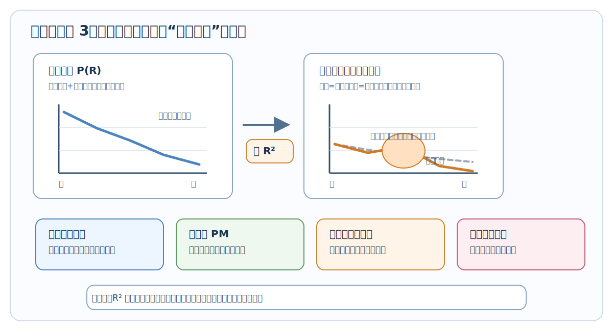

为什么不直接看原始回波 $P(R)$？因为远处天然更暗。哪怕远处空气和近处一样干净，光走得越远，回来的信号也会越弱。

所以工程上常先做一个很重要的动作：

> 把回波乘上距离平方 $R^2$，先抵消“远处天然变暗”的几何影响。

如果只用人话写，就是：

$$
\text{初步可看的图层}
\approx
\text{清洗后的回波}
\times
\text{距离平方校正}
$$

一个假数据例子：

| 距离 | 原始回波 | 乘上 $R^2$ 后 | 人眼怎么看 |
|---:|---:|---:|---|
| 100 m | 100 | 100 | 近处信号强，不一定污染强 |
| 200 m | 28 | 112 | 校正后和近处差不多 |
| 300 m | 18 | 162 | 这里可能有一小团颗粒物 |
| 400 m | 8 | 128 | 远处原始值低，但校正后仍有结构 |

这张图层的用途是“先看形状”，不是“直接报 PM”。你可以把它理解成医生先看 X 光片：能看到异常位置，但还不能只靠一张片子就给出全部诊断。

### 12.2 参考区段为什么重要

Klett/Fernald 这类算法不是魔法。它想从一条回波曲线里反推出整条路径上的空气状态，但它需要先找一个“可信起点”。

这个可信起点通常放在远端，叫参考区段。英文里常写成 `reference range`，符号常写成 $R_c$。你第一遍只记中文“参考区段”就够了。

更通俗地说：

> 先找一段相对干净、相对稳定的空气，当成尺子的起点，然后算法再从这里往回推。


选参考区段时，最怕两种情况：

1. 选到污染团里：算法会把“脏空气”误当成干净起点。
2. 选到噪声很大的远端：算法从一开始就不稳，后面整条结果都会漂。

一个假数据例子：

| 距离段 | 校正后信号 | 质量判断 | 适合当参考区段吗 |
|---:|---:|---|---|
| 200-300 m | 180, 220, 260 | 变化大，像污染团 | 不适合 |
| 500-600 m | 130, 128, 132 | 稳定，信号还够 | 适合 |
| 900-1000 m | 25, 18, 30 | 太弱，噪声大 | 不适合 |

所以“参考区段”不是随便选一个远处位置，而是在问：

> 哪一段空气最像一个可靠的起跑线？

### 12.3 Klett/Fernald 到底在算什么

先把英文名放一边。你可以把 Klett/Fernald 理解成一种“带起点的反推算法”。

LiDAR 只测到一个东西：回波曲线。

但回波曲线里混着两件事：

1. 这一层空气把多少光打回来了，记作 $\beta$。
2. 光在路上被吃掉了多少，记作 $\alpha$。

这两个量的中文直觉是：

| 符号 | 中文叫法 | 你可以怎么想 |
|---|---|---|
| $\beta$ | 后向散射 | 这一层把多少光“打回雷达” |
| $\alpha$ | 消光 | 光经过这里时被“吃掉/削弱”多少 |

问题是：雷达只看到“最后回来的亮不亮”，却不知道是因为“这一层打回来得多”，还是因为“路上被吃掉得少”。

所以算法需要再加一个经验假设：消光-散射比例。英文常写成 `lidar ratio`。

> 消光-散射比例。

它常写成：

$$
S = \frac{\alpha}{\beta}
$$

不用急着推公式。先按这句话理解：

> $S$ 是在说：同一类颗粒物，通常“吃掉光的能力”和“把光打回来的能力”大概是什么比例。

一个假数据例子：

| 场景 | 后向散射 $\beta$ | 假设 $S$ | 推出来的消光 $\alpha$ | 直觉 |
|---|---:|---:|---:|---|
| 干净空气 | 0.001 | 50 | 0.05 | 吃光少 |
| 普通扬尘 | 0.004 | 50 | 0.20 | 吃光明显 |
| 浓烟/浓尘 | 0.010 | 50 | 0.50 | 吃光很强 |

这张表不是要你记数值，而是要你看懂关系：

> 先从回波里估“打回来多少”，再用比例关系推“路上吃掉多少”。

### 12.4 Klett 反演怎么理解：不是背公式，而是做反推题

先回答一个很容易卡住的问题：

> **Klett 不是英文缩写，而是人名。**
>
> Klett 反演指的是美国学者 James D. Klett 提出的一类弹性 LiDAR 反演方法。你可以先把它理解成“用 Klett 这个人提出的方法，从回波反推出消光和后向散射”。

Klett 的论文公式会写成积分形式，看上去很复杂。入门阶段先不要被积分吓住。它在程序里做的事情可以翻译成一句很土但很有用的话：

> 先在远处找一个比较可信的参考点，然后从远处往近处，一格一格把“这层空气有多浑浊”算回来。

下面用一组假数据完整走一遍。

#### 12.4.1 假设我们已经拿到一条回波

为了让数字简单，我们只取 5 个距离点：

| 距离 R | 原始回波 P | 先不要急着解释 |
|---:|---:|---|
| 100 m | 320 | 近处回波通常很大，因为距离近 |
| 200 m | 130 | 变小了 |
| 300 m | 88 | 这里可能有污染团 |
| 400 m | 28 | 继续变小 |
| 500 m | 10 | 远端参考点 |

第一步先做距离平方校正。这里为了计算方便，把距离写成 km：

$$
X(R) = P(R) \times R^2
$$

这里的 $X(R)$ 可以先理解成“距离平方校正后的回波”，也就是前面讲过的 RCS。

| 距离 R | R(km) | 原始回波 P | $R^2$ | $X=P\times R^2$ |
|---:|---:|---:|---:|---:|
| 100 m | 0.1 | 320 | 0.01 | 3.20 |
| 200 m | 0.2 | 130 | 0.04 | 5.20 |
| 300 m | 0.3 | 88 | 0.09 | 7.92 |
| 400 m | 0.4 | 28 | 0.16 | 4.48 |
| 500 m | 0.5 | 10 | 0.25 | 2.50 |

注意这个变化：

> 原始回波里 100 m 最大，但距离平方校正后 300 m 最大。  
> 这说明 300 m 附近更像是真正的污染增强，而不只是“离雷达近所以亮”。

#### 12.4.2 给 Klett 一个远端参考点

Klett 不能凭空开始算。它需要一个参考点。

这里我们假设：

| 参数 | 数值 | 通俗解释 |
|---|---:|---|
| 消光-散射比例 $S$ | 50 sr | 把“打回来多少”换算成“吃掉多少”的比例 |
| 参考距离 | 500 m | 最远端这格看起来比较平稳 |
| 参考后向散射 $\beta_{\mathrm{ref}}$ | 0.0035 | 先告诉算法：500 m 这一格大概是这个浑浊程度 |

因为：

$$
\alpha = S \times \beta
$$

所以参考点的消光大约是：

$$
\alpha_{\mathrm{ref}} = 50 \times 0.0035 = 0.175\ \mathrm{km}^{-1}
$$

这一步的直觉是：

> 我先告诉算法“500 m 那一格大概有多浑浊”，然后让它从 500 m 往 100 m 反推回来。

#### 12.4.3 程序里真正用到的简化 Klett 计算

下面这个式子看着像公式，其实只对应代码里的三件事：

$$
\beta_i =
\frac{X_i}
{X_{\mathrm{ref}}/\beta_{\mathrm{ref}} + 2S\int_{R_i}^{R_{\mathrm{ref}}}X(r)\,dr}
$$

如果你暂时不想看公式，就把它翻译成：

```text
这一格的后向散射 =
    这一格校正后的回波
    ÷
    （参考点提供的起点 + 从这一格到参考点之间累计的衰减影响）
```

其中最关键的是这个“累计的衰减影响”。程序不会真的手算积分，而是把每两个距离点之间的面积加起来。

假设距离间隔都是 0.1 km，用梯形面积近似：

| 当前距离 | 从当前距离累加到 500 m 的面积 | 怎么理解 |
|---:|---:|---|
| 100 m | 2.04 | 从 100 m 到 500 m 的回波累计影响 |
| 200 m | 1.62 | 从 200 m 到 500 m 的累计影响 |
| 300 m | 0.97 | 从 300 m 到 500 m 的累计影响 |
| 400 m | 0.35 | 从 400 m 到 500 m 的累计影响 |
| 500 m | 0.00 | 参考点本身，不再往后累加 |

#### 12.4.4 完整 Python 示例

这段代码就是上面那张表的计算过程。它不是生产级大气反演代码，而是教学版：目的只是让你看清楚“数据一步一步怎么变”。

```python
# 教学版 Klett 反演：看懂数据怎么一步步变化

S = 50.0  # 消光-散射比例，单位 sr

# 距离，单位 km。0.1 km = 100 m
ranges_km = [0.1, 0.2, 0.3, 0.4, 0.5]

# 假设已经扣掉背景噪声后的原始回波
raw_power = [320, 130, 88, 28, 10]

# 远端参考点：这里取 500 m
ref_index = len(ranges_km) - 1
beta_ref = 0.0035  # 参考点后向散射，单位 km^-1 sr^-1

# 第一步：距离平方校正，得到 X = P * R^2
rcs = []
for p, r in zip(raw_power, ranges_km):
    rcs.append(p * r * r)


def area_from_current_to_ref(i):
    """用梯形法计算：从第 i 个距离点累加到参考点的面积。"""
    area = 0.0
    for j in range(i, ref_index):
        dr = ranges_km[j + 1] - ranges_km[j]
        area += (rcs[j] + rcs[j + 1]) / 2.0 * dr
    return area


x_ref = rcs[ref_index]

print("距离(m)  原始P   RCS_X   累计面积  分母      beta      alpha")

for i, (r, p, x) in enumerate(zip(ranges_km, raw_power, rcs)):
    area = area_from_current_to_ref(i)

    # Klett 反演的核心：参考点 + 路径累计影响
    denominator = x_ref / beta_ref + 2.0 * S * area

    beta = x / denominator
    alpha = S * beta

    print(
        f"{int(r * 1000):>6}  "
        f"{p:>5.0f}  "
        f"{x:>6.2f}  "
        f"{area:>7.2f}  "
        f"{denominator:>7.1f}  "
        f"{beta:>8.5f}  "
        f"{alpha:>7.3f}"
    )
```

运行后会得到类似这样的结果：

| 距离 | 原始 P | RCS $X$ | 累计面积 | 分母 | $\beta$ | $\alpha=S\beta$ |
|---:|---:|---:|---:|---:|---:|---:|
| 100 m | 320 | 3.20 | 2.04 | 918.8 | 0.00348 | 0.174 |
| 200 m | 130 | 5.20 | 1.62 | 876.8 | 0.00593 | 0.297 |
| 300 m | 88 | 7.92 | 0.97 | 811.2 | 0.00976 | 0.488 |
| 400 m | 28 | 4.48 | 0.35 | 749.2 | 0.00598 | 0.299 |
| 500 m | 10 | 2.50 | 0.00 | 714.3 | 0.00350 | 0.175 |

现在从左到右看，数据经历了这些变化：

```text
原始回波 P
  ↓ 距离平方校正
RCS：X = P × R²
  ↓ 加入远端参考点 beta_ref
累计路径影响
  ↓ Klett 递推
后向散射 beta
  ↓ alpha = S × beta
消光 alpha
```

最重要的结论是：

1. 原始回波最大的位置是 100 m，因为近处天然容易亮。
2. 做完距离平方校正后，300 m 的 RCS 最大。
3. 做完简化 Klett 反演后，300 m 的消光 $\alpha=0.488$ 仍然最高。
4. 所以这条射线上，300 m 附近最像真正的颗粒物增强区。

这就是 Klett 反演的价值：

> 它不是只看哪里亮，而是把距离影响、路径衰减和参考点一起考虑进去，再判断哪里真正浑浊。

### 12.5 离散化后程序到底怎么做

论文喜欢写连续距离 $R$，但真实程序不会真的在连续空间里算。程序会把距离切成很多小格子，每个小格子英文叫 `bin`。

这里 `bin` 可以翻译成：

> 距离小格子。

例如一条 0-600 m 的路径，可以切成这样：

```text
雷达 | 0-100 | 100-200 | 200-300 | 300-400 | 400-500 | 500-600 |
近端                                                             远端
```

程序真正做的是：

1. 先在远端 500-600 m 选一个参考格子。
2. 给这个参考格子一个可信的起始值。
3. 用第 6 格推第 5 格，再推第 4 格，一直推回雷达附近。

一个非常简化的假数据：

| 距离小格子 | 校正后回波 | 程序动作 |
|---|---:|---|
| 500-600 m | 90 | 参考区段，先给起点 |
| 400-500 m | 110 | 从参考区段往回推 |
| 300-400 m | 180 | 可能有污染团，结果会升高 |
| 200-300 m | 160 | 继续往回推 |
| 100-200 m | 120 | 得到近端结果 |

如果用伪代码写，核心只有几行：

```python
# ranges 从近到远排好
# rcs 是距离平方校正后的回波
# ref_index 是参考区段的位置

结果[ref_index] = 参考区段的可信值

for i in 从参考区段往近处走:
    先看这一格的回波有多强
    再考虑前面路径已经吃掉了多少光
    估出这一格的散射和消光
```

这段伪代码不追求科研细节，只帮你抓住程序结构：

> 不是一次把整条曲线算完，而是从参考起点一格一格往回走。

### 12.6 消光-散射比例对结果影响有多大

`lidar ratio` 这个英文建议直接在脑子里替换成：

> 消光-散射比例。

它是一个很敏感的经验参数。为什么敏感？因为算法要靠它把“打回来多少”换算成“吃掉多少”。

同一条回波，如果你选不同的 $S$，推出来的消光和 PM 可能会不一样。

假设同一个位置估出来的 $\beta = 0.004$：

| 假设的 $S$ | 推出来的 $\alpha = S \times \beta$ | 结果倾向 |
|---:|---:|---|
| 30 | 0.12 | 偏保守，PM 可能偏低 |
| 50 | 0.20 | 中间值 |
| 70 | 0.28 | 偏激进，PM 可能偏高 |

这就是为什么工程系统不会随便写死一个值。常见做法是：

1. 先用文献或厂商经验给一个范围。
2. 再拿本地地面 PM 站的数据反复校准。
3. 必要时按天气、季节、污染来源分别取值。

对入门者来说，只要先记住一句：

> $S$ 选得大，消光和 PM 往往会被推高；$S$ 选得小，结果往往会被压低。

### 12.7 为什么反演前后都要平滑

LiDAR 回波里一定有噪声。噪声有时只是一个小尖峰，但在反演算法里可能被放大。

所以反演前后经常要平滑。平滑不是为了把图修得漂亮，而是为了让算法不要被单个噪声点带偏。

看一个假数据：

| 距离 | 原始结果 | 平滑后 | 说明 |
|---:|---:|---:|---|
| 100 m | 42 | 43 | 正常 |
| 200 m | 45 | 46 | 正常 |
| 300 m | 120 | 67 | 可能是噪声尖峰，被压下 |
| 400 m | 50 | 55 | 正常 |
| 500 m | 52 | 53 | 正常 |

但平滑也不能太狠。太狠会把真实污染团的边界抹掉。

一个简单判断标准：

1. 如果只是孤立一个点特别高，多半要压一压。
2. 如果连续好几格都高，可能是真实污染团，不应该抹掉。
3. 如果热点边界被磨得看不清，说明平滑窗口太大。

### 12.8 湿度修正为什么必须进入主流程

这一节非常重要，因为湿度会让初学者误判。

很多颗粒物会吸水。空气越潮，颗粒物表面吸的水越多，散射就越强。于是 LiDAR 看到的亮度可能变高。

但这不一定代表“干颗粒物质量真的变多了”。

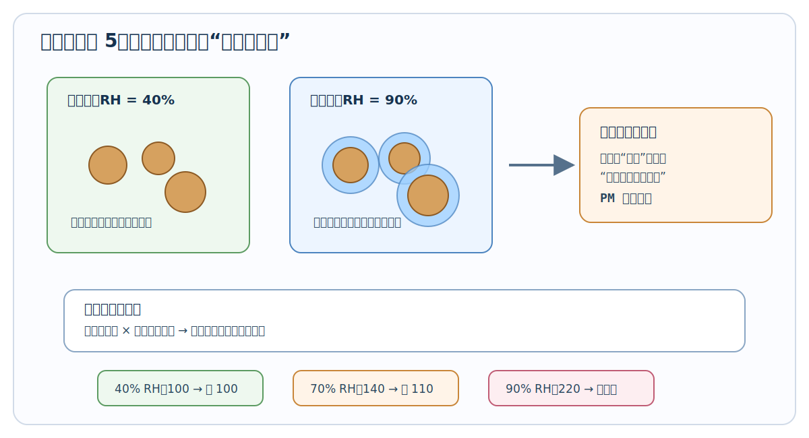

用一句话说：

> 高湿度会把颗粒物“看起来变胖”，所以光学信号会变强。

假设同样一团干颗粒物，湿度不同：

| 相对湿度 RH | LiDAR 看到的光学强度 | 如果不修正 | 修正后理解 |
|---:|---:|---|---|
| 40% | 100 | 正常 | 接近干颗粒物本身 |
| 70% | 140 | 可能误判偏浓 | 有一部分是湿度放大 |
| 90% | 220 | 很容易误报警 | 必须谨慎修正或降权 |

工程上常用一个湿度修正函数，把“湿空气下变亮的部分”尽量扣回来。公式可以先不用背，只记住它在做这件事：

$$
\text{干态光学量}
=
\text{湿态光学量}
\times
\text{湿度修正系数}
$$

这里的“干态”不是说空气真的被烘干了，而是说：

> 算法尽量把结果换算成更接近干颗粒物质量的样子。

### 12.9 PM2.5 / PM10 估算到底怎么做

到这里最容易出现一个误解：

> 有了消光 $\alpha$，是不是就直接有了 PM2.5？

答案是：不是。

LiDAR 先测到的是光学反应，PM2.5/PM10 是质量浓度。光学强不强和质量多不多有关，但不是一回事。

看这张中文流程图：


从光学量到 PM，一般要经过四层：

1. LiDAR 先得到光学量，比如消光 $\alpha$、后向散射 $\beta$。
2. 加入湿度、温度、风速风向等气象信息。
3. 拿本地地面 PM 站当参考答案，训练一个标定模型。
4. 模型上线后，把新的 LiDAR 和气象数据换算成 PM 图层。

一个假数据训练样本长这样：

| 时间 | LiDAR 干态消光 | 湿度 | 风速 | 地面 PM2.5 |
|---|---:|---:|---:|---:|
| 09:00 | 0.12 | 45% | 2.1 m/s | 38 |
| 10:00 | 0.18 | 52% | 1.6 m/s | 55 |
| 11:00 | 0.30 | 60% | 1.2 m/s | 88 |
| 12:00 | 0.20 | 85% | 0.8 m/s | 62 |

模型学习的不是“某个公式长什么样”，而是在学：

> 在这个地方、这台设备、这些天气条件下，LiDAR 光学量大概对应多少 PM。

所以 PM 标定一定是本地化的。换城市、换季节、换污染源，模型都可能需要重新评估。

### 12.10 PM 标定的训练和上线流程

可以把 PM 标定想成“先让模型做练习题，再让它做真题”。

训练阶段：

1. 收集一段时间的 LiDAR 数据。
2. 同时收集地面 PM 站、湿度、温度、风速风向。
3. 把时间对齐，比如都对齐到每 1 分钟或每 5 分钟。
4. 把 LiDAR 低层若干距离小格子做平均，尽量和地面站代表的空气层接近。
5. 让模型学习“LiDAR + 气象”到“地面 PM”的关系。
6. 留出一部分数据不训练，只用来检查模型准不准。
7. 上线后持续监控，如果季节或设备状态变了，要重新校准。

一个很简化的训练表：

| 输入 1 | 输入 2 | 输入 3 | 输入 4 | 模型要学的答案 |
|---:|---:|---:|---:|---:|
| 干态消光 0.12 | 湿度 45% | 温度 26℃ | 风速 2.1 | PM2.5 = 38 |
| 干态消光 0.18 | 湿度 52% | 温度 27℃ | 风速 1.6 | PM2.5 = 55 |
| 干态消光 0.30 | 湿度 60% | 温度 29℃ | 风速 1.2 | PM2.5 = 88 |

这里有一个很关键的工程细节：

> LiDAR 看的是一条线或一个扫描面，地面 PM 站只看一个点。训练时必须想清楚“空间上怎么对应”。

如果地面站在雷达旁边，低层近距离数据更有代表性。如果地面站离得远，就要考虑风向、扫描方向和高度差。

### 12.11 一个简单但实用的 PM 推理流程

训练好模型以后，实时推理可以理解成下面这条流水线：

```text
新的 LiDAR 回波
      ↓
预处理和距离校正
      ↓
反演出光学量 α、β
      ↓
湿度修正，得到更接近干颗粒物的光学量
      ↓
加入温度、湿度、风速、风向等气象量
      ↓
PM 标定模型
      ↓
输出 PM2.5 / PM10 图层
```

如果用很短的伪代码写：

```python
def 估算PM(消光, 后向散射, 湿度, 温度, 风速, 模型):
    干态消光 = 做湿度修正(消光, 湿度)
    输入特征 = [干态消光, 后向散射, 湿度, 温度, 风速]
    PM结果 = 模型输出(输入特征)
    return PM结果
```

注意这段伪代码里最重要的不是最后一行，而是前面的数据处理。输入如果不干净，模型再高级也会输出不可靠结果。

### 12.12 怎么从 PM 场里提取热点

当你已经有一张 PM 图或消光图之后，业务系统通常不只想看颜色图，还想知道：

1. 哪里超过阈值？
2. 这片高值区有多大？
3. 中心在哪里？
4. 要不要报警或联动喷雾？

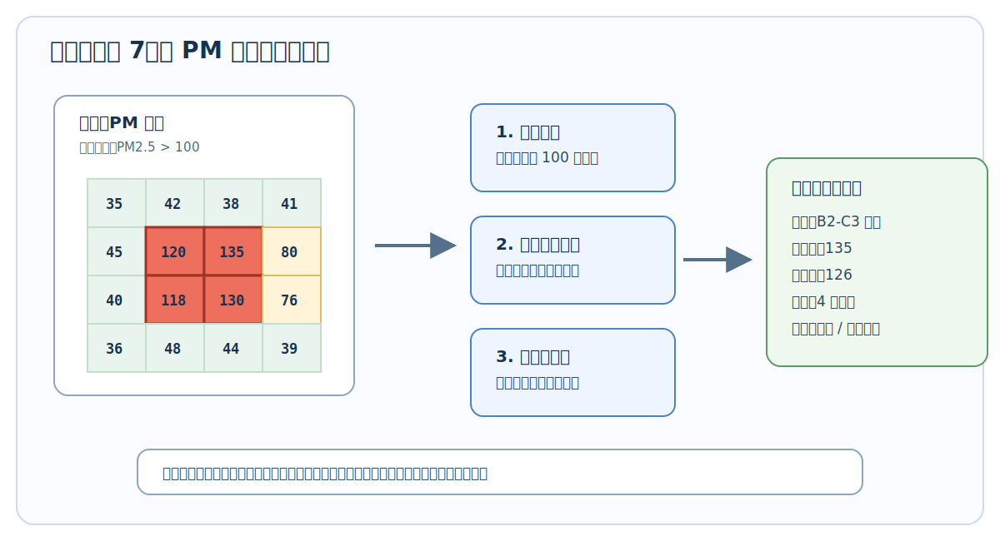

一个小型假数据网格：

| 网格 | PM 值 |
|---|---:|
| A1 | 35 |
| A2 | 42 |
| A3 | 38 |
| B1 | 45 |
| B2 | 120 |
| B3 | 135 |
| C1 | 40 |
| C2 | 118 |
| C3 | 130 |

假设报警阈值是 100，那么 B2、B3、C2、C3 这四个格子会被认为是同一个热点区域。

热点提取一般分四步：

1. 设阈值：比如 PM2.5 大于 100。
2. 去噪声：孤立一个高点可能是噪声，先检查。
3. 找连在一起的高值格子：这一步叫连通域分析。
4. 算热点属性：面积、最大值、平均值、中心位置、持续时间。

热点中心可以不用一上来就看复杂公式。先按这个直觉理解：

> 谁的 PM 值更高，谁对中心位置的影响就更大。

比如 B2=120、B3=135、C2=118、C3=130，那么热点中心会偏向 B3/C3 这一侧，因为那边更高。

### 12.13 算法链里每个输出分别给谁用

第 12 章其实讲了一条完整加工链：

```text
原始回波
  ↓
预处理后的回波
  ↓
衰减后向散射 / RCS
  ↓
消光 α 和后向散射 β
  ↓
湿度修正后的光学量
  ↓
PM2.5 / PM10 图层
  ↓
热点事件、地图、报表、喷雾联动
```

不同输出给不同人用：

| 产品层级 | 输出内容 | 主要给谁看 | 用来做什么 |
|---|---|---|---|
| L1 | 预处理回波、RCS | 算法工程师 | 检查数据质量 |
| L1.5 | 衰减后向散射图 | 值班人员、算法工程师 | 快速看结构和异常 |
| L2 | 消光、后向散射、PM 图层 | 业务模型、告警系统 | 判断污染强度 |
| L3 | 热点、轨迹、报表、联动目标 | 管理端、喷雾系统 | 决策和处置 |

所以页面和系统不要乱读最底层原始数据。更合理的做法是：

> 每个页面只消费适合自己的那一级产品。

例如实时总览页面适合看 L2/L3，质量控制页面才需要看 L1/L1.5。这样系统会更稳定，也更容易解释给业务人员听。

---

## 13. 从极坐标到地图坐标，再到 UI 图层

前面第 11 章和第 12 章讲的是：怎么把一条回波曲线一步步变成 RCS、消光、PM2.5 / PM10 和热点。

但这还不够。工程系统最终必须回答一个更现实的问题：

> 这团粉尘到底在现场的哪个方向、离设备多远、离地多高、该画在地图哪里、喷雾炮该往哪儿打？

所以第 13 章讲的不是新的反演算法，而是把算法结果“放回现实空间”。你可以把它理解成：

```text
算法告诉你：第 120 m 这个距离格子 PM2.5 很高
空间定位告诉你：这个格子在设备东北方向 86 m、北向 99 m、高度 23 m
UI 图层告诉你：这个点应该画在地图和 3D 场景里的哪里
联动控制告诉你：喷雾炮应该转到哪个角度
```

一句话总结：

> 第 12 章解决“这里脏不脏”，第 13 章解决“这里到底是哪儿”。

---

### 13.1 先把“极坐标”说成人话

激光雷达天然不是像地图软件那样直接输出经纬度。它最直接知道的是三件事：

1. **距离 R**：回波从多远的地方回来。
2. **方位角 azimuth**：这束光朝哪个水平方向打出去。
3. **仰角 elevation**：这束光往上抬了多少角度。

这三个量合起来，就像你拿着手电筒指向空中某个方向，然后说：

> 沿着我手电筒照出去的这条线，往前 120 m 那里有一团粉尘。

这就是极坐标的直觉。


```text
侧视 + 俯视混合想象：

                      这个点 = (R, azimuth, elevation)
                         ●
                        ╱
                       ╱  R = 距离
                      ╱
                     ╱ elevation = 抬头角
                    ╱
      LiDAR  ●─────╯
             ↑
             azimuth = 水平方向角
```

所以每个 range bin 都不是地图上的一个现成点，而是“某个方向射线上的一个小空间格子”。

> **🎯 为什么算法结果必须做空间定位？**
>
> 因为算法输出的 PM 或消光，最开始只是挂在数组索引上的。
>
> 比如 `pm25[4] = 82` 只说明“第 4 个距离格子浓度高”，但它没有直接告诉你这个格子在现实世界中的位置。
>
> 业务系统真正需要的是：
>
> 1. 它在雷达东边还是西边？
> 2. 它离设备水平距离多远？
> 3. 它离地多高？
> 4. 它是不是在工地边界内？
> 5. 喷雾炮能不能打到？
>
> 所以坐标转换不是“画图小功能”，而是从算法结果走向工程动作的关键一步。没有它，PM 图只能看热闹，不能定位和联动。

---

### 13.2 固定式系统怎么转成 ENU

固定式系统最常用的是 ENU 本地坐标系。它不是经纬度，而是以雷达站为原点建立一个小范围的三维坐标系：

| 轴 | 英文 | 中文含义 | 人话理解 |
| --- | --- | --- | --- |
| E | East | 东向 | x 轴，往东为正 |
| N | North | 北向 | y 轴，往北为正 |
| U | Up | 向上 | z 轴，往天上为正 |


可以想象雷达站脚下放了一张透明坐标纸：

```text
俯视图：

                 北 N / y+
                   ↑
                   │
                   │
        西 x-  ────●────→ 东 E / x+
                 LiDAR
                   │
                   │
                   ↓
                 南 y-

侧视图：

                 上 U / z+
                   ↑
                   │      ● 粉尘点
                   │     ╱
                   │    ╱
                   ●───╯────────→ 水平距离
                LiDAR
```

固定式雷达坐标转换的核心动作只有两步：

1. 先把斜距 R 拆成“水平投影”和“高度”。
2. 再把水平投影按方位角拆成“东向 x”和“北向 y”。

用普通写法就是：

```text
水平投影 = R * cos(elevation)
高度 z = R * sin(elevation)

东向 x = 水平投影 * sin(azimuth)
北向 y = 水平投影 * cos(azimuth)
```

注意这里默认方位角 0 度指向正北，90 度指向正东。这是气象和雷达系统里很常见的定义。

### 13.3 一个具体数字例子：40 度方位、10 度仰角、120 m 距离

假设某个热点格子来自下面这条射线：

1. 方位角 azimuth = 40 deg。
2. 仰角 elevation = 10 deg。
3. 斜距 R = 120 m。
4. 这一格 PM2.5 = 82。

先算水平投影：

```text
水平投影 ≈ 120 * cos(10 deg) ≈ 118.2 m
高度 z   ≈ 120 * sin(10 deg) ≈ 20.8 m
```

再把水平投影拆成东向和北向：

```text
东向 x ≈ 118.2 * sin(40 deg) ≈ 76.0 m
北向 y ≈ 118.2 * cos(40 deg) ≈ 90.5 m
```

所以这个点的 ENU 坐标约为：

```text
(x, y, z) = (76.0, 90.5, 20.8) m
```

这句话的业务含义是：

> 这个高 PM 格子位于雷达东边约 76 m、北边约 90 m、高度约 21 m 的位置。

这就比“第 120 m 距离 bin 浓度高”有用多了。因为现在它已经能被放到地图、剖面图、三维场景和喷雾控制里。


下面是一个更完整的 Python 小函数：

```python
import numpy as np

def polar_to_enu(ranges_m, azimuth_deg, elevation_deg):
    az = np.deg2rad(azimuth_deg)
    el = np.deg2rad(elevation_deg)

    horizontal = ranges_m * np.cos(el)
    x_east = horizontal * np.sin(az)
    y_north = horizontal * np.cos(az)
    z_up = ranges_m * np.sin(el)
    return x_east, y_north, z_up

x, y, z = polar_to_enu(120.0, 40.0, 10.0)
print(round(x, 1), round(y, 1), round(z, 1))
```

> **🎯 为什么 x 用 sin，y 用 cos？是不是写反了？**
>
> 这取决于方位角从哪里开始算。
>
> 在数学课里，角度常常从 x 轴正方向开始，逆时针转，所以很多公式会写成 `x = R * cos(angle)`、`y = R * sin(angle)`。
>
> 但气象、导航和雷达里，方位角常常是：
>
> 1. 0 度 = 正北。
> 2. 90 度 = 正东。
> 3. 180 度 = 正南。
> 4. 270 度 = 正西。
>
> 这样定义时，北向 y 才是 0 度的主方向，所以：
>
> ```text
> x_east  = horizontal * sin(azimuth)
> y_north = horizontal * cos(azimuth)
> ```
>
> 你只要记住一句：这里的方位角是“从北开始顺时针量”的，不是数学课里“从 x 轴开始量”的。

---

### 13.4 PPI 和 RHI 转坐标时分别在看什么

第 4 章和第 19 章已经讲过 PPI 和 RHI。这里把它们和坐标转换连起来。


#### PPI：像在地图上扫一圈

PPI 是固定仰角，水平方向转动。它最适合回答：

> 哪个方向、多远处有污染热点？

```text
PPI 俯视图：

              北
              ↑
         38° ╱│╲ 42°
            ╱ │ ╲
           ╱  │  ╲
          ╱   │   ╲
         ●────┼────→ 东
       LiDAR

每一条射线都有一串距离 bin。
把这些 bin 转成 ENU 后，就能铺到地图上。
```

PPI 的重点是平面位置。对工地和园区来说，它适合画：

1. 扫描扇区。
2. 热点多边形。
3. 污染团在平面上的质心。
4. 风向叠加后的传播方向。

#### RHI：像把空气竖着切一刀

RHI 是固定方位角，上下扫仰角。它最适合回答：

> 这团粉尘抬到了多高？层顶层底在哪里？

```text
RHI 侧视图：

高度 ↑
     │              ● 高仰角点
     │           ╱
     │        ● 中仰角点
     │     ╱
     │  ● 低仰角点
     │╱
LiDAR●────────────────→ 地面距离
```

RHI 有时不必一开始就转完整三维，先转成“地面距离 + 高度”就很直观：

```text
地面距离 = R * cos(elevation)
高度     = 设备安装高度 + R * sin(elevation)
```

例如设备安装高度 18 m，R = 120 m，仰角 10 度：

```text
地面距离 ≈ 118.2 m
高度     ≈ 18 + 20.8 = 38.8 m
```

注意这里高度比前面的 20.8 m 多了 18 m，因为前面算的是“相对雷达本体的高度”，这里算的是“相对地面的高度”。

> **🎯 固定式系统里，什么时候要加设备安装高度？**
>
> 如果你只在雷达本体坐标系里画图，z = R * sin(elevation) 就够了。
>
> 但如果你要说“离地高度是多少”，或者要和建筑物、喷雾炮、工地围挡、地形模型叠加，就必须加上设备安装高度。
>
> ```text
> 相对雷达高度 = R * sin(elevation)
> 离地高度     = 雷达安装高度 + R * sin(elevation)
> ```
>
> 这件事很容易漏。漏掉之后，所有热点高度都会被系统性低估。

---

### 13.5 车载系统为什么更麻烦

固定式系统好办，是因为雷达站不动。你只要知道雷达原点在哪里，射线往哪个方向打，就能把点放到空间里。

车载系统麻烦在于：雷达自己一直在动，而且车体还会晃。


车载 LiDAR 每一条 profile 都必须同时绑定：

1. 这一刻车在哪里：GPS / RTK。
2. 这一刻车头朝哪：航向 yaw。
3. 车有没有左右歪：横滚 roll。
4. 车有没有前后点头：俯仰 pitch。
5. 雷达装在车顶哪个位置：安装偏置。
6. 扫描头自己又转到了哪个角度：扫描姿态。

可以把完整坐标链想成一层一层搬箱子：

```text
第 1 层：点在雷达自己的坐标里
        ↓ 加上扫描头角度
第 2 层：点在雷达安装座坐标里
        ↓ 加上雷达相对车体的位置偏置
第 3 层：点在车体坐标里
        ↓ 加上车体 roll / pitch / yaw
第 4 层：点在世界坐标里
        ↓ 加上 GPS / RTK 位置
第 5 层：点能落到地图上
```

用一行普通话表达就是：

> 先把“雷达看见的点”转到“车上”，再把“车上的点”转到“地球上的位置”。

如果写成工程关系，可以这样理解：

```text
世界点 = GPS位置 + 车体姿态 * (安装偏置 + 扫描头姿态 * 雷达本体点)
```

你不需要一开始就手推矩阵，但必须知道每一项少了会发生什么：

| 漏掉的量 | 会出现什么问题 |
| --- | --- |
| GPS 位置 | 整条走航轨迹不知道在地图哪里 |
| 航向 yaw | 点云整体转错方向 |
| 俯仰 pitch | 前方热点高度被算高或算低 |
| 横滚 roll | 左右两侧热点高度不一致 |
| 安装偏置 | 点云整体平移，喷雾目标偏位 |
| 时间同步 | 点云像被拉扯、错位、重影 |

> **🎯 车载系统最怕的不是公式写错，而是时间没对齐**
>
> 假设车速 36 km/h，也就是 10 m/s。如果 LiDAR 数据和 GPS 时间差了 0.5 秒，那么空间位置就会错 5 m。
>
> 对普通显示来说，5 m 可能只是图上有点偏；但对喷雾联动、污染源定位、执法取证来说，5 m 已经可能让结论不可靠。
>
> 所以车载系统里，LiDAR、GPS、IMU、云台角度必须尽量使用统一时间戳。坐标转换不是最后才补的美化步骤，而是从采集时就要设计好的数据契约。

---

### 13.6 为什么还要做网格化

坐标转换之后，你会得到很多离散点：

```text
点 1: x=76.0, y=90.5, z=20.8, PM=82
点 2: x=94.9, y=113.2, z=26.0, PM=66
点 3: x=79.0, y=87.8, z=20.8, PM=79
...
```

这些点对算法工程师来说可以处理，但对 UI 和业务系统来说还不够好用。因为它们是散的，不一定刚好排成整齐表格。

网格化就是把空间切成固定大小的小格子，然后把落在同一个小格子里的点合并统计。


```text
俯视图：

    ┌────┬────┬────┬────┐
    │    │    │    │    │
    ├────┼────┼────┼────┤
    │    │ ●  │ ●  │    │
    ├────┼────┼────┼────┤
    │    │ ●  │ ●  │    │
    ├────┼────┼────┼────┤
    │    │    │    │    │
    └────┴────┴────┴────┘

    多个离散点落进同一个网格后，合成一个格子的值。
```

三维时，这个小格子就叫体素。你可以把体素理解成“三维像素”。

一个简单的体素索引逻辑是：

```text
i = floor((x - x0) / dx)
j = floor((y - y0) / dy)
k = floor((z - z0) / dz)
```

其中：

1. x0、y0、z0 是网格原点。
2. dx、dy、dz 是每个格子的尺寸。
3. i、j、k 是这个点落在哪个三维格子里。

同一个格子里可能有多个点，常见统计方式有：

| 统计方式 | 适合场景 | 含义 |
| --- | --- | --- |
| 平均值 | 稳定显示 PM 场 | 多个点取平均，图更平稳 |
| 最大值 | 告警检测 | 只要格子里有高值就突出显示 |
| 加权平均 | 热点质心 | PM 越高，对结果影响越大 |
| 命中次数 | 数据质量 | 这个格子被扫描到多少次 |
| 最近一次值 | 实时刷新 | 保留最新观测结果 |

> **🎯 网格化不是为了“降低精度”，而是为了让数据可用**
>
> 很多初学者会觉得：点云越原始越真实，为什么还要切格子？
>
> 原因是业务系统要的是稳定、可查询、可告警、可回放的数据。
>
> 离散点适合科研分析，但网格更适合：
>
> 1. 画热力图。
> 2. 做区域统计。
> 3. 找连通热点。
> 4. 和工地边界、道路、厂区网格叠加。
> 5. 做历史对比和报表。
>
> 所以网格化的本质是把“很多条射线上的点”，整理成“平台能消费的空间产品”。

---

### 13.7 坐标转换之后，UI 页面分别吃什么数据

前面第 12.13 节说过，不同产品层级给不同人用。现在加上空间坐标以后，页面和数据的关系会更清楚。


| 页面 | 主要输入 | 是否需要坐标转换 | 典型显示 | 主要用途 |
| --- | --- | --- | --- | --- |
| 时间-高度主图 | L1.5 attenuated backscatter | 通常只需要距离转高度 | curtain plot | 看污染层随时间变化 |
| 当前廓线 | L1/L2 profile | 不一定需要 ENU | 曲线图 | 看单条回波或消光剖面 |
| RHI 剖面 | L2 extinction / PM | 需要转地距和高度 | 距离-高度热力图 | 看羽流抬升和层顶层底 |
| PPI 平面 | L2 PM / extinction | 需要转 ENU 平面坐标 | 扇区热力图 | 看热点平面位置 |
| 地图页面 | L3 grid / hotspot | 必须转 ENU 或经纬度 | 底图叠加 | 看热点在哪个工地、道路、厂区 |
| 3D 页面 | L3 voxel / point cloud | 必须转 3D 坐标 | 体素、点云、切片 | 看空间结构和喷雾指向 |
| 告警页面 | 热点事件表 | 需要热点质心坐标 | 告警列表 | 决策和联动 |
| 质量控制页面 | L0 / L1 / SNR / energy | 坐标不是重点 | 原始信号和 QA 图 | 排查设备和算法问题 |

最容易犯的错是：所有页面都直接读原始数组，然后各算各的。这样会导致：

1. 同一个热点在不同页面位置不一致。
2. UI 和算法的结果对不上。
3. 回放时和实时显示不一致。
4. 喷雾目标和地图标记不一致。

更稳的做法是：

```text
L0 原始数据
  ↓
L1 / L2 算法产品
  ↓
统一坐标转换
  ↓
L3 空间产品快照
  ↓
各个 UI 页面只消费同一份快照
```

也就是说，坐标转换最好放在产品层统一做，而不是每个页面自己偷偷算一遍。

---

### 13.8 一个热点事件最终应该长什么样

平台层真正喜欢消费的，不是一整条回波，也不是一堆散点，而是一条结构化事件。

例如：

```json
{
    "event_id": "dust_20260527_102315_001",
    "timestamp": "2026-05-27T10:23:15Z",
    "type": "dust_hotspot",
    "source_product": "ppi_pm25_grid",
    "center_enu_m": [86.1, 99.1, 23.2],
    "center_height_agl_m": 41.2,
    "target_azimuth_deg": 41.0,
    "target_elevation_deg": 10.0,
    "peak_pm25_ugm3": 186.0,
    "mean_pm25_ugm3": 122.5,
    "mean_extinction_km_1": 0.42,
    "area_m2": 950.0,
    "vertical_extent_m": [24.0, 58.0],
    "confidence": 0.91,
    "recommended_action": "spray"
}
```

这条事件里，字段可以分成 5 类：

| 字段类别 | 例子 | 作用 |
| --- | --- | --- |
| 身份信息 | event_id, timestamp, type | 知道这是什么事件、什么时候发生 |
| 空间位置 | center_enu_m, center_height_agl_m | 知道热点在哪里、离地多高 |
| 控制目标 | target_azimuth_deg, target_elevation_deg | 给喷雾炮或云台使用 |
| 污染强度 | peak_pm25, mean_pm25, extinction | 判断严重程度 |
| 质量和处置 | confidence, recommended_action | 判断要不要报警和联动 |

你可以看到，到这一步数据已经从“科研数组”变成了“业务对象”。

```text
科研数组：pm25[azimuth_index, range_index]
业务对象：某时某地有一个粉尘热点，中心在 (86.1, 99.1, 23.2) m，建议喷雾
```

这就是平台层最需要的数据形态。

---

### 13.9 从热点事件到喷雾联动

当热点事件已经有了质心坐标，喷雾联动就可以继续往下走。

最常见流程是：

1. 把热点 ENU 坐标换成喷雾设备自己的坐标。
2. 计算喷雾炮要转到的方位角。
3. 计算喷雾炮要抬到的俯仰角。
4. 判断这个角度是否在机械行程范围内。
5. 判断热点距离是否在有效射程内。
6. 判断置信度和持续时间是否足够，避免误喷。
7. 发送控制指令。
8. 继续用 LiDAR 观察喷雾之后 PM 是否下降。

一个简单几何关系是：

```text
热点相对喷雾炮的坐标 = 热点坐标 - 喷雾炮坐标

水平距离 = sqrt(dx*dx + dy*dy)
目标方位角 = atan2(dx, dy)
目标仰角   = atan2(dz, 水平距离)
```

这里 `dx` 是东向差值，`dy` 是北向差值，`dz` 是高度差。

> **🎯 为什么不能一发现超标就立刻喷？**
>
> 因为 LiDAR 数据里可能有噪声、鸟类昆虫、雨滴、强反射、短时车尘扰动。工程系统通常会加几个保险条件：
>
> 1. 热点连续存在超过一定时间，比如 30 秒或 1 分钟。
> 2. 热点面积不能太小，不能只是单个孤立格子。
> 3. SNR 和数据质量标志要合格。
> 4. 热点必须落在需要治理的区域内。
> 5. 喷雾炮角度和射程必须覆盖得到。
>
> 所以联动控制不只是“PM 超标 -> 喷水”，而是“可信热点 -> 可达目标 -> 合规动作 -> 效果评估”。

### 13.10 这一章真正想让你记住什么

第 13 章可以浓缩成一条完整链路：

```text
距离 bin + 方位角 + 仰角
      ↓
极坐标点
      ↓
ENU / 地图 / 地距-高度坐标
      ↓
点云或网格
      ↓
热点区域和质心
      ↓
UI 图层、告警事件、喷雾目标
```

如果只记住 5 句话，就记住这 5 句：

1. LiDAR 原始空间信息是“距离 + 方位角 + 仰角”，不是现成地图点。
2. ENU 坐标就是以雷达为原点的“东、北、上”本地坐标。
3. PPI 主要看水平位置，RHI 主要看垂直结构。
4. 车载系统必须额外处理 GPS、IMU、安装偏置和时间同步。
5. UI 和联动控制真正消费的是空间产品和热点事件，不是原始回波数组。

所以从软件视角看，一条完整的数据链并不是“画图结束”，而是：

> 原始回波数组 -> 预处理 -> 反演 -> PM 估算 -> 空间定位 -> 热点事件 -> 联动控制 -> 效果评估

---

## 14. 软件到底应该做成什么样，小白先建立正确的 UI 预期

很多人一说到激光雷达 UI，就先想到炫酷 3D 点云。对颗粒物系统来说，这其实不是第一优先级。

真正高频、好用、工程上有效的界面通常是：

1. 时间-高度热力图。
2. 距离-高度剖面图。
3. 地图上的扫描扇区叠加。
4. 当前廓线曲线。
5. 告警列表和设备状态栏。

3D 当然也重要，但通常是第二屏或分析屏，而不是唯一主屏。

### 14.1 你应该从公开软件界面里学什么

主要学 3 件事：

1. 信息组织方式。
2. 图层和质量控制怎么展示。
3. 操作员最常盯的指标到底是什么。

下面这些 UI 图都来自公开资料，已经放进本项目的 assets 目录，可以直接在 Markdown 中查看。

### 14.2 CloudnetPy / Cloudnet 风格：科研型 quicklook

来源：[CloudnetPy quickstart](https://actris-cloudnet.github.io/cloudnetpy/quickstart.html)

这类界面最适合你理解“时间-高度 curtain plot 才是大气遥感系统的主战场”。

典型 LiDAR attenuated backscatter：


怎么看：

1. 横轴通常是时间。
2. 纵轴通常是高度。
3. 颜色表示后向散射强弱。
4. 一整天的污染层抬升、云底变化、低层气溶胶累积都能直接看出来。

目标分类图：


怎么看：

1. 不同颜色不是“浓淡”，而是不同目标类型。
2. 这类图特别适合未来加入云、雾、雨、昆虫、沙尘等质量控制标签。
3. 对颗粒物系统来说，它能启发你做“有效数据”和“无效数据”的分层展示。

多仪器联合 quicklook：


怎么看：

1. 同一时间轴上放多个产品，判断效率会高很多。
2. 平台不应该只有一张图，而应该让用户能同时看回波、气象、质量标志和算法结果。

### 14.3 Vaisala BL-View 风格：运维值守型 UI

来源：[Vaisala BL-View 文档](https://docs.vaisala.com/r/M211185EN-E/en-US/GUID-EF63D824-E0FA-437C-A1F8-FCFC6DFDADD7)

BL-View 主界面：


归档图界面：


这两张图给你的启发：

1. 顶部状态栏非常重要，不能只顾画图，不顾设备状态。
2. 业务系统必须同时支持实时查看和历史回放。
3. 告警、数据延迟、设备健康度应该一直可见。

### 14.4 Vaisala CL61 风格：颗粒物业务最接近的显示形态

来源：[Vaisala CL61 文档](https://docs.vaisala.com/r/M212721EN-D/en-US/GUID-34D2DC29-AC43-404F-9F80-3199EF7F9E36)

CL61 后向散射图：


为什么这张图特别值得参考：

1. 它和颗粒物遥感的主图形态几乎一致。
2. 颜色直接表达强弱，非常适合业务用户。
3. 上面可以继续叠加云底、污染层顶、边界层高度、质量标志线。

### 14.5 如果做自己的系统，建议至少有 4 个页面

#### 页面 1：实时总览

应该包含：

1. 站点和设备状态栏。
2. 当前风速风向、湿度、温度。
3. 时间-高度热力图。
4. 当前时刻垂直廓线。
5. 当前告警列表。

#### 页面 2：扫描剖面

应该包含：

1. RHI 距离-高度剖面。
2. PPI 扫描扇区图。
3. 产品切换：RCS、消光、PM2.5、PM10、depol。
4. 风场和污染源叠加。

#### 页面 3：三维空间页面

应该包含：

1. 本地底图或三维地形。
2. ENU 点云或体素。
3. 热点质心位置。
4. 时间轴播放控件。
5. 地面站和喷雾设备位置。

#### 页面 4：质量控制与标定页面

应该包含：

1. 原始信号。
2. 背景值和发射能量趋势。
3. SNR 与异常标志。
4. 地面 PM 对比散点图。
5. 模型漂移和误差统计。

### 14.6 如果最后软件要用 Qt + OpenGL，这几类公开界面最值得参考

你这次明确提到“最终做成 Qt + OpenGL 的软件”，那参考图就不能只看气象 quicklook 了，还要看真正的桌面软件形态。

最值得参考的是下面 3 类：

1. CloudCompare 这种“左侧对象树 + 中间 OpenGL 三维视图 + 底部日志”的三维分析界面。
2. QGIS 这种“左侧图层树 + 中间地图画布 + 右侧属性面板”的 GIS 业务界面。
3. 把两者结合起来，做成“实时监控主屏偏 2D，分析页面偏 3D”的工业上位机。

如果你现在看到的是 Markdown 源码编辑区，而不是预览面板，那么下面这些图片不会像 Word 那样直接展开，这是正常现象。要看渲染后的图片，请打开 Markdown 预览。

#### 参考图 1：CloudCompare 主界面


原图链接：[CloudCompare 主界面快照](assets/qt_ui_refs/cloudcompare_snapshot.jpg)

这张图最值得学的不是配色，而是结构：

1. 左侧是对象树，适合放扫描任务、图层、热点、设备和历史结果。
2. 中间是 OpenGL 主视口，适合放 ENU 点云、体素、PPI 扇面、RHI 剖面和热点质心。
3. 右侧色标告诉你当前颜色到底代表什么物理量，这对 PM、消光、SNR 特别重要。
4. 底部日志区非常实用，适合放设备连接状态、数据延迟、算法异常和控制回执。

如果把它翻译成你的项目，就是：

> 一定要把“图层树”“主视口”“色标”“日志/状态栏”做成固定骨架，而不是只有一块大画布。

来源：CloudCompare 官方介绍页。官方页面明确写明 CloudCompare 依赖 Qt 和 OpenGL，这张图很适合拿来理解 Qt 桌面软件的典型布局。

#### 参考图 2：QGIS 风格的业务应用界面


原图链接：[QGIS 业务应用界面](assets/qt_ui_refs/qgis_workflow_app.png)

这张图更接近“工业上位机”的日常工作状态，因为它不是只展示结果，而是把工具、图层、主画布和底部操作区全部放在一个窗口里。

你重点看 4 个位置：

1. 左侧图层树：适合放底图、道路、工地边界、喷雾炮、雷达站位、热点区域。
2. 中间地图区：适合放 PPI 扇区、热点多边形、风向箭头、历史轨迹。
3. 顶部工具栏：适合放开始扫描、暂停、回放、阈值切换、联动开关。
4. 底部参数区：适合放当前目标角、选中区域属性、设备控制参数。

对你的系统来说，这张图最有启发的一点是：

> 真正高频使用的主屏通常不是纯 3D，而是“地图 + 图层 + 参数区 + 状态区”的组合界面。

#### 参考图 3：QGIS 风格的地图主屏 + 侧边样式面板


原图链接：[QGIS 深色地图主屏](assets/qt_ui_refs/qgis_dark_mode.png)

这张图适合拿来理解“分析屏”应该怎么布局：

1. 左边可以是事件树、历史任务树、算法工具箱。
2. 中间是主地图或主剖面区。
3. 右边是样式和阈值面板，适合放颜色表、量程、阈值、图层透明度。

这对颗粒物系统特别重要，因为同一份数据常常要切换成不同显示模式：

1. RCS。
2. 消光系数。
3. PM2.5。
4. PM10。
5. SNR。
6. 告警 mask。

如果没有右侧这种随时可调的样式面板，值班人员很难快速把图调到“看得出问题”的状态。

来源：QGIS Hub 截图页，CC0。

#### 参考图 4：OpenGL 实时渲染效果为什么重要


原图链接：[CloudCompare OpenGL filters](assets/qt_ui_refs/cloudcompare_gl_filters.jpg)

这张图虽然不是完整软件界面，但它很适合解释一个工程事实：

1. 同一份三维数据，渲染方式不同，视觉可读性会差很多。
2. 如果没有基本的阴影、边缘增强或深度感，三维点云会很平，值班人员不容易看清结构。
3. 所以 OpenGL 在这套软件里不只是“为了炫酷”，而是为了把三维结构看清楚。

来源：CloudCompare 官方介绍页中的 OpenGL filters 示例图。

### 14.7 最推荐的落地路线：Qt Widgets 做外壳，OpenGL 做高性能视图内核

如果你的目标是工业上位机，而不是做一个偏展示的概念 Demo，我更推荐：

1. Qt Widgets 负责主窗口、菜单、停靠面板、表格、参数页、设备状态页。
2. QOpenGLWidget 负责时间高度图、PPI、RHI、地图叠加和三维场景。
3. 曲线和表格继续用 Qt 原生控件或成熟绘图库，不要强行全都塞进 3D 引擎。

这样选的原因很现实：

1. QMainWindow + QDockWidget 很适合做工业软件常见的多面板布局。
2. OpenGL 只处理真正需要高刷新的图形层，性能和维护成本更平衡。
3. 参数配置、日志、设备树、告警表这些内容，用 Widgets 比 QML 或纯 OpenGL 更稳。

如果用一句话概括这条路线，就是：

> 外壳用 Qt 桌面软件的成熟能力，重图形区域再交给 OpenGL，不要把所有事情都变成三维渲染问题。

### 14.8 软件模块建议怎么拆

下面这张表是比较适合 MVP 到工程版演进的拆法：

| 模块 | 推荐技术 | 作用 |
| --- | --- | --- |
| 主窗口 AppShell | QMainWindow + QDockWidget + QSplitter | 组织页面、停靠面板、工具栏、状态栏 |
| 数据接入层 | QTcpSocket / QUdpSocket / QSerialPort / QThread | 接 LiDAR、气象站、GPS、IMU、喷雾炮控制器 |
| 算法调度层 | QObject worker + 线程池 | 背景扣除、RCS、Klett/Fernald、PM 标定、热点检测 |
| 产品缓存层 | 环形缓冲区 + 快照对象 | 给 UI 提供稳定的 L1/L2/L3 产品快照 |
| 2D 图层视图 | QOpenGLWidget | 时间高度图、PPI、RHI、热力图、地图叠加 |
| 3D 视图 | QOpenGLWidget | ENU 点云、体素、热点质心、喷雾方向线 |
| 曲线与表格 | QTableView + QTreeView + 绘图库 | 当前廓线、设备状态、告警列表、误差统计 |
| 回放与归档 | SQLite / 文件索引 / 时间轴控件 | 历史查询、事件回放、前后对比 |
| 联动控制层 | 命令服务 + 状态回执 | 向喷雾炮、云台、继电器发送控制指令 |

你可以把它理解成 3 层：

1. 下层负责收数据和发命令。
2. 中层负责把原始数据变成产品。
3. 上层负责把产品画出来，并让人能操作。

### 14.9 线程和数据流一定要这样设计，UI 才不会卡死

Qt + OpenGL 软件最容易犯的错，就是一边采数据、一边算算法、一边在 UI 线程里直接画原始数组。这样数据一大，界面就会卡。

更合理的结构应该是：

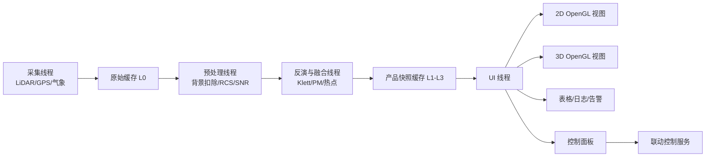

你要特别记住 4 条工程规则：

1. QOpenGLWidget 的真正绘制发生在 UI 线程，不要在工作线程里直接碰 OpenGL 上下文。
2. 算法线程只生产“产品快照”，不要直接操作界面控件。
3. UI 线程只消费最新快照，不回头扫大批历史原始数据。
4. 采集、算法、UI 之间尽量用 signal/slot 的队列连接或线程安全队列隔开。

也就是说：

> 算法线程负责算，UI 线程负责看，控制线程负责发命令，三者不要混在一起。

### 14.10 每一种图在 OpenGL 里分别怎么画

#### 视图 1：时间-高度图

这个视图最适合做成一张持续刷新的二维纹理：

1. 横轴是时间列。
2. 纵轴是距离或高度 bin。
3. 每来一条新 profile，就更新一列像素。
4. 颜色映射由 shader 或颜色查找表完成。

工程上最常用的做法是：

1. CPU 先把当前产品整理成浮点矩阵。
2. 再上传成 OpenGL texture。
3. 最后由 fragment shader 按色标显示。

这样做的好处是，哪怕矩阵比较大，滚动显示也比用普通 QWidget 一格一格画快得多。

#### 视图 2：PPI 和 RHI

PPI 和 RHI 有两条实现路线：

1. 简单路线：先在 CPU 上把极坐标重采样到规则网格，再当作二维纹理画出来。
2. 进阶路线：直接在 GPU 上按射线和距离插值，实时生成扇形或剖面图层。

如果是你现在这个项目，我建议先走简单路线，因为：

1. 更容易调试。
2. 算法和显示更容易对齐。
3. 出问题时更容易检查是哪一步错了。

等到 MVP 稳定以后，再考虑把极坐标插值搬到 GPU。

#### 视图 3：地图叠加层

地图页不要直接把所有东西都做成三维。更实用的做法是：

1. 底图作为纹理或瓦片图层。
2. 热点多边形、扫描扇区、设备图标、风向箭头作为叠加图层。
3. 选中某个热点后，在右侧面板显示区域面积、均值、峰值和持续时间。

这类图层最关键的不是炫酷，而是坐标准确。你必须把下面这些对象统一到同一坐标系里：

1. 雷达位置。
2. GPS/IMU 姿态。
3. ENU 结果点。
4. 底图坐标。
5. 喷雾炮目标角。

#### 视图 4：三维点云和体素场

三维视图建议只承担 4 件事：

1. 看热点空间位置。
2. 看喷雾方向和热点是否对准。
3. 看扫描覆盖范围。
4. 做事后分析和回放。

实现时可以这样理解：

1. 点云模式用 VBO 存点坐标和颜色。
2. 体素模式用 instancing 或立方体批量绘制。
3. 色标统一由 PM、消光或 backscatter 对应的查找表控制。
4. 鼠标点击用 picking 或射线相交，拿到选中点或选中体素。

#### 视图 5：当前廓线和质量控制曲线

这一类图不一定非要 OpenGL。更现实的选择是：

1. 用普通 2D 绘图库画当前 profile。
2. 用表格控件画告警和日志。
3. 让 OpenGL 重点负责热力图、地图和三维场景。

这样分工更稳，也更容易维护。

### 14.11 真正做工程时，页面建议这样拆

如果最后软件要能上线值守，我建议页面按“主屏看态势，副屏做分析”来拆：

1. 实时总览页：时间高度图、当前风场、告警列表、设备状态。
2. 扫描页：PPI、RHI、扇区热力图、扫描参数。
3. 地图联动页：底图、热点区、喷雾炮方向、联动按钮。
4. 三维分析页：ENU 点云、体素、热点轨迹、时间轴回放。
5. 质量控制页：原始信号、能量趋势、背景、SNR、标定散点图。

这样拆的好处是：

1. 值班人员有主屏可看。
2. 算法人员有分析页可查。
3. 运维人员有质量页可排错。
4. 领导或客户演示时也有一页看起来足够直观。

### 14.12 一个现实可落地的 Qt + OpenGL 开发顺序

如果你们现在准备开始做软件，我建议按下面顺序推进，而不是一开始就做全功能三维系统：

1. 第一步先搭 Qt 主窗口、菜单、状态栏和停靠面板。
2. 第二步先做时间高度图和当前廓线，这样最容易尽快看到成果。
3. 第三步再做 PPI/RHI 和地图叠加。
4. 第四步补三维 ENU 场景和热点选中。
5. 第五步再接历史回放、告警管理和喷雾联动。

这样推进的原因很简单：

1. 最先有业务价值的是 quicklook、剖面和地图页。
2. 三维页很重要，但通常不是 MVP 最先证明价值的页面。
3. 如果一开始就把大量时间砸在 3D 特效上，反而容易把真正关键的数据链和联动控制拖慢。

---

## 15. 一个最现实的工程闭环是什么样

如果把“发现扬尘热点并自动处置”作为目标，完整链条可以是：

1. 固定式 LiDAR 连续扫描工地区域。
2. 算法识别高消光或高 PM 估算区域。
3. 系统把该区域转成 ENU 或地理坐标。
4. 平台判断热点是否持续存在、是否超过阈值。
5. 如果满足条件，向喷雾炮发送目标方位角和俯仰角。
6. 喷雾炮执行定向喷雾。
7. LiDAR 继续观测处理后的变化，评估压尘效果。

这个闭环里最重要的不是某一个公式，而是下面 3 个点：

1. 热点识别要稳，不能乱报。
2. 坐标映射要准，不然喷错方向。
3. UI 要能让值班人员一眼看懂“为什么报、报在哪里、有没有压下去”。

---

## 16. 两周 MVP 应该怎么排，不要一开始就铺太大

### 第 1 周：先把数据链跑通

目标：

1. 打通原始采集或样例数据导入。
2. 完成背景扣除、RCS、基础质量控制。
3. 做出时间-高度图和单帧廓线图。
4. 接一个地面 PM 参考站。

第 1 周做到这一步，其实已经能演示“设备能看见颗粒物结构变化”。

### 第 2 周：再把业务闭环补上

目标：

1. 加入 Klett/Fernald 的简化版 L2 产品。
2. 做湿度修正和简单 PM 标定。
3. 把扫描数据转到 ENU 坐标。
4. 在地图或 3D 页面上画出热点。
5. 输出告警和喷雾炮控制目标点。

两周 MVP 的核心不是追求“科研终极精度”，而是证明下面这件事成立：

> 这套系统能够稳定发现工地或道路上的粉尘热点，并在软件上看见、定位、记录、联动处置。

---

## 17. 小白最容易掉进去的坑

1. 以为回波强就一定等于 PM 高。
2. 以为只要有激光器就能做系统。
3. 以为 3D 页面一定比 2D 页面更重要。
4. 以为一开始就要追求气体 DIAL。
5. 以为不需要地面参考仪也能做绝对定量。
6. 以为不做 overlap 校正也没关系。
7. 以为湿度影响可以忽略。
8. 以为算法准确就等于工程可用，忽略状态监控和质量控制。

---

## 18. 你现在应该先记住哪几句话

如果今天只能带走 6 句话，那就记住这 6 句：

1. 大气颗粒物激光雷达测到的首先是光学回波，不是直接称重。
2. LiDAR 方程里最重要的是“这一层会不会把光打回来”和“整条路径把光吃掉了多少”。
3. 单波长弹性 LiDAR 不能凭一条曲线把所有未知量直接解出来，所以需要假设和标定。
4. 工地扬尘第一版最现实的路线是弹性 Mie 后向散射，不是 DIAL 气体方案。
5. 真正高频使用的 UI 往往是时间-高度图、剖面图、地图扇区图，而不是只有炫酷 3D。
6. 工程价值来自“发现热点、准确定位、闭环联动、持续评估”，不是只生成一张漂亮图片。

---

## 19. 一个完整算例：从原始回波到热点告警

前面讲了很多概念和算法，现在用一组简化的假数据，把整条链路真正走一遍。你可以把这一节当成“把前面所有内容串起来的练习题”。

这组数据不是某台真实设备的标定结果，所以它不用于科研发表，但非常适合建立工程直觉。

### 19.1 先设定一个具体场景

假设我们有一台固定式颗粒物 LiDAR，装在工地高点平台上：

1. 设备安装高度为 18 m。
2. 当前在看一个固定方位附近的低仰角扫描。
3. 距离分辨率为 30 m。
4. 我们先只看一条射线上的 6 个 range bin。
5. 然后再把这条射线扩展成一个小扫描扇面，最后提取热点。

为了便于说明，先定义 6 个距离 bin：

$$
R = [30, 60, 90, 120, 150, 180]\ \mathrm{m}
$$

原始 photon counts 假设如下：

$$
P_{\mathrm{raw}} = [34, 38, 55, 110, 82, 45]
$$

同时假设：

1. 远端背景均值 $B = 20$ counts。
2. 这一帧的激光单脉冲能量 $E = 2.0\ \mathrm{mJ}$。
3. overlap 曲线在近距离不完整：

$$
O(R) = [0.40, 0.70, 0.90, 1.00, 1.00, 1.00]
$$

### 19.2 第一步：背景扣除

背景扣除公式是：

$$
P_1(R) = P_{\mathrm{raw}}(R) - B
$$

带入这组数据后：

$$
P_1 = [14, 18, 35, 90, 62, 25]
$$

这里最值得注意的是：

1. 原始 34 counts 并不表示有 34 counts 都来自目标。
2. 其中有 20 counts 只是背景底噪。
3. 真正属于目标回波的只有扣背景之后的部分。

你可以把这一步理解成：

> 先把房间里的环境光关掉，再看手电筒真正照到了什么。

### 19.3 第二步：发射能量归一化

能量归一化公式是：

$$
P_2(R) = \frac{P_1(R)}{E}
$$

这里的 $E$ 就是这个 profile 对应的发射激光能量。更准确地说：

> $E$ 是这一枪，或者这一帧平均意义下，实际发出去的激光脉冲能量。

它不是接收端收到的光能量，而是发射端发出去的能量。因为回波信号 $P_1(R)$ 会随着发射能量一起变大或变小，所以要先除以 $E$，把它变成“单位发射能量下的回波强度”。

带入 $E = 2.0\ \mathrm{mJ}$ 后：

$$
P_2 = [7.00, 9.00, 17.50, 45.00, 31.00, 12.50]
$$

单位你可以先理解成“每毫焦对应的计数”。

再用一个单点例子看得更清楚：

1. 同一片空气，第一帧发射能量是 $2.0\ \mathrm{mJ}$，回波是 100 counts。
2. 第二帧发射能量是 $1.8\ \mathrm{mJ}$，回波是 90 counts。
3. 直接看 100 和 90，好像空气变弱了。
4. 但做能量归一化后，二者都是 50 counts/mJ。

这说明变化来自激光器发射能量，而不是来自空气中的颗粒物变化。

为什么这一步不能省：

1. 因为不同脉冲的发射能量会抖动。
2. 不归一化的话，两帧之间的差别不一定来自空气变化，也可能只是激光器输出变强或变弱。
3. 归一化之后，后面的 RCS、overlap 校正和反演才是在比较空气本身，而不是比较激光器哪一枪更有劲。

### 19.4 第三步：RCS 距离平方校正

距离平方校正公式：

$$
\mathrm{RCS}(R) = P_2(R) R^2
$$

计算后得到：

$$
\mathrm{RCS} = [6300, 32400, 141750, 648000, 697500, 405000]
$$

这一步先把“远处天然更暗”的几何趋势补回来。注意，它还没有处理近距离 overlap 不完整的问题，所以近端数值仍然可能偏低。

### 19.5 第四步：overlap 校正

现在把近距离重叠不完整的问题补回来：

$$
P_{\mathrm{corr}}(R) = \frac{\mathrm{RCS}(R)}{O(R)}
$$

把每个距离 bin 算出来：

| 距离 R (m) | 原始计数 Praw | 扣背景后 P1 | 能量归一化 P2 | RCS | overlap 校正后 Pcorr |
| --- | --- | --- | --- | --- | --- |
| 30 | 34 | 14 | 7.00 | 6300 | 15750 |
| 60 | 38 | 18 | 9.00 | 32400 | 46286 |
| 90 | 55 | 35 | 17.50 | 141750 | 157500 |
| 120 | 110 | 90 | 45.00 | 648000 | 648000 |
| 150 | 82 | 62 | 31.00 | 697500 | 697500 |
| 180 | 45 | 25 | 12.50 | 405000 | 405000 |

这一步有一个很重要的现象：

1. 30 m 处的 RCS 本来只有 6300。
2. 但因为 overlap 只有 0.40，校正后变成了 15750。

这说明近距离如果不做 overlap 校正，近端粉尘会被严重低估。

> 说明：RCS 和 overlap 校正都是逐距离点的乘除操作，数学上先后可交换。本文为了和第 11 章预处理流程一致，统一写成“先 RCS，再除以 $O(R)$”。

从这个表里你可以立刻看到两件事：

1. 120 m 到 150 m 之间是这条射线里最显著的高回波区。
2. 150 m 的 RCS 比 120 m 还高，说明那里可能仍然存在明显颗粒物结构。

但注意，这里还不能直接说“150 m 的 PM 一定最高”，因为传播衰减还没有真正被反演掉。

### 19.6 第五步：给 Klett/Fernald 反演准备边界条件

现在开始做反演。我们先给出一个工程上常见的简化假设：

1. 取 lidar ratio $S = 45\ \mathrm{sr}$。
2. 取最远端 180 m 作为参考 bin。
3. 假设参考端消光系数：

$$
\alpha_{\mathrm{ref}} = 0.18\ \mathrm{km}^{-1}
$$

这相当于告诉算法：

> 最远端那一格我先给你一个可接受的起点，你从这里往回推。

### 19.7 第六步：做一个简化版 Klett 反演

为了便于教学，我们直接给出这组假数据经过简化递推后的结果。你可以把它理解成“程序已经根据 RCS、边界条件和 lidar ratio 算好的输出”。

| 距离 R (m) | backscatter $\beta$ ($\mathrm{km}^{-1}\ \mathrm{sr}^{-1}$) | extinction $\alpha = S\beta$ ($\mathrm{km}^{-1}$) |
| --- | --- | --- |
| 30 | 0.0019 | 0.086 |
| 60 | 0.0022 | 0.099 |
| 90 | 0.0030 | 0.135 |
| 120 | 0.0063 | 0.284 |
| 150 | 0.0051 | 0.230 |
| 180 | 0.0040 | 0.180 |

这里的结果比单看 RCS 更有物理意义，因为它试图把双程传播衰减的影响部分剥离掉。

从结果上看：

1. 120 m 的消光系数最高。
2. 150 m 也仍然偏高。
3. 说明这条射线上真正的主污染区大致位于 120 m 到 150 m。

这就是为什么：

> 你不能只看 RCS 或颜色深浅，而必须通过反演去判断真正的光学浓度结构。

### 19.8 第七步：加入湿度修正

现在假设这条路径上的相对湿度随距离略有变化：

$$
RH = [72, 74, 76, 78, 80, 82]\ \%
$$

并且取吸湿增长经验参数：

$$
\gamma = 0.45
$$

湿度修正公式：

$$
\alpha_{\mathrm{dry}}(R) = \alpha(R) \cdot \left[1 - \frac{RH(R)}{100}\right]^\gamma
$$

计算后得到：

| 距离 R (m) | 原始消光 $\alpha$ | RH (%) | 干态消光 $\alpha_{\mathrm{dry}}$ |
| --- | --- | --- | --- |
| 30 | 0.086 | 72 | 0.048 |
| 60 | 0.099 | 74 | 0.054 |
| 90 | 0.135 | 76 | 0.071 |
| 120 | 0.284 | 78 | 0.144 |
| 150 | 0.230 | 80 | 0.112 |
| 180 | 0.180 | 82 | 0.083 |

这个表最值得你注意的点是：

1. 所有点的消光都下降了。
2. 120 m 仍然是最高值。
3. 说明它的高值不只是“湿度太大造成的虚高”，而是真有明显颗粒物结构。

### 19.9 第八步：把干态消光转成 PM2.5 / PM10

为了教学简单，我们先用一个非常朴素的线性模型：

$$
\mathrm{PM}_{2.5} = 500 \cdot \alpha_{\mathrm{dry}} + 10
$$

再假设：

$$
\mathrm{PM}_{10} = 1.6 \cdot \mathrm{PM}_{2.5}
$$

注意：这只是教学用经验关系，真实项目里必须用本地标定模型替代。

带入后得到：

| 距离 R (m) | 干态消光 $\alpha_{\mathrm{dry}}$ | PM2.5 ($\mu g/m^3$) | PM10 ($\mu g/m^3$) |
| --- | --- | --- | --- |
| 30 | 0.048 | 34.0 | 54.4 |
| 60 | 0.054 | 37.0 | 59.2 |
| 90 | 0.071 | 45.5 | 72.8 |
| 120 | 0.144 | 82.0 | 131.2 |
| 150 | 0.112 | 66.0 | 105.6 |
| 180 | 0.083 | 51.5 | 82.4 |

如果我们把热点阈值设成：

$$
\mathrm{PM}_{2.5} > 60\ \mu g/m^3
$$

那么这条射线上会有两个连续高值 bin：

1. 120 m。
2. 150 m。

到这里为止，你已经从一条原始回波数组，走到了“这条射线上的高污染区在哪里”。

### 19.10 第九步：把单条射线扩展成一个小扫描扇面

现在我们不只看一条射线，而是假设相邻两个方位角也扫到了类似高值。为了简化说明，只取 4 个热点点元：

| 点编号 | 方位角 (deg) | 仰角 (deg) | 距离 R (m) | PM2.5 |
| --- | --- | --- | --- | --- |
| A | 40 | 10 | 120 | 82 |
| B | 40 | 10 | 150 | 66 |
| C | 42 | 10 | 120 | 79 |
| D | 42 | 10 | 150 | 63 |

这些点说明：

1. 高值区不只出现在一条射线上。
2. 它已经在相邻扫描角里形成了一个连续的二维小斑块。
3. 这就具备了“提取热点区域”的基础。

### 19.11 第十步：把热点点元转成 ENU 坐标

仍然使用固定式系统的 ENU 公式：

$$
\begin{aligned}
x &= R \cos(\mathrm{elevation}) \sin(\mathrm{azimuth}) \\
y &= R \cos(\mathrm{elevation}) \cos(\mathrm{azimuth}) \\
z &= R \sin(\mathrm{elevation})
\end{aligned}
$$

算出来的近似结果如下：

| 点编号 | ENU x (m) | ENU y (m) | ENU z (m) | 权重 PM2.5 |
| --- | --- | --- | --- | --- |
| A | 75.9 | 90.5 | 20.8 | 82 |
| B | 94.9 | 113.2 | 26.0 | 66 |
| C | 79.0 | 87.8 | 20.8 | 79 |
| D | 98.8 | 109.7 | 26.0 | 63 |

此时这些点已经不是抽象的“第几个 bin”，而是真正的空间点。

### 19.12 第十一步：计算热点质心

如果用 PM2.5 做权重，那么热点加权质心公式是：

$$
x_c = \frac{\sum_i w_i x_i}{\sum_i w_i}, \qquad
y_c = \frac{\sum_i w_i y_i}{\sum_i w_i}, \qquad
z_c = \frac{\sum_i w_i z_i}{\sum_i w_i}
$$

带入 A、B、C、D 四个点之后，可以得到近似质心：

$$
(x_c, y_c, z_c) \approx (86.1, 99.1, 23.2)\ \mathrm{m}
$$

这意味着什么？

意思是如果你要驱动一个喷雾炮去瞄准这个热点，那么它最值得优先瞄准的位置，不是 A、B、C、D 某一个点，而是这个加权质心附近。

### 19.13 第十二步：把质心转成控制目标

对于固定式喷雾炮，平台通常还要继续算两个量：

1. 水平距离。
2. 控制方位角和俯仰角。

水平距离：

$$
R_{\mathrm{horizontal}} = \sqrt{x_c^2 + y_c^2} \approx 131.2\ \mathrm{m}
$$

目标方位角近似为：

$$
    heta = \arctan\left(\frac{x_c}{y_c}\right) \approx 41^\circ
$$

目标仰角近似为：

$$
\phi = \arctan\left(\frac{z_c}{R_{\mathrm{horizontal}}}\right) \approx 10^\circ
$$

这个结果很合理，因为它正好落在前面 40 到 42 度、10 度仰角那一小片高值区中间。

### 19.14 第十三步：形成热点事件记录

到平台层，通常会把它整理成一条可消费事件：

```json
{
    "event_id": "dust_demo_001",
    "timestamp": "2026-05-27T10:23:15Z",
    "type": "dust_hotspot",
    "center_enu_m": [86.1, 99.1, 23.2],
    "target_azimuth_deg": 41.0,
    "target_elevation_deg": 10.0,
    "peak_pm25_ugm3": 82.0,
    "mean_pm25_ugm3": 72.5,
    "recommended_action": "spray"
}
```

此时这条数据已经非常适合：

1. 给前端画告警卡片。
2. 给地图画一个热点标记。
3. 给喷雾联动模块发控制指令。
4. 给报表系统留痕。

### 19.15 用一段代码把这个算例串起来

下面是一段非常简化但逻辑完整的示意代码，用来把这一节的算例串起来：

```python
import numpy as np

ranges = np.array([30, 60, 90, 120, 150, 180], dtype=float)
raw_counts = np.array([34, 38, 55, 110, 82, 45], dtype=float)
background = 20.0
laser_energy = 2.0
overlap = np.array([0.40, 0.70, 0.90, 1.00, 1.00, 1.00], dtype=float)
rh = np.array([72, 74, 76, 78, 80, 82], dtype=float)

signal_bg = raw_counts - background
signal_norm = signal_bg / laser_energy
signal_overlap = signal_norm / overlap
rcs = signal_overlap * ranges**2

beta = np.array([0.0019, 0.0022, 0.0030, 0.0063, 0.0051, 0.0040])
alpha = 45.0 * beta
alpha_dry = alpha * (1.0 - rh / 100.0) ** 0.45

pm25 = 500.0 * alpha_dry + 10.0
pm10 = 1.6 * pm25

hot_mask = pm25 > 60.0
hot_ranges = ranges[hot_mask]
hot_pm25 = pm25[hot_mask]

print("RCS:", np.round(rcs, 1))
print("alpha:", np.round(alpha, 3))
print("PM2.5:", np.round(pm25, 1))
print("热点距离:", hot_ranges)
print("热点PM2.5:", np.round(hot_pm25, 1))
```

你可以看到，这段代码虽然不长，但它已经完整体现了这条思路：

1. 原始回波先做清洗。
2. 再做 RCS。
3. 再做反演输出光学量。
4. 再做湿度修正。
5. 再做 PM 推断。
6. 最后再做热点判别。

### 19.16 这个完整算例真正想让你学会什么

如果你把这节真正看懂了，其实就已经建立了一个很重要的工程直觉：

1. 原始回波不是业务结果，它只是起点。
2. 预处理不是锦上添花，而是决定后面会不会全盘跑偏。
3. 反演解决的是“把回波变成光学量”的问题。
4. 湿度修正和地面标定解决的是“把光学量变成 PM”的问题。
5. ENU 映射和热点提取解决的是“把 PM 场变成可行动坐标”的问题。
6. 最终平台真正消费的，不是一条波形，而是一条结构化事件。

如果你愿意，下一步完全可以把这一节再继续升级成：

1. 带真实 Python 可运行脚本的版本。
2. 带图表输出的 notebook 版本。
3. 带 RHI 或 PPI 小矩阵示例的二维版本。

### 19.17 再进一步：二维 PPI 扫描面小矩阵算例

上面的例子本质上还是“少量热点点元”。现在我们把它再往前推进一步，真正做成一个二维扫描面。

这里选择 PPI 作为例子，因为它更贴近工地和道路场景里最常见的“水平扩散监控”。

PPI 的意思是：

1. 仰角固定。
2. 方位角不断变化。
3. 每个方位角上都有一串距离 bin。

所以 PPI 的数据天然就是一个二维矩阵：

$$
\mathrm{PM}[\mathrm{azimuth}, R]
$$

你可以把它理解成：

> 每一行是一条射线，每一列是这条射线上的一个距离格子，整张表拼起来就是一个扫描扇面。

### 19.18 先定义一个最小 PPI 小矩阵

假设：

1. 固定仰角为 $10^\circ$。
2. 方位角一共扫 3 条：$38^\circ$、$40^\circ$、$42^\circ$。
3. 距离 bin 取 4 个：60 m、90 m、120 m、150 m。
4. 每个格子的 PM2.5 都已经经过前面的整条算法链，也就是已经完成了预处理、反演和湿度修正后的标定输出。

得到的二维 PM2.5 小矩阵如下：

| 方位角 \ 距离 | 60 m | 90 m | 120 m | 150 m |
| --- | --- | --- | --- | --- |
| 38 deg | 34 | 46 | 78 | 58 |
| 40 deg | 37 | 51 | 82 | 66 |
| 42 deg | 35 | 49 | 79 | 63 |

读这个表时，你要这样看：

1. 同一行表示同一条扫描射线。
2. 同一列表示相近的距离圈层。
3. 右上区域数值更高，说明热点不是单点，而是一个小片区。

### 19.19 第一步：做阈值分割

仍然使用前面的业务阈值：

$$
\mathrm{PM}_{2.5} > 60\ \mu g/m^3
$$

把矩阵转成二值 mask 后：

| 方位角 \ 距离 | 60 m | 90 m | 120 m | 150 m |
| --- | --- | --- | --- | --- |
| 38 deg | 0 | 0 | 1 | 0 |
| 40 deg | 0 | 0 | 1 | 1 |
| 42 deg | 0 | 0 | 1 | 1 |

这里的 `1` 表示热点候选单元，`0` 表示非热点单元。

从这个二值表里，你已经能直观看见一件事：

1. 高值区主要集中在 120 m，部分延伸到 150 m。
2. 并且跨越了多个相邻方位角。
3. 这说明它不是随机噪点，而是一个连续粉尘斑块。

### 19.20 第二步：连通域判断这个热点是不是一个整体

对二维扫描面来说，阈值分割之后通常还要做连通域分析。

在这个小例子里，值为 1 的格子共有 5 个：

1. 38 deg, 120 m。
2. 40 deg, 120 m。
3. 40 deg, 150 m。
4. 42 deg, 120 m。
5. 42 deg, 150 m。

如果采用 8 邻域连通规则，这 5 个格子会被识别为同一个热点区域，而不是 5 个彼此无关的小点。

这一步非常关键，因为平台真正关心的是：

> 这里是不是存在一个连续污染团，而不是某一个像素偶然超阈值。

### 19.21 第三步：把二维热点格子转成空间坐标

现在把这 5 个热点格子真正转换到 ENU 坐标。

固定仰角仍然是 $10^\circ$，转换公式与前面一致：

$$
\begin{aligned}
x &= R \cos(10^\circ) \sin(\mathrm{azimuth}) \\
y &= R \cos(10^\circ) \cos(\mathrm{azimuth}) \\
z &= R \sin(10^\circ)
\end{aligned}
$$

算出来的热点格子中心坐标近似如下：

| 热点格子 | PM2.5 | x (m) | y (m) | z (m) |
| --- | --- | --- | --- | --- |
| 38 deg, 120 m | 78 | 72.8 | 93.1 | 20.8 |
| 40 deg, 120 m | 82 | 76.0 | 90.5 | 20.8 |
| 42 deg, 120 m | 79 | 79.0 | 87.8 | 20.8 |
| 40 deg, 150 m | 66 | 94.9 | 113.2 | 26.0 |
| 42 deg, 150 m | 63 | 98.8 | 109.7 | 26.0 |

到了这里，二维扫描面上的“5 个高值格子”就已经被转换成了“5 个真实空间点”。

### 19.22 第四步：估算二维热点的加权质心

现在用 PM2.5 作为权重，计算这 5 个热点单元的加权质心。

公式和前面一样：

$$
x_c = \frac{\sum_i w_i x_i}{\sum_i w_i}, \qquad
y_c = \frac{\sum_i w_i y_i}{\sum_i w_i}, \qquad
z_c = \frac{\sum_i w_i z_i}{\sum_i w_i}
$$

把这 5 个单元代入之后，可以得到近似结果：

$$
(x_c, y_c, z_c) \approx (83.3, 97.9, 22.7)\ \mathrm{m}
$$

这个结果怎么理解：

1. 这条剖面里的主要污染团，平均位于设备前方约 130 m。
2. 它的主质量中心大约在 23 m 高度。
3. 如果你要做平面热点研判，这个质心比盯着矩阵本身更有用。

### 19.23 第五步：把二维热点质心转成喷雾目标角

有了质心坐标之后，控制系统常要继续算：

1. 水平距离。
2. 目标方位角。
3. 目标仰角。

水平距离：

$$
R_{\mathrm{horizontal}} = \sqrt{x_c^2 + y_c^2} \approx 128.5\ \mathrm{m}
$$

目标方位角近似为：

$$
\mathrm{az}_{\mathrm{target}} = \arctan\left(\frac{x_c}{y_c}\right) \approx 40.4^\circ
$$

目标仰角近似为：

$$
\phi_{\mathrm{target}} = \arctan\left(\frac{z_c}{R_{\mathrm{horizontal}}}\right) \approx 10.0^\circ
$$

从这个结果你可以看到，二维扫描面算出来的热点目标角，仍然稳定落在 40 度左右、10 度左右，这和我们一开始的人眼直观判断是一致的。

### 19.24 第六步：如果把这个二维结果画到 UI 上，会长什么样

在 PPI 页面上，它不会表现成 5 个孤立数字，而会更像一个扇形网格中的连续高值区。

你可以把它抽象成下面这样：

```text
PPI fixed elevation = 10 deg

azimuth \ range   60m   90m   120m  150m
38 deg            low   low   high  low
40 deg            low   low   high  high
42 deg            low   low   high  high

centroid -> (83.3, 97.9, 22.7) m
target   -> az=40.4 deg, el=10.0 deg
```

真正的前端显示里，通常会同时叠加：

1. 热力图颜色。
2. 阈值轮廓线。
3. 热点质心点。
4. 当前建议喷雾指向。

这时候值班人员看到的就不再是抽象矩阵，而是一张可直接决策的业务图。

### 19.25 第七步：用代码把这个二维算例串起来

下面这段示意代码把二维 PPI 小矩阵的核心步骤连起来：

```python
import numpy as np

azimuths = np.array([38.0, 40.0, 42.0], dtype=float)
ranges = np.array([60.0, 90.0, 120.0, 150.0], dtype=float)
elevation = 10.0

pm25 = np.array([
  [34.0, 46.0, 78.0, 58.0],
  [37.0, 51.0, 82.0, 66.0],
  [35.0, 49.0, 79.0, 63.0],
])

mask = pm25 > 60.0
section_points = []

for iaz, azimuth in enumerate(azimuths):
    az = np.deg2rad(azimuth)
    el = np.deg2rad(elevation)

    for ir, radius in enumerate(ranges):
        if not mask[iaz, ir]:
            continue

        value = pm25[iaz, ir]
        x = radius * np.cos(el) * np.sin(az)
        y = radius * np.cos(el) * np.cos(az)
        z = radius * np.sin(el)
        section_points.append((value, x, y, z))

weights = np.array([row[0] for row in section_points])
xyz = np.array([[row[1], row[2], row[3]] for row in section_points])
centroid = (weights[:, None] * xyz).sum(axis=0) / weights.sum()

horizontal_range = np.hypot(centroid[0], centroid[1])
target_azimuth = np.rad2deg(np.arctan2(centroid[0], centroid[1]))
target_elevation = np.rad2deg(np.arctan2(centroid[2], horizontal_range))

print("hotspot_cell_count =", len(section_points))
print("centroid_enu_m =", np.round(centroid, 2))
print("target_az_el_deg =", np.round([target_azimuth, target_elevation], 2))
```

这段代码体现的是二维扫描面的标准流程：

1. 二维矩阵先做阈值筛选。
2. 保留热点单元。
3. 把热点单元逐个转成三维坐标。
4. 最后再算质心和控制目标。

### 19.27 这个二维算例真正想让你明白什么

这一节最重要的，不是记住某个数字，而是建立下面这套直觉：

1. 一维射线算例解决的是“单条光路怎么看”。
2. 二维 PPI 算例解决的是“一个扫描面怎么看”。
3. 真正的业务热点，不是单个 bin，而是二维或三维上的连续区域。
4. 平台做告警和联动时，核心对象不是波形，而是区域、质心、面积和目标角。

### 19.28 再补一个垂直剖面例子：RHI 到底怎么看

前面的 PPI 解决的是“热点在平面上扩到哪里去了”。

RHI 解决的则是另外一个非常关键的问题：

> 这个污染羽流抬升到了多高、层底层顶在哪里、是不是正在往上翻卷。

RHI 的含义是：

1. 方位角固定。
2. 仰角不断变化。
3. 在一个固定方向上把空间剖开，得到一张“距离-高度”剖面图。

对工地扬尘、料场扬尘、烟羽抬升判断来说，RHI 特别有用，因为它能直接告诉你：

1. 粉尘是贴地扩散，还是已经被抬到半空。
2. 热点的垂直厚度有多大。
3. 喷雾是该打近地面，还是该打更高的位置。

### 19.29 先定义一个最小 RHI 小矩阵

假设：

1. 固定方位角为 40 deg。
2. 设备安装高度为 18 m。
3. 仰角扫 4 条：4 deg、8 deg、12 deg、16 deg。
4. 距离 bin 取 4 个：60 m、90 m、120 m、150 m。
5. 每个格子的值依然是假设已经经过完整算法链输出的 PM2.5。

于是得到一个二维 RHI 小矩阵：

| 仰角 \ 距离 | 60 m | 90 m | 120 m | 150 m |
| --- | --- | --- | --- | --- |
| 4 deg | 28 | 45 | 72 | 65 |
| 8 deg | 32 | 58 | 95 | 84 |
| 12 deg | 30 | 55 | 88 | 76 |
| 16 deg | 24 | 41 | 62 | 54 |

你可以先直接目测这张表：

1. 主要高值集中在 120 m 到 150 m。
2. 高值覆盖了多个仰角。
3. 说明这不是地面一条很薄的带，而是一个向上抬起的垂直污染羽流。

### 19.30 第一步：做阈值分割

还是沿用前面的业务阈值：

$$
\mathrm{PM}_{2.5} > 60\ \mu g/m^3
$$

转成二值 mask 之后：

| 仰角 \ 距离 | 60 m | 90 m | 120 m | 150 m |
| --- | --- | --- | --- | --- |
| 4 deg | 0 | 0 | 1 | 1 |
| 8 deg | 0 | 0 | 1 | 1 |
| 12 deg | 0 | 0 | 1 | 1 |
| 16 deg | 0 | 0 | 1 | 0 |

这个结果说明：

1. 热点主要存在于 120 m 到 150 m 这一带。
2. 从 4 deg 一直延伸到 16 deg。
3. 所以它不是单点，而是一条有厚度的竖向污染剖面。

### 19.31 第二步：把 RHI 格子转成地距-高度坐标

对固定方位角的 RHI 来说，最常用的不是先转完整三维，而是先转成剖面坐标：

1. 地面投影距离 $s$。
2. 高度 $h$。

公式是：

$$
\begin{aligned}
s &= R \cos(\mathrm{elevation}) \\
h &= h_0 + R \sin(\mathrm{elevation})
\end{aligned}
$$

其中：

1. $h_0 = 18\ \mathrm{m}$ 是设备安装高度。
2. $s$ 表示沿这个固定方位方向，离设备有多远。
3. $h$ 表示这个格子真正处在多高的位置。

把所有热点格子换算后，得到近似结果：

| 热点格子 | PM2.5 | 地距 s (m) | 高度 h (m) |
| --- | --- | --- | --- |
| 4 deg, 120 m | 72 | 119.7 | 26.4 |
| 4 deg, 150 m | 65 | 149.6 | 28.5 |
| 8 deg, 120 m | 95 | 118.8 | 34.7 |
| 8 deg, 150 m | 84 | 148.5 | 38.9 |
| 12 deg, 120 m | 88 | 117.4 | 42.9 |
| 12 deg, 150 m | 76 | 146.7 | 49.2 |
| 16 deg, 120 m | 62 | 115.4 | 51.1 |

这张表特别重要，因为到这一步你终于能回答：

1. 污染并不是只在地面附近。
2. 它已经从大约 26 m 一直抬升到 51 m 左右。
3. 这说明这是一个有明显竖向结构的羽流，而不是单纯贴地积尘。

### 19.32 第三步：估算层底、层顶和剖面厚度

RHI 最常见的一个业务动作，就是从热点区里估算：

1. 层底高度。
2. 层顶高度。
3. 垂直厚度。

对这组数据：

$$
h_{\mathrm{bottom}} \approx 26.4\ \mathrm{m}
$$

$$
h_{\mathrm{top}} \approx 51.1\ \mathrm{m}
$$

所以剖面厚度约为：

$$
\mathrm{depth}_{\mathrm{vertical}} = h_{\mathrm{top}} - h_{\mathrm{bottom}} \approx 24.7\ \mathrm{m}
$$

这一组量在业务里非常有价值，因为它直接回答了：

1. 羽流最高抬到了多高。
2. 近地喷雾能不能覆盖到它。
3. 这个污染区是“薄薄一层”还是“厚厚一团”。

### 19.33 第四步：计算 RHI 剖面的加权质心

如果用 PM2.5 作为权重，那么在 RHI 平面里我们常先算一个剖面质心：

$$
s_c = \frac{\sum_i w_i s_i}{\sum_i w_i}, \qquad
h_c = \frac{\sum_i w_i h_i}{\sum_i w_i}
$$

把上面 7 个热点格子代入之后，可得到近似结果：

$$
(s_c, h_c) \approx (130.5, 38.7)\ \mathrm{m}
$$

这个结果怎么理解：

1. 这条剖面里的主要污染团，平均位于设备前方约 130 m。
2. 它的主质量中心大约在 39 m 高度。
3. 如果你要做垂直剖面的人工研判，这两个数比盯着矩阵本身更有用。

### 19.34 第五步：如果还要转回三维 ENU 怎么做

RHI 只是固定在一个方位角上的二维切片。如果还要把剖面质心放回三维地图，则需要再把固定方位角 40 deg 代入：

$$
\begin{aligned}
x_c &= s_c \sin(40^\circ) \\
y_c &= s_c \cos(40^\circ) \\
z_c &= h_c
\end{aligned}
$$

得到近似三维质心：

$$
(x_c, y_c, z_c) \approx (83.9, 100.0, 38.7)\ \mathrm{m}
$$

和前面的 PPI 热点相比，你会发现：

1. 水平位置仍然接近同一片区域。
2. 但这次额外知道了它在竖直方向上的主中心高度更高。
3. 这就是为什么 PPI 和 RHI 最好配合使用，而不是只用其中一种。

### 19.35 第六步：如果把这个 RHI 结果画到 UI 上，会长什么样

在 RHI 页面上，它更像下面这种“地距-高度”结构：

```text
RHI fixed azimuth = 40 deg

elevation \ range   60m   90m   120m  150m
4 deg               low   low   high  high
8 deg               low   low   high  high
12 deg              low   low   high  high
16 deg              low   low   high  low

section centroid -> ground_range=130.5 m, height=38.7 m
layer bottom     -> 26.4 m
layer top        -> 51.1 m
```

前端真正展示时，通常会把它画成：

1. 距离-高度热力图。
2. 叠加热点轮廓线。
3. 叠加层顶、层底和质心标记。
4. 必要时叠加风向或喷雾可达范围。

### 19.36 第七步：用代码把这个 RHI 算例串起来

下面是一段示意代码，把二维 RHI 小矩阵从阈值筛选一路串到剖面质心：

```python
import numpy as np

elevations = np.array([4.0, 8.0, 12.0, 16.0], dtype=float)
ranges = np.array([60.0, 90.0, 120.0, 150.0], dtype=float)
sensor_height = 18.0

pm25 = np.array([
    [28.0, 45.0, 72.0, 65.0],
    [32.0, 58.0, 95.0, 84.0],
    [30.0, 55.0, 88.0, 76.0],
    [24.0, 41.0, 62.0, 54.0],
])

mask = pm25 > 60.0
section_points = []

for iel, elevation in enumerate(elevations):
    el = np.deg2rad(elevation)

    for ir, radius in enumerate(ranges):
        if not mask[iel, ir]:
            continue

        value = pm25[iel, ir]
        ground_range = radius * np.cos(el)
        height = sensor_height + radius * np.sin(el)
        section_points.append((value, ground_range, height))

weights = np.array([row[0] for row in section_points])
sh = np.array([[row[1], row[2]] for row in section_points])
centroid = (weights[:, None] * sh).sum(axis=0) / weights.sum()

layer_bottom = sh[:, 1].min()
layer_top = sh[:, 1].max()

print("section_point_count =", len(section_points))
print("section_centroid_sh =", np.round(centroid, 2))
print("layer_bottom_top =", np.round([layer_bottom, layer_top], 2))
```

这段代码的逻辑很直接：

1. 先在二维 RHI 矩阵上做阈值筛选。
2. 再把超阈值格子转成剖面坐标。
3. 再从这些剖面点里提取层底、层顶和质心。

### 19.37 这个 RHI 算例真正想让你学会什么

这一节真正想让你建立的是下面这套判断框架：

1. PPI 更擅长看水平扩散和热点平面位置。
2. RHI 更擅长看垂直结构、抬升高度和层顶层底。
3. 如果只看 PPI，你知道热点在哪，但不一定知道它抬多高。
4. 如果只看 RHI，你知道它抬多高，但不一定知道它横向扩到哪。
5. 真正成熟的业务系统，往往需要 PPI 和 RHI 配合，才能同时支持告警、研判和联动控制。

---

## 20. 一个适合你的学习顺序

如果你现在真的是零基础，建议就按这个顺序学，不要跳：

1. 先看懂“激光打一枪，为什么能换成距离”。
2. 再看懂 LiDAR 方程每一项的物理意思。
3. 再理解为什么不能直接从回波读出 PM 浓度。
4. 再学 RCS、Klett/Fernald、湿度修正这几个实用算法。
5. 再看 ENU 坐标和 2D/3D UI。
6. 最后才去碰多波长、偏振、Raman、DIAL 这些更高级内容。

只要前 4 步走扎实，你对这套系统的理解就已经不再是“听起来很高级”，而是真正能跟工程团队讨论需求了。

---

## 21. 参考资料

下面这些资料适合继续往下读：

1. [NOAA LIDAR principle page](https://csl.noaa.gov/groups/csl3/instruments/dial/lidar.html)
2. [JPL NDACC instruments overview](https://lidar.jpl.nasa.gov/ndacc/instruments/general.php)
3. [CloudnetPy quickstart](https://actris-cloudnet.github.io/cloudnetpy/quickstart.html)
4. [Klett 1981 paper abstract](https://pubmed.ncbi.nlm.nih.gov/20309093/)
5. [Fernald 1984 paper abstract](https://opg.optica.org/abstract.cfm?uri=ao-23-5-652)
6. [PyMieScatt documentation](https://pymiescatt.readthedocs.io/)
7. [Gaudfrin et al. 2020, AMT article with inversion flow and signal figures](https://amt.copernicus.org/articles/13/1921/2020/)
8. [CloudCompare presentation page stating the UI relies on Qt and OpenGL](https://www.cloudcompare.org/presentation.html)
9. [QGIS screenshot: application for topological wastewater management](https://hub.qgis.org/screenshots/4/)
10. [QGIS screenshot: Trajectools dark mode](https://hub.qgis.org/screenshots/2/)

如果后面你要继续深化，我建议下一份文档再单独拆成三部分：

1. 纯入门版，只讲概念和图。
2. 算法版，只讲反演和标定。
3. 工程版，只讲设备、通信、UI 和联动控制。
